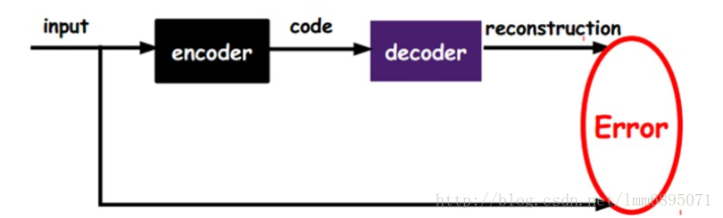
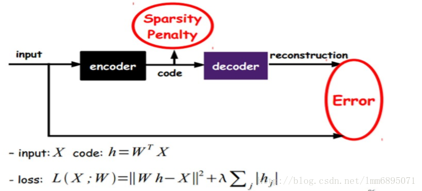
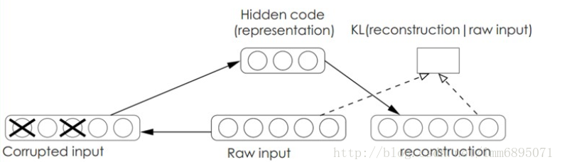
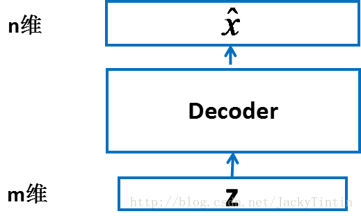
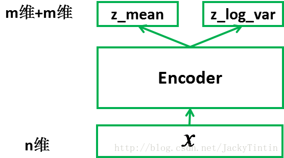
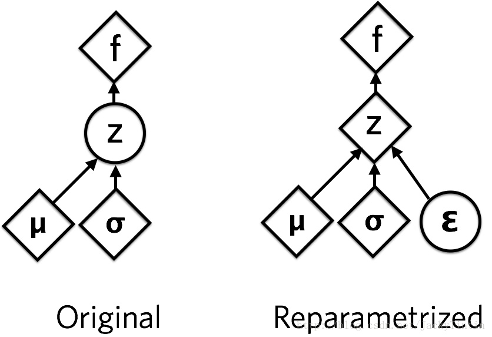
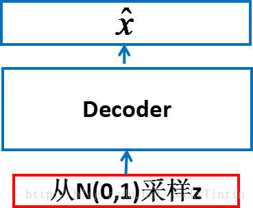
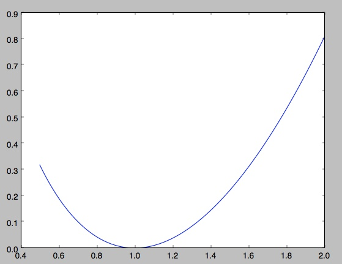

###<center>变分自编码器VAE<center>

#### 1、常见的自编码器
自动编码器是一种数据的压缩算法，其中数据的压缩和解压缩函数是**数据相关的、有损的、从样本中自动学习的**。在大部分提到自动编码器的场合，压缩和解压缩的函数是通过神经网络实现的。

+ 1）**自动编码器是数据相关的**（data-specific 或 data-dependent），这意味着自动编码器只能压缩那些与训练数据类似的数据。比如，使用人脸训练出来的自动编码器在压缩别的图片，比如树木时性能很差，因为它学习到的特征是与人脸相关的。

+ 2）**自动编码器是有损的**，意思是解压缩的输出与原来的输入相比是退化的，MP3，JPEG等压缩算法也是如此。这与无损压缩算法不同。

+ 3）**自动编码器是从数据样本中自动学习的**，这意味着很容易对指定类的输入训练出一种特定的编码器，而不需要完成任何新工作。

搭建一个自动编码器需要完成下面三样工作：搭建编码器，搭建解码器，设定一个损失函数，用以衡量由于压缩而损失掉的信息。编码器和解码器一般都是参数化的方程，并关于损失函数可导，典型情况是使用神经网络。编码器和解码器的参数可以通过最小化损失函数而优化，例如SGD。

**自编码器是一个自监督的算法，并不是一个无监督算法。**自监督学习是监督学习的一个实例，其标签产生自输入数据。要获得一个自监督的模型，你需要一个靠谱的目标跟一个损失函数，仅仅把目标设定为重构输入可能不是正确的选项。基本上，要求模型在像素级上精确重构输入不是机器学习的兴趣所在，学习到高级的抽象特征才是。事实上，当主要任务是分类、定位之类的任务时，那些对这类任务而言的最好的特征基本上都是重构输入时的最差的那种特征。

目前自编码器的应用主要有两个方面，**第一是数据去噪，第二是为进行可视化而降维。**配合适当的维度和稀疏约束，自编码器可以学习到比PCA等技术更有意思的数据投影。

对于2D的数据可视化，t-SNE（读作tee-snee）或许是目前最好的算法，但通常还是需要原数据的维度相对低一些。所以，可视化高维数据的一个好办法是首先使用自编码器将维度降低到较低的水平（如32维），然后再使用t-SNE将其投影在2D平面上。

#####1.1、AE
自编码模型AutoEncode，只有一层隐藏层；尽可能的复现原始信号，是PCA的扩展，获取有效的特征；
<center></center>
<center></center>

#####1.2、SAE
Sparse AutoEncode 稀疏自编码模型，目的是抑制一些神经元的活性，使得code层更加的稀疏；
<center></center>


#####1.3、DAE
Denoising AutoEncoders降噪自动编码器; 在原始的文本中加入噪音，提高其泛化能力，鲁棒性高； 加入训练数据加入噪声，DAE必须学习去去除这种噪声而获得真正的没有被噪声污染过的输入。 DAE可以通过梯度下降算法去训练。 一般上，我们将原始文档一式二份，一份加入噪声，然后进行训练；最后可以使用KL散度进行度量；
<center></center>

#####1.4、VAE
变分自动编码；标准的编码器不能获得新的特征，即不会进行合理的推测而产生有效的结果；在AE上，强迫潜在变量服从高斯分布，这样经过采样，产生一些新的特征；
<center></center>

#### 2、变分自编码器VAE
上面简单的展示了VAE的基本结构,下面来讲具体实现

#####2.1、算法实现
#####2.1.1、输入
做为例子，可以设想 $X$ 为 MNIST 数据集。因此，我们有六万张 0~9 的手写体 的灰度图（训练集）， 大小为 28×28。进一步，将每个像素归一化到 [0,1]，则 $X⊂[0,1]^{784}$

#####2.1.2、输出
一个输入为 m 维，输出为 n 维的神经网络，不妨称之为 decoder（或称 generative model）。
<center></center>

+ 在输入输出维度满足要求的前提下，decoder 以为任何结构——MLP、CNN，RNN 或其他。

+ 由于我们已经将输入数据规一化到 [0, 1] 区间，因此，我们令 decoder 的输出也在这个范围内。这可以通过在 decoder 的最后一层加上 sigmoid 激活实现 : 
$$f(x)=\frac{1}{1+e^{-x}}$$

+ 作为例子，我们取 m = 100，decoder 的为最普遍的全连接网络（MLP）。基于 Keras Functional API 的定义如下：

```python
n, m = 784, 2
hidden_dim = 256
batch_size = 100

## Encoder
z = Input(batch_shape=(batch_size, m))
h_decoded = Dense(hidden_dim, activation='tanh')(z)
x_hat = Dense(n, activation='sigmoid')(h_decoded)
```

#####2.1.3、训练
<center></center>

+ **encoder**
为了训练 decoder，我们需要一个辅助的 encoder 网络（又称 recognition model）。encoder 的输入为 n 维，输出为 2×m 维。同 decoder 一样，encoder 可以为任意结构。
<center></center>

+ **采样**
我们将 encoder 的输出（2×m 个数）视作分别为 m 个高斯分布的均值（z_mean）和方差的对数（z_log_var）。
```python
## Encoder
x = Input(batch_shape=(batch_size, n))
h_encoded = Dense(hidden_dim, activation='tanh')(x)
z_mean = Dense(m)(h_encoded)    # 均值
z_log_var = Dense(m)(h_encoded) # 方差对数
```
然后，根据 encoder 输出的均值与方差，生成服从相应高斯分布的随机数：
```python
# 标准高斯分布
epsilon = K.random_normal(shape=(batch_size, m), mean=0.,std=epsilon_std) 
z = z_mean + exp(z_log_var) * epsilon
```
$z$ 就可以作为上面定义的 decoder 的输入，进而产生 n 维的输出 $x̂$ 。
<center></center>
这里运用了 reparemerization 的技巧。由于 $z∼N(μ,σ)$，我们应该从 $N(μ,σ)$ 采样，但这个采样操作对 $μ$ 和 $σ$ 是不可导的，导致常规的通过误差反传的梯度下降法（GD）不能使用。通过 reparemerization，我们首先从 $N(0,1)$ 上采样 $ϵ$，然后，$z=σ⋅ϵ+μ$。这样，$z∼N(μ,σ)$，而且，从 encoder 输出到 $z$，只涉及线性操作，（ϵ 对神经网络而言只是常数）.
<center></center>

+ **优化目标**
encoder 和 decoder 组合在一起，我们能够对每个 $x∈X$，输出一个相同维度的 $x̂$ 。我们目标是，令 $x̂$  与 $x$ 自身尽量的接近。即 $x$ 经过编码（encode）后，能够通过解码（decode）尽可能多的恢复出原来的信息。
注：严格而言，按照模型的假设，我们要优化的并不是 $x$ 与 $x̂$  之间的距离，而是要最大化 $x$ 的似然。不同的损失函数，对应着不是 $p(x|z)$ 的不同概率分布假设。
由于 $x∈[0,1]$，因此，我们用交叉熵（cross entropy）度量 $x$ 与 $x̂$  差异：
$$xent = \sum_{i=1}^n-[x_i\cdot\log(\hat{x}_i)+(1-x_i)\cdot\log(1-\hat{x}_i)]$$
xent 越小，$x$ 与 $x̂$  越接近。我们也可以用均方误差来度量：
$$mse=\sum_{i=1}^n(x_i - \hat{x}_i)^2$$
mse 越小，两者越接近。训练过程中，输出即是输入，这便是 VAE 中 AE（autoencoder，自编码）的含义。另外，我们需要对 encoder 的输出 $z_mean（μ）$ 及 $z_log_var（logσ2）$ 加以约束。这里使用的是 KL 散度（具体公式推导见下文）：
$$KL = -0.5 * (1+\log\sigma^2-\mu^2-\sigma^2)=-0.5(1+\log\sigma^2-\mu^2-exp(\log\sigma^2))$$
总的优化目标（最小化）为：
$$loss = xent + KL$$
或者
$$loss = mse + KL$$
综上所述，有了目标函数，并且从输入到输出的所有运算都可导，我们就可以通过 SGD 或其改进方法来训练这个网络了。

#####2.1.4、小结
总结一下，VAE 包括 encoder （模块 1）和 decoder（模块 4） 两个神经网络。两者通过模块 2、3 连接成一个大网络。得益于 reparemeterization 技巧，我们可以使用常规的 SGD 来训练网络。

#####2.2、直观解释
#####2.2.1、VAE有什么用?
+ **数据生成**
由于我们指定 $p(z)$ 标准正态分布，再结合已经训练好的 decoder （$p(x|z)$），就可以进行采样，**生成类似但不同于训练集数据的新样本。**
<center></center>

+ **高维数据可视化**
encoder 可以将数据 $x$，映射到更低维的 $z$ 空间，如果是2维或3维，就可以直观的展示出来
<center></center>

+ **半监督学习**
相比于高成本的有标注的数据，无标注数据更容易获取。半监督学习试图只用一小部分有标注的数据加上大量无标注数据，来学习到一个较好预测模型（分类或回归）。 VAE 是无监督的，而且也可以学习到较好的特征表征，因此，可以被用来作无监督学习

####3、VAE数学推导
#####3.1、KL散度

在 Variational Inference 中，我们希望能够找到一个相对简单好算的概率分布 $q$，使它尽可能地近似我们待分析的后验概率 $p(z|x)$，其中 $z$ 是隐变量，$x$ 是显变量。在这里我们的 “loss函数” 就是 $KL$ 散度，他可以很好地测量两个概率分布之间的距离。如果两个分布越接近，那么 $KL$ 散度越小，如果越远，$KL$ 散度就会越大。

$KL$ 散度的公式为：

$KL(p||q)=\sum{p(x)log\frac{p(x)}{q(x)}}$，这个是离散概率分布的公式，

$KL(p||q)=\int{p(x)log{\frac{p(x)}{q(x)}}dx}$，这个是连续概率分布的公式。

#####3.1.1、KL散度的实战——1维高斯分布

我们先来一个相对简单的例子。假设我们有两个随机变量 $x_1,x_2$，各自服从一个高斯分布$N_1(\mu_1,\sigma_1^2),N_2(\mu_2,\sigma_2^2)$，那么这两个分布的 $KL$ 散度该怎么计算呢？

我们知道

$N(\mu,\sigma^2)=\frac{1}{\sqrt{2\pi\sigma^2}}e^{\frac{-(x-\mu)^2}{2\sigma^2}}$

那么 $KL(p_1,p_2)$ 就等于

$
\int{p_1(x)log\frac{p_1(x)}{p_2(x)}}dx\\
=\int{p_1(x)(log{p_1(x)}}dx-log{p_2(x)})dx\\
=\int{p_1(x)}*(log{\frac{1}{\sqrt{2\pi\sigma_1^2}}e^{\frac{-(x-\mu_1)^2}{2\sigma_1^2}}}-log{\frac{1}{\sqrt{2\pi\sigma_2^2}}e^{\frac{-(x-\mu_2)^2}{2\sigma_2^2}}})dx\\
=\int{p_1(x) *(-\frac{1}{2}log2\pi-log{\sigma_1}-\frac{(x-\mu_1)^2}{2\sigma_1^2}}+ \frac{1}{2}log{2\pi}+log{\sigma_2}+\frac{(x-\mu_2)^2}{2\sigma_2^2})dx\\
=\int{p_1(x)(log\frac{\sigma_2}{\sigma_1}+[\frac{(x-\mu_2)^2}{2\sigma_2^2}-\frac{(x-\mu_1)^2}{2\sigma_1^2}])dx}\\
=\int(log\frac{\sigma_2}{\sigma_1})p_1(x)dx+\int(\frac{(x-\mu_2)^2}{2\sigma_2^2})p_1(x)dx-\int(\frac{(x-\mu_1)^2}{2\sigma_1^2})p_1(x)dx\\
=log\frac{\sigma_2}{\sigma_1}+\frac{1}{2\sigma_2^2}\int((x-\mu_2)^2)p_1(x)dx-\frac{1}{2\sigma_1^2}\int((x-\mu_1)^2)p_1(x)dx
$

（更新）到这里停一下，有童鞋问这里右边最后一项的化简，这时候积分符号里面的东西是不看着很熟悉？没错，就是我们常见的方差嘛，于是括号内外一约分，就得到了最终的结果 — $\frac{1}{2}$。好，继续 , 下面减去均值再积分必然为0.就相当于不断累加.

$
=log\frac{\sigma_2}{\sigma_1}+\frac{1}{2\sigma_2^2}\int((x-\mu_2)^2)p_1(x)dx-\frac{1}{2}\\ =log\frac{\sigma_2}{\sigma_1}+\frac{1}{2\sigma_2^2}\int((x-\mu_1+\mu_1-\mu_2)^2)p_1(x)dx-\frac{1}{2}\\
=log\frac{\sigma_2}{\sigma_1}+\frac{1}{2\sigma_2^2}[\int{(x-\mu_1)^2}p_1(x)dx+\int{(\mu_1-\mu_2)^2}p_1(x)dx+2\int{(x-\mu_1)(\mu_1-\mu_2)]}p_1(x)dx-\frac{1}{2}\\
=log\frac{\sigma_2}{\sigma_1}+\frac{1}{2\sigma_2^2}[\int{(x-\mu_1)^2}p_1(x)dx+(\mu_1-\mu_2)^2]-\frac{1}{2}\\
=log\frac{\sigma_2}{\sigma_1}+\frac{\sigma_1^2+(\mu_1-\mu_2)^2}{2\sigma_2^2}-\frac{1}{2}
$

说实话一直以来我不是很喜欢写这种大段推导公式的文章，一来原创性比较差（都是前人推过的，我就是大自然的搬运工），二来其中的逻辑性太强，容易让人看蒙。不过最终的结论还是得出来了，我们假设 $N_2$ 是一个正态分布，也就是说 $\mu_2=0,\sigma_2^2=1$ 那么 $N_1$ 长成什么样子能够让 $KL$ 散度尽可能地小呢？

也就是说 $KL(\mu_1,\sigma_1^2)=-log\sigma_1+\frac{\sigma_1^2+\mu_1^2}{2}-\frac{1}{2}$。

我们用“肉眼”看一下就能猜测到当 $\mu_1=0,\sigma_1=1$ 时，$KL$ 散度最小。从公式中可以看出，如果 $\mu_1$ 偏离了 0，那么KL散度一定会变大。而方差的变化则有些不同：

当 $\sigma_1$ 大于1时，$\frac{1}{2}\sigma_1^2$ 将越变越大，而 $-log\sigma_1$ 越变越小；

当 $\sigma_1$ 小于1时，$\frac{1}{2}\sigma_1^2$ 将越变越小，而 $-log\sigma_1$　越变越大；

那么哪边的力量更强大呢？我们可以作图出来，关于 $\sigma$ 的函数：
<center></center>

二次项的威力更大，函数一直保持为非负，这和我们前面提到的关于非负的定义是完全一致的。好了，看完了这个简单的例子，下面让我们再看一个复杂的例子。

#####3.1.2、一个更为复杂的例子：多维高斯分布的KL散度
上一回我们看过了1维高斯分布间的 $KL$ 散度计算，下面我们来看看多维高斯分布的 $KL$散度是什么样子？说实话，这一次的公式将在后面介绍VAE时发挥很重要的作用！

首先给出多维高斯分布的公式：

$p(x_1,x_2,...x_n)=\frac{1}{\sqrt{2\pi*det(\Sigma)}}e^{(-\frac{1}{2}(x-\mu)^T\Sigma^{-1}(x-\mu))}$

由于这次是多维变量，里面的大多数计算都变成了向量、矩阵之间的计算。我们常用的是各维间相互独立的分布，因此协方差矩阵实际上是个对角阵。

考虑到篇幅以及实际情况，下面直接给出结果，让我们忽略哪些恶心的推导过程:

$$KL(p1||p2)=\frac{1}{2}[log \frac{det(\Sigma_2)}{det(\Sigma_1)} - d + tr(\Sigma_2^{-1}\Sigma_1)+(\mu_2-\mu_1)^T \Sigma_2^{-1}(\mu_2-\mu_1)]$$

#####3.2、VAE基本思想
前面我们看过的很多模型从原理上来说都是**判别式模型**。我们有一个等待判别的事物 $X$，这个事物有一个类别 $y$，我们来建立一个模型 $f(x;w)$，使得 $p(y|X)$ 的概率尽可能地大，换种方法说就是让 $f(x;w)$　尽可能地接近 $y$。

如果我们想用生成式的模型去解决这个问题，就需要利用贝叶斯公式把这个问题转换过来：

$$p(z|X)=\frac{p(X|z)p(z)}{p(X)}$$

为了遵从大多数教科书上的变量用法，这里将 $y$ 变成了 $z$。当然，这个时候的 $z$ 可能比上面提到的“类别” $y$ 要复杂一些。在很多的生成模型中，我们把 $z$ 称作隐含变量，把 $X$ 称作观测变量。一般来说，我们可以比较容易地观察到  $X$ ，但是 $X$ 背后的 $z$ 却不那么容易见到，而很多时候 $X$ 是由 $z$ 构造出来的，比方说一天的天气好与坏是由很多不易观察的因素决定的。于是我们自然而然就有了一个需求，当我们拿到这些 $X$ 之后，我们想知道背后的 $z$ 是什么，于是乎就有了上面那个公式。

对于一些简单的问题，上面的公式还是比较容易解出的，比方说朴素贝叶斯模型，但是还是有很多模型是不易解出的，尤其当隐含变量处于一个高维度的连续空间中：

$$p(z|X)=\frac{p(X|z)p(z)}{\int_z{p(X|z)p(z)dz}}$$

这里的积分就没那么容易搞定了。于是乎，各路大神开始想尽一切办法让上面的式子变得好解些。

这时候我们难免会冒出一个问题，既然有了判别式模型可以直接求解式子左边的那个东西，为什么非要把它变成右边那一大堆东西，搞得自己不方便解呢？其实谁都不想给自己找麻烦，可问题是右边的这一堆除了能够解这个问题，它还有一个更加高级的功能，就是根据模型随机生成 $X$。

我们可以想想看，如果我们只拥有式子左边的 $p(z|X)$，我们想要生成一个符合某种 $z$ 的 $X$ 该怎么办？

+ 第一步，随机一个 $X$；

+ 第二步，用 $p(z|X)$ 计算概率，如果概率满足，则结束，如果不满足，返回第一步；

于是乎，用判别式模型生成 $X$ 变成了人品游戏，谁也不知道自己什么时候能在第二步通过。而生成式模型就不同了，我们可以按需定制，首先确定好 $z$，然后根据 $p(X|z)$ 进行随机采样就行了，生成 $X$ 的过程安全可控。**就像上面的图采样算法**

#####3.３、Variational Inference
虽然我们鼓吹了很多生成模型的好处，但是面对等号右边那一堆东西，该束手无策还是束手无策。但是，前辈们还是想到了一些精妙的解法。既然用概率论的方法很难求出右边的东西，我们能不能做一些变换，比方说——（略显生硬地）我们用一个variational 的函数 $q(z)$ 去代替 $p(z|X)$ <font color="red">替代判别模型方程</font>？别着急，后面我们会看到它带来的好处的。

既然要用 $q(z)$ 这个新东西去代替 $p(z|X)$，那么我们当然希望两个东西尽可能地相近，于是乎我们选择了 $KL$ 散度这个指标用来衡量两者的相近程度。由于两边都是可以看作针对 $z$ 的概率分布，因此用 $KL$　散度这个指标实际上非常合适。

所以就有了：
$KL(q(z)||p(z|X))=\int{q(z)log \frac{q(z)}{p(z|X)}}dz
=\int{q(z)[log q(z) - log p(z|X)]}dz$

我们做一下贝叶斯公式的变换，就得到了：

$=\int{q(z)[log q(z) - log p(X|z) - log p(z) + logp(X)]}dz$

再将和z无关的项目从积分符号中拿出来，就得到了：

$=\int{q(z)[log q(z) - log p(X|z) - log p(z)]}dz + log p(X)$

左右整理一下，就得到了：

$log p(X) - KL(q(z)||p(z|X))=\int{q(z) log p(X|z)}dz-KL(q(z)||p(z))$

好吧，其实整理了一圈，这个公式还是很乱，不过因为 $KL$ 散度的特殊关系，我们还是从这个公式中看到了一丝曙光：

我们虽然不大容易求出 $p(X)$，但我们知道当 $X$ 给定的情况下，$p(X)$ 是个固定值。那么如果我们希望$KL(q(z)||p(z|X))$ 尽可能地小，也就相当于让等号右边的那部分尽可能地大。其中等号右边的第一项实际上是基于 $q(z)$ 的似然期望，第二项又是一个负的 $KL$ 散度，所以我们可以认为，为了找到一个好的 $q(z)$，使得它和 $p(z|X)$ 尽可能地相近，我们需要：
+ 右边第一项的log似然的期望最大化

+ 右边第二项的KL散度最小化

对于VAE之前的variation inference，到这里我们就要开始一段全新的公式推导了。比方说我们做一个mean-field assumption，于是乎对于多个隐含变量组成的 $z$，分量相互之间是独立的，于是根据这个特性，我们又可以进行进一步地公式化简。“VAE也是利用了这个特点，我们用深度模型去拟合一些复杂的函数”

#####3.4、公式与实现
为了更加方便地求解上面的公式，这里我们需要做一点小小的trick工作。上面提到了 $Q'(z|X)$ 这个变分函数，它代表了当我们给定某个 $X$ 的情况下 $z$ 的分布情况。我们可以想象这里的 $z$ 是满足某种分布的。那么我们从数值上可以把 $X$ 抽离出来呢？

比方说我们有一个随机变量 $a$ 服从高斯分布 $N(1,1)$，根据定理我们可以定义一个随机变量 $b=a-1$，那么它将服从高斯分布 $N(0,1)$，换句话说，我们可以用一个均值为0，方差为1的随机变量加上1来表示现在的随机变量 $a$。这样我们就把一个随机变量分成了两部分——**一部分是确定的，一部分是随机的。**

对于上面的 $Q'(z|X)$，我们同样可以采用上面的方法完成。我们可以把一个服从这个条件概率的 $z$ 拆分成两部分，一部分是一个复杂的函数 $g_\phi(X)$，它解决了确定部分的问题，我们再定义另外一个随机变量 $\varepsilon$ ，它负责随机的部分。为了书写的一致性，我们用 $g_\phi(X+\varepsilon )$ 来表示服从条件概率的 $z$。

这样做有什么好处呢？现在我们知道了 $z$ 条件概率值完全取决于生成它所使用的 $\varepsilon$ 的概率。也就是说如果 $z^{(i)}=g_\phi(X+\varepsilon^{(i)})$，那么 $q(z^{(i)})=p(\varepsilon ^{(i)})$，那么上面关于变分推导的公式也就变成了下面的公式：

$$log p(X) - KL(q(z)||p(z|X))=\int{p(\varepsilon ) log p(X|g_{\phi}(X,\varepsilon ) )}dz-KL(q(z|X,\varepsilon )||p(z))$$

这就是替换的一小步，求解的一大步！实际上到了这里，我们已经接近问题最终的答案了，剩下的只是我们的临门一脚——我们可不可以假设这个随机部分服从什么样的分布呢？

当然能！不过由于我们一般把z的先验假设成一个多维的独立高斯分布，为了 $KL$ 计算的方便，也为了我们在前面的章节推导2个多维高斯分布的 $KL$ 散度这件事情没有白做，我们决定在这里让这个替换后的随机部分同样服从多维的独立高斯分布。

下面我们来看看这个公式的两部分具体该如何计算。
#####3.4.1、右边的第二项，KL散度部分——encoder
首先来看看公式右边的第二项。刚才我们提到我们一般把 $z$ 的先验假设成一个多维的独立高斯分布，这里我们可以给出一个更强的假设，那就是这个高斯分布的均值为0，方差为单位矩阵，那么我们前面提到的 $KL$ 散度公式就从：
$$KL(p1||p2)=\frac{1}{2}[log \frac{det(\Sigma_2)}{det(\Sigma_1)} - d + tr(\Sigma_2^{-1}\Sigma_1)+(\mu_2-\mu_1)^T \Sigma_2^{-1}(\mu_2-\mu_1)]$$

瞬间简化成为：

$$KL(p1||N(0,I))=\frac{1}{2}[-log [det(\Sigma_1)] - d + tr(\Sigma_1)+\mu_1^T \mu_1]$$

真的有种世界清静了的感觉……我们下面的目标就是利用encoder的部分根据 $X$ 求解 $z$ 的均值方差。这部分我们采用一个深度的神经网络就可以了。由于实际训练过程中我们采用的是 $batch$ 的训练方法，因此我们需要输入一个 $batch$ 的$X$ 信息，然后进行模型的计算和优化。

如果我们用一个向量 $\sigma_1$ 来表示上面协方差矩阵的主对角线，情况将会更加美好：

$$KL(p1(\mu_1,\sigma_1)||N(0,I))=\frac{1}{2}[-\sum_i{log [(\sigma_{1i})}] - d + \sum_i(\sigma_{1i})+\mu_1^T \mu_1]$$

到这里，关于这一部分的函数拟合已经比较清晰了，我们的函数输入输出已经非常清楚，我们的loss也化简到了一个比较简单的状态，下面就是具体的计算了。

#####3.4.2、右边的第一项，期望部分——decoder

从前面的 $KL$ 散度公式优化中，我们可以看到，如果两个概率分布的 $KL$　散度值为0时，实际上就说明我们的随机部分的分布和我们 $z$ 的先验分布相同了。

这带来一个好消息，就是我们可以直接使用上一步encoder得到的均值方差。这样，我们就需要另外一个深度函数decoder，帮助我们从$z$ 再变回 $X$。前面我们说了我们的目标是最大化似然的期望，实际上就可以转换为采样一批 $X$，先用encoder生成 $z'$ 的分布，然后通过优化使得 $p(X|z)$ 的似然最大化。

下面是一个简单的MNIST数据集VAE实现.可以看出实现过程非常简单,就是在自编码过程中加入了均值和方差两个层.通过大量的数据训练,可以得到一个全局的均值和方差.后面可以直接从随机正态分布中抽样,产生类似的样本.


####4、CVAE
变分自编码器存在一个问题,虽然可以生成样本,但是只能输出与输入图片类似的样本.生成的样本是随机的,无法满足用户的需求,例如我们希望生成2这个数字的图片,直接使用VAE是无法满足要求的.CVAE可以解决这个问题,让网络生成指定类别的样本.

在VAE的基础上,在训练和测试时加入一个one-hot的标签.也就是给CVAE网络加入一个条件,让网络学习图片分布时加入标签因素,这样就可以按照标签的数值生成指定的图片.


如图,在编码阶段需要输入标签对应的特征,在解码阶段也需要输入标签特征,这样就能保证解码结果与输入结果更接近.最终,得到的模型会将输入的标签当做MNIST数据中的特征,从而实现按照标签生成MNIST数据.以后要生成样本时,直接指定标签,就能生成类似的样本.
