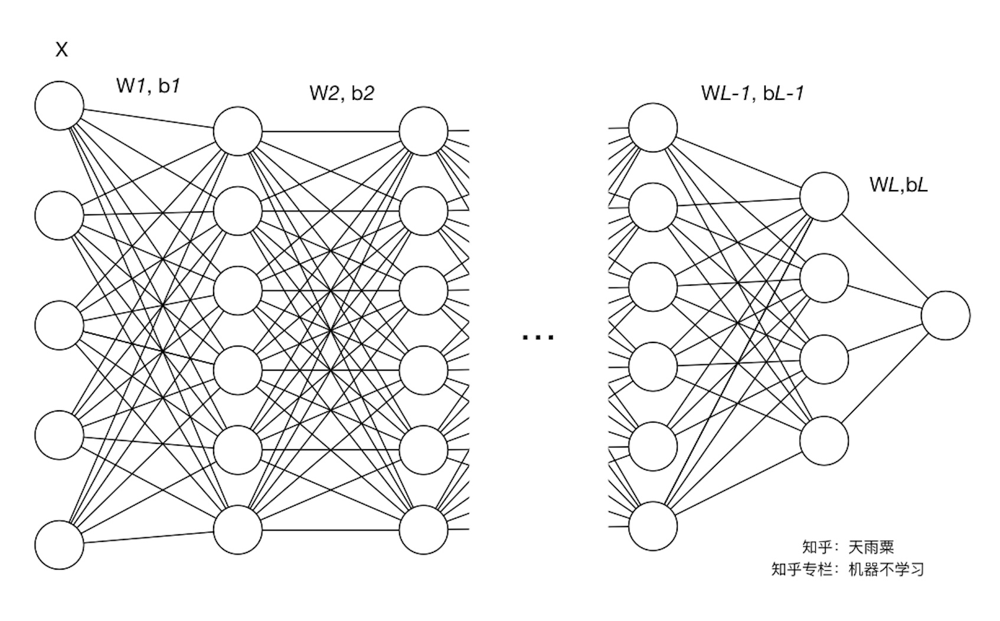
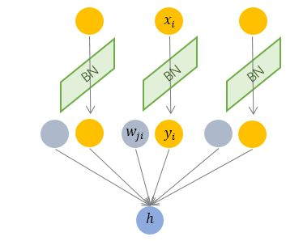
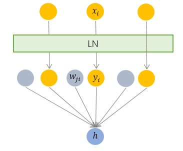
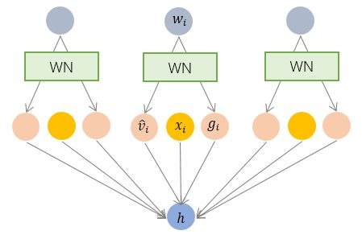
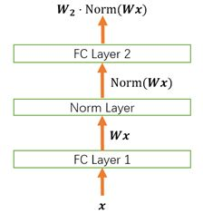
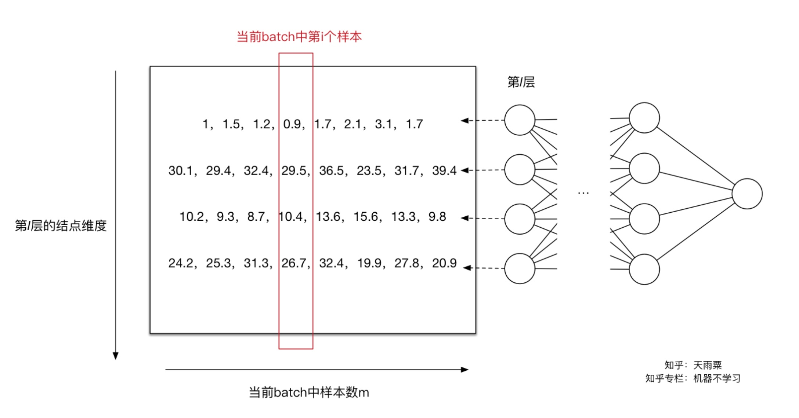
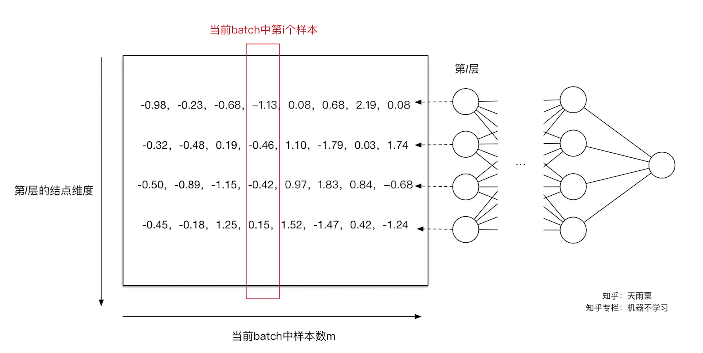

###
详解深度学习中的Normalization，不只是BN

####1、什么是covariate shift？
我们规定左侧为神经网络的底层，右侧为神经网络的上层。那么网络中层与层之间的关联性会导致如下的状况：随着训练的进行，网络中的参数也随着梯度下降在不停更新。

+ 一方面，当底层网络中参数发生微弱变化时，由于每一层中的线性变换与非线性激活映射，这些微弱变化随着网络层数的加深而被放大（类似蝴蝶效应）；

+ 另一方面，参数的变化导致每一层的输入分布会发生改变，进而上层的网络需要不停地去适应这些分布变化，使得我们的模型训练变得困难。上述这一现象叫做Internal Covariate Shift。

**那么covariate shift到底是什么？**
Batch Normalization的原论文作者给了Internal Covariate Shift一个较规范的定义：在深层网络训练的过程中，**由于网络中参数变化而引起内部结点数据分布发生变化**的这一过程被称作Internal Covariate Shift。

这句话该怎么理解呢？我们同样以上图为例，我们定义每一层的线性变换为 $Z^{[l]}=W^{[l]}\times input+b^{[l]}$，其中 $l$  代表层数；非线性变换为 $A^{[l]}=g^{[l]}(Z^{[l]})$ ，其中 $g^{[l]}(\cdot)$ 为第 $l$ 层的激活函数。

随着梯度下降的进行，每一层的参数 $W^{[l]}$ 与 $b^{[l]}$ 都会被更新，那么 $Z^{[l]}$ 的分布也就发生了改变，进而 $A^{[l]}$ 也同样出现分布的改变。而 $A^{[l]}$ 作为第 $l+1$ 层的输入，意味着 $l+1$ 层就需要去不停适应这种数据分布的变化，这一过程就被叫做Internal Covariate Shift。

####2、怎么解决covariate shift？
要缓解ICS的问题，就要明白它产生的原因。ICS产生的原因是由于参数更新带来的网络中每一层输入值分布的改变，并且随着网络层数的加深而变得更加严重，因此我们可以通过固定每一层网络输入值的分布来对减缓ICS问题。

**（1）白化（Whitening）**

白化（Whitening）是机器学习里面常用的一种规范化数据分布的方法，主要是PCA白化与ZCA白化。白化是对输入数据分布进行变换，进而达到以下两个目的：

+ **使得输入特征分布具有相同的均值与方差。**
其中PCA白化保证了所有特征分布均值为0，方差为1；而ZCA白化则保证了所有特征分布均值为0，方差相同；

+ **去除特征之间的相关性。**

通过白化操作，我们可以减缓ICS的问题，进而固定了每一层网络输入分布，加速网络训练过程的收敛。

**（2）Batch Normalization提出**

既然白化可以解决这个问题，为什么我们还要提出别的解决办法？当然是现有的方法具有一定的缺陷，白化主要有以下两个问题：

+ **白化过程计算成本太高**，并且在每一轮训练中的每一层我们都需要做如此高成本计算的白化操作；

+ **白化过程由于改变了网络每一层的分布**，因而改变了网络层中本身数据的表达能力。底层网络学习到的参数信息会被白化操作丢失掉。

既然有了上面两个问题，那我们的解决思路就很简单，一方面，我们提出的normalization方法要能够简化计算过程；另一方面又需要经过规范化处理后让数据尽可能保留原始的表达能力。于是就有了简化+改进版的白化——Batch Normalization。

####3、为什么需要 Normalization

#####3.1、独立同分布与白化
机器学习界的炼丹师们最喜欢的数据有什么特点？窃以为，莫过于**“独立同分布”**了，即independent and identically distributed，简称为 i.i.d.  独立同分布并非所有机器学习模型的必然要求（比如 **Naive Bayes 模型就建立在特征彼此独立的基础之上，而Logistic Regression 和 神经网络 则在非独立的特征数据上依然可以训练出很好的模型**），但独立同分布的数据可以简化常规机器学习模型的训练、提升机器学习模型的预测能力，已经是一个共识。

因此，在把数据喂给机器学习模型之前，**“白化（whitening）”是一个重要的数据预处理步骤。**白化一般包含两个目的：

+ （1）去除特征之间的相关性 —> **独立**；

+ （2）使得所有特征具有相同的均值和方差 —> **同分布**。

白化最典型的方法就是PCA。

#####3.2、深度学习中的 Internal Covariate Shift
深度神经网络模型的训练为什么会很困难？其中一个重要的原因是，深度神经网络涉及到很多层的叠加，而每一层的参数更新会导致上层的输入数据分布发生变化，通过层层叠加，高层的输入分布变化会非常剧烈，这就使得高层需要不断去重新适应底层的参数更新。为了训好模型，我们需要非常谨慎地去设定学习率、初始化权重、以及尽可能细致的参数更新策略。

Google 将这一现象总结为 Internal Covariate Shift，简称 ICS. 什么是 ICS 呢？

大家都知道在统计机器学习中的一个经典假设是“源空间（source domain）和目标空间（target domain）的数据分布（distribution）是一致的”。如果不一致，那么就出现了新的机器学习问题，如 transfer learning / domain adaptation 等。而 covariate shift 就是分布不一致假设之下的一个分支问题，**它是指源空间和目标空间的条件概率是一致的，但是其边缘概率不同**，即：对所有 $x \in \mathcal{X}$, $P_s(Y|X=x) = P_t(Y|X=x)$ 但是　$P_s(X) \neq P_t(X)$ .大家细想便会发现，的确，对于神经网络的各层输出，由于它们经过了层内操作作用，其分布显然与各层对应的输入信号分布不同，而且差异会随着网络深度增大而增大，可是它们所能“指示”的样本标记（label）仍然是不变的，这便符合了covariate shift的定义。由于是对层间信号的分析，也即是“internal”的来由。

#####3.3、ICS 会导致什么问题？
简而言之，每个神经元的**输入数据不再是“独立同分布”**。

+ 其一，上层参数需要不断适应新的输入数据分布，降低学习速度。
我们在上面提到了梯度下降的过程会让每一层的参数 $W^{[l]}$ 和 $b^{[l]}$ 发生变化，进而使得每一层的线性与非线性计算结果分布产生变化。后层网络就要不停地去适应这种分布变化，这个时候就会使得整个网络的学习速率过慢。

+ 其二，下层输入的变化可能趋向于变大或者变小，导致上层落入饱和区，使得学习过早停止。
当我们在神经网络中采用饱和激活函数（saturated activation function）时，例如sigmoid，tanh激活函数，很容易使得模型训练陷入梯度饱和区（saturated regime）。随着模型训练的进行，我们的参数 $W^{[l]}$ 会逐渐更新并变大，此时 $Z^{[l]}=W^{[l]}A^{[l-1]}+b^{[l]}$ 就会随之变大，并且 $Z^{[l]}$ 还受到更底层网络参数 $W^{[1]},W^{[2]},\cdots,W^{[l-1]}$ 的影响，随着网络层数的加深，$ Z^{[l]} $很容易陷入梯度饱和区，此时梯度会变得很小甚至接近于0，参数的更新速度就会减慢，进而就会放慢网络的收敛速度。
对于激活函数梯度饱和问题，有两种解决思路。**第一种就是更为非饱和性激活函数，例如线性整流函数ReLU可以在一定程度上解决训练进入梯度饱和区的问题。另一种思路是，我们可以让激活函数的输入分布保持在一个稳定状态来尽可能避免它们陷入梯度饱和区，这也就是Normalization的思路。**

+ 其三，每层的更新都会影响到其它层，因此每层的参数更新策略需要尽可能的谨慎。

####4、Normalization 的通用框架与基本思想
我们以神经网络中的一个普通神经元为例。神经元接收一组输入向量 $\boldsymbol{x} = (x_1,x_2,...,x_d)$,通过某种运算后，输出一个标量值　$y=f(\boldsymbol x)$

由于 ICS 问题的存在， $\boldsymbol x$ 的分布可能相差很大。要解决独立同分布的问题，**“理论正确”的方法就是对每一层的数据都进行白化操作**。然而标准的白化操作代价高昂，特别是我们还希望白化操作是可微的，保证白化操作可以通过反向传播来更新梯度。

因此，以 BN 为代表的 Normalization 方法退而求其次，进行了简化的白化操作。基本思想是：在将  $\boldsymbol x$ 送给神经元之前，先对其做**平移和伸缩变换**， 将 $\boldsymbol x$ 的分布规范化成在固定区间范围的标准分布。

**通用变换框架就如下所示：**

$$h=f\left(\boldsymbol g\cdot\frac{\boldsymbol x-\mu}{\sigma}+\boldsymbol b\right)$$

我们来看看这个公式中的各个参数。
+ $\mu$ 是平移参数（shift parameter）， $\sigma$ 是缩放参数（scale parameter）。通过这两个参数进行 shift 和 scale 变换： $\hat{\boldsymbol x}=\frac{\boldsymbol x-\mu}{\sigma}$ 得到的数据符合均值为 0、方差为 1 的标准分布。 

+ $\boldsymbol b$ 是再平移参数（re-shift parameter）， $\boldsymbol g$ 是再缩放参数（re-scale parameter）。将 上一步得到的 $\hat{\boldsymbol x}$ 进一步变换为： $y=\boldsymbol g\cdot \hat{\boldsymbol x} + \boldsymbol b$ 

最终得到的数据符合均值为  $\boldsymbol b$ 、方差为 $\boldsymbol g^2$ 的分布。

奇不奇怪？奇不奇怪？

说好的处理 ICS，第一步都已经得到了标准分布，第二步怎么又给变走了？
答案是——**为了保证模型的表达能力不因为规范化而下降。**

我们可以看到，第一步的变换将输入数据限制到了一个全局统一的确定范围（均值为 0、方差为 1）。下层神经元可能很努力地在学习，但不论其如何变化，其输出的结果在交给上层神经元进行处理之前，将被粗暴地重新调整到这一固定范围。

为了尊重底层神经网络的学习结果，我们将规范化后的数据进行再平移和再缩放，使得每个神经元对应的输入范围是针对该神经元量身定制的一个确定范围（均值为  $\boldsymbol b$ 、方差为 $\boldsymbol g^2$ ）。**rescale 和 reshift 的参数都是可学习的**，这就使得 Normalization 层可以学习如何去尊重底层的学习结果。

除了充分利用底层学习的能力，另一方面的重要意义在于保证获得非线性的表达能力。Sigmoid 等激活函数在神经网络中有着重要作用，通过区分饱和区和非饱和区，使得神经网络的数据变换具有了非线性计算能力。而第一步的规范化会将几乎所有数据映射到激活函数的非饱和区（线性区），仅利用到了线性变化能力，从而降低了神经网络的表达能力。而进行再变换，则可以将数据从线性区变换到非线性区，恢复模型的表达能力。

**经过这么的变回来再变过去，会不会跟没变一样？**

不会。因为，再变换引入的两个新参数 $\boldsymbol g$ 和 $\boldsymbol b$，可以表示旧参数作为输入的同一族函数，但是新参数有不同的学习动态。在旧参数中， $\boldsymbol x$ 的均值取决于下层神经网络的复杂关联；但在新参数中， $y=\boldsymbol g\cdot \hat{\boldsymbol x} + \boldsymbol　b$ 仅由 $\boldsymbol b$ 来确定，去除了与下层计算的密切耦合。新参数很容易通过梯度下降来学习，简化了神经网络的训练。

**这样的 Normalization 离标准的白化还有多远？**
标准白化操作的目的是“独立同分布”。独立就不说了，暂不考虑。变换为**均值为 b** 、方差为 $\boldsymbol g^2$ 的分布，也并不是严格的同分布，只是映射到了一个确定的区间范围而已。（所以，这个坑还有得研究呢！）

####5、主流 Normalization 方法梳理
在上一节中，我们提炼了 Normalization 的通用公式：
$$h=f\left(\boldsymbol g\cdot\frac{\boldsymbol x-\mu}{\sigma}+\boldsymbol b\right)$$
对照于这一公式，我们来梳理主流的四种规范化方法。

#####5.1、Batch Normalization —— 纵向规范化
Batch Normalization 于2015年由 Google 提出，开 Normalization 之先河。其规范化针对单个神经元进行，利用网络训练时一个 mini-batch 的数据来计算该神经元 $x_i$ 的均值和方差, 因而称为 Batch Normalization。
$$\mu_i = \frac{1}{M}\sum{x_i}, \quad \sigma_i= \sqrt{\frac{1}{M}\sum{(x_i-\mu_i)^2}+\epsilon }$$

其中 M 是 mini-batch 的大小。

按上图所示，相对于一层神经元的水平排列，BN 可以看做一种纵向的规范化。**由于 BN 是针对单个维度定义的,也就是针对每个输入定义的**，因此标准公式中的计算均为 element-wise 的。

BN 独立地规范化每一个输入维度 $x_i$ ，但规范化的参数是一个 mini-batch 的**一阶统计量和二阶统计量**。这就要求 **每一个 mini-batch 的统计量是整体统计量的近似估计**，或者说**每一个 mini-batch 彼此之间，以及和整体数据，都应该是近似同分布的**。分布差距较小的 mini-batch 可以看做是为规范化操作和模型训练引入了噪声，可以增加模型的鲁棒性；**但如果每个 mini-batch的原始分布差别很大，那么不同 mini-batch 的数据将会进行不一样的数据变换，这就增加了模型训练的难度。**

因此，BN 比较适用的场景是：**每个 mini-batch 比较大，数据分布比较接近。在进行训练之前，要做好充分的 shuffle. 否则效果会差很多。**

另外，由于 BN 需要在运行过程中**统计每个 mini-batch 的一阶统计量和二阶统计量**，因此**不适用于 动态的网络结构 和 RNN 网络。**不过，也有研究者专门提出了适用于 RNN 的 BN 使用方法，这里先不展开了。

#####5.2、Layer Normalization —— 横向规范化
层规范化就是针对 BN 的上述不足而提出的。与 BN 不同，LN 是一种横向的规范化，如图所示。**它综合考虑一层所有维度的输入，计算该层的平均输入值和输入方差**，然后用同一个规范化操作来转换各个维度的输入。

$$\mu = \sum_i{x_i}, \quad \sigma= \sqrt{\sum_i{(x_i-\mu)^2}+\epsilon }$$

其中 $i$ 枚举了该层所有的输入神经元。对应到标准公式中，四大参数 $\mu, \sigma, g, b$ 均为标量（BN中是向量），所有输入共享一个规范化变换。

**LN 针对单个训练样本进行，不依赖于其他数据**，因此可以避免 BN 中受 mini-batch 数据分布影响的问题，**可以用于小mini-batch场景、动态网络场景和 RNN**，特别是自然语言处理领域。此外，**LN 不需要保存 mini-batch 的均值和方差，节省了额外的存储空间。**

但是，BN 的转换是针对单个神经元可训练的——不同神经元的输入经过再平移和再缩放后分布在不同的区间，而 **LN 对于一整层的神经元训练得到同一个转换——所有的输入都在同一个区间范围内。**如果不同输入特征不属于相似的类别（比如颜色和大小），那么 LN 的处理可能会降低模型的表达能力。

#####5.3、Weight Normalization —— 参数规范化
前面我们讲的模型框架
$$h=f\left(\boldsymbol g\cdot\frac{\boldsymbol x-\mu}{\sigma}+\boldsymbol b\right)$$
其中，经过规范化之后的 $\boldsymbol{y}$ 作为输入送到下一个神经元，应用以 $\boldsymbol{w}$ 为参数的  $f_{\boldsymbol w}(\cdot)$ 函数定义的变换。最普遍的变换是线性变换，即 $f_\boldsymbol{w}(\boldsymbol{x})=\boldsymbol{w}\cdot\boldsymbol{x}$

BN 和 LN 均将规范化应用于输入的特征数据 $\boldsymbol{x}$ ，而 WN 则另辟蹊径，将规范化应用于线性变换函数的权重 $\boldsymbol{w}$ ，这就是 WN 名称的来源。

具体而言，WN 提出的方案是，将权重向量 $\boldsymbol{w}$ 分解为向量方向 $\hat{\boldsymbol{v}}$ 和向量模 $g$ 两部分：

$${\boldsymbol{w}} = g\cdot\hat{\boldsymbol{v}} = g\cdot\frac{\boldsymbol{v}}{\boldsymbol{||v||}}$$

其中 $\boldsymbol{v}$ 是与 $\boldsymbol{w}$ 同维度的向量， $\boldsymbol{||v||}$ 是欧氏范数，因此$\hat{\boldsymbol{v}}$ 是单位向量，决定了 $\boldsymbol{w}$ 的方向；g 是标量，决定了 $\boldsymbol{w}$ 的长度。由于 $||{\boldsymbol{w}}|| \equiv |g|$ ，因此这一权重分解的方式将权重向量的欧氏范数进行了固定，从而实现了正则化的效果。

**乍一看，这一方法似乎脱离了我们前文所讲的通用框架？**

并没有。其实从最终实现的效果来看，异曲同工。我们来推导一下看。  
$$f_\boldsymbol{w}(WN(\boldsymbol{x}))=\boldsymbol{w}\cdot WN(\boldsymbol{x}) = g\cdot\frac{\boldsymbol{v}}{\boldsymbol{||v||}} \cdot\boldsymbol{x} \\= \boldsymbol{v}\cdot g\cdot\frac{\boldsymbol{x}}{\boldsymbol{||v||}}=f_\boldsymbol{v}(g\cdot\frac{\boldsymbol{x}}{\boldsymbol{||v||}}) $$

对照一下前述框架：
$$h=f\left(\boldsymbol g\cdot\frac{\boldsymbol x-\mu}{\sigma}+\boldsymbol b\right)$$

我们只需令：

$$\boldsymbol{\sigma} = \boldsymbol{||v||}, \quad \boldsymbol{\mu}=0, \quad \boldsymbol{b}=0\\ $$

回忆一下，**BN 和 LN 是用输入的特征数据的方差对输入数据进行 scale，而 WN 则是用 神经元的权重的欧氏范式对输入数据进行 scale**。虽然在原始方法中分别进行的是特征数据规范化和参数的规范化，但本质上都实现了对数据的规范化，只是用于 scale 的参数来源不同。

另外，我们看到这里的规范化**只是对数据进行了 scale，而没有进行 shift**，因为我们简单地令 $\boldsymbol{\mu}=0$. 但事实上，这里留下了与 BN 或者 LN 相结合的余地——那就是利用 BN 或者 LN 的方法来计算输入数据的均值 $\boldsymbol{\mu}$ 。

WN 的规范化不直接使用输入数据的统计量，因此避免了 BN 过于依赖 mini-batch 的不足，以及 LN 每层唯一转换器的限制，同时也可以用于动态网络结构。

#####5.4、Cosine Normalization —— 余弦规范化
我们再来看看神经元的经典变换 $f_\boldsymbol{w}(\boldsymbol{x})=\boldsymbol{w}\cdot\boldsymbol{x}$

+ 对输入数据 $\boldsymbol{x}$ 的变换已经做过了，横着来是 LN，纵着来是 BN。

+ 对模型参数 $\boldsymbol{w}$ 的变换也已经做过了，就是 WN。

然而天才的研究员们盯上了中间的那个点，对，就是 $\cdot$ 

他们说，**我们要对数据进行规范化的原因，是数据经过神经网络的计算之后可能会变得很大，导致数据分布的方差爆炸，而这一问题的根源就是我们的计算方式——点积**，权重向量 $\boldsymbol{w}$ 和 特征数据向量 $\boldsymbol{x}$ 的点积。向量点积是无界（unbounded）的啊！

那怎么办呢？**我们知道向量点积是衡量两个向量相似度的方法之一**。哪还有没有其他的相似度衡量方法呢？有啊，很多啊！夹角余弦就是其中之一啊！而且关键的是，**夹角余弦是有确定界的啊，[-1, 1] 的取值范围**，多么的美好！仿佛看到了新的世界！

于是，Cosine Normalization 就出世了。他们不处理权重向量 $\boldsymbol{w}$ ，也不处理特征数据向量 $\boldsymbol{x}$ ，就改了一下线性变换的函数：

$$f_\boldsymbol{w}(\boldsymbol{x})=cos \theta = \frac{\boldsymbol{w}\cdot\boldsymbol{x}}{\boldsymbol{||w||}\cdot\boldsymbol{||x||}}\\ $$

其中 $\theta$ 是 $\boldsymbol{w}$ 和 $\boldsymbol{x}$ 的夹角。然后就没有然后了，所有的数据就都是 [-1, 1] 区间范围之内的了！

不过，回过头来看，CN 与 WN 还是很相似的。我们看到上式中，分子还是 $\boldsymbol{w}$ 和 $\boldsymbol{x}$ 的内积，而分母则可以看做用 $\boldsymbol{w}$ 和 $\boldsymbol{x}$ 二者的模之积进行规范化。对比一下 WN 的公式：
$$f_\boldsymbol{w}(WN(\boldsymbol{x}))=f_\boldsymbol{v}(g\cdot\frac{\boldsymbol{x}}{\boldsymbol{||v||}}) $$

一定程度上可以理解为，WN 用 权重的模 $\boldsymbol{||v||}$ 对输入向量进行 scale，而 CN 在此基础上用输入向量的模 $\boldsymbol{||x||}$ 对输入向量进行了进一步的 scale.

CN 通过用余弦计算代替内积计算实现了规范化，但成也萧何败萧何。原始的内积计算，其几何意义是 输入向量在权重向量上的投影，既包含 二者的夹角信息，也包含 两个向量的scale信息。去掉scale信息，可能导致表达能力的下降，因此也引起了一些争议和讨论。具体效果如何，可能需要在特定的场景下深入实验。

####6、Normalization 为什么会有效？
我们以下面这个简化的神经网络为例来分析。

#####6.1、Normalization 的权重伸缩不变性
**权重伸缩不变性（weight scale invariance）指的是**，当权重 $\boldsymbol{W}$ 按照常量 $\lambda$ 进行伸缩时，得到的规范化后的值保持不变，即：
$$Norm(\boldsymbol{W'}\boldsymbol{x})=Norm(\boldsymbol{W}\boldsymbol{x})\\$$

其中 $\boldsymbol{W'}=\lambda\boldsymbol{W}$ 。

**上述规范化方法均有这一性质**，这是因为，当权重 $\boldsymbol{W}$ 伸缩时，对应的均值和标准差均等比例伸缩，分子分母相抵。
$$
Norm(\boldsymbol{W'x})=Norm\left(\boldsymbol{g}\cdot\frac{\boldsymbol{\boldsymbol{W'x}}-\boldsymbol{\mu'}}{\boldsymbol{\sigma'}}+\boldsymbol{b}\right)\\=Norm\left(\boldsymbol{g}\cdot\frac{\lambda\boldsymbol{Wx}-\lambda\boldsymbol{\mu}}{\lambda\boldsymbol{\sigma}}+\boldsymbol{b}\right)\\=Norm\left(\boldsymbol{g}\cdot\frac{\boldsymbol{Wx}-\boldsymbol{\mu}}{\boldsymbol{\sigma}}+\boldsymbol{b}\right)=Norm(\boldsymbol{Wx})\\
$$

**权重伸缩不变性可以有效地提高反向传播的效率。由于**

$$\frac{\partial Norm(\boldsymbol{W'x})}{\partial \boldsymbol{x}} = \frac{\partial Norm(\boldsymbol{Wx})}{\partial \boldsymbol{x}} \\ $$

因此，权重的伸缩变化不会影响反向梯度的 Jacobian 矩阵，因此也就对反向传播没有影响，**避免了反向传播时因为权重过大或过小导致的梯度消失或梯度爆炸问题，从而加速了神经网络的训练。**

**权重伸缩不变性还具有参数正则化的效果，可以使用更高的学习率。**

由于 
$$\frac{\partial Norm(\boldsymbol{W'x})}{\partial \boldsymbol{W'}} =\frac{1}{ \lambda}\cdot \frac{\partial Norm(\boldsymbol{Wx})}{\partial\boldsymbol{W}} \\ $$

因此，下层的权重值越大，其梯度就越小。这样，参数的变化就越稳定，相当于实现了参数正则化的效果，避免参数的大幅震荡，提高网络的泛化性能。

#####6.2、 Normalization 的数据伸缩不变性

**数据伸缩不变性（data scale invariance）指的是**，当数据 $\boldsymbol{x}$ 按照常量 $\lambda$ 进行伸缩时，得到的规范化后的值保持不变，即：
$$Norm(\boldsymbol{W}\boldsymbol{x'})=Norm(\boldsymbol{W}\boldsymbol{x})\\$$

其中 $\boldsymbol{x'}=\lambda\boldsymbol{x}$。

数据伸缩不变性仅对 BN、LN 和 CN 成立。因为这三者对输入数据进行规范化，因此当数据进行常量伸缩时，其均值和方差都会相应变化，分子分母互相抵消。而 WN 不具有这一性质。

**数据伸缩不变性可以有效地减少梯度弥散，简化对学习率的选择。**

对于某一层神经元 $h_l=f_{\boldsymbol{W}_l}(\boldsymbol{x}_l)$ 而言，展开可得

$$h_l=f_{\boldsymbol{W}_l}(\boldsymbol{x}_l)=f_{\boldsymbol{W}_l}(f_{\boldsymbol{W}_{l-1}}(\boldsymbol{x}_{l-1}))=\cdots=\boldsymbol{x}_0\prod_{k=0}^l\boldsymbol{W}_k\\ $$

**层神经元的输出依赖于底下各层的计算结果。如果没有正则化，当下层输入发生伸缩变化时，经过层层传递，可能会导致数据发生剧烈的膨胀或者弥散，从而也导致了反向计算时的梯度爆炸或梯度弥散。**

加入 Normalization 之后，不论底层的数据如何变化，对于某一层神经元 $h_l=f_{\boldsymbol{W}_l}(\boldsymbol{x}_l)$ 而言，其输入 $\boldsymbol{x}_l$ 永远保持标准的分布，这就使得高层的训练更加简单。从梯度的计算公式来看：

$$
\frac{\partial Norm(\boldsymbol{Wx'})}{\partial \boldsymbol{W}} = \frac{\partial Norm(\boldsymbol{Wx})}{\partial\boldsymbol{W}} \\
$$

数据的伸缩变化也不会影响到对该层的权重参数更新，使得训练过程更加鲁棒，简化了对学习率的选择。

####7、以Batch Normalization为基础演示计算过程
#####7.1、思路
既然白化计算过程比较复杂，那我们就简化一点，比如我们可以尝试单独对每个特征进行normalizaiton就可以了，**让每个特征都有均值为0，方差为1的分布就OK。**

另一个问题，既然**白化操作减弱了网络中每一层输入数据表达能力，那我就再加个线性变换操作**，让这些数据再能够尽可能恢复本身的表达能力就好了。

因此，基于上面两个解决问题的思路，作者提出了Batch Normalization，下一部分来具体讲解这个算法步骤。

#####7.2、算法
在深度学习中，由于采用full batch的训练方式对内存要求较大，且每一轮训练时间过长；我们一般都会采用对数据做划分，用mini-batch对网络进行训练。因此，**Batch Normalization也就在mini-batch的基础上进行计算**。

#####7.2.1、参数定义
我们依旧以下图这个神经网络为例。我们定义网络总共有 L 层（不包含输入层）并定义如下符号：

**参数相关：**

+ $l$ ：网络中的层标号

+ $L$ ：网络中的最后一层或总层数

+ $d_l$ ：第 l 层的维度，即神经元结点数

+ $W^{[l]}$ ：第 $l$ 层的权重矩阵， $W^{[l]}\in \mathbb{R}^{d_l\times d_{l-1}}$
 
+ $b^{[l]}$ ：第 $l$ 层的偏置向量， $b^{[l]}\in \mathbb{R}^{d_l\times 1}$

+ $Z^{[l]}$ ：第 $l$ 层的线性计算结果， $Z^{[l]}=W^{[l]}\times input+b^{[l]}$

+ $g^{[l]}(\cdot)$ ：第 $l$ 层的激活函数

+ $A^{[l]}$ ：第 $l$ 层的非线性激活结果， $A^{[l]}=g^{[l]}(Z^{[l]})$

**样本相关：**

+ $M$ ：训练样本的数量

+ $N$ ：训练样本的特征数

+ $X$ ：训练样本集， $X=\{x^{(1)},x^{(2)},\cdots,x^{(M)}\}，X\in \mathbb{R}^{N\times M}$ （注意这里 $X$ 的一列是一个样本）

+ m ：batch size，即每个batch中样本的数量

+ $\chi^{(i)}$ ：第 $i$ 个 mini-batch 的训练数据， $X= \{\chi^{(1)},\chi^{(2)},\cdots,\chi^{(k)}\}$ ，其中 $\chi^{(i)}\in \mathbb{R}^{N\times m}$

#####7.2.2、算法步骤
介绍算法思路沿袭前面BN提出的思路来讲。第一点，**对每个特征进行独立的 normalization**。我们考虑一个batch的训练，传入 $m$ 个训练样本，并关注网络中的某一层，忽略上标 $l$ 。

$$Z\in \mathbb{R}^{d_l\times m}$$

我们关注当前层的第 $j$ 个维度，也就是第 $j$ 个神经元结点，则有 $Z_j\in \mathbb{R}^{1\times m}$ 。我们当前维度进行规范化, 只关心当前维度中，batch中所有数据,所以规范化的时候也只使用了当前维度的数据：

$$\mu_j=\frac{1}{m}\sum_{i=1}^m Z_j^{(i)} $$

$$ \sigma^2_j=\frac{1}{m}\sum_{i=1}^m(Z_j^{(i)}-\mu_j)^2 $$

$$\hat{Z}_j=\frac{Z_j-\mu_j}{\sqrt{\sigma_j^2+\epsilon}} $$

其中 $\epsilon$ 是为了防止方差为0产生无效计算。

下面我们再来结合个具体的例子来进行计算。下图我们只关注第 $l$ 层 **(只是当前一层的结果)** 的计算结果，左边的矩阵 $Z^{[l]}=W^{[l]}A^{[l-1]}+b^{[l]}$ **线性计算结果**，还未进行激活函数的非线性变换。此时每一列是一个样本，图中可以看到共有8列，代表当前训练样本的batch中共有8个样本，每一行代表当前 $l$ 层神经元的一个节点，可以看到当前 $l$ 层共有4个神经元结点，即第 $l$ 层维度为4。我们可以看到，每行的数据分布都不同。

对于第一个神经元，我们求得 $\mu_1=1.65 ， \sigma^2_1=0.44$ （其中 $\epsilon=10^{-8}$ ），此时我们利用 $\mu_1,\sigma^2_1$ 对第一行数据（第一个维度）进行 normalization 得到新的值 $[-0.98,-0.23,-0.68,-1.13,0.08,0.68,2.19,0.08]$ 。同理我们可以计算出其他输入维度归一化后的值。如下图：

通过上面的变换，**我们解决了第一个问题，即用更加简化的方式来对数据进行规范化，使得第 $l$ 层的输入每个特征的分布均值为0，方差为1。**

如同上面提到的，Normalization 操作我们虽然缓解了ICS问题，让每一层网络的输入数据分布都变得稳定，**但却导致了数据表达能力的缺失。**也就是我们通过变换操作改变了原有数据的信息表达，使得底层网络学习到的参数信息丢失。另一方面，通过让每一层的输入分布均值为0，方差为1，**会使得输入在经过sigmoid或tanh激活函数时，容易陷入非线性激活函数的线性区域。**

因此，BN又引入了两个可学习（learnable）的参数 $\gamma$ 与 $\beta$ 。**这两个参数的引入是为了恢复数据本身的表达能力**，对规范化后的数据进行线性变换，即 $\tilde{Z_j}=\gamma_j \hat{Z}_j+\beta_j$ 。特别地，当 $\gamma^2=\sigma^2,\beta=\mu $时，可以实现等价变换并且保留了原始输入特征的分布信息。

**通过上面的步骤，我们就在一定程度上保证了输入数据的表达能力。**
补充： 在进行normalization的过程中，由于我们的规范化操作会对减去均值，因此，偏置项 $b$ 可以被忽略掉或可以被置为 0，即 $BN(Wu+b)=BN(Wu)$

#####7.2.3、公式
对于神经网络中的第 $l$ 层，我们有：

$$Z^{[l]}=W^{[l]}A^{[l-1]}+b^{[l]}$$

$$\mu=\frac{1}{m}\sum_{i=1}^mZ^{[l](i)} $$

$$\sigma^2=\frac{1}{m}\sum_{i=1}^m(Z^{[l](i)}-\mu)^2 $$

$$\tilde{Z}^{[l]}=\gamma\cdot\frac{Z^{[l]}-\mu}{\sqrt{\sigma^2+\epsilon}}+\beta $$

$$A^{[l]}=g^{[l]}(\tilde{Z}^{[l]}) $$

#####7.3、测试阶段如何使用Batch Normalization？
我们知道BN在每一层计算的 $\mu$ 与 $\sigma^2$ 都是基于当前 batch 中的训练数据，但是这就带来了一个问题：我们在预测阶段，**有可能只需要预测一个样本或很少的样本，没有像训练样本中那么多的数据**，此时 $\mu$ 与 $\sigma^2$ 的计算一定是有偏估计，这个时候我们该如何进行计算呢？

利用BN训练好模型后，我们保留了每组 mini-batch 训练数据在网络中每一层的 $\mu_{batch}$ 与 $\sigma^2_{batch}$ 。此时我们使用**整个样本的统计量**来对 Test 数据进行归一化，**具体来说使用均值与方差的无偏估计：**

$$\mu_{test}=\mathbb{E} (\mu_{batch})$$

$$\sigma^2_{test}=\frac{m}{m-1}\mathbb{E}(\sigma^2_{batch}) $$

得到每个特征的均值与方差的无偏估计后，我们对test数据采用同样的normalization方法：

$$BN(X_{test})=\gamma\cdot \frac{X_{test}-\mu_{test}}{\sqrt{\sigma^2_{test}+\epsilon}}+\beta $$

另外，除了采用整体样本的无偏估计外。吴恩达在Coursera上的Deep Learning课程指出可以对 train 阶段每个 batch 计算的 mean/variance 采用指数加权平均来得到 test 阶段 mean/variance 的估计。

#####7.4、Batch Normalization的优势
Batch Normalization在实际工程中被证明了能够缓解神经网络难以训练的问题，BN具有的有事可以总结为以下四点：

**（1）BN使得网络中每层输入数据的分布相对稳定，加速模型学习速度**

BN通过规范化与线性变换使得每一层网络的输入数据的均值与方差都在一定范围内，使得后一层网络不必不断去适应底层网络中输入的变化，从而实现了网络中层与层之间的解耦，允许每一层进行独立学习，有利于提高整个神经网络的学习速度。

**（2）BN使得模型对网络中的参数不那么敏感，简化调参过程，使得网络学习更加稳定**

在神经网络中，我们经常会谨慎地采用一些权重初始化方法（例如Xavier）或者合适的学习率来保证网络稳定训练。当学习率设置太高时，会使得参数更新步伐过大，容易出现震荡和不收敛。**但是使用BN的网络将不会受到参数数值大小的影响**。例如，我们对参数 $W$ 进行缩放得到 $aW$ 。对于缩放前的值 $Wu$ ，我们设其均值为 $\mu_1$ ，方差为 $\sigma^2_1$ ；对于缩放值 $aWu$ ，设其均值为 $\mu_2$ ，方差为 $\sigma^2_2$ ，则我们有：

$$\mu_2=a\mu_1 ， \sigma^2_2=a^2\sigma^2_1$$

我们忽略 $\epsilon$ ，则有：

$$BN(aWu)=\gamma\cdot\frac{aWu-\mu_2}{\sqrt{\sigma^2_2}}+\beta=\gamma\cdot\frac{aWu-a\mu_1}{\sqrt{a^2\sigma^2_1}}+\beta=\gamma\cdot\frac{Wu-\mu_1}{\sqrt{\sigma^2_1}}+\beta=BN(Wu)$$

$$\frac{\partial{BN((aW)u)}}{\partial{u}}=\gamma\cdot\frac{aW}{\sqrt{\sigma^2_2}}=\gamma\cdot\frac{aW}{\sqrt{a^2\sigma^2_1}}=\frac{\partial{BN(Wu)}}{\partial{u}}$$

$$\frac{\partial{BN((aW)u)}}{\partial{(aW)}}=\gamma\cdot\frac{u}{\sqrt{\sigma^2_2}}=\gamma\cdot\frac{u}{a\sqrt{\sigma^2_1}}=\frac{1}{a}\cdot\frac{\partial{BN(Wu)}}{\partial{W}}$$

注：公式中的 $u$ 是当前层的输入，也是前一层的输出；不是下标啊旁友们！

我们可以看到，经过BN操作以后，权重的缩放值会被“抹去”，因此保证了输入数据分布稳定在一定范围内。另外，权重的缩放并不会影响到对 $u$ 的梯度计算；并且当权重越大时，即 $a$ 越大， $\frac{1}{a}$ 越小，意味着权重 $W$ 的梯度反而越小，这样BN就保证了梯度不会依赖于参数的scale，使得参数的更新处在更加稳定的状态。

因此，在使用Batch Normalization之后，抑制了参数微小变化随着网络层数加深被放大的问题**(这里有个系数控制,让其变化恒定,不至于太大)**，使得网络对参数大小的适应能力更强，此时我们可以设置较大的学习率而不用过于担心模型的风险。

**（3）BN允许网络使用饱和性激活函数（例如 sigmoid，tanh等），缓解梯度消失问题**

在不使用BN层的时候，由于网络的深度与复杂性，很容易使得底层网络变化累积到上层网络中，导致模型的训练很容易进入到激活函数的梯度饱和区；**通过 normalize 操作可以让激活函数的输入数据落在梯度非饱和区，缓解梯度消失的问题**；另外通过自适应学习 $\gamma$ 与 $\beta$ 又让数据保留更多的原始信息。

**（4）BN具有一定的正则化效果**

在Batch Normalization中，由于我们使用 mini-batch 的均值与方差作为对整体训练样本均值与方差的估计，尽管每一个batch中的数据都是从总体样本中抽样得到，但**不同 mini-batch 的均值与方差会有所不同，这就为网络的学习过程中增加了随机噪音**，与Dropout通过关闭神经元给网络训练带来噪音类似，在一定程度上对模型起到了正则化的效果。

**另外，原作者通过也证明了网络加入BN后，可以丢弃Dropout，模型也同样具有很好的泛化效果。**