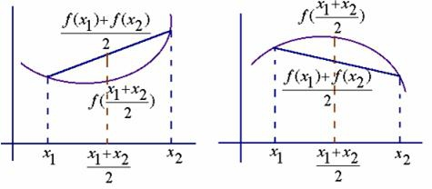
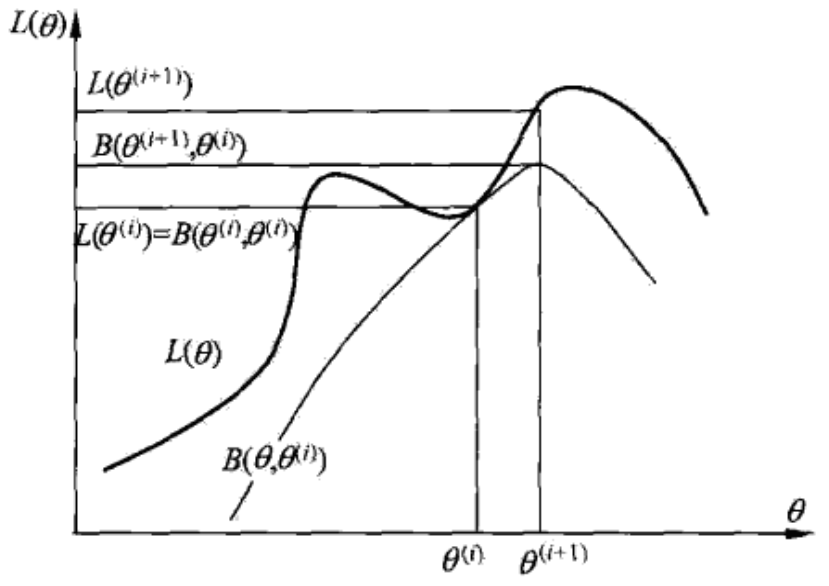
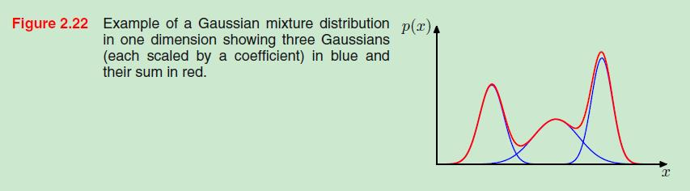

##
EM算法及其推广

###1、感性地理解EM算法
如果使用基于最大似然估计的模型，模型中存在隐变量，就要用EM算法做参数估计。个人认为，理解EM算法背后的idea，远比看懂它的数学推导重要。idea会让你有一个直观的感受，从而明白算法的合理性，数学推导只是将这种合理性用更加严谨的语言表达出来而已。打个比方，一个梨很甜，用数学的语言可以表述为糖分含量90%，但只有亲自咬一口，你才能真正感觉到这个梨有多甜，也才能真正理解数学上的90%的糖分究竟是怎么样的。如果EM是个梨，本文的目的就是带领大家咬一口。
####1.1、一个非常简单的例子
假设现在有两枚硬币1和2，,随机抛掷后正面朝上概率分别为 P1，P2。为了估计这两个概率，做实验，每次取一枚硬币，连掷5下，记录下结果，如下：

<table style="width:700px;text-align:center;margin:auto;"><thead><tr><th>硬币</th><th>结果</th><th>统计</th></tr></thead><tbody><tr><td>1</td><td>正正反正反</td><td>3正-2反</td></tr><tr><td>2</td><td>反反正正反</td><td>2正-3反</td></tr><tr><td>1</td><td>正反反反反</td><td>1正-4反</td></tr><tr><td>2</td><td>正反反正正</td><td>3正-2反</td></tr><tr><td>1</td><td>反正正反反</td><td>2正-3反</td></tr></tbody></table>

可以很容易地估计出P1和P2，如下：
P1 = （3+1+2）/ 15 = 0.4
P2= （2+3）/10 = 0.5
到这里，一切似乎很美好，下面我们加大难度。
####1.2、加入隐变量
还是上面的问题，现在我们抹去每轮投掷时使用的硬币标记，如下：

<table style="width:700px;text-align:center;margin:auto;"><thead><tr><th>硬币</th><th>结果</th><th>统计</th></tr></thead><tbody><tr><td>unknown</td><td>正正反正反</td><td>3正-2反</td></tr><tr><td>unknown</td><td>反反正正反</td><td>2正-3反</td></tr><tr><td>unknown</td><td>正反反反反</td><td>1正-4反</td></tr><tr><td>unknown</td><td>正反反正正</td><td>3正-2反</td></tr><tr><td>unknown</td><td>反正正反反</td><td>2正-3反</td></tr></tbody></table>

好了，现在我们的目标没变，还是估计P1和P2，要怎么做呢？

显然，此时我们多了一个隐变量 $z$（选择的是哪一个硬币），可以把它认为是一个5维的向量$（z_1,z_2,z_3,z_4,z_5)$，代表每次投掷时所使用的硬币，比如 $z_1$，就代表第一轮投掷时使用的硬币是1还是2。但是，这个变量 $z$ 不知道，就无法去估计P1和P2，所以，我们必须先估计出  $z$，然后才能进一步估计P1和P2。

但要估计 $z$，我们又得知道P1和P2，这样我们才能用最大似然概率法则去估计z，这不是鸡生蛋和蛋生鸡的问题吗，如何破？

答案就是先随机初始化一个P1和P2，用它来估计 $z$，然后基于 $z$，还是按照最大似然概率法则去估计新的P1和P2，如果新的P1和P2和我们初始化的P1和P2一样，请问这说明了什么？

**这说明我们初始化的P1和P2是一个相当靠谱的估计！**

就是说，我们初始化的P1和P2，按照最大似然概率就可以估计出 $z$，然后基于 $z$，按照最大似然概率可以反过来估计出P1和P2，当与我们初始化的P1和P2一样时，说明是P1和P2很有可能就是真实的值。这里面包含了两个交互的最大似然估计。

如果新估计出来的P1和P2和我们初始化的值差别很大，怎么办呢？

**就是继续用新的P1和P2迭代，直至收敛。**这就是下面的EM初级版。

####1.3、EM初级版
我们不妨这样，先随便给P1和P2赋一个值，比如：
P1 = 0.2
P2 = 0.7

然后，我们看看**第一轮**抛掷最可能是哪个硬币。
如果是硬币1，得出3正2反的概率为 $0.2\times0.2\times0.2\times0.8\times0.8 = 0.00512$
如果是硬币2，得出3正2反的概率为 $0.7\times0.7\times0.7\times0.3\times0.3=0.03087$
然后依次求出其他4轮中的相应概率。做成表格如下：
<table style="width:700px;text-align:center;margin:auto;"><thead><tr><th>轮数</th><th>若是硬币1</th><th>若是硬币2</th></tr></thead><tbody><tr><td>1</td><td>0.00512</td><td>0.03087</td></tr><tr><td>2</td><td>0.02048</td><td>0.01323</td></tr><tr><td>3</td><td>0.08192</td><td>0.00567</td></tr><tr><td>4</td><td>0.00512</td><td>0.03087</td></tr><tr><td>5</td><td>0.02048</td><td>0.01323</td></tr></tbody></table>

按照最大似然法则（选择一个极值作为估计值）：
第1轮中最有可能的是**硬币2**
第2轮中最有可能的是**硬币1**
第3轮中最有可能的是**硬币1**
第4轮中最有可能的是**硬币2**
第5轮中最有可能的是**硬币1**

我们就把上面的值作为 $z$ 的估计值。然后按照最大似然概率法则来估计新的P1和P2。

P1 = （2+1+2）/15 = 0.33
P2=（3+3）/10 = 0.6

设想我们是全知的神，知道每轮抛掷时的硬币就是如本文1.1部分标示的那样，那么，P1和P2的最大似然估计就是0.4和0.5（下文中将这两个值称为P1和P2的真实值）。那么对比下我们初始化的P1和P2和新估计出的P1和P2：
<table style="width:700px;text-align:center;margin:auto;"><thead><tr><th>初始化的P1</th><th>估计出的P1</th><th>真实的P1</th><th>初始化的P2</th><th>估计出的P2</th><th>真实的P2</th></tr></thead><tbody><tr><td>0.2</td><td>0.33</td><td>0.4</td><td>0.7</td><td>0.6</td><td>0.5</td></tr></tbody></table>

看到没？我们估计的P1和P2相比于它们的初始值，更接近它们的真实值了！

可以期待，我们继续按照上面的思路，用估计出的P1和P2再来估计z，再用z来估计新的P1和P2，反复迭代下去，就可以最终得到 P1 = 0.4，P2=0.5，此时无论怎样迭代，P1和P2的值都会保持0.4和0.5不变，于是乎，我们就找到了P1和P2的最大似然估计。

这里有两个问题：
1、新估计出的P1和P2一定会更接近真实的P1和P2？
答案是：没错，一定会更接近真实的P1和P2，数学可以证明。

2、迭代一定会收敛到真实的P1和P2吗？
答案是：不一定，取决于P1和P2的初始化值，上面我们之所以能收敛到P1和P2，是因为我们幸运地找到了好的初始化值。

####1.4、EM进阶版
下面，我们思考下，上面的方法还有没有改进的余地？

我们是用最大似然概率法则估计出的 $z$ 值，然后再用 $z$ 值按照最大似然概率法则估计新的P1和P2。也就是说，我们使用了 **一个** 最可能的 $z$ 值，而不是所有可能的 $z$ 值。

如果考虑所有 **所有** 的 $z$ 值，对每一个 $z$ 值都估计出一个新的P1和P2，将每一个 $z$ 值**概率大小作为权重**，将所有新的P1和P2分别加权相加，这样的P1和P2应该会更好一些。

<table style="width:700px;text-align:center;margin:auto;"><thead><tr><th>轮数</th><th>若是硬币1</th><th>若是硬币2</th></tr></thead><tbody><tr><td>1</td><td>0.00512</td><td>0.03087</td></tr><tr><td>2</td><td>0.02048</td><td>0.01323</td></tr><tr><td>3</td><td>0.08192</td><td>0.00567</td></tr><tr><td>4</td><td>0.00512</td><td>0.03087</td></tr><tr><td>5</td><td>0.02048</td><td>0.01323</td></tr></tbody></table>

利用上面这个表，我们可以算出每轮抛掷中使用硬币1或者使用硬币2的概率。比如第1轮，使用硬币1的概率是：
$$\frac{0.00512}{(0.00512+0.03087)}=0.14$$

使用硬币2的概率是 $1-0.14=0.86$
依次可以算出其他4轮的概率，如下：

<table style="width:700px;text-align:center;margin:auto;"><thead><tr><th>轮数</th><th>$z_i=硬币1$</th><th>$z_i=硬币2$</th></tr></thead><tbody><tr><td>1</td><td>0.14</td><td>0.86</td></tr><tr><td>2</td><td>0.61</td><td>0.39</td></tr><tr><td>3</td><td>0.94</td><td>0.06</td></tr><tr><td>4</td><td>0.14</td><td>0.86</td></tr><tr><td>5</td><td>0.61</td><td>0.39</td></tr></tbody></table>

上表中的右两列表示期望值。看第一行，0.86表示，从期望的角度看，这轮抛掷使用硬币2的概率是0.86。相比于前面的方法，我们按照最大似然概率，直接将第1轮估计为用的硬币2，此时的我们更加谨慎，我们只说，有0.14的概率是硬币1，有0.86的概率是硬币2，不再是非此即彼。这样我们在估计P1或者P2时，就可以用上全部的数据，而不是部分的数据，显然这样会更好一些。
**这一步，我们实际上是估计出了 $z$ 的概率分布，这步被称作E步。**

结合下表：
<table style="width:700px;text-align:center;margin:auto;"><thead><tr><th>硬币</th><th>结果</th><th>统计</th></tr></thead><tbody><tr><td>unknown</td><td>正正反正反</td><td>3正-2反</td></tr><tr><td>unknown</td><td>反反正正反</td><td>2正-3反</td></tr><tr><td>unknown</td><td>正反反反反</td><td>1正-4反</td></tr><tr><td>unknown</td><td>正反反正正</td><td>3正-2反</td></tr><tr><td>unknown</td><td>反正正反反</td><td>2正-3反</td></tr></tbody></table>

我们按照**期望最大似然概率**的法则来估计新的P1和P2：

在第一轮中，以P1估计为例，计算P1为正的概率，第1轮的3正2反相当于:
$0.14\times3=0.42$ 正
$0.14\times2=0.28$ 反
依次算出其他四轮，列表如下：
<table style="width:700px;text-align:center;margin:auto;"><thead><tr><th>轮数</th><th>正面</th><th>反面</th></tr></thead><tbody><tr><td>1</td><td>0.42</td><td>0.28</td></tr><tr><td>2</td><td>1.22</td><td>1.83</td></tr><tr><td>3</td><td>0.94</td><td>3.76</td></tr><tr><td>4</td><td>0.42</td><td>0.28</td></tr><tr><td>5</td><td>1.22</td><td>1.83</td></tr><tr><td>合计</td><td>4.22</td><td>7.98</td></tr></tbody></table>

$$P1=\frac{4.22}{(4.22+7.98)}=0.35$$

可以看到，改变了 $z$ 值的估计方法后，新估计出的P1要更加接近0.4。原因就是我们使用了所有抛掷的数据，而不是之前只使用了部分的数据。

**这步中，我们根据E步中求出的 $z$ 的概率分布，依据最大似然概率法则去估计P1和P2，被称作M步。**

###2、从最大似然到EM算法
####2.1、最大似然
假设我们需要调查我们学校的男生和女生的身高分布。你怎么做啊？你说那么多人不可能一个一个去问吧，肯定是抽样了。假设你在校园里随便地活捉了100个男生和100个女生。他们共200个人（也就是200个身高的样本数据，为了方便表示，下面，我说“人”的意思就是对应的身高）都在教室里面了。那下一步怎么办啊？你开始喊：“男的左边，女的右边，其他的站中间！”。然后你就先统计抽样得到的100个男生的身高。假设他们的身高是服从高斯分布的。但是这个分布的均值 $\mu$和方差 $\sigma^2$ 我们不知道，这两个参数就是我们要估计的。记作 $\theta=[\mu,\sigma]^T$。

用数学的语言来说就是：在学校那么多男生（身高）中，我们独立地按照概率密度 $p(x|\theta)$ 抽取100了个（身高），组成样本集 $X$，我们想通过样本集 $X$ 来估计出未知参数 $\theta$。这里概率密度 $p(x|\theta)$ 我们知道了是高斯分布 $N(\mu,\sigma^2)$ 的形式，其中的未知参数是 $\theta=[\mu,\sigma]^T$。抽到的样本集是 $X=\{x_1,x_2,…,x_N\}$，其中 $x_i$ 表示抽到的第  $i$ 个人的身高，这里 $N$ 就是100，表示抽到的样本个数。

由于每个样本都是独立地从 $p(x|\theta)$ 中抽取的，换句话说这100个男生中的任何一个，都是我随便捉的，从我的角度来看这些男生之间是没有关系的。那么，我从学校那么多男生中为什么就恰好抽到了这100个人呢？抽到这100个人的概率是多少呢？因为这些男生（的身高）是服从同一个高斯分布 $p(x|\theta)$ 的。那么我抽到男生A（的身高）的概率是 $p(x_A|\theta)$，抽到男生B的概率是 $p(x_B|\theta)$，那因为他们是独立的，所以很明显，我同时抽到男生A和男生B的概率是 $p(x_A|\theta)\cdot p(x_B|\theta)$，同理，我同时抽到这100个男生的概率就是他们各自概率的乘积了。用数学家的口吻说就是从分布是 $p(x|\theta)$ 的总体样本中抽取到这100个样本的概率，也就是样本集 $X$ 中各个样本的联合概率，每个样本之间相互独立，用下式表示：
$$L(\theta)=L(x_1,x_2,...,x_n;\theta)=\prod_{i=1}^{n}p(x_i;\theta)$$

这个概率反映了，在概率密度函数的参数是 $\theta$ 时，得到 $X$ 这组样本的概率。因为这里 $X$ 是已知的，也就是说我抽取到的这100个人的身高可以测出来，也就是已知的了。而 $\theta$ 是未知了，则上面这个公式只有 $\theta$ 是未知数，所以它是 $\theta$ 的函数。这个函数放映的是在不同的参数 $\theta$ 取值下，取得当前这个样本集的可能性，因此称为参数 $\theta$ 相对于样本集 $X$ 的似然函数（likehood function）。记为 $L(\theta)$。

这里出现了一个概念，似然函数。还记得我们的目标吗？我们需要在已经抽到这一组样本 $X$ 的条件下，估计参数 $\theta$ 的值。怎么估计呢？似然函数有啥用呢？那咱们先来了解下似然的概念。

直接举个例子：
某位同学与一位猎人一起外出打猎，一只野兔从前方窜过。只听一声枪响，野兔应声到下，如果要你推测，这一发命中的子弹是谁打的？你就会想，只发一枪便打中，由于猎人命中的概率一般大于这位同学命中的概率，看来这一枪是猎人射中的。
这个例子所作的推断就体现了极大似然法的基本思想。

回到男生身高那个例子。在学校那么男生中，我一抽就抽到这100个男生（表示身高），而不是其他人，那是不是表示在整个学校中，这100个人（的身高）出现的概率最大啊。那么这个概率怎么表示？哦，就是上面那个似然函数 $L(\theta)$。所以，我们就只需要找到一个参数 $\theta$，其对应的似然函数 $L(\theta)$ 最大，也就是说抽到这100个男生（的身高）概率最大。这个叫做 $\theta$ 的最大似然估计量，记为：
$$\hat{\theta}=\mathop{\arg\max}L(\theta)$$
有时，可以看到 $L(\theta)$ 是连乘的，所以为了便于分析，还可以定义对数似然函数，将其变成连加的，直接取对数：
$$\mathop{\ln}L(\theta)=\mathop{\ln}\prod_{i=1}^{n}p(x_i;\theta)=\sum_{i=1}^{n}\mathop{\ln}p(x_i;\theta)$$

好了，现在我们知道了，要求 $\theta$，只需要使 $\theta$ 的似然函数 $L(\theta)$ 极大化，然后极大值对应的 $\theta$ 就是我们的估计。这里就回到了求最值的问题了。怎么求一个函数的最值？当然是求导，然后让导数为0，那么解这个方程得到的 $\theta$ 就是了（当然，前提是函数 $L(\theta)$ 连续可微）。那如果 $\theta$ 是包含多个参数的向量那怎么处理啊？当然是求 $L(\theta)$ 对所有参数的偏导数，也就是梯度了，那么 $n$ 个未知的参数，就有 $n$ 个方程，方程组的解就是似然函数的极值点了，当然就得到这 $n$ 个参数了。

最大似然估计你可以把它看作是一个反推。多数情况下我们是根据已知条件来推算结果，而最大似然估计是已经知道了结果，然后寻求使该结果出现的可能性最大的条件，以此作为估计值。比如，如果其他条件一定的话，抽烟者发生肺癌的危险时不抽烟者的5倍，那么如果现在我已经知道有个人是肺癌，我想问你这个人抽烟还是不抽烟。你怎么判断？你可能对这个人一无所知，你所知道的只有一件事，那就是抽烟更容易发生肺癌，那么你会猜测这个人不抽烟吗？我相信你更有可能会说，这个人抽烟。为什么？这就是“最大可能”，我只能说他“最有可能”是抽烟的，“他是抽烟的”这一估计值才是“最有可能”得到“肺癌”这样的结果。这就是最大似然估计。

好了，极大似然估计就讲到这，总结一下：
极大似然估计，只是一种概率论在统计学的应用，它是参数估计的方法之一。说的是**已知某个随机样本满足某种概率分布，但是其中具体的参数不清楚**，参数估计就是通过若干次试验，观察其结果，利用结果推出参数的大概值。最大似然估计是建立在这样的思想上：**已知某个参数能使这个样本出现的概率最大**，我们当然不会再去选择其他小概率的样本，所以干脆就把这个参数作为估计的真实值。

求最大似然函数估计值的一般步骤：
+ 写出似然函数；
+ 对似然函数取对数，并整理；
+ 求导数，令导数为0，得到似然方程；
+ 解似然方程，得到的参数即为所求；

####2.2、EM算法引入
 好了，重新回到上面那个身高分布估计的问题。现在，通过抽取得到的那100个男生的身高和已知的其身高服从高斯分布，我们通过最大化其似然函数，就可以得到了对应高斯分布的参数 $\theta=[\mu,\sigma]^T$了。那么，对于我们学校的女生的身高分布也可以用同样的方法得到了。

再回到例子本身，如果没有“男的左边，女的右边，其他的站中间！”这个步骤，或者说我抽到这200个人中，某些男生和某些女生一见钟情，已经好上了，纠缠起来了。咱们也不想那么残忍，硬把他们拉扯开。那现在这200个人已经混到一起了，这时候，你从这200个人（的身高）里面随便给我指一个人（的身高），我都无法确定这个人（的身高）是男生（的身高）还是女生（的身高）。也就是说你不知道抽取的那200个人里面的每一个人到底是从男生的那个身高分布里面抽取的，还是女生的那个身高分布抽取的。用数学的语言就是，抽取得到的每个样本都不知道是从哪个分布抽取的。

这个时候，对于每一个样本或者你抽取到的人，就有两个东西需要猜测或者估计的了，一是这个人是男的还是女的？二是男生和女生对应的身高的高斯分布的参数是多少？

只有当我们知道了哪些人属于同一个高斯分布的时候，我们才能够对这个分布的参数作出靠谱的预测，例如刚开始的最大似然所说的，但现在两种高斯分布的人混在一块了，我们又不知道哪些人属于第一个高斯分布，哪些属于第二个，所以就没法估计这两个分布的参数。反过来，只有当我们对这两个分布的参数作出了准确的估计的时候，才能知道到底哪些人属于第一个分布，那些人属于第二个分布。

EM算法就是这样，假设我们想估计知道A和B两个参数，在开始状态下二者都是未知的，但如果知道了A的信息就可以得到B的信息，反过来知道了B也就得到了A。可以考虑首先赋予A某种初值，以此得到B的估计值，然后从B的当前值出发，重新估计A的取值，这个过程一直持续到收敛为止。

EM的意思是“Expectation Maximization”，在我们上面这个问题里面，我们是先随便猜一下男生（身高）的正态分布的参数：如均值和方差是多少。例如男生的均值是1米7，方差是0.1米（当然了，刚开始肯定没那么准），然后计算出每个人更可能属于第一个还是第二个正态分布中的（例如，这个人的身高是1米8，那很明显，他最大可能属于男生的那个分布），这个是属于Expectation一步（每个样本属于哪一个分布的期望）。有了每个人的归属，或者说我们已经大概地按上面的方法将这200个人分为男生和女生两部分，我们就可以根据之前说的最大似然那样，通过这些被大概分为男生的 $n$ 个人来重新估计第一个分布的参数，女生的那个分布同样方法重新估计。这个是Maximization（根据计算的期望分布，再计算最大似然函数）。然后，当我们更新了这两个分布的时候，每一个属于这两个分布的概率又变了，那么我们就再需要调整E步……如此往复，直到参数基本不再发生变化为止。

这里把每个人（样本）的完整描述看做是三元组 $y_i=\{x_i,z_{i1},z_{i2}\}$，其中，$x_i$ 是第 $i$ 个样本的观测值，也就是对应的这个人的身高，是可以观测到的值。$z_{i1}和z_{i2}$ 表示男生和女生这两个高斯分布中哪个被用来产生值 $x_i$，就是说这两个值标记这个人到底是男生还是女生（的身高分布产生的）。这两个值我们是不知道的，是**隐含变量**。确切的说，$z_{ij}$ 在 $x_i$ 由第 $j$ 个高斯分布产生时值为1，否则为0。例如一个样本的观测值为1.8，然后他来自男生的那个高斯分布，那么我们可以将这个样本表示为{1.8, 1, 0}。如果 $z_{i1}$ 和 $z_i2$的值已知，也就是说每个人我已经标记为男生或者女生了，那么我们就可以利用上面说的最大似然算法来估计他们各自高斯分布的参数。但是它们未知，因此我们只能用EM算法。（这就是初级版的EM算法的思想）

####2.3、一个EM算法的例子
假设有三枚硬币，分别记做A,B,C，这些硬币的正面朝上的概率为，$\pi,p和q$ ，进行如下实验，先抛出硬币A，如果正面朝上，那么选择硬币B实验，连续抛10次，如果反面朝上，那么选择硬币C实验，连续抛10次。最后实验结果如下：
$$1,1,0,1,0,0,1,0,1,1$$

我们看不到硬币A的结果，只能看到B或者C的结果。现在的问题是估计三个硬币朝上的概率，也就是求模型的三个参数：
$$\begin{align*}
P(y|\theta)&=\sum_{z}P(y,z|\theta)=\sum_{z}P(y|z,\theta)\cdot P(z|\theta)\\
&=\pi p^6\cdot (1-p)^4+(1-\pi)q^6\cdot (1-q)^4
\end{align*}$$

其中 $y$ 表示观测序列，$z$ 表示隐含变量，有两种取值情况，一种是正面，一种是反面。对包含隐含变量的似然估计**强行将隐含变量暴露出来**。这个模型就是上面数据的生成模型，**注意**，观测序列 $y$ 是可以观测到结果的，隐含变量 $z$ 是不能观测到结果的。

观测数据可以表示为$Y=(Y_1,Y_2,...,Y_n)^T$，未观察数据可以表示为 $Z=(Z_1,Z_2,...,Z_n)^T$，则观测数据的似然函数为：
$$P(Y|\theta)=\sum_{Z}P(Y,Z|\theta)=\sum_{Z}P(Z|\theta)\cdot P(Y|Z,\theta)$$
基于上面的数据可以表示为：
$$P(Y|\theta)=\prod_{j=1}^{n}[\pi p^{y_j}\cdot (1-p)^{1-y_j}+(1-\pi)q^{y_j}\cdot (1-q)^{1-y_j}]$$
数据 $y_j$ 由两个部分产生的，第一部分是由B产生，第二部分是由C产生，每一个 $y_i$ 产生的概率为：
$$p(y_i|\theta)=\pi p^{y_j}\cdot (1-p)^{1-y_j}+(1-\pi)q^{y_j}\cdot (1-q)^{1-y_j}$$
考虑求模型参数 $\theta=(\pi,p,q)$ 的极大似然估计，可以得到：
$$\hat{\theta}=\mathop{\arg\max\ln}_{\theta} P(X|\theta)$$

如果对数似然中包含隐变量，那么这个问题没有解析解，只能通过迭代求解的方式求解。EM算法就是一种用于求解这个问题的方法。

EM算法首先选取参数的初值，我们可以记为 $\theta_0=(\pi_0,p_0,q_0)$，然后通过下面的步骤迭代计算参数的估计值，知道收敛。第 $i$ 次迭代参数估计为 $\theta_i=(\pi_i,p_i,q_i)$，EM第 $i+1$ 次迭代如下：
+ **E步：**计算在模型参数为 $\theta_i=(\pi_i,p_i,q_i)$ 情况下，第 $j$ 个观测数据 $y_j$ 来自硬币B的概率：
$$\mu_{i+1}^{j}=\frac{\pi_i p_i^{y_j}\cdot (1-p_i)^{1-y_j}}{\pi_i p_i^{y_j}\cdot (1-p_i)^{1-y_j}+(1-\pi_i)q_i^{y_j}\cdot (1-q_i)^{1-y_j}}$$

+ **M步：**计算模型参数的新估计值：
$$\begin{align*}
\pi_{i+1}&=\frac{1}{n}\sum_{j=1}^{n}\mu_{i+1}^{j}\\\\
p_{i+1}&=\frac{\sum_{j=1}^{n}\mu_{i+1}^{j}y_j}{\sum_{j=1}^{n}\mu_{i+1}^{j}}\\\\
q_{i+1}&=\frac{\sum_{j=1}^{n}(1-\mu_{i+1}^{j})y_j}{\sum_{j=1}^{n}(1-\mu_{i+1}^{j})}\\
\end{align*}$$

进行数字计算，假设模型参数的初值为：
$$\pi_0=0.5 \quad p_0=0.5 \quad q_0=0.5$$

通过计算可以可得：$y_j=1 和 y_j=0$，都有 $\mu_1^j=0.5$，其中 $j=1,2,...,10$，通过上面公式计算可得：
$$\pi_1=0.5 \quad p_1=0.6 \quad q_1=0.6$$
这说明 $\pi$ 初始化的时候效果比较好，在迭代计算中变化不大。
通过计算可以可得：$y_j=1 和 y_j=0$，都有 $\mu_2^j=0.5$，其中 $j=1,2,...,10$，通过上面公式计算可得：
$$\pi_2=0.5 \quad p_2=0.6 \quad q_2=0.6$$
假设这个模型参数已经满足我们的条件，所以得到模型参数的极大似然估计为：
$$\hat{\pi}=0.5 \quad \hat{p}=0.6 \quad \hat{q}=0.6$$

如果选取的初值为 $\pi_0=0.4 \quad p_0=0.6 \quad q_0=0.7$，则得到的模型极大似然估计参数为   $\hat{\pi}=0.406 \quad \hat{p}=0.536 \quad \hat{q}=0.643$，这就说明最后模型的参数与初值选择有关，选择不同的模型初值，可以得到不同的参数估计值。

EM算法通过迭代求 $L(\theta)=\mathop{\ln} P(Y|\theta)$ 的极大似然估计，每次迭代包含两个步：E步，求期望，M步，求极大化。

**EM算法的描述**
输入：观测变量数据$Y$ ，隐变量数据 $Z$，联合分布 $P(Y,Z|\theta)$（观测到的结果），条件分布 $P(Z|Y,\theta)$（需要用户假设），求 $ P(Y|\theta)$
输出：模型参数 $\theta$
+ 选择参数的初值 $\theta_0$ ，开始迭代；

+ E步：设 $\theta_i$ 表示第 $i$ 次参数的估计值，在第 $i+1$ 次迭代的E步，计算：
$$\begin{align*}
Q(\theta,\theta_i)&=E_Z[log P(Y,Z|\theta)|Y,\theta_i] \\
&=\sum_{Z}log P(Y,Z|\theta)\cdot P(Z|Y,\theta_i)
\end{align*}$$
上面的公式表示，给定观测数据和模型参数的情况下，求联合概率分布对数似然的期望，这部分是通过**定义**推导的，这里 $P(Z|Y,\theta_i)$ 表示的是在给定观测数据 $Y$ 和当前的参数估计 $\theta_i$ 的情况下，隐变量 $Z$ 的条件概率分布。

+ M步：求使 $Q(\theta,\theta_i)$ 极大的$\theta$，确定第 $i+1$次迭代的估计值 $\theta_{i+1}$
$$\theta_{i+1}=\mathop{\arg\max}_{\theta}Q(\theta,\theta_i)$$

+ 重复E步和M步，知道收敛

所以整个EM算法变成了求 $Q$ 函数，E步用于根据**给定的模型参数值计算Q函数**，**M步用于求Q函数的极大**，求出新的模型参数值。

**$Q$ 函数的定义**
完全数据对数似然 $log P(Y,Z|\theta)$，在给定观测数据 $Y$ 和模型参数 $\theta$ 的情况下，关于隐变量概率分布 $P(Z|Y,\theta)$ 的数学期望。
$$\begin{align*}
Q(\theta,\theta_i)&=E_Z[log P(Y,Z|\theta)|Y,\theta_i] \\
&=\sum_{Z}log P(Y,Z|\theta)\cdot P(Z|Y,\theta_i)
\end{align*}$$
下面对EM算法作几点说明：
步骤1：参数的初始值可以任意选择，但是EM算法对初始值的选择比较敏感
步骤2：E步求 $Q(\theta,\theta_i)$ ，$Q$ 函数中 $Z$是未观测数据，$Y$ 是观测数据，注意 $Q$ 函数中第一个参数 $\theta$ 是需要极大化的参数，第二个参数是以及给出的当前模型参数。
步骤3：M步求 $Q(\theta,\theta_i)$ 极大化，得到 $\theta_{i+1}$ ，完成一次迭代，每次迭代的效果总比前面的效果要好，$Q$ 函数是一个单调递增函数。
步骤4：给出停止迭代的条件，一般是一个较小的 $\delta$
$$\|\theta_{i+1}-\theta_i\|\lt\delta\quad或者\quad\|Q(\theta_{i+1},\theta_i)-Q(\theta_i,\theta_i)\|\lt\delta$$

###3、EM算法导出
####3.1、凸函数和凹函数

**凸函数**：如图左边，满足如下条件（**简单的理解，这个定义是错的，严格的定义比较复杂**）
$$\frac{f(x_1)+f(x_2)}{2} \geq f(\frac{x_1+x_2}{2})$$
**凹函数**：如图右边，满足如下条件（**简单的理解，这个定义是错的，严格的定义比较复杂**）
$$f(\frac{x_1+x_2}{2}) \geq \frac{f(x_1)+f(x_2)}{2}$$
等号不成立时，函数是严格凹函数或者凸函数，一元可微函数在某个区间上是凸的，当且仅当它的二阶导数在该区间上单调不减，即有 $f^{''}(x) \geq 0$，当 $x$ 是向量时，其hessian矩阵 $H$ 是半正定的 $(H \geq 0)$，那么 $f$ 就是凸函数。如果 $f^{''}(x) \gt 0$ 或者 $(H \gt 0)$ ，那么就可以认为 $f$ 是严格凸函数。

####3.2、jensen不等式
**Jensen 不等式：** 如果 $f$ 是凸函数，$X$ 是随机变量，则 $E[f(X)] \geq f(E[X])$，如果 $f$ 是凹函数，$X$ 是随机变量，则 $E[f(X)] \leq f(E[X])$，在EM算法中，$f(x)$ 是 ln 的函数，也是凹函数。

####3.3、EM算法原理
我们面对一个含有隐变量的概率模型，目标是极大化观测数据（不完全数据）$Y$ 关于参数 $\theta$ 的对数似然函数，如下：
$$\begin{align*}
L(\theta)&=log P(Y|\theta)=log \sum_{Z}P(Y,Z|\theta)\\
&=log\left(\sum_{Z}P(Y|Z,\theta) \cdot P(Z|\theta)\right)
\end{align*}$$
注意到这一个极大化的公式主要的难点在于有未观测数据 $Z$ 和 对数里面包含求和符号。

事实上EM算法通过迭代逐步近似极大化 $L(\theta)$ 的。假设在第 $i$ 次迭代后 $\theta$ 的估计值 $\theta_i$ 。我们希望新估计值 $\theta$ 能够使 $L(\theta)$ 增加，即有 $L(\theta) \gt L(\theta_i)$，并逐步达到极大值。为此我们考虑两者的差值，根据jensen不等式来计算其下界：
$$\begin{align*}
L(\theta)-L(\theta_i)&=log\left(\sum_{Z}P(Y|Z,\theta) \cdot P(Z|\theta)\right)-logP(Y|\theta_i)\\
&=log\left(\sum_{Z}P(Z|Y,\theta_i)\cdot\frac{P(Y|Z,\theta) \cdot P(Z|\theta)}{P(Z|Y,\theta_i)}\right)-logP(Y|\theta_i)\\
&\geq \sum_{Z}P(Z|Y,\theta_i)\cdot log\left( \frac{P(Y|Z,\theta) \cdot P(Z|\theta)}{P(Z|Y,\theta_i)}\right)-logP(Y|\theta_i)\\
&=\sum_{Z}P(Z|Y,\theta_i)\cdot \left(log\left( \frac{P(Y|Z,\theta) \cdot P(Z|\theta)}{P(Z|Y,\theta_i)}\right)-\frac{logP(Y|\theta_i)}{\sum_{Z}P(Z|Y,\theta_i)}\right)\\
&=\sum_{Z}P(Z|Y,\theta_i)\cdot \left(log\left( \frac{P(Y|Z,\theta) \cdot P(Z|\theta)}{P(Z|Y,\theta_i)}\right)-logP(Y|\theta_i)\right)\\
&=\sum_{Z}P(Z|Y,\theta_i)\cdot \left(log\frac{P(Y|Z,\theta) \cdot P(Z|\theta)}{P(Z|Y,\theta_i)\cdot P(Y|\theta_i)}\right)\\
\end{align*}$$

其中 $P(Z|Y,\theta_i)$ 表示已知观测变量 $Y$ 和 当前模型参数 $\theta_i$ 的情况下，隐变量 $Z$ 的概率分布。假设 $L(\theta)$ 的下界为：
$$B(\theta,\theta_i)=L(\theta_i)+\sum_{Z}P(Z|Y,\theta_i)\cdot \left(log\frac{P(Y|Z,\theta) \cdot P(Z|\theta)}{P(Z|Y,\theta_i)\cdot P(Y|\theta_i)}\right)$$

当 $\theta=\theta_i$ 时，可以得到 $L(\theta_i)=B(\theta_i,\theta_i)$ 那么就有：
$$L(\theta)\geq B(\theta,\theta_i)$$
可以看出如果选择一个 $\theta$ 使 $B(\theta,\theta_i)$ 增大，那么 $L(\theta)$ 一定会增大，并且一定会大于 $L(\theta_i)$ ，所以我们需要选择一个 $\theta_{i+1}$ 使下界  $B(\theta,\theta_i)$ 达到最大。
$$\theta_{i+1}=\mathop{\arg \max}_{\theta}B(\theta,\theta_i)$$
现在求 $\theta_{i+1}$ ，目的是 $\theta$ 使下界 $B(\theta,\theta_i)$ 达到最大，可以省略与 $\theta$ 无关的项，可以得到：
$$\begin{align*}
\theta_{i+1}&=\mathop{\arg \max}_{\theta}B(\theta,\theta_i)\\
&=\mathop{\arg \max}_{\theta}\left(L(\theta_i)+\sum_{Z}P(Z|Y,\theta_i)\cdot \left(log\frac{P(Y|Z,\theta) \cdot P(Z|\theta)}{P(Z|Y,\theta_i)\cdot P(Y|\theta_i)}\right)\right)\\
&=\mathop{\arg \max}_{\theta}\left(\sum_{Z}P(Z|Y,\theta_i)\cdot \left(logP(Y|Z,\theta) \cdot P(Z|\theta)\right)\right)\\
&=\mathop{\arg \max}_{\theta}\left(\sum_{Z}P(Z|Y,\theta_i)\cdot logP(Y,Z|\theta)\right)\\
&=\mathop{\arg \max}_{\theta}Q(\theta,\theta_i)
\end{align*}$$

从上面可以看到，求最佳的下界时，就转换成求 $Q$ 函数的极大化，EM算法通过不断的求解下界的极大化来逼近，带有隐变量的对数似然的最大化。

 

在上图中EM算法可以描述为：
+ **E步：**在给定模型参数 $\theta_i$ 的情况下，确定一个 $Q$ 函数（**需要找**），关键之找隐变量的分布，在不等式取等号的时候最大，最后找到概率分布 $P(Z|Y,\theta_i)$ 可以满足条件，使得边界 $B(\theta,\theta_i)$ 和 目标函数在 $\theta_i$ 处相等

+ **M步：**根据E步找出来的 $Q$ 函数，通过求极大化得到最大值对应的下一个 $\theta_{i+1}$，下一次的E步迭代就使用这个值作为已知参数迭代。

###4、EM算法的收敛性
EM算法提供一种**近似计算**含有**隐变量**概率模型极大似然估计的方法。EM算法的最大有点是**简单性和普适性**，很容易看出存在下面两个问题：
+ EM算法得到的估计序列是否收敛？

+ 收敛到全局最大值还是局部最大值？

**定理1：**假设 $P(Y|\theta)$ 为观测数据的似然函数，$\theta_i（i=1,2,...,n）$ 为EM算法得到参数估计序列，$P(Y|\theta_i)(i=1,..,n)$ 为对应的似然函数序列，则 $P(Y|\theta_i)$ 是单调递增的。
$$P(Y|\theta_{i+1}) \geq P(Y|\theta_i)$$
**证明：**
根据贝叶斯公式可得：
$$P(Y|\theta)=\frac{P(Y,Z|\theta)}{P(Z|Y,\theta)}$$
相应的取对数有：
$$logP(Y|\theta)=log P(Y,Z|\theta)-log P(Z|Y,\theta)$$
由于 $Q$ 函数可以表示为：
$$Q(\theta,\theta_i)=\sum_{Z}P(Z|Y,\theta_i)log P(Y,Z|\theta)$$
通过比较可以发现，假设 $H$ 函数，可以看成是一种熵模型，表示为:
$$H(\theta,\theta_i)=\sum_{Z}P(Z|Y,\theta_i)log P(Z|Y,\theta)$$

于是对数似然可以表示为：
$$\sum_{Z}P(Z|Y,\theta_i)log P(Y|\theta)=Q(\theta,\theta_i)-H(\theta,\theta_i)$$
由于 $P(Y|\theta)$ 与隐含变量无关，所以：
$$\sum_{Z}P(Z|Y,\theta_i)log P(Y|\theta)=log P(Y|\theta)$$
因此有：
$$log P(Y|\theta)=Q(\theta,\theta_i)-H(\theta,\theta_i)$$
当 $\theta 分别取 \theta_1和\theta_{i+1}$ 时有，将两者相减：
$$\begin{align*}
log P(Y|\theta_{i+1})-log P(Y|\theta_{i})&=\left(Q(\theta_{i+1},\theta_i)-H(\theta_{i+1},\theta_i)\right)-\left(Q(\theta_{i},\theta_i)-H(\theta_{i},\theta_i)\right)\\
&=\left(Q(\theta_{i+1},\theta_i)-Q(\theta_i,\theta_i)\right)-\left(H(\theta_{i+1},\theta_i)-H(\theta_i,\theta_i)\right)
\end{align*}$$
现在只需要证明整个公式的右边大于等于0即可，也就是：
$$\left(Q(\theta_{i+1},\theta_i)-Q(\theta_i,\theta_i)\right)-\left(H(\theta_{i+1},\theta_i)-H(\theta_i,\theta_i)\right) \geq 0
$$

$$Q(\theta_{i+1},\theta_i)-Q(\theta_i,\theta_i) \geq H(\theta_{i+1},\theta_i)-H(\theta_i,\theta_i)
$$
根据 $Q$ 函数的定义，我们可以得到，在迭代的过程中，我们求出的 $\theta_{i+1}$ 是比上一次得到 $Q$ 函数要大，所以有：
$$Q(\theta_{i+1},\theta_i)-Q(\theta_i,\theta_i) \geq 0$$

通过计算可以得到，第二项表示为，需要利用jensen不等式中凹函数性质：
$$\begin{align*}
H(\theta_{i+1},\theta_i)-H(\theta_i,\theta_i)&=\sum_{Z}P(Z|Y,\theta_i)log P(Z|Y,\theta_{i+1})-\sum_{Z}P(Z|Y,\theta_i)log P(Z|Y,\theta_{i})\\
&=\sum_{Z}P(Z|Y,\theta_i)log \frac{P(Z|Y,\theta_{i+1})}{P(Z|Y,\theta_{i})}\\
& \leq log \sum_{Z}P(Z|Y,\theta_i) \frac{P(Z|Y,\theta_{i+1})}{P(Z|Y,\theta_{i})}\\
&=log \sum_{Z}P(Z|Y,\theta_{i+1})\\
&=0
\end{align*}$$
综上就可以得到 $P(Y|\theta)$ 是单调递增的，所以一定能够找到局部最大值，通常初始值不同，就会导致收敛得到的局部极大值不同，所有通常使用的方式是选择多个初值进行初始化，最后选择一个比较好的结果。

###5、EM算法在混合高斯模型中的应用
EM算法的一个重要应用是高斯混合模型参数的估计，高斯混合模型应用广泛，在许多情况下，EM算法是学习高斯混合模型**（GMM）**的有效方法。
####5.1、高斯混合模型
高斯混合模型指的是具有如下形式的概率模型：
$$P(y|\theta)=\sum_{k=1}^{K}\alpha_k\phi(y|\theta_k)$$
其中，$\alpha_k$ 是系数，也就是每个高斯分布的权重，$\alpha_k \geq 0$，$\sum_{k=1}^{K}\alpha_k=1$，$\phi(y|\theta_k)$ 表示每个高斯分布的分布函数，$\theta_k=(\mu_k,\sigma_k^2)$，概率密度函数如下：
$$\phi(y|\theta_k)=\frac{1}{\sqrt{\overline{2\pi}}\sigma_k}\cdot exp\left({-\frac{(y-\mu_k)^2}{2\sigma_k^2}}\right)$$
称为第 $k$ 个分模型。
#####5.1.1、第一个细节：为什么系数之和为1？

这图显示了一个GMM是如何由**三个高斯分量**叠加而成。那么，为什么GMM的各个高斯分量的系数之和必须为1呢？

其实答案很简单，我们所谓的GMM的定义本质上是一个**概率密度函数**。而概率密度函数在其作用域内的积分之和必然为1。GMM整体的概率密度函数是由若干个高斯分量的概率密度函数线性叠加而成的，而每一个高斯分量的概率密度函数的积分必然也是1，所以，要想GMM整体的概率密度积分为1，就必须对每一个高斯分量赋予一个其值不大于1的权重，并且权重之和为1，例如第一个分量的权值为0.3，该分量积分之后结果为1，所以占全部的比重为0.3。

#####5.1.2、第二个细节：求解GMM参数为什么需要用EM算法
众所周知，求解GMM参数使用EM算法。但是为什么呢？这样是必须的吗？
首先，类似于其他的模型求解，我们先使用最大似然估计来尝试求解GMM的参数。给定观测数据 $Y=\{y_1,y_2,...,y_n\}$，假设符合如下的混合高斯分布，如下：
$$p(y_i;\theta)=\sum_{k=1}^{K}\alpha_kN(y_i;\mu_k,\sigma_k)$$
求解混合高斯模型的参数，对应的目标函数如下：
$$\mathop{\arg\max}_{\theta}P(Y;\theta)=\mathop{\arg\max}_{\theta} \prod_{i=1}^{n}p(y_i;\theta)$$
对目标函数取对数：
$$ln(P(Y;\theta))=\sum_{i=1}^{n}\mathop{\ln}p(y_i;\theta)=\sum_{i=1}^{n}\mathop{\ln}\left(\sum_{k=1}^{K}\alpha_kN(y_i;\mu_k,\sigma_k)\right)$$
可以看出目标函数是和的对数，很难展开，优化问题麻烦，难以对其进行求偏导处理。因此只能寻求其它方法。那就是EM算法
#####5.1.3、第三个细节：求解GMM的EM算法隐变量的理解
使用EM算法必须明确隐变量。求解GMM的时候设想观测数据 $Y$ 是这样产生的：首选依赖GMM的某个高斯分量的系数概率（因为系数取值在0~1之间，因此可以看做是一个概率取值）选择到这个高斯分量，然后根据这个被选择的高斯分量生成观测数据。然后**隐变量就是某个高斯分量是否被选中：选中就为1，否则为0**。这个就和前面我们抛硬币一样，先抛一枚选择是正面还是反面，然后选择相应的硬币再抛出。

按照这样的设想：隐变量是一个向量，并且这个向量中只有一个元素取值为1，其它的都是0。**因为假设只有一个高斯分量被选中并产生观测数据**。然而我们的GMM的一个观测数据在直观上**应该是每个高斯分量都有产生，而不是由一个高斯分量单独生成，只是重要性不同（由系数控制）**。那么，这样的隐变量假设合理吗？

答案是合理，只是理解起来比较“费劲”而已。

现在我们不知道GMM具体的参数值，想要根据观测数据去求解其参数。而GMM的参数是由各个高斯分量的参数再加上权值系数组成的。那么我们就先假定，**如果这个观测值只是由其中一个高斯分量产生，去求解其中一个高斯分量的参数**。我们假设不同的观测值**都有一个产生自己的唯一归宿**，就像K-means算法一样。然后在后面的迭代过程中，**根据数据整体似然函数的优化过程，逐渐找到一个最优的分配方案**。然而，不同于K-means算法的是，我们最终给出的只是某一个观测是由某一个高斯分量唯一生成的概率值，而不是确定下来的属于某一类。每个高斯分量其实都可以产生这个观测数据只是输出不同而已，即产生观测数据的概率不同。最后，根据每个高斯分量产生观测数据的可能性不同，结合其权值汇总出整个GMM产生这个观测数据的概率值。

####5.2、高斯混合模型参数估计的EM算法
假设观测数据 $y_1,y_2,...,y_n$ 由高斯混合摸生成：
$$P(y|\theta)=\sum_{k=1}^{K}\alpha_k\phi(y|\theta_k)$$
其中，模型参数可以表示为：$(\alpha_1,\alpha_2,...,\alpha_K;\theta_1,\theta_2,...,\theta_n)$ 我们使用EM算法估计模型的参数。
#####5.2.1、确定隐变量，写出完全数据的对数似然函数
可以设想观测数据 $y_j$，$j=1,2,...,N$，是这样产生的，首先根据概率 $\alpha_k$ 选择第 $k$ 个高斯分布模型 $\phi(y|\theta_k)$ 然后依据这个高斯模型来产生观测数据 $y_j$。这时观测数据就是已知的了，反应观测数据来自哪个高斯分布就是未知变量，用隐变量 $\gamma_{jk}$ 表示第 $j$ 个观测数据 $y_j$ 来自于第 $k$ 个分量，定义如下：
$$\gamma_{jk}=\left\{
\begin{aligned}
1 & \quad 第\;j\;个观测变量来自于第\;k\;个分模型\\
0 & \quad 否则\\
\end{aligned}
\right.$$
那么对于每一个观测数据 $y_j$ 都会对应于一个向量变量 $\Gamma_j=\{\gamma_{j1},\gamma_{j2},...,\gamma_{jK}\}$ ，那么有：
$$\sum_{k=1}^{K}\gamma_{jk}=1$$
$$p(\Gamma_j)=\prod_{k=1}^{K}\alpha_k^{\gamma_{jk}}$$

其中，$K$ 为GMM高斯分量的个数，$\alpha_k$ 为第 $k$ 个高斯分量的权值。因为观测数据来自GMM的各个高斯分量相互独立，而 $\alpha_k$  刚好可以看做是观测数据来自第 $K$ 个高斯分量的概率，因此可以直接通过连乘得到整个隐变量 $\Gamma_j$ 的先验分布概率。
有了观测数据 $y_j$ 和未观测数据 $\gamma_{jk}$，就可以写出完全数据的对数似然。

对于观测数据 $y_j$,当已知其是哪个高斯分量生成的之后，其服从的概率分布为：
$$p(y_j|\gamma_{jk}=1;\theta)=N(y_j|\mu_k,\sigma_k)$$
由于观测数据从哪个高斯分量生成这个事件之间的相互独立的，因此可以写为：
$$p(y_j|\Gamma_{j};\theta)=\prod_{k=1}^{K}N(y_j|\mu_k,\sigma_k)^{\gamma_{jk}}$$
这样我们就得到了已知 $\Gamma_j$ 的情况下单个观测数据的后验概率分布。结合之前得到的 $\Gamma_j$ 的先验分布，则我们可以写出单个完全观测数据的似然函数为：
$$p(y_j,\Gamma_{j};\theta)=\prod_{k=1}^{K}\alpha_k^{\gamma_{jk}}N(y_j|\mu_k,\sigma_k)^{\gamma_{jk}}$$
最终得到所有观测数据的完全数据似然函数为：
$$p(y,\Gamma;\theta)=\prod_{j=1}^{N}\prod_{k=1}^{K}\alpha_k^{\gamma_{jk}}N(y_j|\mu_k,\sigma_k)^{\gamma_{jk}}$$
取对数，得到对数似然函数为：
$$lnp(y,\Gamma;\theta)=\sum_{j=1}^{N}\sum_{k=1}^{K} \left(\gamma_{jk}ln\alpha_k+\gamma_{jk}lnN(y_j|\mu_k,\sigma_k)\right)$$

#####5.2.2、EM算法的E步：根据给定的模型参数，确定$Q$函数
$$\begin{align*}
Q(\Theta,\Theta_i)&=E_\Gamma[lnP(y,\Gamma|\Theta)\;|\;y,\Theta_i]\\
&=\sum_{j=1}^{N}\sum_{k=1}^{K} \left(E_\Gamma(\gamma_{jk})ln\alpha_k+E_\Gamma(\gamma_{jk})lnN(y_j|\mu_k,\sigma_k)\right)\\
\end{align*}$$
根据EM算法，现在我们需要通过**当前参数的取值**得到**隐变量的估计公式**也就是说隐变量的期望的表达形式。即如何求解 $E\{\gamma_{jk}|y,\Theta\}$，为了表达方便我们这里假设$\Theta=\Theta_i$，反正都是表示这个参数是已知的。
$$\begin{align*}
\hat{\gamma_{jk}}=E\{\gamma_{jk}|y,\Theta_i\}&=p(\gamma_{jk}=1|y,\Theta)\\\\
&=\frac{p(\gamma_{jk}=1,y_j|\Theta)}{\sum_{k=1}^{K}p(\gamma_{jk}=1,y_j|\Theta)}\\\\
&=\frac{p(y_j|\gamma_{jk}=1,\Theta)\cdot p(\gamma_{jk}=1|\Theta)}{\sum_{k=1}^{K}p(y_j|\gamma_{jk}=1,\Theta)\cdot p(\gamma_{jk}=1|\Theta)}\\\\
&=\frac{\alpha_k\phi(y_j|\theta_k)}{\sum_{k=1}^{K}\alpha_k\phi(y_j|\theta_k)}
\end{align*}$$
通过求解在当前模型参数下，第 $j$ 个观测数据来自第 $k$ 个分模型的概率，也就是分模型 $k$ 对观测数据 $y_j$ 的响应度 $\hat{\gamma}_{jk}$，将其带入 $Q$ 函数可得我们E步所需的。
#####5.2.3、EM算法的M步：求 $Q$ 函数的极大化，找出对应的模型参数
通过上一步的求解，我们得到了在给定模型参数的情况下的 $Q$ 函数，M步的目的是求出该 $Q$ 函数的极大值对一个的模型参数。
$$\theta_{i+1}=\mathop{\arg max}_{\theta} Q(\theta,\theta_i)$$
首先，我们将上式中的 $lnN(y_j|\mu_k,\sigma_k)$ 根据单高斯的向量形式的概率密度函数的表达形式展开:
$$lnN(y_j|\mu_k,\sigma_k)=−\frac{D}{2}ln(2\pi)−\frac{1}{2}ln|\sigma_k|−\frac{1}{2}(y_j−\mu_k)^T\sigma_k^{-1}(y_j−\mu_k)$$

假设我们已经知道隐变量 $\gamma_{jk}$的取值，对 $Q$ 函数分别对$\alpha_k$，$\mu_k$ 和 $\sigma_k$ 求偏导并且偏导结果为零，可以得到：
$$\hat{\mu_k}=\frac{\sum_{j=1}^{N}\hat{\gamma_{jk}}y_j}{\sum_{j=1}^{N}\hat{\gamma_{jk}}}$$
$$\hat{\sigma_k}^2=\frac{\sum_{j=1}^{N}\hat{\gamma_{jk}}(y_j-\mu_k)^2}{\sum_{j=1}^{N}\hat{\gamma_{jk}}}$$
$$\hat{\alpha_k}=\frac{\sum_{j=1}^{N}\hat{\gamma_{jk}}}{N}$$

通过求解EM算法中的每一步，我们可以总结出算法的流程为：
输入：观测数据，高斯混合模型
输出：高斯混合模型参数
+ 取初始参数开始迭代
+ E步：依据当前模型参数，计算分模型 $k$ 对观测数据 $y_i$ 的响应度
$$\begin{align*}
\hat{\gamma_{jk}}
&=\frac{\alpha_k\phi(y_j|\theta_k)}{\sum_{k=1}^{K}\alpha_k\phi(y_j|\theta_k)}
\end{align*}$$
+ M步：计算新一轮的模型参数
$$\hat{\mu_k}=\frac{\sum_{j=1}^{N}\hat{\gamma_{jk}}y_j}{\sum_{j=1}^{N}\hat{\gamma_{jk}}}$$
$$\hat{\sigma_k}^2=\frac{\sum_{j=1}^{N}\hat{\gamma_{jk}}(y_j-\mu_k)^2}{\sum_{j=1}^{N}\hat{\gamma_{jk}}}$$
$$\hat{\alpha_k}=\frac{\sum_{j=1}^{N}\hat{\gamma_{jk}}}{N}$$
+ 重复上面两步，直到收敛

#####5.2.4、GMM和K-means直观对比
最后我们比较GMM和K-means两个算法的步骤。

**GMM：**
+ 先计算所有数据对每个分模型的响应度
+ 根据响应度计算每个分模型的参数
+ 迭代

**K-means：**
+ 先计算所有数据对于K个点的距离，取距离最近的点作为自己所属于的类
+ 根据上一步的类别划分更新点的位置（点的位置就可以看做是模型参数）
+ 迭代

可以看出GMM和K-means还是有很大的相同点的。GMM中数据对高斯分量的响应度就相当于K-means中的距离计算，GMM中的根据响应度计算高斯分量参数就相当于K-means中计算分类点的位置。然后它们都通过不断迭代达到最优。不同的是：GMM模型给出的是每一个观测点由哪个高斯分量生成的概率，而K-means直接给出一个观测点属于哪一类。