###<center>从GAN到WGAN-GP</center>
####1、GAN
GAN，全称Generative Adversarial Nets，中文名是生成对抗式网络。对于GAN来说，最通俗的解释就是“伪造者-鉴别者”的解释，如艺术画的伪造者和鉴别者。一开始伪造者和鉴别者的水平都不高，但是鉴别者还是比较容易鉴别出伪造者伪造出来的艺术画。但随着伪造者对伪造技术的学习后，其伪造的艺术画会让鉴别者识别错误；或者随着鉴别者对鉴别技术的学习后，能够很简单的鉴别出伪造者伪造的艺术画。这是一个双方不断学习技术，以达到最高的伪造和鉴别水平的过程。<font color="red">最大的特点是,生成样本是从随机函数中生成的.</font>

#####1.1、Generation
什么是生成（generation）？就是模型通过学习一些数据，然后生成类似的数据。让机器看一些图片，然后自己来产生图片，这就是生成。以前就有很多可以用来生成的技术了，比如auto-encoder（自编码器），结构如下图：
<center>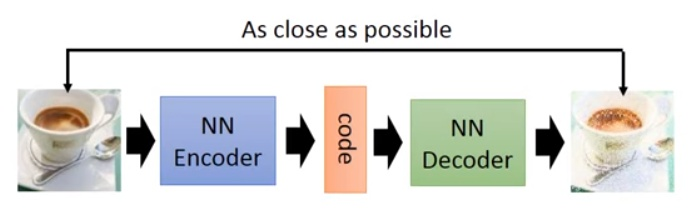</center>

你训练一个encoder，把input转换成code，然后训练一个decoder，把code转换成一个image，然后计算得到的image和input之间的MSE，训练完这个model之后，取出后半部分NN Decoder，输入一个随机的code，就能generate一个image。但是auto-encoder生成image的效果，当然看着很别扭啦，一眼就能看出真假。

上述的这些生成模型，其实有一个非常严重的弊端。比如VAE，它生成的image是希望和input越相似越好，但是model是如何来衡量这个相似呢？model会计算一个loss，采用的大多是MSE，即每一个像素上的均方差。loss小真的表示相似嘛？

<center>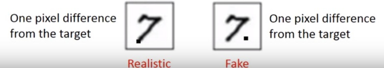</center>

比如这两张图，第一张，我们认为是好的生成图片，第二张是差的生成图片，但是对于上述的model来说，这两张图片计算出来的loss是一样大的，所以会认为是一样好的图片。这就是上述生成模型的弊端，用来衡量生成图片好坏的标准并不能很好的完成想要实现的目的。于是就有了下面要讲的GAN。

#####1.2、GAN
大名鼎鼎的GAN是如何生成图片的呢？首先大家都知道GAN有两个网络，一个是generator，一个是discriminator，从二人零和博弈中受启发，通过两个网络互相对抗来达到最好的生成效果。流程如下：
<center>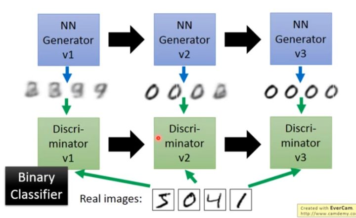</center>

主要流程类似上面这个图。首先，有一个一代的generator，它能生成一些很差的图片，然后有一个一代的discriminator，它能准确的把生成的图片，和真实的图片分类，简而言之，这个discriminator就是一个二分类器，对生成的图片输出0，对真实的图片输出1。

接着，开始训练出二代的generator，它能生成稍好一点的图片，能够让一代的discriminator认为这些生成的图片是真实的图片。然后会训练出一个二代的discriminator，它能准确的识别出真实的图片，和二代generator生成的图片。以此类推，会有三代，四代。。。n代的generator和discriminator，最后discriminator无法分辨生成的图片和真实图片，这个网络就拟合了。

#####1.3、原理
首先我们知道真实图片集的分布 $P_{data}(x)$，$x$ 是一个真实图片，可以想象成一个向量，这个向量集合的分布就是 $P_{data}$。我们需要生成一些也在这个分布内的图片，如果直接就是这个分布的话，怕是做不到的。

我们现在有的generator生成的分布可以假设为 $P_G(x;\theta)$，这是一个由 $\theta$ 控制的分布，$\theta$ 是这个分布的参数（如果是高斯混合模型，那么 $\theta$ 就是每个高斯分布的平均值和方差）. 假设我们在真实分布中取出一些数据，$\{x^1, x^2, \dots,x^m \}$，我们想要计算一个似然 $P_G(x^i;\theta)$. 对于这些数据，在生成模型中的似然就是 $L = \prod_{i=1}^{m}P_G(x^i;\theta)$, <font color="red">目的就是让这个概率分布更加靠近真实的概率分布 $P_{data}(x)$</font>

我们想要最大化这个似然，等价于让generator生成那些真实图片的概率最大。这就变成了一个最大似然估计的问题了，我们需要找到一个 $\theta ^*$ 来最大化这个似然。
$$
\begin{align}
\theta ^* &= arg\ \max_{\theta}\prod_{i=1}^{m}P_G(x^i;\theta) \\
&=arg\ \max_{\theta}\ log\prod_{i=1}^{m}P_G(x^i;\theta) \\
&=arg\ \max_{\theta} \sum_{i=1}^{m}logP_G(x^i;\theta) \\
& \approx arg\ \max_{\theta}\ E_{x\sim P_{data}}[logP_G(x;\theta)] \\
& = arg\ \max_{\theta}\int_{x} P_{data}(x)logP_G(x;\theta)dx - \int_{x}P_{data}(x)logP_{data}(x)dx \\
&=arg\ \max_{\theta}\int_{x}P_{data}(x)(logP_G(x;\theta)-logP_{data}(x))dx \\
&=arg\ \min_{\theta}\int_{x}P_{data}(x)log \frac{P_{data}(x)}{P_G(x;\theta)}dx \\
&=arg\ \min_{\theta}\ KL(P_{data}(x)||P_G(x;\theta))
\end{align}
$$

寻找一个 $\theta ^*$ 来最大化这个似然，等价于最大化 $log$ 似然。因为此时这 $m$ 个数据，是从真实分布中取的，所以也就约等于真实分布中的所有 $x$ 在 $P_{G}$ 分布中的 $log$ 似然的期望。

真实分布中的所有 $x$ 的期望，等价于求概率积分，所以可以转化成积分运算，因为减号后面的项和 $\theta$ 无关，所以添上之后还是等价的。然后提出共有的项，括号内的反转，$max$ 变 $min$，就可以转化为KL divergence的形式了，KL divergence描述的是两个概率分布之间的差异。

所以最大化似然，让generator最大概率的生成真实图片，也就是要找一个 $\theta$ 让 $P_G$ 更接近于 $P_{data}$, 那如何来找这个最合理的 $\theta$ 呢？我们可以假设 $P_G(x;\theta)$ 是一个神经网络。

首先随机产生一个向量 $z$，通过 $G(z)=x$ 这个网络，生成图片 $x$，那么我们如何比较两个分布是否相似呢？只要我们取一组 $sample z$，这组 $z$ 符合一个分布，那么通过网络就可以生成另一个分布 $P_G$，然后来比较与真实分布 $P_{data}$

大家都知道，神经网络只要有非线性激活函数，就可以去拟合任意的函数，那么分布也是一样，所以可以用一个正态分布，或者高斯分布，取样去训练一个神经网络，学习到一个很复杂的分布。
<center>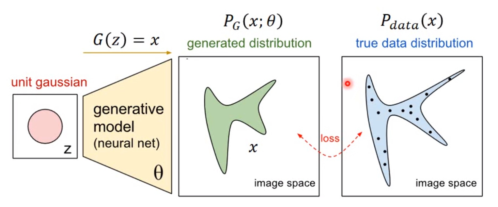</center>

如何来找到更接近的分布，这就是GAN的贡献了。先给出GAN的公式,<font color="red">这就是生成器和判别器要优化的损失</font>：

$$V(G,D)=E_{x\sim P_{data}}[logD(x)] + E_{x\sim P_G}[log(1-D(x))]$$
这个式子的好处在于，固定G，$\max V(G,D)$ 就表示 $P_G$ 和 $P_{data}$ 之间的差异，然后要找一个最好的 G，让这个最大值最小，也就是两个分布之间的差异最小。
$$G^*=arg\ \min_{G}\ \max_D\ V(G,D)$$
表面上看这个的意思是，D 要让这个式子尽可能的大，也就是对于 $x$ 是真实分布中，$D(x)$ 要接近与1，对于 $x$ 来自于生成的分布，$D(x)$ 要接近于0，然后 $G$ 要让式子尽可能的小，让来自于生成分布中的 $x$，$D(x)$ 尽可能的接近1

现在我们先固定G，来求解最优的D

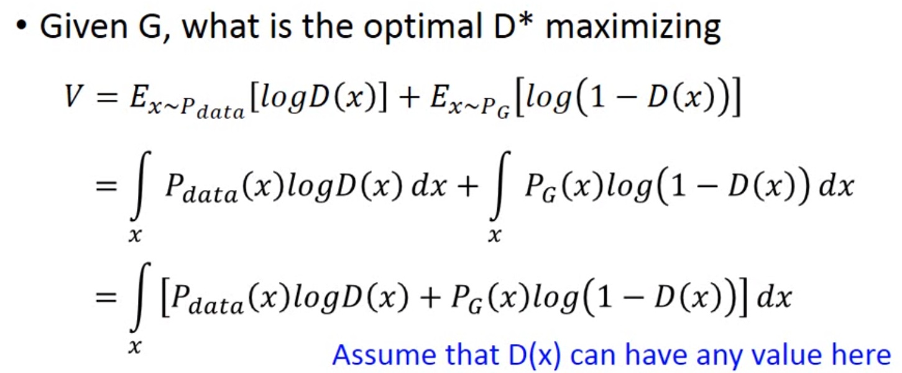
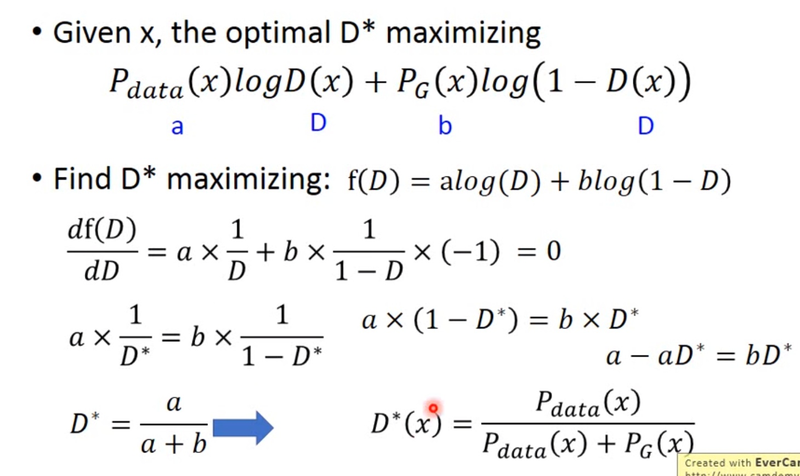

对于一个给定的 $x$，得到最优的 $D$ 如上图，范围在(0,1)内，把最优的 $D$ 带入 $\max_D\ V(G,D)$，可以得到：

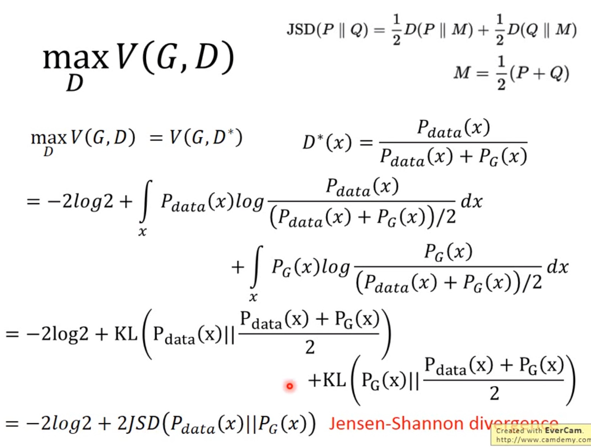


JS divergence是KL divergence的 **对称平滑版本**，表示了两个分布之间的差异，这个推导就表明了上面所说的，固定G，$\max_D\ V(G,D)$ 表示两个分布之间的差异，最小值是 $-2log2$ (<font color="red">后面我们会证明为什么JSD的最大值为 $log2$ </font>)，最大值为0。现在我们需要找个 $G$，来最小化 $\max_D\ V(G,D)$，观察上式，当 $P_G(x)=P_{data}(x)$ 时，$G$ 是最优的。

#####1.4、训练
有了上面推导的基础之后，我们就可以开始训练GAN了。结合我们开头说的，两个网络交替训练，我们可以在起初有一个 $G_0$ 和 $D_0$，先训练 $D_0$ 找到 $\max_D\ V(G_0,D_0)$，然后固定 $D_0$ 开始训练 $G_0$,训练的过程都可以使用gradient descent，以此类推，训练 $D_1,G_1,D_2,G_2,\dots$

但是这里有个问题就是，你可能在 $D_0^*$ 的位置取到了 $\max_D\ V(G_0,D_0)=V(G_0,D_0^*)$，然后更新 $G_0$ 为 $G_1$ ,可能 $ V(G_1,D_0^*) \lt V(G_0,D_0^*) $ 了，但是并不保证会出现一个新的点 $D_1^*$ 使得 $V(G_1,D_1^*) > V(G_0,D_0^*)$，这样更新 $G$ 就没达到它原来应该要的效果，如下图所示：
<center></center>

避免上述情况的方法就是更新 $G$ 的时候，不要更新 $G$ 太多。知道了网络的训练顺序，我们还需要设定两个loss function，一个是 $D$ 的loss，一个是 $G$ 的loss。下面是整个GAN的训练具体步骤：<font color="red">注意,训练生成器的时候没有真实数据,所以对应的判别器中真实损失不存在</font>
<center>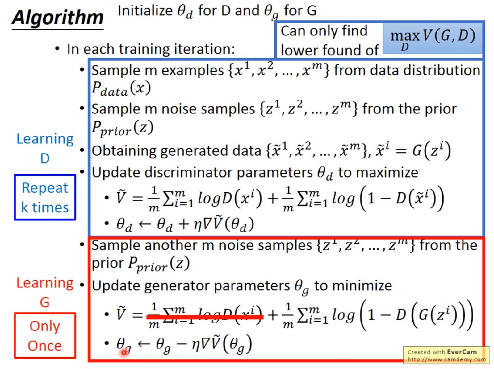</center>

#####1.5、存在的问题
但是上面 $G$ 的loss function还是有一点小问题，下图是两个函数的图像：
<center>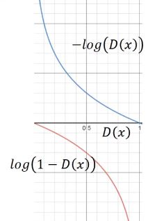</center>

$log(1-D(x))$ 是我们计算时 $G$ 的 loss function，但是我们发现，在 $D(x)$ 接近于0的时候，这个函数十分平滑，梯度非常的小。这就会导致，在训练的初期，$G$ 想要骗过 $D$，变化十分的缓慢，而上面的函数，趋势和下面的是一样的，都是递减的。但是它的优势是在 $D(x)$ 接近0的时候，梯度很大，有利于训练，在 $D(x)$ 越来越大之后，梯度减小，这也很符合实际，在初期应该训练速度更快，到后期速度减慢。所以我们把 $G$ 的 loss function修改为 $minimize\ V = -\frac{1}{m}\sum_{i=1}^{m}log(D(x^i))$，这样可以提高训练的速度。

还有一个问题，在其他paper中提出，就是经过实验发现，经过许多次训练，loss一直都是平的，也就是 $\max_D\ V(G,D)=0$，JS divergence一直都是 $log2$ ，$P_G$ 和 $P_{data}$ 完全没有交集，但是实际上两个分布是有交集的，造成这个的原因是因为，我们无法真正计算期望和积分，只能使用sample的方法，**如果训练的过拟合了，D还是能够完全把两部分的点分开**，如下图：
<center></center>

对于这个问题，我们是否应该让 $D$ 变得弱一点，减弱它的分类能力，但是从理论上讲，为了让它能够有效的区分真假图片，我们又希望它能够powerful，所以这里就产生了矛盾。

还有可能的原因是，虽然两个分布都是高维的，但是两个分布都十分的窄，可能交集相当小，这样也会导致 $JS$ 散度算出来 $=log2$，约等于没有交集。

解决的一些方法，有添加噪声，让两个分布变得更宽，可能可以增大它们的交集，这样JS divergence就可以计算，但是随着时间变化，噪声需要逐渐变小。

还有一个问题叫Mode Collapse，如下图：
<center>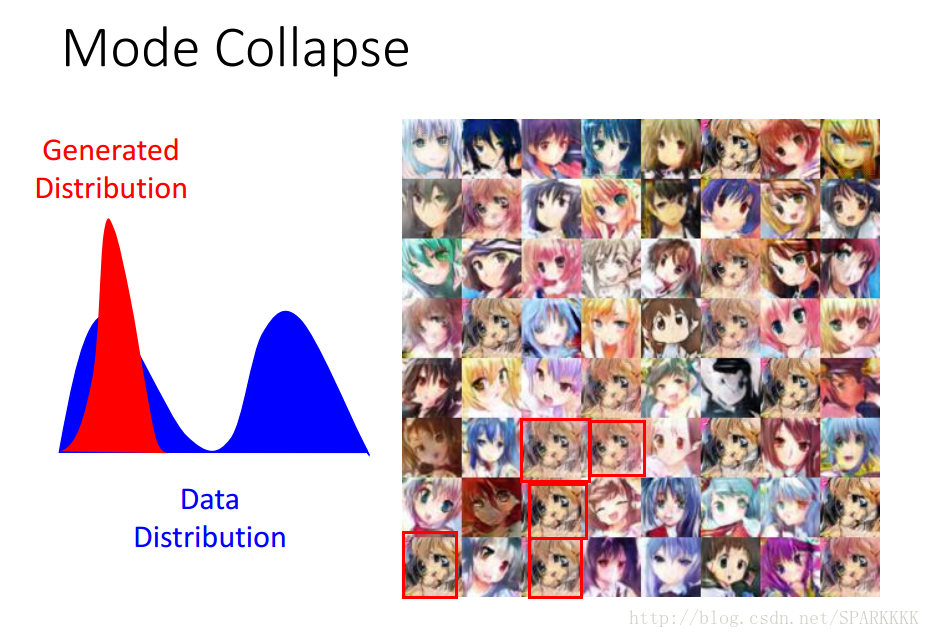</center>

这个图的意思是，data的分布是一个双峰的，但是学习到的生成分布却只有单峰，我们可以看到模型学到的数据，但是却不知道它没有学到的分布。但是实际中ModeCollapse不能像这个一样这么容易被发现(sample中出现完全一模一样的图片). 例如训练集有很多种类别(如猫狗牛羊)，但是我们只能生成狗(或猫或牛或羊)，虽然生成的狗的图片质量特别好，但是！整个G就只能生成狗，根本没法生成猫牛羊，陷入一种训练结果不好的状态。这和我们对GAN的预期是相悖的。
<center>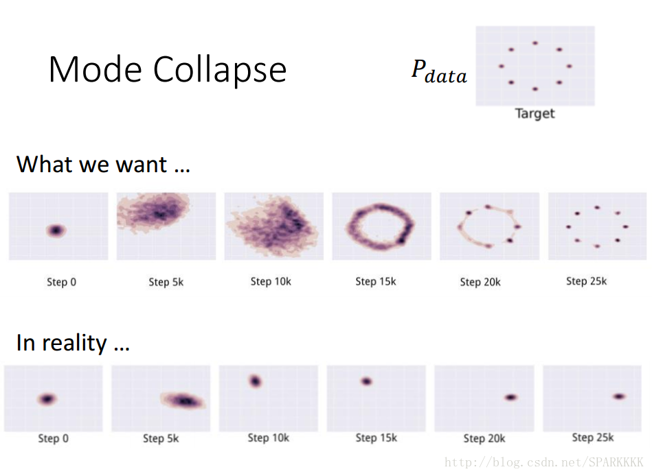</center>

如上图。$P_{data}$ 是八个高斯分布的点，也就是8个mode。我们希望给定一个随机高斯分布（中间列中的最左图），我们希望这一个随机高斯分布经过 $G$ 最后可以映射到这8个高斯分布的mode上面去. 但是最下面一列的图表明，我们不能映射到这8个高斯分布的mode上面，整个 $G$ 只能生成同一个mode，由于 $G$ 和 $D$ 的对抗关系，$G$ 不断切换mode

+ 在step10k的时候，$G$ 的位置在某一个 Gaussian 所在位置，然后 $D$ 发现 $G$ 只是在这个Gaussian这里了，所以就把这个地方的所有data(无论real还是fake)都给判定为fake

+ $G$ 发现在这个 Gaussian 待不下去了，只会被 $D$ 永远判定为fake，所以就想着换到另一个地方。在step15k就跳到了另一个 Gaussian 上去

+ 然后不断跳跳跳，不断重复上述两个过程，就像猫捉老鼠的过程一样，然后就没有办法停下来，没法达到我们理想中映射到8个不同的Gaussian上面去

<center>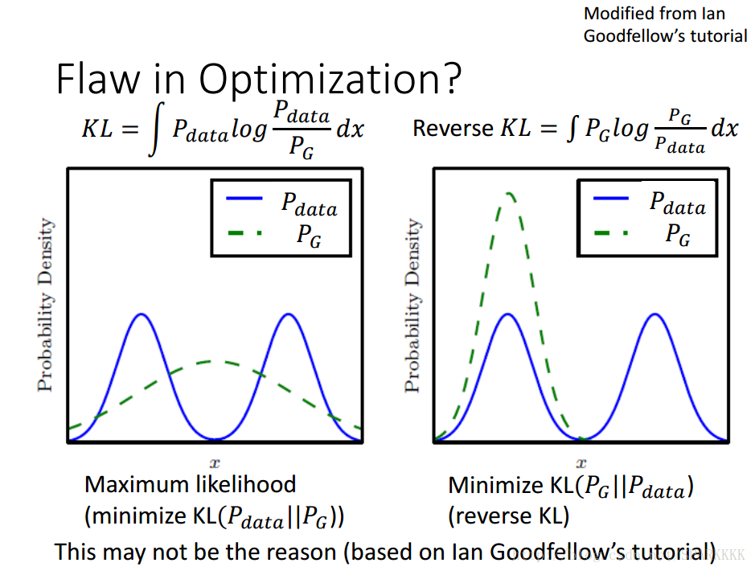</center>

对于左边的KL散度，出现无穷大的 $KL$ 散度是因为 $P_{data}$ 有值而 $P_G$ 没有值. 也就是说当我们 $P_{data}$ 有值的时候，我们必须保证 $P_G$ 也有值，这才能保证 $KL$ 散度不会趋于无穷大。 假设我们的 $G$ 的capacity不够，只能产生一个Gaussian的时候，那么这个时候的 $G$ 就会倾向去覆盖所有 $P_{data}$ 存在的地方，$P_{data}$ 有值的地方 $P_G$ 也要有。

当然，即使 $P_data$ 没有的地方，有 $P_G$ 也无所谓(毕竟这个时候KL散度趋于0，惩罚很小). 虽然这个时候基本上不会出现mode collapse的情况，但是会出现很多无意义的样本.

对于右边的reverse KL散度，如果出现了 $P_G$ 在某一个没有 $P_{data}（P_{data}≈0）$ 的位置产生了值，那就会使得这个reverse KL散度变得特别大。 所以对于在minimize KL散度这个training过程中，就会出现很高的惩罚。为了安全起见，$P_G$ 就会更加倾向于生成同一张安全的一定会被认为是real的image，也不冒险去产生一些不一样的image. 而由于我们这里假设 $P_G$ 只是一个单一的Gaussian而不是多个Gaussian叠加(如图中的 $P_{data}$)，所以就会趋向于去完全拟合其中一个真实的Gaussian，这样就出现了mode collapse

<font color="red">造成这个情况的原因是，KL divergence里的两个分布写反了. 这个图很清楚的显示了，如果是第一个KL divergence的写法，为了防止出现无穷大，所以有$P_{data}$ 出现的地方都必须要有 $P_G$ 覆盖，就不会出现Mode Collapse</font>

下面给出GAN的基本流程图,从一个随机噪音中产生100维,然后经过一个全连接层,得到256维的隐含层,通过relu激活函数,最后使用全连接层得到一个784维的模拟图片数据. **这就是生成器的主要工作**

判别器从真实图片或这模拟图片中选择一个数据,然后通过一个全连接层得到256维的隐含层,最后再次通过全连接层,得到一个1维的结果,用于判断是真实图片还是模拟图片,输出为1表示是真实图片,为0表示模拟图片.

<center>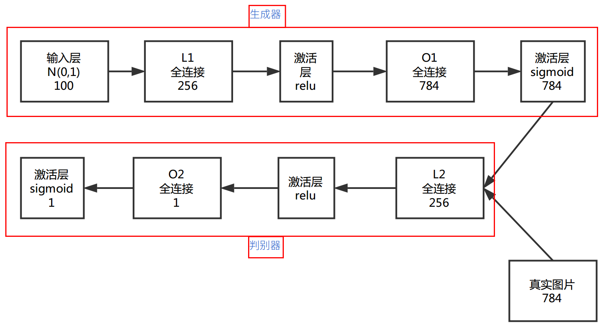</center>

**关键部分在于损失函数**
+ 生成器的损失函数:
gen_loss = -tf.reduce_mean(tf.log(disc_fake))

+ 判别器的损失函数:
disc_loss = -tf.reduce_mean(tf.log(disc_real)+tf.log(1. - disc_fake))

#####1.6、GAN代码实现
```python
def generator(x):
    # 生成器网络,分为输入层,隐含层和输出层
    # 在图片领域中通常使用relu激活函数
    hidden_layer = tf.matmul(x, weights['gen_hidden1'])
    hidden_layer = tf.add(hidden_layer, biases['gen_hidden1'])
    hidden_layer = tf.nn.relu(hidden_layer)
    # 通过这个神经网络直接输出为784维的图片向量,
    # 这里最后返回的值是在[0,1]之间,对于最后的输出层,通常使用sigmoid激活函数
    out_layer = tf.matmul(hidden_layer, weights['gen_out'])
    out_layer = tf.add(out_layer, biases['gen_out'])
    out_layer = tf.nn.sigmoid(out_layer)
    return out_layer

def discriminator(x):
    # 根据生成器生成的模拟数据或真实数据进行判断
    hidden_layer = tf.matmul(x, weights['disc_hidden1'])
    hidden_layer = tf.add(hidden_layer, biases['disc_hidden1'])
    hidden_layer = tf.nn.relu(hidden_layer)
    # 最后返回维度为1的判别结果,这里使用sigmoid函数,返回的是一个概率值,
    # 在[0,1]之间
    out_layer = tf.matmul(hidden_layer, weights['disc_out'])
    out_layer = tf.add(out_layer, biases['disc_out'])
    out_layer = tf.nn.sigmoid(out_layer)
    return out_layer

# 判别网络分为两部分,第一部分是真实图片输入,
# 第二部分是生成的随机模拟图片,需要对这两部分分别求损失
disc_real = discriminator(disc_input)
disc_fake = discriminator(gen_sample)

# Build Loss,生成器的损失只与模拟数据的判断有关.
gen_loss = -tf.reduce_mean(tf.log(disc_fake))
# 判别器的损失由两部分组成,第一部分真实数据损失,第二部分模拟数据损失
# 对于模拟数据,尽可能让其为假
disc_loss = -tf.reduce_mean(tf.log(disc_real) + tf.log(1. - disc_fake))

# Build Optimizers
# gan 中一个独特的点就是有两个优化器,其他网络通常只有一个优化器
optimizer_gen = tf.train.AdamOptimizer(learning_rate=learning_rate)
optimizer_disc = tf.train.AdamOptimizer(learning_rate=learning_rate)

# 在tensorflow中优化器默认会优化所有变量,所以在GAN中需要将生成器和判别器的变量
# 放在不同的列表中,分别进行优化,通常这些变量包括权重和偏置
# 统一放在一个列表中
gen_vars = [weights['gen_hidden1'], weights['gen_out'],
            biases['gen_hidden1'], biases['gen_out']]
# Discriminator Network Variables
disc_vars = [weights['disc_hidden1'], weights['disc_out'],
            biases['disc_hidden1'], biases['disc_out']]

# 在优化器中可以指定优化的变量列表
train_gen = optimizer_gen.minimize(gen_loss, var_list=gen_vars)
train_disc = optimizer_disc.minimize(disc_loss, var_list=disc_vars)

with tf.Session() as sess:
    for i in range(1, num_steps+1):
        # 由于GAN是无监督的学习方法,所以不需要标签数据
        # 这一部分作为真实输入
        batch_x, _ = mnist.train.next_batch(batch_size)
        # Generate noise to feed to the generator
        # 这里只要是随机噪音数据就可以,不一定要是标准高斯分布的数据
        z = np.random.uniform(-1., 1., size=[batch_size, noise_dim])
        # Train
        # 这里只要输入真实输入即可,网络会自动生成
        feed_dict = {disc_input: batch_x, gen_input: z}
        _, _, gl, dl = sess.run([train_gen, train_disc, gen_loss, disc_loss],
                                feed_dict=feed_dict)
```


####2、Wasserstein GAN

Wasserstein GAN（下面简称WGAN）成功地做到了以下爆炸性的几点：
+ 彻底解决GAN训练不稳定的问题，不再需要小心平衡生成器和判别器的训练程度

+ 基本解决了collapse mode的问题，确保了生成样本的多样性

+ 训练过程中终于有一个像交叉熵、准确率这样的数值来指示训练的进程，这个数值越小代表GAN训练得越好，代表生成器产生的图像质量越高

+ 以上一切好处不需要精心设计的网络架构，最简单的多层全连接网络就可以做到

而改进后相比原始GAN的算法实现流程却只改了四点：
+ 判别器最后一层去掉sigmoid

+ 生成器和判别器的loss不取log

+ 每次更新判别器的参数之后把它们的绝对值截断到不超过一个固定常数c

+ 不要用基于动量的优化算法（包括momentum和Adam），推荐RMSProp，SGD也行

#####2.1、原始GAN究竟出了什么问题？
回顾一下，原始GAN中**判别器要最小化如下损失函数**，尽可能把真实样本分为正例，生成样本分为负例：
$$-\mathbb{E}_{x\sim P_r}[\log D(x)] - \mathbb{E}_{x\sim P_g}[\log(1-D(x))] （公式1 ）$$
其中 $P_r$ 是真实样本分布，$P_g$ 是由生成器产生的样本分布。对于**生成器**，Goodfellow一开始提出来一个损失函数，后来又提出了一个改进的损失函数，分别是:

$$\mathbb{E}_{x\sim P_g}[\log(1-D(x))] （公式2）$$

$$\mathbb{E}_{x\sim P_g}[- \log D(x)] （公式3）$$

后者在WGAN两篇论文中称为“the - log D alternative”或“the - log D trick”。至于为什么要改,我们在上一节有讲原因.

#####2.1.1、第一种原始GAN形式的问题
**一句话概括：判别器越好，生成器梯度消失越严重。**
首先从公式1可以得到，在生成器 $G$ 固定参数时最优的判别器 $D$ 应该是什么。对于一个具体的样本 $x$，它可能来自真实分布也可能来自生成分布，它对公式1损失函数的贡献是:
$$- P_r(x) \log D(x) - P_g(x) \log [1 - D(x)]$$
令其关于 $D(x)$ 的导数为0，得

$$- \frac{P_r(x)}{D(x)} + \frac{P_g(x)}{1 - D(x)} = 0$$
化简得最优判别器为,<font color="red">目的是为了求判别器的最优损失,固定了生成器</font>：

$$D^*(x) = \frac{P_r(x)}{P_r(x) + P_g(x)}（公式4）$$

这个结果从直观上很容易理解，就是看一个样本 $x$ 来自真实分布和生成分布的可能性的相对比例。如果 $P_r(x) = 0$ 且 $P_g(x) \neq 0$，最优判别器就应该非常自信地给出概率0；如果 $P_r(x) = P_g(x)$，说明该样本是真是假的可能性刚好一半一半，此时最优判别器也应该给出概率0.5。

然而 GAN 训练有一个trick，就是别把判别器训练得太好，否则在实验中生成器会完全学不动（loss降不下去），为了探究背后的原因，我们就可以看看在极端情况——**判别器最优时，生成器的损失函数变成什么**。给公式2加上一个不依赖于生成器的项,<font color="red">表示生成器损失</font>，使之变成
$$\mathbb{E}_{x\sim P_r}[\log D(x)] + \mathbb{E}_{x\sim P_g}[\log(1-D(x))]$$
注意，最小化这个损失函数等价于最小化公式2，**而且它刚好是判别器损失函数的反**。代入最优判别器即公式4，再进行简单的变换可以得到,<font color="red">这个过程可以参考第一部分</font>:

$$\mathbb{E}_{x \sim P_r} \log \frac{P_r(x)}{\frac{1}{2}[P_r(x) + P_g(x)]} + \mathbb{E}_{x \sim P_g} \log \frac{P_g(x)}{\frac{1}{2}[P_r(x) + P_g(x)]} - 2\log 2（公式5)$$

变换成这个样子是为了引入Kullback–Leibler divergence（简称KL散度）和Jensen-Shannon divergence（简称JS散度）这两个重要的相似度衡量指标，后面的主角之一Wasserstein距离，就是要来吊打它们两个的。所以接下来介绍这两个重要的配角——KL散度和JS散度：
$$KL(P_1||P_2) = \mathbb{E}_{x \sim P_1} \log \frac{P_1}{P_2}（公式6）$$

$$JS(P_1 || P_2) = \frac{1}{2}KL(P_1||\frac{P_1 + P_2}{2}) + \frac{1}{2}KL(P_2||\frac{P_1 + P_2}{2})（公式7）$$

于是公式5就可以继续写成,<font color="red">生成器loss</font>

$$2JS(P_r || P_g) - 2\log 2（公式8）$$
看看目前得到了什么结论：**根据原始GAN定义的判别器loss，我们可以得到最优判别器的形式；而在最优判别器的下，我们可以把原始GAN定义的 <font color="red">生成器loss</font> 等价变换为最小化真实分布 $P_r$ 与生成分布 $P_g$ 之间的JS散度。我们越训练判别器，它就越接近最优，最小化生成器的loss也就会越近似于最小化 $P_r$ 和 $P_g$ 之间的JS散度。**

问题就出在这个JS散度上。我们会希望如果两个分布之间越接近它们的JS散度越小，我们通过优化JS散度就能将 $P_g$ “拉向” $P_r$，最终以假乱真。**这个希望在两个分布有所重叠的时候是成立的**，但是如果两个分布完全没有重叠的部分，或者它们重叠的部分可忽略（下面解释什么叫可忽略），它们的JS散度是多少呢？

答案是 $\log 2$，因为对于任意一个 $x$ 只有四种可能：

+ $P_1(x) = 0$ 且 $P_2(x) = 0$

+ $P_1(x) \neq 0$ 且 $P_2(x) \neq 0$

+ $P_1(x) = 0$ 且 $P_2(x) \neq 0$

+ $P_1(x) \neq 0$ 且 $P_2(x) = 0$

第一种对计算JS散度无贡献，第二种情况由于重叠部分可忽略所以贡献也为0，第三种情况对公式7右边第一个项的贡献是$\log \frac{P_2}{\frac{1}{2}(P_2 + 0)} = \log 2$，第四种情况与之类似，所以最终 $JS(P_1||P_2) = \log 2$。

换句话说，无论 $P_r$ 跟 $P_g$ 是远在天边，还是近在眼前，只要它们俩没有一点重叠或者重叠部分可忽略，JS散度就固定是常数 $\log 2$，**而这对于梯度下降方法意味着——梯度为0！**,<font color="red">就是因为JS散度的问题,分布不重叠导致生成器的梯度为0,所以无法训练生成器了</font>,此时对于最优判别器来说，生成器肯定是得不到一丁点梯度信息的；即使对于接近最优的判别器来说，生成器也有很大机会面临梯度消失的问题。 

但是 $P_r$ 与 $P_g$ 不重叠或重叠部分可忽略的可能性有多大？不严谨的答案是：非常大。比较严谨的答案是：当$P_r$ 与 $P_g$ 的支撑集（support）是高维空间中的低维流形（manifold）时，$P_r$ 与 $P_g$ 重叠部分测度（measure）为0的概率为1。

回过头来看第一句话，“当 $P_r$ 与 $P_g$ 的支撑集是高维空间中的低维流形时”，基本上是成立的。**原因是GAN中的生成器一般是从某个低维（比如100维）的随机分布中采样出一个编码向量，再经过一个神经网络生成出一个高维样本（比如64x64的图片就有4096维）**。当生成器的参数固定时，**生成样本的概率分布虽然是定义在4096维的空间上**，但它本身所有可能产生的变化已经被那个100维的随机分布限定了，**其本质维度就是100，再考虑到神经网络带来的映射降维，最终可能比100还小**，所以生成样本分布的支撑集就在4096维空间中构成一个最多100维的低维流形，“撑不满”整个高维空间。

**“撑不满”就会导致真实分布与生成分布难以“碰到面”**，这很容易在二维空间中理解：一方面，二维平面中随机取两条曲线，它们之间刚好存在重叠线段的概率为0；另一方面，虽然它们很大可能会存在交叉点，但是相比于两条曲线而言，交叉点比曲线低一个维度，长度（测度）为0，可忽略。三维空间中也是类似的，随机取两个曲面，它们之间最多就是比较有可能存在交叉线，但是交叉线比曲面低一个维度，面积（测度）是0，可忽略。从低维空间拓展到高维空间，就有了如下逻辑：因为一开始生成器随机初始化，所以 $P_g$ 几乎不可能与 $P_r$ 有什么关联，所以它们的支撑集之间的重叠部分要么不存在，要么就比 $P_r$ 和 $P_g$ 的最小维度还要低至少一个维度，故而测度为0。所谓“重叠部分测度为0”，就是上文所言“不重叠或者重叠部分可忽略”的意思。

我们就得到了WGAN前作中关于生成器梯度消失的第一个论证：**在（近似）最优判别器下，<font color="red">最小化生成器的loss等价于最小化 $P_r$ 与 $P_g$ 之间的JS散度</font>，而由于 $P_r$ 与 $P_g$ 几乎不可能有不可忽略的重叠，所以无论它们相距多远JS散度都是常数 $\log 2$，最终导致生成器的梯度（近似）为0，梯度消失。**

接着作者写了很多公式定理从第二个角度进行论证，但是背后的思想也可以直观地解释：<font color="red">说明判别器可以无限拟合,但是生成器却存在梯度消失问题</font>

+ 首先，$P_r$ 与 $P_g$ 之间几乎不可能有不可忽略的重叠，所以无论它们之间的“缝隙”多狭小，都肯定存在一个最优分割曲面把它们隔开，最多就是在那些可忽略的重叠处隔不开而已。

+ 由于判别器作为一个神经网络可以无限拟合这个分隔曲面，所以存在一个最优判别器，对几乎所有真实样本给出概率1，对几乎所有生成样本给出概率0，而那些隔不开的部分就是难以被最优判别器分类的样本，但是它们的测度为0，可忽略。

+ 最优判别器在真实分布和生成分布的支撑集上给出的概率都是常数（1和0），导致生成器的loss梯度为0，梯度消失。

有了这些理论分析，原始GAN不稳定的原因就彻底清楚了：**判别器训练得太好，生成器梯度消失，生成器loss降不下去；判别器训练得不好，生成器梯度不准，四处乱跑。**只有判别器训练得不好不坏才行，但是这个火候又很难把握，甚至在同一轮训练的前后不同阶段这个火候都可能不一样，所以GAN才那么难训练。

#####2.1.2、第二种原始GAN形式的问题
**一句话概括：最小化第二种生成器loss函数，会等价于最小化一个不合理的距离衡量，导致两个问题，一是梯度不稳定，二是collapse mode即多样性不足。**

如前文所说，Ian Goodfellow提出的“- log D trick”是把 **生成器loss** 改成

$$\mathbb{E}_{x\sim P_g}[- \log D(x)]（公式3）$$

上文推导已经得到在最优判别器D^*下

$$\mathbb{E}_{x\sim P_r}[\log D^*(x)] + \mathbb{E}_{x\sim P_g}[\log(1-D^*(x))] = 2JS(P_r || P_g) - 2\log 2（公式9）$$

我们可以把KL散度（注意下面是先g后r）变换成含 $D^*$ 的形式：
$$
\begin{align}
KL(P_g || P_r) &= \mathbb{E}_{x \sim P_g} [\log \frac{P_g(x)}{P_r(x)}] \\
&= \mathbb{E}_{x \sim P_g} [\log \frac{P_g(x) / (P_r(x) + P_g(x))}{P_r(x) / (P_r(x) + P_g(x))}] \\
&= \mathbb{E}_{x \sim P_g} [\log \frac{1 - D^*(x)}{D^*(x)}] \\
&= \mathbb{E}_{x \sim P_g} \log [1 - D^*(x)] -  \mathbb{E}_{x \sim P_g} \log D^*(x)
\end{align} \\（公式10）
$$

由公式3，9，10可得最小化目标的等价变形
$$
\begin{align}
\mathbb{E}_{x \sim P_g} [-\log D^*(x)] &=  KL(P_g || P_r) -  \mathbb{E}_{x \sim P_g} \log [1 - D^*(x)] \\
&= KL(P_g || P_r) - 2JS(P_r || P_g) + 2\log 2 + \mathbb{E}_{x\sim P_r}[\log D^*(x)]
\end{align}
$$
注意上式最后两项不依赖于生成器 $G$，最终得到最小化公式3等价于最小化

$$KL(P_g || P_r) - 2JS(P_r || P_g)（公式11）$$

这个等价最小化目标存在两个严重的问题。第一是它同时要最小化生成分布与真实分布的KL散度，却又要最大化两者的JS散度，一个要拉近，一个却要推远！这在直观上非常荒谬，在数值上则会导致梯度不稳定，这是后面那个JS散度项的毛病。

第二，即便是前面那个正常的KL散度项也有毛病。因为KL散度不是一个对称的衡量，$KL(P_g || P_r)与KL(P_r || P_g)$ 是有差别的。以前者为例

+ 当 $P_g(x)\rightarrow 0$ 而 $P_r(x)\rightarrow 1$ 时，$P_g(x) \log \frac{P_g(x)}{P_r(x)} \rightarrow 0$，对 $KL(P_g || P_r)$ 贡献趋近0

+ 当 $P_g(x)\rightarrow 1$ 而 $P_r(x)\rightarrow 0$ 时，$P_g(x) \log \frac{P_g(x)}{P_r(x)} \rightarrow +\infty$，对 $KL(P_g || P_r)$贡献趋近正无穷

换言之，$KL(P_g || P_r)$ 对于上面两种错误的惩罚是不一样的，**第一种错误对应的是“生成器没能生成真实的样本”，惩罚微小；第二种错误对应的是“生成器生成了不真实的样本” ，惩罚巨大。**第一种错误对应的是缺乏多样性，第二种错误对应的是缺乏准确性。这一放一打之下，生成器宁可多生成一些重复但是很“安全”的样本，也不愿意去生成多样性的样本，因为那样一不小心就会产生第二种错误，得不偿失。这种现象就是大家常说的 **collapse mode**。

第一部分小结：在原始GAN的（近似）最优判别器下，**第一种生成器loss面临梯度消失问题，第二种生成器loss面临优化目标荒谬、梯度不稳定、对多样性与准确性惩罚不平衡导致mode collapse这几个问题。**


#####2.2、WGAN之前的一个过渡解决方案

原始GAN问题的根源可以归结为两点，**一是等价优化的距离衡量（KL散度、JS散度）不合理，二是生成器随机初始化后的生成分布很难与真实分布有不可忽略的重叠。**

WGAN前作其实已经**针对第二点提出了一个解决方案，就是对生成样本和真实样本加噪声**，直观上说，使得原本的两个低维流形“弥散”到整个高维空间，强行让它们产生不可忽略的重叠。而**一旦存在重叠，JS散度就能真正发挥作用**，此时如果两个分布越靠近，它们“弥散”出来的部分重叠得越多，JS散度也会越小而不会一直是一个常数，**于是（在第一种原始GAN形式下）梯度消失的问题就解决了。**在训练过程中，我们可以对所加的噪声进行退火（annealing），慢慢减小其方差，到后面两个低维流形“本体”都已经有重叠时，就算把噪声完全拿掉，JS散度也能照样发挥作用，继续产生有意义的梯度把两个低维流形拉近，直到它们接近完全重合。以上是对原文的直观解释。

在这个解决方案下我们可以放心地把**判别器训练到接近最优，不必担心梯度消失的问题**。而当判别器最优时，对公式9取反可得判别器的最小loss为
$$
\begin{align}
\min L_D(P_{r+\epsilon}, P_{g+\epsilon}) &= - \mathbb{E}_{x\sim P_{r+\epsilon}}[\log D^*(x)] - \mathbb{E}_{x\sim P_{g+\epsilon}}[\log(1-D^*(x))] \\
&= 2\log 2 - 2JS(P_{r+\epsilon} || P_{g+\epsilon})
\end{align}
$$
其中 $P_{r+\epsilon}$ 和 $P_{g+\epsilon}$ 分别是加噪后的真实分布与生成分布。反过来说，从最优判别器的loss可以反推出当前两个加噪分布的JS散度。两个加噪分布的JS散度可以在某种程度上代表**两个原本分布的距离**，也就是说可以通过最优判别器的loss反映训练进程！……真的有这样的好事吗？

并没有，因为加噪JS散度的具体数值受到噪声的方差影响，随着噪声的退火，前后的数值就没法比较了，所以它不能成为 $P_r$ 和 $P_g$ 距离的本质性衡量。

加噪方案是针对原始GAN问题的第二点根源提出的，解决了训练不稳定的问题，不需要小心平衡判别器训练的火候，可以放心地把判别器训练到接近最优，**但是仍然没能够提供一个衡量训练进程的数值指标**。但是WGAN本作就从第一点根源出发，用Wasserstein距离代替JS散度，同时完成了稳定训练和进程指标的问题！

#####2.3、Wasserstein距离的优越性质
Wasserstein 距离，也叫Earth Mover's Distance，**推土机距离**，简称EMD，用来表示两个分布的相似程度。Wasserstein distance 衡量了把数据从分布 $p$ “移动成”分布 $q$ 时所需要移动的平均距离的最小值（类似于把一堆土从一个形状移动到另一个形状所需要做的功的最小值）

假设有两个工地 $P$ 和 $Q$，$P$ 工地上有 $m$ 堆土，$Q$ 工地上有 $n$ 个坑，现在要将 $P$ 工地上的 $m$ 堆土全部移动到 $Q$ 工地上的 $n$ 个坑中，所做的最小的功。每堆土我们用一个二元组来表示 $(p,w)$，$p$ 表示土堆的中心，$w$ 表示土的数量。则这两个工地可表示为：
$P = \{(p_1,w_{p_1}),...,(p_m,w_{p_1})\}$
$Q = \{(q_1,w_{q_1}),...,(q_n,w_{q_n})\}$

每个土堆中心 $p_i$ 到每个土坑中心 $q_j$ 都会有一个距离 $d_{ij}$，则构成了一个 $m*n$ 的距离矩阵 $D=[d_{ij}]$。

那么问题就是我们希望找到一个流（flow），当然也是个矩阵 $[f_{ij}]$，每一项 $f_{ij}$ 代表从 $p_i$ 到 $q_j$ 的流动数量，从而最小化整体的代价函数：
$$WORK(P,Q,F)=\sum_{i=1}^m\sum_{j=1}^n d_{ij}f_{ij}$$

问题描述清楚了：就是把 $P$ 中的 $m$ 个坑的土，用最小的代价搬到 $Q$ 中的 $n$ 个坑中，$p_i$ 到 $q_j$ 的两个坑的距离由 $d_{ij}$ 来表示。$f_{ij}$ 是从 $p_i$ 搬到 $q_j$ 的土的量；$d_{ij}$ 是 $p_i$ 位置到 $q_j$ 位置的代价（距离）。要最小化 $WORK$ 工作量。$EMD$ 是把这个工作量归一化以后的表达，即除以对 $f_{ij}$ 的求和。
<center>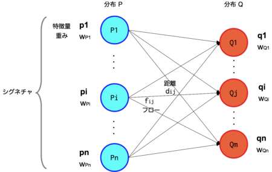</center>

$$EMD(P,Q)=\frac{\sum_{i=1}^M\sum_{j=1}^Nd_{ij}f_{ij}}{\sum_{i=1}^M\sum_{j=1}^Nf_{ij}}$$

**Wasserstein距离相比KL散度、JS散度的优越性在于，即便两个分布没有重叠，Wasserstein距离仍然能够反映它们的远近。**WGAN本作通过简单的例子展示了这一点。考虑如下二维空间中的两个分布 $P_1$ 和 $P_2$，$P_1$ 在线段AB上均匀分布，$P_2$ 在线段CD上均匀分布，通过控制参数 $\theta$ 可以控制着两个分布的距离远近。
<center>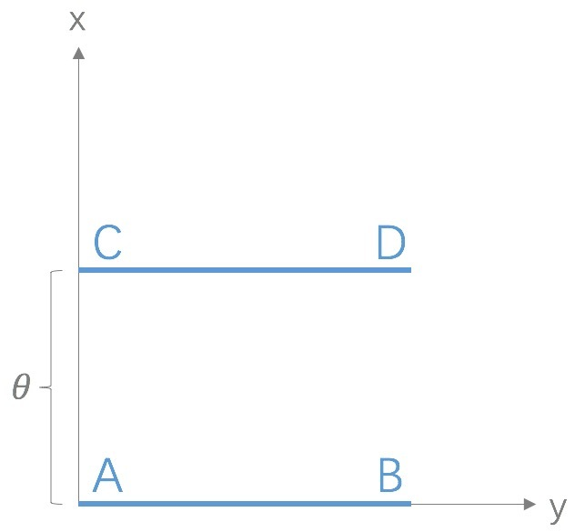</center>

此时容易得到:
$$KL(P_1 || P_2) = KL(P_1 || P_2) =
\begin{cases}
+\infty & \text{if $\theta \neq 0$} \\
0 & \text{if $\theta = 0$}
\end{cases}（突变）$$

$$JS(P_1||P_2)=
\begin{cases}
\log 2 & \text{if $\theta \neq 0$} \\
0 & \text{if $\theta = 0$}
\end{cases}（突变）$$

$$W(P_0, P_1) = |\theta|（平滑）$$

KL散度和JS散度是突变的，要么最大要么最小，**Wasserstein距离却是平滑的**，如果我们要用梯度下降法优化$\theta$ 这个参数，前两者根本提供不了梯度，Wasserstein距离却可以。类似地，在高维空间中如果两个分布不重叠或者重叠部分可忽略，则KL和JS既反映不了远近，也提供不了梯度，但是Wasserstein却可以提供有意义的梯度。

#####2.4、从Wasserstein距离到WGAN
既然Wasserstein距离有如此优越的性质，如果我们能够把它定义为 **生成器的loss**，不就可以产生有意义的梯度来更新生成器，使得生成分布被拉向真实分布吗？

没那么简单，因为Wasserstein距离定义（公式12）中的 $\inf_{\gamma \sim \Pi (P_r, P_g)}$ 没法直接求解，不过没关系，作者用了一个已有的定理把它变换为如下形式

$$W(P_r, P_g) = \frac{1}{K} \sup_{||f||_L \leq K} \mathbb{E}_{x \sim P_r} [f(x)] - \mathbb{E}_{x \sim P_g} [f(x)]（公式13）$$

首先需要介绍一个概念——Lipschitz连续。它其实就是在一个连续函数 $f$ 上面额外施加了一个限制，要求存在一个常数 $K\geq 0$ 使得定义域内的任意两个元素 $x_1$ 和 $x_2$ 都满足
$$|f(x_1) - f(x_2)| \leq K |x_1 - x_2|$$
此时称函数 $f$ 的Lipschitz常数为 $K$。简单理解，比如说 $f$ 的定义域是实数集合，那上面的要求就等价于 $f$ 的导函数绝对值不超过 $K$。再比如说 $\log (x)$ 就不是Lipschitz连续，因为它的导函数没有上界。Lipschitz连续条件限制了一个连续函数的最大局部变动幅度。

公式13的意思就是在要求函数 $f$ 的Lipschitz常数 $\|f\|_L$ 不超过 $K$ 的条件下，对所有可能满足条件的f取到 $\mathbb{E}_{x \sim P_r} [f(x)] - \mathbb{E}_{x \sim P_g} [f(x)]$ 的上界，然后再除以 $K$。特别地，我们可以用一组参数 $w$ 来定义一系列可能的函数 $f_w$，此时求解公式13可以近似变成求解如下形式

$$K \cdot W(P_r, P_g) \approx \max_{w: \|f_w\|_L \leq K} \mathbb{E}_{x \sim P_r} [f_w(x)] - \mathbb{E}_{x \sim P_g} [f_w(x)]（公式14）$$

再用上我们搞深度学习的人最熟悉的那一套，不就可以把 $f$ 用一个带参数 $w$ 的神经网络来表示嘛！由于神经网络的拟合能力足够强大，我们有理由相信，这样定义出来的一系列 $f_w$ 虽然无法囊括所有可能，但是也足以高度近似公式13要求的那个 $sup_{\|f\|_L \leq K}$ 了。

最后，还不能忘了满足公式14中 $\|f_w\|_L \leq K$ 这个限制。我们其实不关心具体的 $K$ 是多少，只要它不是正无穷就行，因为它只是会使得梯度变大 $K$ 倍，并不会影响梯度的方向。所以作者采取了一个非常简单的做法，就是限制神经网络 $f_\theta$ 的所有参数 $w_i$ 的不超过某个范围 $[-c, c]$，比如 $w_i \in [- 0.01, 0.01]$，此时关于输入样本 $x$ 的导数 $\frac{\partial f_w}{\partial x}$ 也不会超过某个范围，所以一定存在某个不知道的常数 $K$ 使得 $f_w$ 的局部变动幅度不会超过它，Lipschitz连续条件得以满足。具体在算法实现中，只需要每次更新完 $w$ 后把它 $clip$ 回这个范围就可以了。

**到此为止，我们可以构造一个含参数 $w$、最后一层不是非线性激活层的判别器网络 $f_w$ ，在限制 $w$ 不超过某个范围的条件下，使得**

$$L = \mathbb{E}_{x \sim P_r} [f_w(x)] - \mathbb{E}_{x \sim P_g} [f_w(x)]（公式15）$$

尽可能取到最大，此时 $L$ 就会近似真实分布与生成分布之间的Wasserstein距离（忽略常数倍数 $K$）。注意原始GAN的判别器做的是真假二分类任务，所以最后一层是 $sigmoid$，但是现在WGAN中的判别器 $f_w$ 做的是近似拟合Wasserstein距离，属于回归任务，所以要把最后一层的 $sigmoid$ 拿掉。

接下来生成器要近似地最小化Wasserstein距离，可以最小化 $L$，由于Wasserstein距离的优良性质，我们不需要担心生成器梯度消失的问题。再考虑到 $L$ 的第一项与生成器无关，就得到了WGAN的两个loss。

+ $- \mathbb{E}_{x \sim P_g} [f_w(x)]（公式16，WGAN生成器loss函数） $

+ $\mathbb{E}_{x \sim P_g} [f_w(x)]- \mathbb{E}_{x \sim P_r} [f_w(x)]（公式17，WGAN判别器loss函数）$

**公式15是公式17的反，可以指示训练进程，其数值越小，表示真实分布与生成分布的Wasserstein距离越小，GAN训练得越好。**

上文说过，WGAN与原始GAN第一种形式相比，只改了四点：
+ 判别器最后一层去掉sigmoid

+ 生成器和判别器的loss不取log

+ 每次更新判别器的参数之后把它们的绝对值截断到不超过一个固定常数c

+ 不要用基于动量的优化算法（包括momentum和Adam），推荐RMSProp，SGD也行

前三点都是从理论分析中得到的，已经介绍完毕；第四点却是作者从实验中发现的，属于trick，相对比较“玄”。作者发现如果使用Adam，判别器的loss有时候会崩掉，当它崩掉时，Adam给出的更新方向与梯度方向夹角的cos值就变成负数，更新方向与梯度方向南辕北辙，这意味着判别器的loss梯度是不稳定的，所以不适合用Adam这类基于动量的优化算法。作者改用RMSProp之后，问题就解决了，因为RMSProp适合梯度不稳定的情况。

#####2.5、总结
WGAN前作分析了Ian Goodfellow提出的原始GAN两种形式各自的问题，第一种形式等价在最优判别器下等价于最小化生成分布与真实分布之间的JS散度，由于随机生成分布很难与真实分布有不可忽略的重叠以及JS散度的突变特性，使得生成器面临梯度消失的问题；第二种形式在最优判别器下等价于既要最小化生成分布与真实分布直接的KL散度，又要最大化其JS散度，相互矛盾，导致梯度不稳定，而且KL散度的不对称性使得生成器宁可丧失多样性也不愿丧失准确性，导致collapse mode现象。

WGAN前作针对分布重叠问题提出了一个过渡解决方案，通过对生成样本和真实样本加噪声使得两个分布产生重叠，理论上可以解决训练不稳定的问题，可以放心训练判别器到接近最优，但是未能提供一个指示训练进程的可靠指标，也未做实验验证。

WGAN本作引入了Wasserstein距离，由于它相对KL散度与JS散度具有优越的平滑特性，理论上可以解决梯度消失问题。接着通过数学变换将Wasserstein距离写成可求解的形式，利用一个参数数值范围受限的判别器神经网络来最大化这个形式，就可以近似Wasserstein距离。在此近似最优判别器下优化生成器使得Wasserstein距离缩小，就能有效拉近生成分布与真实分布。WGAN既解决了训练不稳定的问题，也提供了一个可靠的训练进程指标，而且该指标确实与生成样本的质量高度相关。


####3、WGAN-GP 从weight clipping到gradient penalty

#####3.1、WGAN的关键部分——Lipschitz限制是什么

WGAN中，判别器 $D$ 和生成器 $G$ 的loss函数分别是：

$$L(D) = -\mathbb{E}_{x \sim P_r}[D(x)] + \mathbb{E}_{x \sim P_g}[D(x)] \;\;(公式1)$$

$$L(G) = - \mathbb{E}_{x \sim P_g}[D(x)] \;\;(公式2)$$

公式1表示判别器希望尽可能拉高真样本的分数，拉低假样本的分数，公式2表示生成器希望尽可能拉高假样本的分数。

Lipschitz限制则体现为，在整个样本空间 $\mathcal{X}$  上，要求判别器函数 $D(x)$ 梯度的 $Lp-norm$ 不大于一个有限的常数 $K$：

$$|| \nabla _x D(x) ||_p \leq K \text{, } \forall x \in \mathcal{X}  （公式3）$$


直观上解释，就是当输入的样本稍微变化后，判别器给出的分数不能发生太过剧烈的变化。在原来的论文中，这个限制具体是通过weight clipping的方式实现的：每当更新完一次判别器的参数之后，就检查判别器的所有参数的绝对值有没有超过一个阈值，比如0.01，有的话就把这些参数clip回 [-0.01, 0.01] 范围内。通过在训练过程中保证判别器的所有参数有界，就保证了判别器不能对两个略微不同的样本给出天差地别的分数值，从而间接实现了Lipschitz限制。

#####3.2、weight clipping的实现方式存在两个严重问题
第一，如公式1所言，判别器loss希望尽可能拉大真假样本的分数差，然而weight clipping独立地限制每一个网络参数的取值范围，在这种情况下我们可以想象，最优的策略就是尽可能让所有参数走极端，要么取最大值（如0.01）要么取最小值（如-0.01）！为了验证这一点，作者统计了经过充分训练的判别器中所有网络参数的数值分布，发现真的集中在最大和最小两个极端上：
<center>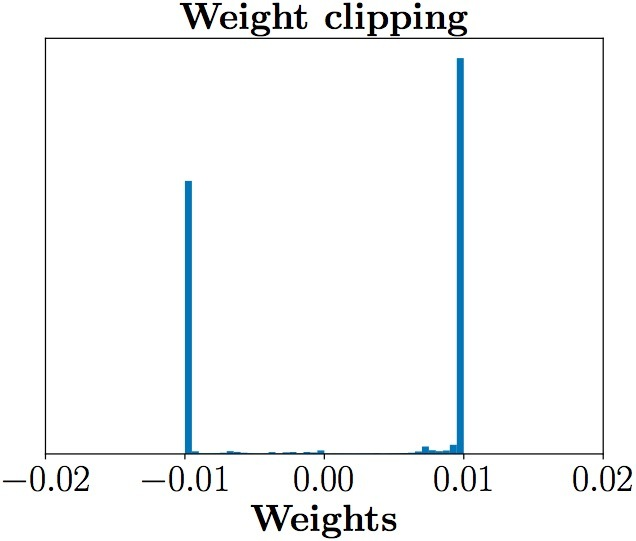</center>

这样带来的结果就是，判别器会非常倾向于学习一个简单的映射函数（想想看，几乎所有参数都是正负0.01，都已经可以直接视为一个二值神经网络了，太简单了）。而作为一个深层神经网络来说，这实在是对自身强大拟合能力的巨大浪费！判别器没能充分利用自身的模型能力，经过它回传给生成器的梯度也会跟着变差。

在正式介绍gradient penalty之前，我们可以先看看在它的指导下，同样充分训练判别器之后，参数的数值分布就合理得多了，判别器也能够充分利用自身模型的拟合能力：
<center>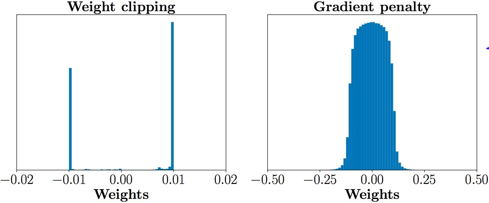</center>

第二个问题，weight clipping会导致很容易一不小心就梯度消失或者梯度爆炸。原因是判别器是一个多层网络，如果我们把clipping threshold设得稍微小了一点，每经过一层网络，梯度就变小一点点，多层之后就会指数衰减；反之，如果设得稍微大了一点，每经过一层网络，梯度变大一点点，多层之后就会指数爆炸。只有设得不大不小，才能让生成器获得恰到好处的回传梯度，然而在实际应用中这个平衡区域可能很狭窄，就会给调参工作带来麻烦。相比之下，gradient penalty就可以让梯度在后向传播的过程中保持平稳。论文通过下图体现了这一点，其中横轴代表判别器从低到高第几层，纵轴代表梯度回传到这一层之后的尺度大小（注意纵轴是对数刻度），c是clipping threshold：
<center>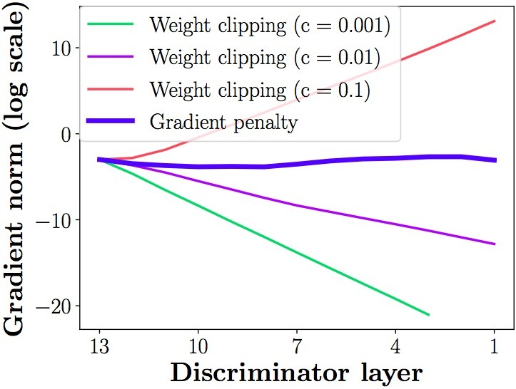</center>

#####3.3、gradient penalty到底是什么？
前面提到，Lipschitz限制是要求判别器的梯度不超过 $K$，那我们何不直接设置一个额外的loss项来体现这一点呢？比如说：
$$ReLU[ || \nabla_x D(x) ||_p - K ]  （公式4）$$

不过，既然判别器希望尽可能拉大真假样本的分数差距，那自然是希望梯度越大越好，变化幅度越大越好，所以判别器在充分训练之后，其梯度norm其实就会是在K附近。知道了这一点，我们可以把上面的loss改成要求梯度norm离K越近越好，效果是类似的：

$$ [ || \nabla_x D(x) ||_p - K ]^2  （公式5）$$

究竟是公式4好还是公式5好，我看不出来，可能需要实验验证，反正论文作者选的是公式5。接着我们简单地把K定为1，再跟WGAN原来的判别器loss加权合并，就得到新的 **判别器loss**：

$$L(D) = -\mathbb{E}_{x\sim P_r}[D(x)] + \mathbb{E}_{x\sim P_g}[D(x)] + \lambda \mathbb{E}_{x \sim \mathcal{X}} [ || \nabla_x D(x) ||_p - 1 ]^2  （公式6）$$

这就是所谓的gradient penalty了吗？还没完。公式6有两个问题，首先是loss函数中存在梯度项，那么优化这个loss岂不是要算梯度的梯度？一些读者可能对此存在疑惑，不过这属于实现上的问题，放到后面说。

其次，3个loss项都是期望的形式，落到实现上肯定得变成采样的形式。前面两个期望的采样我们都熟悉，第一个期望是从真样本集里面采，第二个期望是从生成器的噪声输入分布采样后，再由生成器映射到样本空间。可是第三个分布要求我们在整个样本空间 $\mathcal{X}$ 上采样，这完全不科学！由于所谓的维度灾难问题，如果要通过采样的方式在图片或自然语言这样的高维样本空间中估计期望值，所需样本量是指数级的，实际上没法做到。

所以，论文作者就非常机智地提出，我们其实没必要在整个样本空间上施加Lipschitz限制，只要重点抓住生成样本集中区域、真实样本集中区域以及夹在它们中间的区域就行了。具体来说，我们先随机采一对真假样本，还有一个0-1的随机数：

$$x_r \sim P_r, x_g \sim P_g, \epsilon \sim Uniform[0, 1] （公式7）$$

然后在 $x_r$ 和 $x_g$ 的连线上随机插值采样：
$$\hat x = \epsilon x_r + (1 - \epsilon) x_g  （公式8）$$

把按照上述流程采样得到的 $\hat x$ 所满足的分布记为 $P_{\hat x}$ ，就得到最终版本的判别器loss,<font color="red">最关键的是改了判别器的损失函数：</font>

$$L(D) = -\mathbb{E}_{x\sim P_r}[D(x)] + \mathbb{E}_{x\sim P_g}[D(x)] + \lambda \mathbb{E}_{x \sim \mathcal{P_{\hat x}}} [ || \nabla_x D(x) ||_p - 1 ]^2  （公式9）$$
<font color="red">通过最后一项将两者的空间联系起来,并且不会存在梯度消失问题</font>

**这就是新论文所采用的gradient penalty方法，相应的新WGAN模型简称为WGAN-GP**。我们可以做一个对比：
+ weight clipping是对样本空间全局生效，但因为是间接限制判别器的梯度norm，会导致一不小心就梯度消失或者梯度爆炸；

+ gradient penalty只对真假样本集中区域、及其中间的过渡地带生效，但因为是直接把判别器的梯度norm限制在1附近，所以梯度可控性非常强，容易调整到合适的尺度大小。

论文还讲了一些使用gradient penalty时需要注意的配套事项，这里只提一点：**由于我们是对每个样本独立地施加梯度惩罚，所以判别器的模型架构中不能使用Batch Normalization**，因为它会引入同个batch中不同样本的相互依赖关系。如果需要的话，可以选择其他normalization方法，如Layer Normalization、Weight Normalization和Instance Normalization，这些方法就不会引入样本之间的依赖。论文推荐的是Layer Normalization。

#####3.4、WGAN-GP的简单实现

```java
batch_size = 100
width, height = 28, 28
mnist_dim = 784
random_dim = 10

def G(x)
    with tf.variable_scope('generator', reuse=tf.AUTO_REUSE):
        x = slim.fully_connected(x, 32, activation_fn=tf.nn.relu)
        x = slim.fully_connected(x, 128, activation_fn=tf.nn.relu)
        x = slim.fully_connected(x, mnist_dim, activation_fn=tf.nn.sigmoid)
    return x

def D(X):
    with tf.variable_scope('discriminator', reuse=tf.AUTO_REUSE):
        X = slim.fully_connected(X, 128, activation_fn=tf.nn.relu)
        X = slim.fully_connected(X, 32, activation_fn=tf.nn.relu)
        X = slim.fully_connected(X, 1, activation_fn=None)
    return X

real_X = tf.placeholder(tf.float32, shape=[batch_size, mnist_dim])
random_X = tf.placeholder(tf.float32, shape=[batch_size, random_dim])
random_Y = G(random_X)

eps = tf.random_uniform([batch_size, 1], minval=0., maxval=1.)
X_inter = eps * real_X + (1. - eps) * random_Y
grad = tf.gradients(D(X_inter), [X_inter])[0]
grad_norm = tf.sqrt(tf.reduce_sum((grad) ** 2, axis=1))
grad_pen = 10 * tf.reduce_mean(tf.nn.relu(grad_norm - 1.))

D_loss = tf.reduce_mean(D(random_Y)) - tf.reduce_mean(D(real_X)) + grad_pen
G_loss = -tf.reduce_mean(D(random_Y))

# 获得各个网络中各自的训练参数
t_vars = tf.trainable_variables()
d_vars = [var for var in t_vars if 'discriminator' in var.name]
g_vars = [var for var in t_vars if 'generator' in var.name]
print(len(t_vars), len(d_vars))

D_solver = tf.train.AdamOptimizer(1e-4, 0.5).minimize(D_loss, var_list=d_vars)
G_solver = tf.train.AdamOptimizer(1e-4, 0.5).minimize(G_loss, var_list=g_vars)
```