### <center>理解 word2vec</center>
本文主要从以下三部分讲解:
+ 直观理解word2vec

+ word2vec的tensorflow实现

+ word2vec原理

#### 1、直观理解word2vec
#####1.1、什么是Word2Vec和Embeddings？
Word2Vec其实就是通过学习文本来用词向量的方式表征词的语义信息，即通过一个嵌入空间使得语义上相似的单词在该空间内距离很近。Embedding其实就是一个映射，将单词从原先所属的空间映射到新的多维空间中，也就是把原先词所在空间嵌入到一个新的空间中去。

我们从直观角度上来理解一下，cat这个单词和kitten属于语义上很相近的词，而dog和kitten则不是那么相近，iphone这个单词和kitten的语义就差的更远了。通过对词汇表中单词进行这种数值表示方式的学习（也就是将单词转换为词向量），能够让我们基于这样的数值进行向量化的操作从而得到一些有趣的结论。比如说，如果我们对词向量kitten、cat以及dog执行这样的操作：kitten - cat + dog，那么最终得到的嵌入向量（embedded vector）将与puppy这个词向量十分相近。

#####1.2、模型构建
Word2Vec模型中，主要有Skip-Gram和CBOW两种模型，从直观上理解，Skip-Gram是给定input word来预测上下文。而CBOW是给定上下文，来预测input word。这里主要讲解Skip-Gram模型。
<center>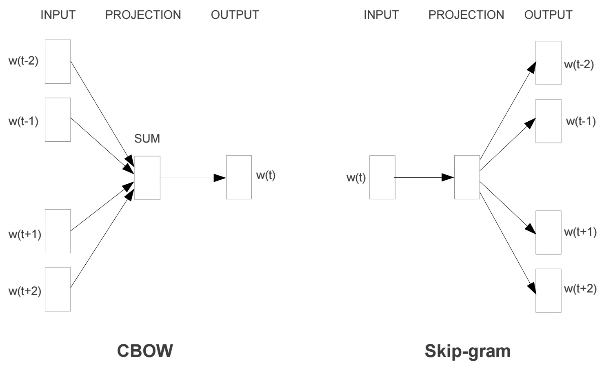</center>.

Skip-Gram模型的基础形式非常简单，为了更清楚地解释模型，我们先从最一般的基础模型来看Word2Vec（下文中所有的Word2Vec都是指Skip-Gram模型）。

Word2Vec模型实际上分为了两个部分，第一部分为建立模型，第二部分是通过模型获取嵌入词向量。Word2Vec的整个建模过程实际上与**自编码器（auto-encoder）的思想很相似**，即先基于训练数据构建一个神经网络，当这个模型训练好以后，我们并不会用这个训练好的模型处理新的任务，我们**真正需要的是这个模型通过训练数据所学得的参数**，例如隐层的权重矩阵——后面我们将会看到这些权重在Word2Vec中实际上就是我们试图去学习的“word vectors”。基于训练数据建模的过程，我们给它一个名字叫“Fake Task”，意味着建模并不是我们最终的目的。

最常见的就是自编码器（auto-encoder）：通过在隐层将输入进行编码压缩，继而在输出层将数据解码恢复初始状态，训练完成后，**我们会将输出层“砍掉”，仅保留输入层和隐含层**。<font color="red">在word2vec中,保留输入层到隐含层之间的权重作为词向量</font>

这里简单的举个例子,假设训练数据如下:
```python
文本为: eat orange,apple
如果:  input word 为 orange, 并且skip_window=1
那么:  提取出来的训练样本就有(orange,eat) 和 (orange,apple),样本训练过程如下:
```
<center>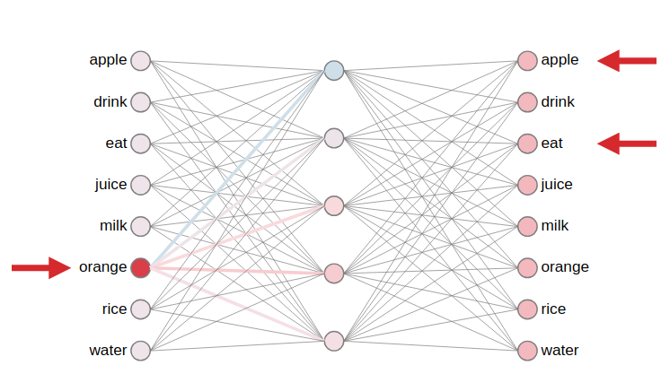</center>.

我们将通过给神经网络输入文本中成对的单词来训练它完成上面所说的概率计算。下面的图中给出了一些我们的训练样本的例子。我们选定句子“The quick brown fox jumps over lazy dog”，设定我们的窗口大小为2（$window\_size=2$），也就是说我们仅选输入词前后各两个词和输入词进行组合。下图中，蓝色代表input word，方框内代表位于窗口内的单词。
<center>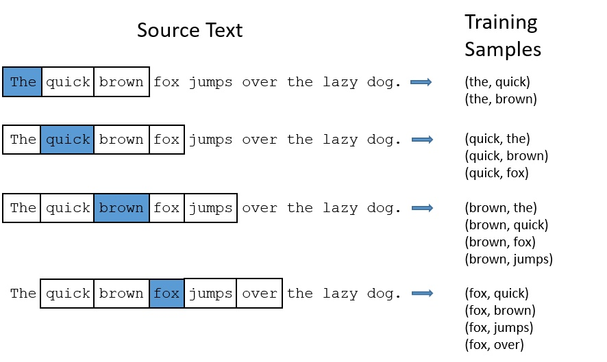</center>.

##### 1.2.1 如何表示这些单词?
首先，我们都知道神经网络只能接受数值输入，我们不可能把一个单词字符串作为输入，因此我们得想个办法来表示这些单词。最常用的办法就是基于训练文档来构建我们自己的词汇表（vocabulary）再对单词进行**one-hot编码**。

假设从我们的训练文档中抽取出10000个唯一不重复的单词组成词汇表。我们对这10000个单词进行one-hot编码，得到的每个单词都是一个10000维的向量，向量每个维度的值只有0或者1，假如单词ants在词汇表中的出现位置为第3个，那么ants的向量就是一个第三维度取值为1，其他维都为0的10000维的向量（$ants=[0, 0, 1, 0, ..., 0]$）。

举个例子，“The dog barked at the mailman”，那么我们基于这个句子，可以构建一个大小为5的词汇表（忽略大小写和标点符号）：("the", "dog", "barked", "at", "mailman")，我们对这个词汇表的单词进行编号0-4。那么”dog“就可以被表示为一个5维向量[0, 1, 0, 0, 0]。

**<font color="red">模型的输入如果为一个10000维的向量，那么输出也是一个10000维度（词汇表的大小）的向量，它包含了10000个概率，每一个概率代表着当前词是输入样本中output word的概率大小。这里假设输入一个单词,输出为概率加权为 1, 每个位置的值表示当前单词可能是输入的概率</font>** 下面就是一个简单的神经网络结构:
<center></center>.

隐层没有使用任何激活函数，但是输出层使用了sotfmax。我们基于成对的单词来对神经网络进行训练，训练样本是 ( input word, output word ) 这样的单词对，input word和output word都是one-hot编码的向量。最终模型的输出是一个概率分布。<font color="red">每次都是一个样本进行训练, 训练完所有样本之后就得到了输入到隐含层的权重, 这就是我们要求的词向量.</font>

##### 1.2.2 隐含层
说完单词的编码和训练样本的选取，我们来看下我们的隐层。如果我们现在想用300个特征来表示一个单词（即每个词可以被表示为300维的向量）。那么隐层的权重矩阵应该为10000行，300列（隐层有300个结点）。

Google在最新发布的基于Google news数据集训练的模型中使用的就是300个特征的词向量。词向量的维度是一个可以调节的超参数**（在Python的gensim包中封装的Word2Vec接口默认的词向量大小为100， window_size为5）。**

看下面的图片，左右两张图分别从不同角度代表了**输入层-隐层的权重矩阵**。左图中每一列代表一个10000维的词向量和隐层单个神经元连接的权重向量。从右边的图来看，每一行实际上代表了每个单词的词向量。
<center>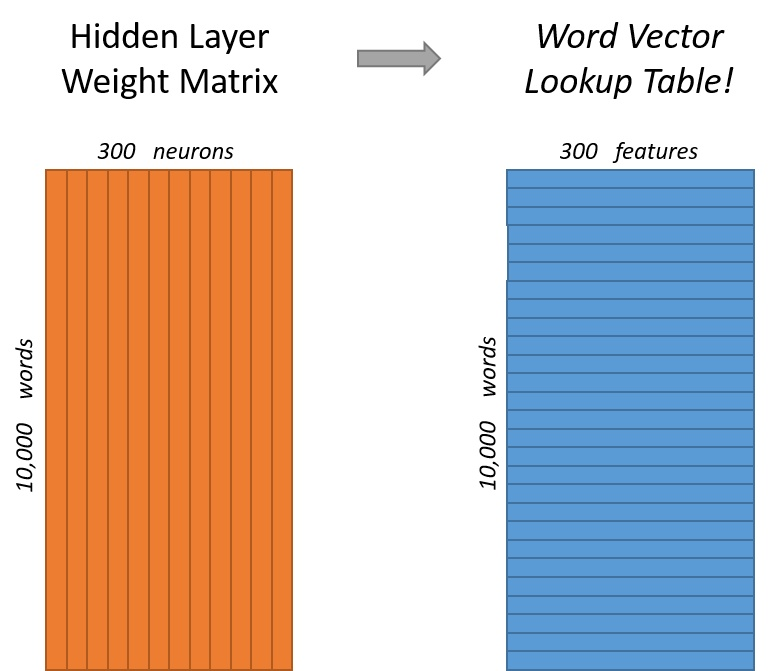</center>.

所以我们最终的目标就是学习这个隐层的权重矩阵。我们现在回来接着通过模型的定义来训练我们的这个模型。上面我们提到，input word和output word都会被我们进行one-hot编码。仔细想一下，我们的输入被one-hot编码以后大多数维度上都是0（实际上仅有一个位置为1），所以这个向量相当稀疏，那么会造成什么结果呢。如果我们将一个1 x 10000的向量和10000 x 300的矩阵相乘，它会消耗相当大的计算资源，为了高效计算，它仅仅会选择矩阵中对应的向量中维度值为1的索引行（这句话很绕），看图就明白。
<center>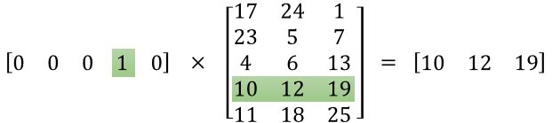</center>.

我们来看一下上图中的矩阵运算，左边分别是1 x 5和5 x 3的矩阵，结果应该是1 x 3的矩阵，按照矩阵乘法的规则，结果的第一行第一列元素为 $0\times 17 + 0\times 23 + 0\times 4 + 1\times 10 + 0\times 11 = 10$，同理可得其余两个元素为12，19。如果10000个维度的矩阵采用这样的计算方式是十分低效的。

为了有效地进行计算，这种稀疏状态下不会进行矩阵乘法计算，可以看到矩阵的计算的结果实际上是矩阵对应的向量中值为1的索引，上面的例子中，左边向量中取值为1的对应维度为3（下标从0开始），那么计算结果就是矩阵的第3行（下标从0开始）—— [10, 12, 19]，**这样模型中的隐层权重矩阵便成了一个”查找表“（lookup table），进行矩阵计算时，直接去查输入向量中取值为1的维度下对应的那些权重值。隐层的输出就是每个输入单词的“嵌入词向量”**。<font color="red">每个单词的隐层输出就是该单词的词向量.</font>

##### 1.2.3 输出层
经过神经网络隐层的计算，ants这个词会从一个1 x 10000的向量变成1 x 300的向量，再被输入到输出层。输出层是一个softmax回归分类器，**它的每个结点将会输出一个0-1之间的值（概率），这些所有输出层神经元结点的概率之和为1。**

下面是一个例子，训练样本为 (input word: “ants”， output word: “car”) 的计算示意图,softmax是一个多分类器,会计算10000个单词,每一个的概率,然后通过概率差值,再反向传播回去计算权重。
<center>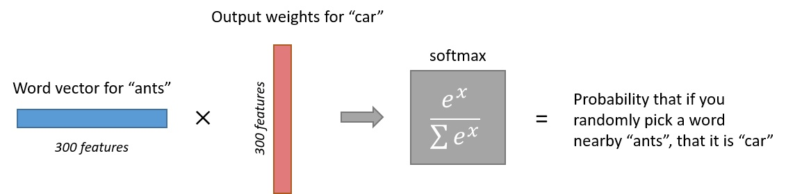</center>.

如果两个不同的单词有着非常相似的“上下文”（也就是窗口单词很相似，比如“Kitty climbed the tree”和“Cat climbed the tree”），那么通过我们的模型训练，这两个单词的嵌入向量将非常相似。

那么两个单词拥有相似的“上下文”到底是什么含义呢？比如对于同义词“intelligent”和“smart”，我们觉得这两个单词应该拥有相同的“上下文”。而例如”engine“和”transmission“这样相关的词语，可能也拥有着相似的上下文。

实际上，这种方法实际上也可以帮助你进行词干化（stemming），例如，神经网络对”ant“和”ants”两个单词会习得相似的词向量。词干化（stemming）就是去除词缀得到词根的过程。


#####1.3、模型优化
上一部分我们了解skip-gram的**输入层、隐层、输出层**。在这个部分，会继续深入讲如何在skip-gram模型上进行高效的训练。在上一部分讲解完成后，**我们会发现Word2Vec模型是一个超级大的神经网络（权重矩阵规模非常大）。**

举个栗子，我们拥有10000个单词的词汇表，我们如果想嵌入300维的词向量，那么我们的**输入-隐层权重矩阵和隐层-输出层的权重矩阵都会有 10000 x 300 = 300万个权重**，在如此庞大的神经网络中进行梯度下降是相当慢的。更糟糕的是，**你需要大量的训练数据来调整这些权重并且避免过拟合**。百万数量级的权重矩阵和亿万数量级的训练样本意味着训练这个模型将会是个灾难。

Word2Vec的作者在它的第二篇论文中强调了这些问题，下面是作者在第二篇论文中的三个创新：
+ 将常见的单词组合（word pairs）或者词组作为单个“words”来处理。

+ 对高频次单词进行抽样来减少训练样本的个数。

+ 对优化目标采用“negative sampling”方法，这样每个训练样本的训练只会更新一小部分的模型权重，从而降低计算负担。

论文的作者指出，一些单词组合（或者词组）的含义和拆开以后具有完全不同的意义。比如“Boston Globe”是一种报刊的名字，而单独的“Boston”和“Globe”这样单个的单词却表达不出这样的含义。因此，在文章中只要出现“Boston Globe”，我们就应该把它作为一个单独的词来生成其词向量，而不是将其拆开。同样的例子还有“New York”，“United Stated”等。

事实证明，对常用词抽样并且对优化目标采用“negative sampling”不仅降低了训练过程中的计算负担，还提高了训练的词向量的质量。

#####1.3.1、对高频词抽样
在上面的讲解中，我们展示了训练样本是如何从原始文档中生成出来的，这里我再重复一次。我们的原始文本为“The quick brown fox jumps over the laze dog”，如果我使用大小为2的窗口，那么我们可以得到图中展示的那些训练样本。
<center></center>.

但是对于“the”这种常用高频单词，这样的处理方式会存在下面两个问题：
+ 当我们得到成对的单词训练样本时，("fox", "the") 这样的训练样本并不会给我们提供关于“fox”更多的语义信息，因为“the”在每个单词的上下文中几乎都会出现。

+ 由于在文本中“the”这样的常用词出现概率很大，**因此我们将会有大量的（”the“，...）这样的训练样本，而这些样本数量远远超过了我们学习“the”这个词向量所需的训练样本数**。

Word2Vec通过“抽样”模式来解决这种高频词问题。它的基本思想如下：**对于我们在训练原始文本中遇到的每一个单词，它们都有一定概率被我们从文本中删掉，而这个被删除的概率与单词的频率有关。**

作者在word2vec的C语言代码实现了一个计算在词汇表中保留某个词概率的公式。 $w_i$ 是一个单词，$q(w_i)$ 是 $w_i$ 这个单词在所有语料中出现的频次。举个栗子，如果单词“peanut”在10亿规模大小的语料中出现了1000次，那么  $q("peanut")=1000 / 1000000000 = 10^{-6}$。

在代码中还有一个参数叫“sample”，这个参数代表一个阈值，默认值为0.001（**在gensim包中的word2vec类说明中，这个参数默认为0.001，文档中对这个参数的解释为“ threshold for configuring which higher-frequency words are randomly downsampled”**）。词频大于这个阈值的单词,以一定的概率删除. $P(w_i)$ 代表着保留某个单词的概率：

$$P(w_i)=\left(\sqrt{\frac{q(w_i)}{0.001}}+1\right)\times \frac{0.001}{q(w_i)}$$
<center>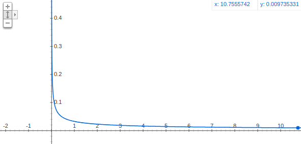</center>.

图中横轴表示词频 $q(w_i)$, $y$ 轴代表某个单词被保留的概率。对于一个庞大的语料来说，单个单词的出现频率不会很大，即使是常用词，也不可能特别大。

从这个图中，我们可以看到，随着单词出现频率的增高，它被采样保留的概率越来越小，我们还可以看到一些有趣的结论：
+ 当 $q(w_i) \leq 0.0026$ 时，$P(w_i)=1.0$ 。当单词在语料中出现的频率小于0.0026时，它是100%被保留的，这意味着只有那些在语料中出现频率超过0.26%的单词才会被采样。

+ 当 $q(w_i)=0.00746$ 时，$P(w_i)=0.5$，意味着这一部分的单词有50%的概率被保留。

+ 当 $q(w_i)=1.0$ 时，$P(w_i)=0.033$，意味着这部分单词以3.3%的概率被保留。

#####1.3.2、负采样
**训练一个神经网络意味着要输入训练样本并且不断调整神经元的权重，从而不断提高对目标的准确预测。**每当神经网络经过一个训练样本的训练，它的权重就会进行一次调整。

正如我们上面所讨论的，**vocabulary的大小决定了我们的Skip-Gram神经网络将会拥有大规模的权重矩阵**，所有的这些权重需要通过我们数以亿计的训练样本来进行调整，这是非常消耗计算资源的，并且实际中训练起来会非常慢。

负采样（negative sampling）解决了这个问题，它是用来提高训练速度并且改善所得到词向量的质量的一种方法。不同于原本每个训练样本更新所有的权重，负采样每次让一个训练样本仅仅更新一小部分的权重，这样就会降低梯度下降过程中的计算量。

当我们用训练样本 **(input word: "fox"，output word: "quick")** 来训练我们的神经网络时，“ fox”和“quick”都是**经过one-hot编码的**。如果我们的vocabulary大小为10000时，在输出层，我们期望对应“quick”单词的那个神经元结点输出1，其余9999个都应该输出0。在这里，**这9999个我们期望输出为0的神经元结点所对应的单词我们称为“negative” word。**

当使用负采样时，我们将**<font color="red"> 随机 </font>选择一小部分的negative words（比如选5个negative words）**来更新对应的权重。我们也会对我们的“positive” word进行权重更新（在我们上面的例子中，这个单词指的是”quick“）。在论文中，作者指出指出对于**小规模数据集，选择 5-20个negative words会比较好，对于大规模数据集可以仅选择 2-5 个negative words。**

回忆一下我们的隐层-输出层拥有300 x 10000的权重矩阵。如果使用了负采样的方法我们仅仅去**更新我们的positive word-“quick”的和我们选择的其他5个negative words的结点对应的权重，共计6个输出神经元**,如下图,可能的负采样只有 $drink,juice$，相当于每次只更新$300\times 6=1800$ 个权重。对于300w 的权重来说，相当于只计算了0.06%的权重，这样计算效率就大幅度提高。
<center></center>.

#####1.3.3、如何选择negative words
我们使用“一元模型分布（unigram distribution）”来选择“negative words”。要注意的一点是，**一个单词被选作negative sample的概率跟它出现的频次有关，出现频次越高的单词越容易被选作negative words**。

在word2vec的C语言实现中，你可以看到对于这个概率的实现公式。每个单词被选为“negative words”的概率计算公式与其出现的频次有关。代码中的公式实现如下,其中$\frac{3}{4}$ 是一个经验值：
$$P(w_i) = \frac{f(w_i)^{\frac{3}{4}}}{\sum_{j=0}^n(f(w_i)^{\frac{3}{4}})}$$

每个单词被赋予一个权重，即 $f(w_i)$， 它代表着单词出现的频次。
<center>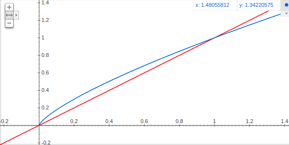</center>.

仔细观察 $x$ 在[0,1]区间内时 $y$ 的取值，$x^{3/4}$ 有一小段弧形，取值在 $y=x$ 函数之上.

负采样的C语言实现非常的有趣。unigram table有一个包含了一亿个元素的数组，这个数组是由词汇表中每个单词的索引号填充的，并且 **这个数组中有重复**，也就是说有些单词会出现多次。那么每个单词的索引在这个数组中出现的次数该如何决定呢，有公式 $P(w_i)*table\_size$，也就是说计算出的 **负采样概率*1亿=单词在表中出现的次数**。

有了这张表以后，每次去我们进行负采样时，只需要在 **0-1亿范围内生成一个随机数**，然后选择表中索引号为这个随机数的那个单词作为我们的negative word即可。一个单词的负采样概率越大，那么它在这个表中出现的次数就越多，它被选中的概率就越大。


#### 2、word2vec的tensorflow实现
这主要包括以下四个部分进行代码构造：

- 数据预处理

- 训练样本构建

- 模型构建

- 模型验证

##### 2.1、 数据预处理
数据预处理部分主要包括：
+ 替换文本中特殊符号并去除低频词

+ 对文本分词

+ 构建语料

+ 单词映射表

首先我们定义一个函数来完成前两步，即对文本的清洗和分词操作。
<center>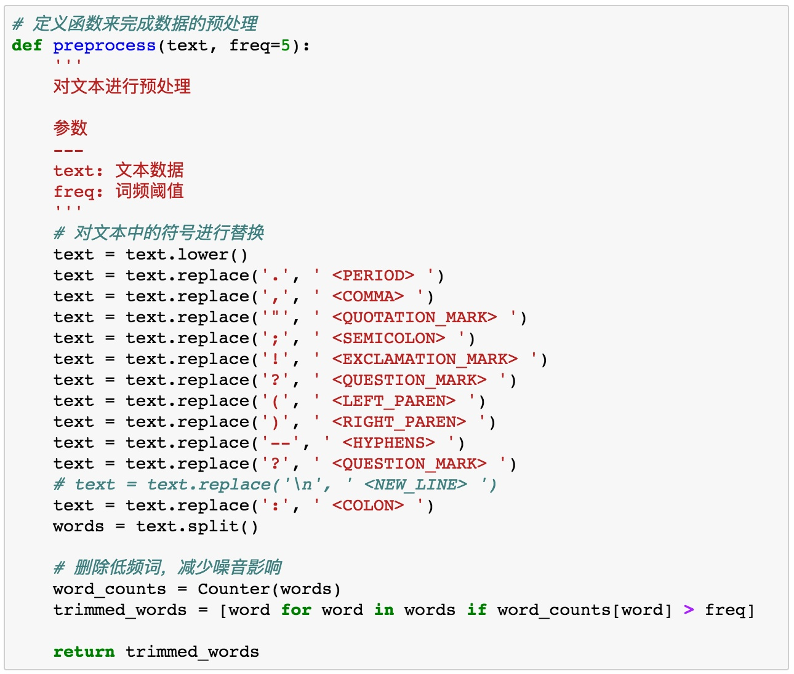</center>.

上面的函数实现了替换标点及删除低频词操作，返回分词后的文本。下面让我们来看看经过清洗后的数据：
<center>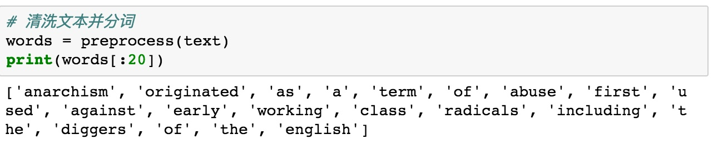</center>.

有了分词后的文本，就可以构建我们的映射表，代码就不再赘述，大家应该都比较熟悉。
<center>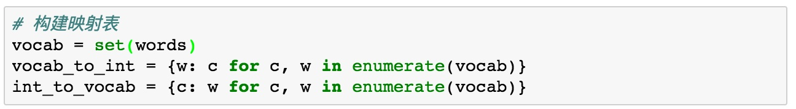</center>.

整个文本中单词大约为1660万的规模，词典大小为6万左右，这个规模对于训练好的词向量其实是不够的，但可以训练出一个稍微还可以的模型。

##### 2.2、 训练样本构建
我们知道skip-gram中，训练样本的形式是(input word, output word)，其中output word是input word的上下文。为了减少模型噪音并加速训练速度，我们在构造batch之前要对样本进行采样，剔除停用词等噪音因素。

在建模过程中，训练文本中会出现很多“the”、“a”之类的常用词（也叫停用词），这些词对于我们的训练会带来很多噪音。在上一篇Word2Vec中提过对样本进行抽样，剔除高频的停用词来减少模型的噪音，并加速训练。我们采用以下公式来计算每个单词被删除的概率大小：

$$P(w_i) = 1 - \sqrt{\frac{t}{f(w_i)}}$$

其中 $f(w_i)$ 代表单词 $w_i$ 的出现频次。$t$ 为一个阈值，一般介于 $10^{-3}$ 到 $10^{-5}$之间。
<center>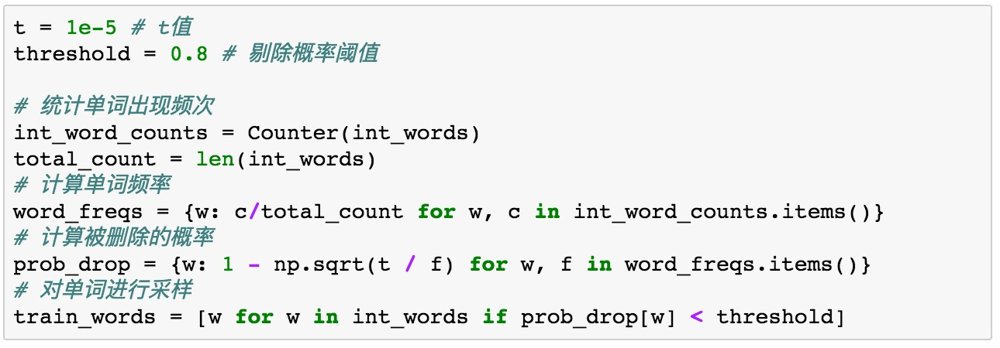</center>.

上面的代码计算了样本中每个单词被删除的概率，并基于概率进行了采样，现在我们手里就拿到了采样过的单词列表。

我们先来分析一下skip-gram的样本格式。skip-gram不同于CBOW，CBOW是基于上下文预测当前input word。而skip-gram则是基于一个input word来预测上下文，因此一个input word会对应多个上下文。我们来举个栗子“The quick brown fox jumps over lazy dog”，如果我们固定 $skip_window=2$ 的话，那么fox的上下文就是[quick, brown, jumps, over]，如果我们的 $batch_size=1$ 的话，那么实际上一个batch中有四个训练样本。

上面的分析转换为代码就是两个步骤，第一个是找到每个input word的上下文，第二个就是基于上下文构建batch。

首先是找到input word的上下文单词列表：
<center>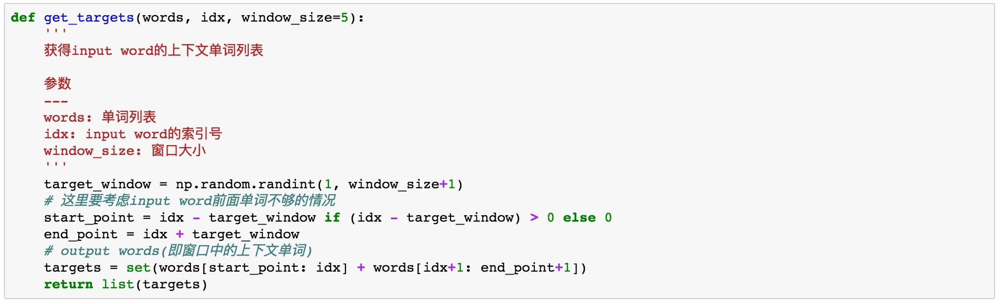</center>.

我们定义了一个get_targets函数，接收一个单词索引号，基于这个索引号去查找单词表中对应的上下文（默认 $window_size=5$）。请注意这里有一个小trick，我在实际选择input word上下文时，使用的窗口大小是一个介于 **[1, window_size]区间的随机数**。这里的目的是让模型更多地去关注离input word更近词。

我们有了上面的函数后，就能够轻松地通过input word找到它的上下文单词。有了这些单词我们就可以构建我们的batch来进行训练：
<center>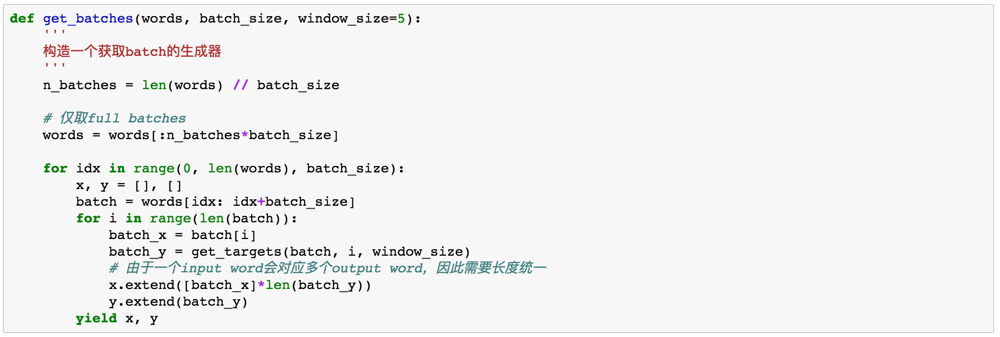</center>.

注意上面的代码对batch的处理。我们知道对于每个input word来说，有多个output word（上下文）。例如我们的输入是“fox”，上下文是[quick, brown, jumps, over]，那么fox这一个batch中就有四个训练样本**[fox, quick], [fox, brown], [fox, jumps], [fox, over]。**

##### 2.3、 模型构建
数据预处理结束后，就需要来构建我们的模型。在模型中为了加速训练并提高词向量的质量，我们采用负采样方式进行权重更新。

输入层到隐层的权重矩阵作为嵌入层要给定其维度，一般embeding_size设置为50-300之间。
<center>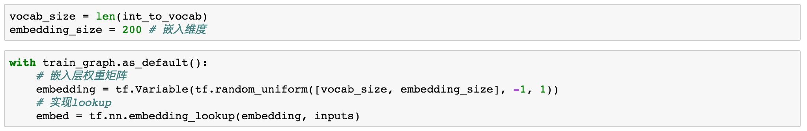</center>.

在skip-gram中，每个input word的多个上下文单词实际上是共享一个权重矩阵，我们将每个（input word, output word）训练样本来作为我们的输入。为了加速训练并且提高词向量的质量，我们采用negative sampling的方法来进行权重更新。

TensorFlow中的sampled_softmax_loss，由于进行了negative sampling，所以实际上我们会低估模型的训练loss。
<center>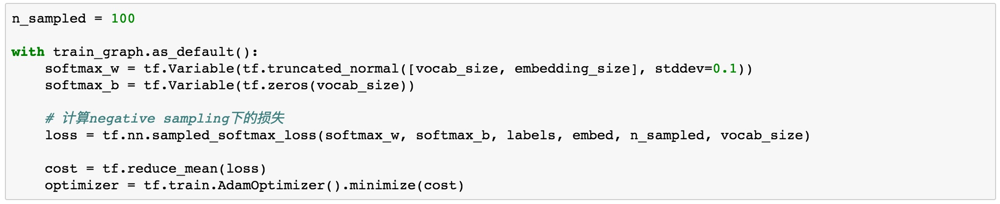</center>.

在Tensorflow 的 word2vec 实现中,对目标样本计算损失值,计算softmax,负采样等过程都封装在nce_loss函数中,其默认使用的是log_uniform_candidate_sampler 采样函数,在不指定采样器时,它会优先采样高频词做为负样本. tf.nn.sampled_softmax_loss 其用法与 tf.nn.nce_loss 函数完全相同.不同的是内部实现,nce_loss 函数可以进行多标签分类,标签之间不互斥,原因在于其对每一个输出的类都链接一个logistic二分类,而sampled_softmax_loss只能对单个标签分类,输出的类别是互斥的,原因是其对每个类的输出放在一起做一个统一的多分类操作.

请注意代码中的softmax_w的维度是vocab_size x embedding_size，这是因为TensorFlow中的sampled_softmax_loss中参数weights的size是[num_classes, dim]。

##### 2.4、 模型验证
在上面的步骤中，我们已经将模型的框架搭建出来，下面就让我们来训练训练一下模型。为了能够更加直观地观察训练每个阶段的情况。我们来挑选几个词，看看在训练过程中它们的相似词是怎么变化的。

<center>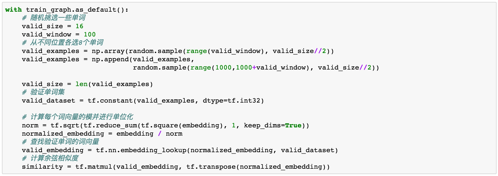</center>.

训练模型：
<center>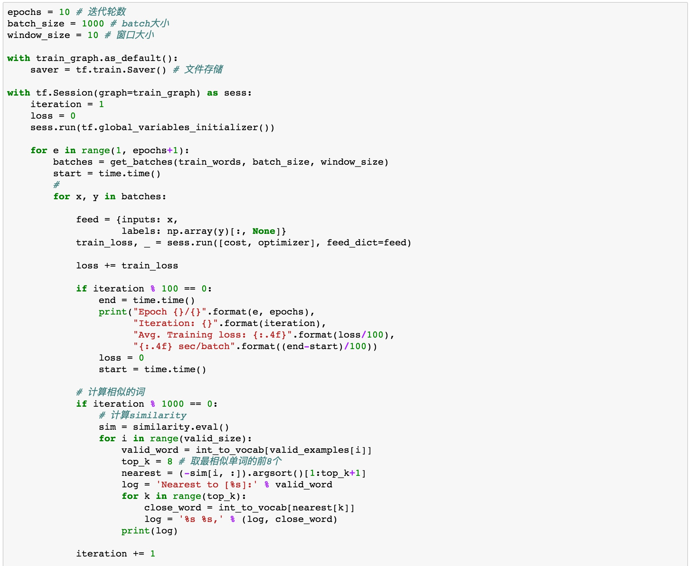</center>.

在这里注意一下，尽量不要经常去让代码打印验证集相似的词，因为这里会多了一步计算步骤，就是计算相似度，会非常消耗计算资源，计算过程也很慢。所以代码中我设置1000轮打印一次结果。
<center></center>.

从最后的训练结果来看，模型还是学到了一些常见词的语义，比如one等计数词以及gold之类的金属词，animals中的相似词也相对准确。为了能够更全面地观察我们训练结果，我们采用sklearn中的TSNE来对高维词向量进行可视化。
<center>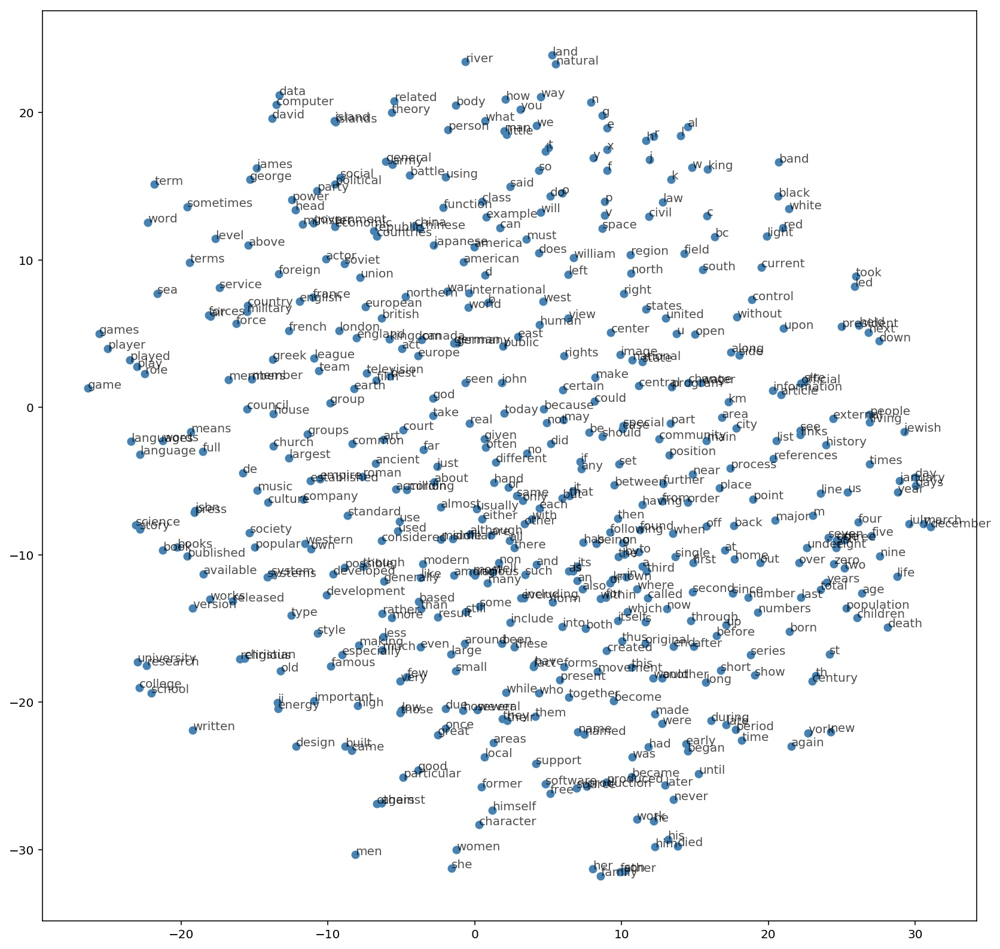</center>.

**关于提升效果的技巧：**

+ 增大训练样本，语料库越大，模型学习的可学习的信息会越多。

+ 增加 window size，可以获得更多的上下文信息。

+ 增加embedding size可以减少信息的维度损失，但也不宜过大，我一般常用的规模为50-300。

#### 3、常见的word2vec工具以及语料
分词工具: jieba
训练工具: gensim
语料: 维基百科中英文

#### 4、word2vec原理

