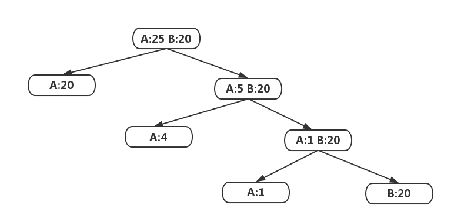
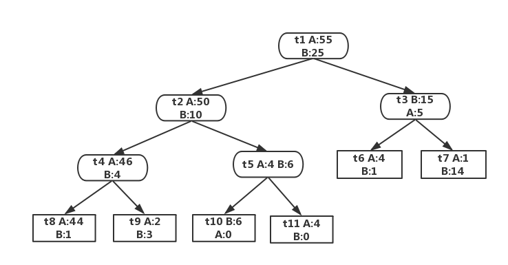
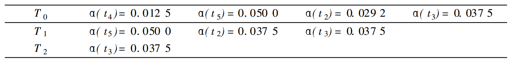
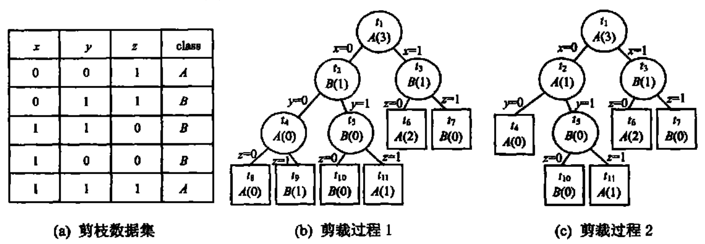
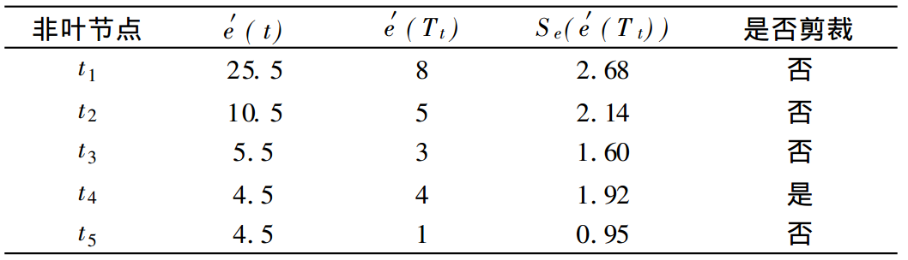
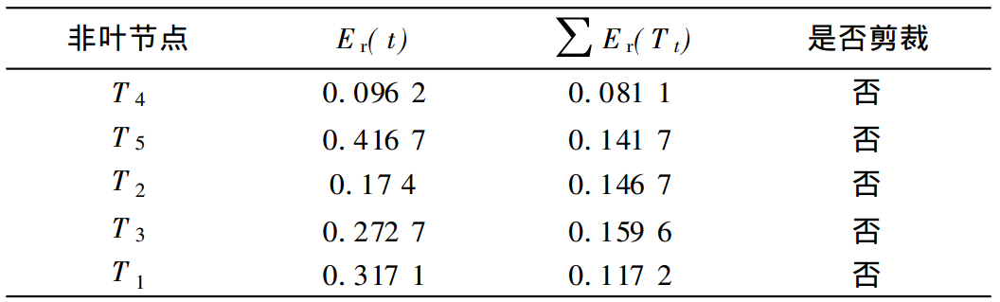
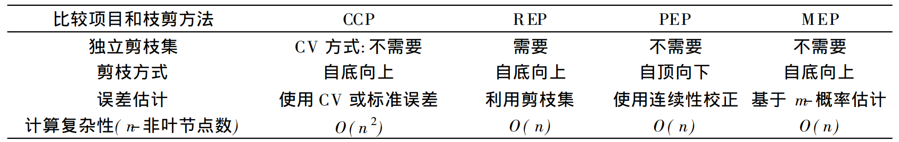

##
**决策树模型**

###1、基本数学知识
一个传递信息的系统是由发送端（信源）和接收端（信宿）以及连接两者的通道（信道）三者组成。

信源为 $X=(x_1,x_2,x_3,...,x_n)$
信宿为 $Y=(y_1,y_2,y_3,...,y_n)$
信道为 $P(Y|X)$

在进行实际的通信之前，收信者（信宿）不可能确切了解信源究竟会发出什么样的具体信息，不可能判断信源会处于什么样的状态。这种情形就称为信宿对于信源状态具有不确定性。而且这种不确定性是存在于通信之前的。因而又叫做**先验不确定性**，表示成

信息熵 $H(X)$

在进行了通信之后，信宿收到了信源发来的信息，这种先验不确定性才会被消除或者被减少。如果干扰很小,不会对传递的信息产生任何可察觉的影响，信源发出的信息能够被信宿全部收到，在这种情况下，信宿的先验不确定性就会被完全消除。在一般情况下，干扰总会对信源发出的信息造成某种破坏，使信宿收到的信息不完全。

先验不确定性不能全部被消除，只能部分地消除。通信结束之后，信宿仍然具有一定程度的不确定性。这就是**后验不确定性**，用条件熵表示：

条件熵 $H(X|Y)$

后验不确定性总要**小于**先验不确定性:

$H(X|Y) < H(X)$

如果后验不确定性的大小正好等于先验不确定性的大小，这就表示信宿根本没有收到信息。如果后验不确定性的大小等于零，这就表示信宿收到了全部信息。可见，信息是用来消除（随机）不确定性的度量。信息量用**互信息**来表示，即：

$I(X,Y)=H(X)-H(X|Y)$

**自信息**: 消息 $x_i$ 发生后所含有的信息量。 它反映了消息 $x_i$ 发生前的不确定性（随机性） 。 定义为：

$I(x_i)=log\frac{1}{P(x_i)}=-logP(x_i)$

**信息熵**: 自信息的数学期望。即信源输出后,每个消息所提供的信息量，也反映了信源输出前的平均不确定性，也成为先验熵。定义为:

$H(X)=-\sum_iP(x_i)logP(x_i)$

信息熵的取值范围：$0\leq H(X) \leq logn$

如果 $n$ 种可能的发生都有相同的概率，即所有的 $x_i$ 有 $P(x_i)=\frac{1}{n}, H(X)$ 达到最大的值 $log n$ ，系统的不确定性最大。$P(x_i)$ 相互接近，$H(X)$ 就大。$P(x_i)$ 相差大，则$H(X)$ 就小。

**后验熵和条件熵**：当没有接收到输出信息 $Y$ 时，已知输入$X$ 的概率分布为 $P(X)$ ,当接收到输出信息时 $Y=Y_j$，那么输入信息的概率分布就会发生变化，变成后验概率分布 $P(X|Y_j)$。其后验熵为：

$H(X|Y_j)=-\sum_iP(X_i|Y_j)logP(X_i|Y_j)$

那么接收到输出信息 $Y=Y_j$ 后，关于 $X$ 的平均不确定性为,这就是接收到输出信息之后的条件熵：

$H(X|Y)=-\sum_jP(Y_j)\sum_iP(X_i|Y_j)logP(X_i|Y_j)$

这个条件熵称为信道疑义度。它表示在输出端收到全部输出信息后，对于输入端的信息尚存在的不确定性。从上面分析可以得到，条件熵小于无条件熵，即：

$H(X|Y) < H(X)$

说明接收到所有信息后，关于输入输入信息平均不确定性减少了。即总能消除一些关于输入端X的不确定性，从而获得了一些信息。

###2、决策树模型与学习
####2.1、决策树概念
+ 决策树是用样本的属性作为结点，用属性的取值作为分支的树结构。

+ 决策树的根结点是所有样本中信息量最大的属性。树的中间结点是该结点为根的子树所包含的样本子集中信息量最大的属性或特征。决策树的叶结点是样本的类别值。

+ 决策树能准确地识别所有样本的类别，也能有效地识别新样本的类别。

####2.2、决策树学习
- 决策树学习的本质是从训练数据中归纳出一组分类规则。与训练数据不矛盾的决策树可能有多个，也可能没有，我们需要选择一个与训练数据矛盾较小的决策树。

- 决策树的本质是由训练数据集估计条件概率模型。

- 决策树的损失函数通常是正则化的极大似然函数，用于评估模型的好坏。

- 从所有可能的决策树中选择最优决策树是NP完全问题，通常使用启发式方法，通常近似求解，得到决策树是次优的

- 决策树通常递归的选择最优特征，并根据这个特征对训练数据进行分割，使得子集在当前条件下有最好的分类。
- 通过上面的方法得到的分类可能对训练数据集有很好的效果，但是泛化效果往往很差，所以适当的剪枝，使模型变得简单，提升泛化能力。

**总结**：决策树学习算法包含特征选择、决策树生成、决策树剪枝，决策树是一个条件概率模型，不同深度的树有不同的复杂度的概率模型。决策树的生成对应于模型的局部选择，决策树的剪枝对应于模型的全局选择，决策树生成只考虑局部最优，决策树剪枝考虑全局最优。

###3、特征选择
####3.1、特征选择问题
特征选择在于选取一个对训练数据有良好分类的特征，如果一个选中一个特征后，发现其和随机分类的效果差不多，说明这个特征没有分类能力，可以不考虑。通常特征选择的准则是**信息增益或信息增益比**。特征选择就是决定使用哪一个特征来划分特征空间。

|ID|年龄|有工作|有自己的房子|信贷情况|类别|
|:---:|:---:|:---:|:---:|:---:|:---:|
|1|青年|否|否|一般|否|
|2|青年|否|否|好|否|
|3|青年|是|否|好|是|
|4|青年|是|是|一般|是|
|5|青年|否|否|一般|否|
|6|中年|否|否|一般|否|
|7|中年|否|否|好|否|
|8|中年|是|是|好|是|
|9|中年|否|是|非常好|是|
|10|中年|否|是|非常好|是|
|11|老年|否|是|非常好|是|
|12|老年|否|是|好|是|
|13|老年|是|否|好|是|
|14|老年|是|否|非常好|是|
|15|老年|否|否|一般|否|

从上表中可以看出，选择不同的属性作为划分，可以得到不同的决策树，如何选择一个最优的特征作为划分，可以通过信息增益来决定。

####3.2、信息增益
**熵**：表示随机变量的不确定性的度量，设 $X$ 是一个取有限个离散值的随机变量，其概率分布为：

$P(X=x_i)=p_i,i=1,2,...,n$

随机变量的熵定义为：

$H(X)=-\sum_{i=1}^{n}p_ilogp_i$

熵只依赖于 $X$ 的分布，而不依赖其具体的值。所以也可以记作 $H(p)$ ，熵越大表示变量的不确定性越大。

$0 \leq H(p) \leq logn$

当随机变量只有两个取值，例如0,1时，那么 $X$ 的分布为

$P(X=1)=p,\quad P(X=0)=1-p,\quad 0 \leq p \leq 1$

那么熵为：

$H(X)=-plogp-(1-p)log(1-p)$

可以看出当 $p=0.5$ 时，熵值最大，不确定性最大。所以熵是用来衡量随机变量的不确定性的。

设随机变量$(X,Y)$，其联合分布概率为：

$P(X=x_i,Y=y_j)=p_{ij},\quad i=1,2,...,n;\quad j=1,2,...,n;$

**条件熵**: $H(Y|X)$ 表示在已知随机变量 $X$ 的前提下，随机变量 $Y$ 的不确定性。可以定义为：

$H(Y|X)=\sum_{i=1}^n p_iH(Y|X=x_i)$

**信息增益：** 表示得知特征 $X$ 的信息而使得 $Y$的不确定性减少的程度。特征$A$对数据集$D$的信息增益$g(D,A)$ ，也叫做**互信息**，定义为：

$g(D,A)=H(D)-H(D|A)$

经验熵$H(D)$表示对数据集$D$进行分类的不确定性，而经验熵$H(D|A)$ 表示在特征$A$给定的条件下，对数据集$D$的分类的不确定性。信息增益表示由于特征$A$ 的存在，使得数据集$D$ 的分类不确定性减少程度。

####3.3、特征选择方法
根据信息增益准则来选择特征：对训练数据集 $D$ 计算其每个特征的信息增益，并比较他们的大小，选择信息增益最大的特征。

**信息增益计算方法：**
输入：训练数据集$D$和特征$A$
输出：特征$A$对训练数据集$D$的信息增益$g(D,A)$
（1）计算数据集$D$的经验熵$H(D)$

$H(D)=-\sum_{k=1}^K\frac{|C_k|}{|D|}log\frac{|C_k|}{|D|}$

（2）计算特征$A$对数据集$D$的条件熵$H(D|A)$

$H(D|A)=\sum_{i=1}^n\frac{|D_i|}{|D|}H(D_i)=-\sum_{i=1}^n\frac{|D_i|}{|D|}\sum_{k=1}^K\frac{|C_{ik}|}{|D_i|}log\frac{|C_{ik}|}{|D_i|}$

（3）计算信息增益

$g(D,A)=H(D)-H(D|A)$

**例子：根据上面给出的表格，根据信息增益准则选择最优特征**
（1）计算经验熵$H(D)$

$H(D)=-\frac{6}{15}log\frac{6}{15}-\frac{9}{15}log\frac{9}{15}=0.971$

（2）计算条件熵$H(D|A)$
设条件$A_1$为年龄，条件$A_2$为有工作，条件$A_3$为有自己的房子，条件$A_4$为信贷情况

$\begin{align*}
 H(D|A_1) &=\frac{5}{15}H(D_1)+\frac{5}{15}H(D_2)+\frac{5}{15}H(D_3)\\
 &= -\frac{5}{15}(\frac{2}{5}log\frac{2}{5}+\frac{3}{5}log\frac{3}{5})-\frac{5}{15}(\frac{1}{5}log\frac{1}{5}+\frac{4}{5}log\frac{4}{5})-\frac{5}{15}(\frac{2}{5}log\frac{2}{5}+\frac{3}{5}log\frac{3}{5})\\
 &=0.888\\
\\
  H(D|A_2) &=\frac{5}{15}H(D_1)+\frac{10}{15}H(D_2)\\
 &= -\frac{5}{15}(\frac{5}{5}log\frac{5}{5})-\frac{10}{15}(\frac{4}{10}log\frac{4}{10}+\frac{6}{10}log\frac{6}{10})\\
 &=0.647\\
\\
  H(D|A_3) &=\frac{6}{15}H(D_1)+\frac{9}{15}H(D_2)\\
 &= -\frac{6}{15}(\frac{6}{6}log\frac{6}{6})-\frac{9}{15}(\frac{3}{9}log\frac{3}{9}+\frac{6}{9}log\frac{6}{9})\\
 &=0.551\\
\\
  H(D|A_4) &=\frac{4}{15}H(D_1)+\frac{5}{15}H(D_2)+\frac{6}{15}H(D_3)\\
 &= -\frac{4}{15}(\frac{4}{4}log\frac{4}{4})-\frac{5}{15}(\frac{1}{5}log\frac{1}{5}+\frac{4}{5}log\frac{4}{5})-\frac{6}{15}(\frac{2}{6}log\frac{2}{6}+\frac{4}{6}log\frac{4}{6})\\
 &=0.608
\end{align*}
$

（3）计算信息增益

$\begin{align*}
g(D,A1)=H(D)-H(D|A_1)=0.083\\
g(D,A2)=H(D)-H(D|A_2)=0.324\\
g(D,A3)=H(D)-H(D|A_3)=0.420\\
g(D,A4)=H(D)-H(D|A_4)=0.363\\
\end{align*}
$

通过比较发现，可以选择信息增益最大的$A_3$作为最优特征。

####3.4、信息增益比
以信息增益作为划分数据集的特征，存在偏向于选择特征较多的问题。极端情况下，每个数据都自成一类，这样就会导致$H(D|A)=0$ ，每一个的信息熵为0。使用信息增益比可以对这个问题进行矫正。信息增益比定义为，信息增益除以，该特征下的条件熵。

$\begin{align*}
g_R(D,A)=\frac{g(D,A)}{H(D|A)}
\end{align*}
$

###4、决策树生成与剪枝
####4.1、ID3算法决策树生成
ID3算法的核心是使用**信息增益**来选择特征，递归地构建决策树。从根节点开始计算所有特征的信息增益，选择信息增益最大的作为最优特征，使用这个特征的每一个取值将数据集划分。对于每个取值中的数据，再次选择最优特征，递归的划分。直到所有的特征信息增益很小或者没有特征选择为止。ID3相当于用极大似然法进行概率模型的选择。

**ID3算法主要流程**
输入：训练数据集$D$，特征集$A$，阈值$\varepsilon$
输出：决策树 $T$
（1）若$D$ 中所有实例属于同一类$C_k$ ，则$T$ 为单节点树，并将该节点的类标记就是这个类，返回$T$。
（2）若$A=\phi$ ，则$T$ 为单节点树，并将$D$中实例数量最多的作为节点标记，返回$T$。
（3）否则，按照算法计算$A$中各个特征对数据集$D$的信息增益，选择**信息增益最大**的特征$A_g$
（4）如果$A_g$的信息增益小于阈值$\varepsilon$,则置$T$为单节点树，并将$D$中实例数量最多的值最为该节点的类别。
（5）否则，对$A_g$每一个可能的取值$a_i$ ，依 $A_g=a_i$将数据集$D$分割为若干非空子集 $D_i$,其中实例数量最多的作为该子集的类标记值。构建子节点以及以该节点为根节点的子树。
（6）对第$i$ 个节点，以$D_i$作为训练数据，以$A-{A_g}$为特征集，递归的调用(1)-(5),得到子树$T_i$，返回$T_i$

**例子：使用上面的数据集，使用ID3算法建立决策树**
根据前面的计算，第一个特征应该选择 $A_3$ ，可以将数据集$D$分为两类，一类是有房子（6个），一类是没有房子(9个)，有房子的标记都含有相同的类标记，所以直接返回。对于没有房子的数据集设为 $D_2$

$\begin{align*}
g(D_2,A_1)=H(D_2)-H(D_2|A_1)=0.251\\
g(D_2,A_2)=H(D_2)-H(D_2|A_2)=0.918\\
g(D_2,A_3)=H(D_2)-H(D_2|A_3)=0.474
\end{align*}
$

选择信息增益最大的特征$A_2$, 通过判断这9个样本中发现，使用这个特征划分之后，发现他们的都只包含一个类。所以只用两个特征就构建了这棵决策树。

####4.2、C4.5算法决策树生成
C4.5算法的核心是使用**信息增益比**来选择特征，递归地构建决策树。从根节点开始计算所有特征的信息增益比，选择信息增益比最大的作为最优特征，使用这个特征的每一个取值将数据集划分。对于每个取值中的数据，再次选择最优特征，递归的划分。直到所有的特征信息增益比很小或者没有特征选择为止。C4.5相当于用极大似然法进行概率模型的选择。

**C4.5算法主要流程**
输入：训练数据集$D$，特征集$A$，阈值$\varepsilon$
输出：决策树 $T$
（1）若$D$ 中所有实例属于同一类$C_k$ ，则$T$ 为单节点树，并将该节点的类标记就是这个类，返回$T$。
（2）若$A=\phi$ ，则$T$ 为单节点树，并将$D$中实例数量最多的作为节点标记，返回$T$。
（3）否则，按照算法计算$A$中各个特征对数据集$D$的信息增益比，选择**信息增益比最大**的特征$A_g$
（4）如果$A_g$的信息增益比小于阈值$\varepsilon$,则置$T$为单节点树，并将$D$中实例数量最多的值最为该节点的类别。
（5）否则，对$A_g$每一个可能的取值$a_i$ ，依 $A_g=a_i$将数据集$D$分割为若干非空子集 $D_i$,其中实例数量最多的作为该子集的类标记值。构建子节点以及以该节点为根节点的子树。
（6）对第$i$ 个节点，以$D_i$作为训练数据，以$A-{A_g}$为特征集，递归的调用(1)-(5),得到子树$T_i$，返回$T_i$

**例子：使用上面的数据集，使用C4.5算法建立决策树**
根据前面的计算，求每个特征的信息增益比，可以发现，第一个特征应该选择 $A_3$ ，可以将数据集$D$分为两类，一类是有房子（6个），一类是没有房子(9个)，有房子的标记都含有相同的类标记，所以直接返回。对于没有房子的数据集设为 $D_2$。由于这里不方便计算$log_2$，所以采用的是$ln$ 来替代。

$\begin{align*}
H(D_2) &=-\frac{3}{9}ln\frac{3}{9}-\frac{6}{9}ln\frac{6}{9}=0.636\\
\\
H(D_2|A_1) &=\frac{4}{9}H(D_{21})+\frac{2}{9}H(D_{22})+\frac{3}{9}H(D_{23})\\
&=\frac{4}{9}(-\frac{1}{4}ln\frac{1}{4}-\frac{3}{4}ln\frac{3}{4})+\frac{2}{9}\times0+\frac{3}{9}(-\frac{1}{3}ln\frac{1}{3}-\frac{2}{3}ln\frac{2}{3})\\
\\
g_R(D_2,A_1)&=\frac{H(D_2)-H(D_2|A_1)}{H(D_2|A_1)}\\
\end{align*}
$

通过上面的计算发现，选择信息增益比最大的特征$A_2$, 通过判断这9个样本中发现，使用这个特征划分之后，发现他们的都只包含一个类。所以只用两个特征就构建了这棵决策树。

####4.3、决策树剪枝
通过上面的方法生成的决策树对训练数据分类效果往往比较好，但是泛化能力比较差，会出现过拟合的情况。过拟合的原因是由于生成的决策树过于复杂，所以需要对决策树进行化简。

决策树剪枝往往通过极小化决策树整体损失函数来实现。设树$T$的叶节点个数为$|T|$，$t$ 是树$T$的叶节点，该叶节点有$N_t$个样本点，其中第$k$类的样本点有$N_{tk}$个，$H_t(T)$为叶节点$t$上的经验熵，计算的是这个叶节点的平均熵，需要计算每一个类型所占分量，$\alpha \geq 0$ 为模型超参数。则决策树学习的损失函数为：

$
C_\alpha(T)=\sum_{t=1}^{|T|}N_{t}H_t(T)+\alpha |T|\\
H_t(T)=-\sum_{k=1}^K\frac{N_{tk}}{N_t}log\frac{N_{tk}}{N_t}\\
C(T)=\sum_{t=1}^{|T|}N_{t}H_t(T)=-\sum_{t=1}^{|T|}\sum_{k=1}^KN_{tk}log\frac{N_{tk}}{N_t}\\
$

其中$C(T)$ 可以表示模型对训练数据的预测误差，可以通过超参数来控制决策树的规模和复杂度。决策树的生成只考虑通过提高信息增益或信息增益比来优化模型对数据的拟合度。决策树剪枝通过优化损失函数来实现，将决策树模型的复杂度考虑进去了。

**决策树剪枝算法**
输入：生成算法产生的整个树$T$，参数$\alpha$
输出：修剪后的子树 $T_\alpha$
（1）计算每个节点的经验熵
（2）递归地从树的叶节点向上回缩。设一组叶节点回缩之前和之后的损失函数分别是$C_\alpha(T_B)$与$C_\alpha(T_A)$，满足如下条件，则剪枝

$C_\alpha(T_A) \leq C_\alpha(T_B)$

####4.4、CART算法决策树生成与剪枝
CART分类与回归树，由特征选择，决策树生成，决策树剪枝组成，可以用于分类也可以用于回归。CART是在给定输入随机变量 $X$ 条件下，输出随机变量 $Y$ 的条件概率分布的学习方法。CART最大的特点是**决策树是二叉树**，内部的节点特征取值为“是”和“否”，左分支为”是“，右分支为“否“，这样等价于递归的二分每个特征。

CART算法由一下两步组成：
（1）决策树生成：基于训练数据集生成决策树，生成的决策树要尽量大；
（2）决策树剪枝：用验证数据集对已生成的树进行剪枝并选择最优子树，使用损失函数最小作为剪枝的标准。
#####4.4.1、CART生成
**1.回归树生成**
回归树采用的是平方误差最小化的原则。
假设$X和Y$分别是输入变量和输出变量，并且$Y$是连续变量，给定训练数据集:

$D=\{(x_1,y_1),(x_2,y_2),...,(x_N,y_N)\}$

一个回归树对应着输入空间的一个划分以及在划分的单元上的输出值。假设将输入空间划分为$M个单元 R_1,R_2,...,R_M ，并且在每个单元R_m 上有一个固定的输出c_m ，于是回归树就可以表示为$
$$f(x)=\sum_{m=1}^Mc_mI(x\in R_m)$$

当输入空间划分确定时，可以用平方误差$\sum_{x_i \in R_m}(y_i-f(x_i))^2$ 来表示回归树对训练集的预测误差，通过平方误差最小化，可以让每个划分单元$R_m$输出一个最优值。可以发现划分单元$R_m$上的$c_m$最优值$\hat{c}_m$是$R_m$上所有输入实例$x_i$对应的输出$y_i$的均值。
$$\hat{c}_m=ave(y_i|x_i\in R_m)$$
问题的关键是怎么对输入空间进行划分。这里采用启发式的方法，选择给定数据集中的一个变量$x_j$和其取值$s$，作为切分变量和切分点。这样就将整个区域切分为两个部分：

$R_1(j,s)=\{x|x_j \leq s\} \quad R_2(j,s)\{x|x_j \gt s\}$

然后寻找最优切分变量$j$和切分点$s$. 具体地，求解

$\mathop{min}_{j,s}[\mathop{min}_{c_1}\sum_{x_i \in R_1(j,s)}(y_i-c_1)^2+\mathop{min}_{c_2}\sum_{x_i \in R_2(j,s)}(y_i-c_2)^2]$

对固定输入变量$j$可以找到最优切分点$s$,这里输入变量就表示一个特征，最优切分点就表示一个特征属性。简单理解就是先选择一个属性 $j$ ，属性中的一个值最为划分点，最后得到的就是两个空间，通过最优化方法，可以求出最佳划分属性值。然后遍历每个属性 $j$，找到最优的划分对$(j,s)$，递归的执行这个过程，就形成了最小二乘回归树。

**最小二乘回归树生成算法**
输入：训练数据集 $D$
输出：回归树 $f(x)$
在训练数据集所在的输入空间中，递归地将每个区域划分为两个子区域并决定每个子区域上的输出值，构建二叉树：
（1）选择最优切分变量$j与切分点s，求解$

$\mathop{min}_{j,s}[\mathop{min}_{c_1}\sum_{x_i \in R_1(j,s)}(y_i-c_1)^2+\mathop{min}_{c_2}\sum_{x_i \in R_2(j,s)}(y_i-c_2)^2]$

遍历变量 $j$，对固定的的每个 $j$ 扫描切分点 $s$，选择使上面公式值达到最小的 $(j,s)$ 对
（2）使用选定的 $(j,s)$划分分区并决定相应的输出值

$R_1(j,s)=\{x|x_j \leq s\} \quad R_2(j,s)\{x|x_j \gt s\}\\
\hat{c}_m=ave(y_i|x_i\in R_m)$

（3）继续对两个子区域调用步骤$(1),(2)$ 直达满足停止条件。
（4）将输入空间划分成为 $M$个区域 $R_1,R_2,...,R_M$ ，生成回归决策树：

$f(x)=\sum_{m=1}^Mc_mI(x\in R_m)$

**2.分类树生成**
分类树采用的是Gini系数最小化的原则。
**基尼系数**
基尼系数表示的是数据集的不确定性，基尼系数越大，样本的不确定性越大，和熵类似。分类问题中，假设有$K$ 个类，样本点属于第 $k$ 类的概率为 $p_k$ ，则概率分布的基尼系数为：

$Gini(p)=\sum_{k=1}^Kp_k(1-p_k)=1-\sum_{k=1}^Kp_k^2$

对于二分类问题，若样本点属于第一类的概率为$p$，则概率分布的基尼系数为：

$Gini(p)=2p(1-p)$

对于给定的样本集合 $D$，其基尼系数为,其中$C_k$ 表示数据集中第 $k$ 类的样本子集，$K$是类的个数

$Gini(D)=1-\sum_{k=1}^K(\frac{|C_k|}{|D|})^2$

在给定的特征$A$下，将集合$D$ 分为两个部分，则条件基尼系数为

$Gini(D,A)=\frac{|D_1|}{|D|}Gini(D_1)+\frac{|D_2|}{|D|}Gini(D_2)$

**分类决策树生成算法**
输入：训练数据集$D$ ，停止计算的条件。
输出：CART决策树
根据训练数据集，从根节点开始，递归地对每个节点进行以下操作：
（1）计算每个特征中，每个相应取值的基尼系数
（2）遍历所有特征的基尼系数，选择基尼系数最小的特征和对应的取值，用于最优切分点。
（3）递归调用$(1),(2) ，直到满足条件$
（4）生成CART决策树
这个算法生成的决策树和ID3算法的决策树非常类似，只是把熵换成了基尼系数
**举个例子**
对于特征$A_1$ ，将青年，中年，老年分别设置为1,2,3，计算其特征的基尼系数

$\begin{align*}
Gini(D,A_1=1) &=\frac{5}{15}(2\times \frac{2}{5}(1-\frac{2}{5}))+\frac{10}{15}(2\times \frac{7}{10}(1-\frac{7}{10}))=0.44\\
Gini(D,A_1=2) &=0.48\\
Gini(D,A_1=3) &=0.44
\end{align*}
$

所以选择基尼系数最小的$A_1=3 或者A_1=1$ 作为这个特征最佳的切分点。然后遍历所以特征，选择这些特征中最小的基尼系数作为全局最佳切分点。然后递归执行。
#####4.4.2、CART剪枝
CART的剪枝算法由两个部分组成：首先从生成算法产生的决策树$T_0$ 底端开始不断的剪枝，直到$T_0$ 的根节点，这样就形成了一个子树序列$\{T_0,T_1,...,T_n\}$ ,然后使用交叉验证的方法，使用独立的验证数据集对整个字数序列进行验证，选择最优的子树。

在剪枝过程中，计算子树的损失函数为:

$C_\alpha(T)=C(T)+\alpha{|T|}$

对于一个给定的$\alpha$ 一定可以找到一个最优的子树，使得损失函数最小，这样的最优子树是唯一的。通过计算多个$\alpha$的值，可以得到多个子树，这样就形成了子树序列。然后通过验证集选择一个最优的子树。

具体的，从整棵树$T_0$开始剪枝，对$T_0$ 的任意内部节点$t$ ,以$t$作为单节点树的损失函数是

$C_\alpha(t)=C(t)+\alpha$

以$t$作为根节点树的损失函数是

$C_\alpha(T_t)=C(T_t)+\alpha{|T_t|}$

当$\alpha=0以及\alpha很小的时候，一颗是单节点树，一颗是多节点树，理论上来讲，多节点树的损失更小，所以有$

$C_\alpha(T_t) \lt C_\alpha(t)$

当两这个相等的时候，有相同的损失函数，即

$\alpha=\frac{C(t)-C(T_t)}{|T_t|-1}$

由于单节点树节点更小，所以选择单节点树，需要对$T_t$ 进行剪枝。为此，对$T_0$中每一个内部节点$t$计算

$g(t)=\frac{C(t)-C(T_t)}{|T_t|-1}$

这个公式表示剪枝后整体损失函数减少程度。在$T_0中减去g(t)最小的T_t$ ，将得到的子树作为$T_1$，同时将最小的$g(t)$ 作为$\alpha_1, T_1$ 作为这个区间的最优子树。

**CART剪枝算法**
输入：CART算法生成的决策树$T_0$
输出：最优决策树$T_\alpha$
（1）设$k=0,T=T_0$
（2）设$\alpha=+\infty$
（3）**自下而上**地对各内部节点$t$ 计算$C(T_t)$，$|T_t|$ 以及

$g(t)=\frac{C(t)-C(T_t)}{|T_t|-1}\\
\alpha=min(\alpha,g(t))
$

（4）对$g(t)=\alpha$的内部节点进行剪枝，并对叶节点$t$以多数表决法决定其类别。
（5）设$k=k+1，\alpha_k=\alpha，T_k=T$
（6）如果$T_k$不是由根节点以及两个也节点构成的树，继续执行。
（7）采用交叉验证的方法得到最优的子树。

**一个关于CART剪枝的例子**
已知CART的生成树如下：

</img>

使用CCP剪枝，整个树的代价为$C(t)=\frac{E}{N}+\alpha|T_t|$，其中$|T_t|$表示以该节点为根节点叶节点的个数。对 $T_0$ 进行剪枝，初始$\alpha_0=0$, 计算整棵树的每一个内部节点的$g(t)$

|$t$|$C(t)$|$C(T_t)$|$g(t)$|
|:-:|:-:|:-:|:-:|
|$t_1$|$\frac{20}{45}$|0 全部分类正确|$\frac{\frac{20}{45}-0}{4-1}=\frac{4}{27}$|
|$t_2$|$\frac{25}{45}$|0 全部分类正确|$\frac{\frac{25}{45}-0}{3-1}=\frac{5}{18}$|
|$t_3$|$\frac{25}{45}$|0 全部分类正确|$\frac{\frac{25}{45}-0}{2-1}=\frac{5}{9}$|

选择最小的$g(t)$进行剪枝，此时$\alpha=\frac{4}{24}$，已经是根节点，所以不再剪枝。
###5、常见的剪枝算法比较
事前剪枝是在决策树生长的过程停止一些不必要的子树生长，但是这也会导致后面可能正确的子树丢失。所以在大多数情况下，采用的是事后剪枝算法。事后剪枝算法又可以分为两类, 一类是把训练数据集分成**树生长集**和**树剪枝集** ，另一类算法则在树生长和树剪枝阶段都使用同一训练数据集。下图是使用CART算法生成的分类决策树：

####5.1、CCP方法（代价-复杂度剪枝）
上文讲到的ID3，C4.5，CART剪枝方法都是采用CCP方法。CCP方法主要包括两个步骤，（1）从原始决策树$T_0$ 开始生成一个子树序列$T_0,T_1,...,T_n$，其中$T_{i+1}从T_i$产生，$T_n$为根节点。（2）从子树序列中，根据树的真实误差估计选择最佳决策树。
在步骤（1）中基本思想是从$T_0$开始，裁剪$T_i$ 中关于训练数据集**误差增加最小**的分支来得到$T_{i+1}$,误差增加可以直观的表示为$C(t)-C(T_t)$，其中$C(t)$表示裁剪后的误差，$C(T_t)$表示裁剪前的误差。剪枝后，叶子数量减少了$|T_t|-1$，也就是复杂度减少了。树分支裁剪后误差增加率由下面公式决定：

$\alpha=\frac{C(t)-C(T_t)}{|T_t|-1}$

$T_{i+1}就是选择T_i中具有最小的 \alpha 值对应的剪枝树$，使用CCP剪枝计算过程

从第（1）步中得到了一个剪枝序列，如何选择最佳的决策树，通常采用的方法有两种。一种是交叉验证，一种是基于独立的剪枝数据集。
####5.2、REP方法（降低误差剪枝）
他的特点是需要使用一个分离的数据集$D$ 用于剪枝，基本思路是，对于每个决策树内部节点使用叶子节点替代，如果误差降低，那么就完成替代，否则不替代。决策树的剪枝过程如下：

左侧表示需要从训练数据集中分离出一个剪枝数据集，自底向上计算每一个内部节点的误差。对于验证集中的误差，出现一个错误那么就加1，在图中$t_4$ 的误差代价为0，然而$t_8和t_9$的误差总和为1。所以执行剪枝。REP是最简单的事后剪枝方法，但是在数据量小的情况下很少用，因为需要将数据集划分出一个剪枝数据集，通常用于剪枝的基准方法。

####5.3、PEP方法（悲观剪枝）
PEP方法是针对REP方法需要独立剪枝数据而提出来的，他不需要分离的剪枝数据集，为了提高对未来事例的预测可靠性, PEP 方法对误差估计增加了连续性校正。剪枝条件为：

$\begin{align*}
\acute{e}(t) &\leq \acute{e}(T_t)+S_e(\acute{e}(T_t))\\
\acute{e}(t) &=e(t)+\frac{1}{2}\\
\acute{e}(T_t) &=\sum e(i)+\frac{N_t}{2}\\
S_e(\acute{e}(T_t)) &=[\acute{e}(T_t)\frac{n(t)-\acute{e}(T_t)}{n(t)}]^\frac{1}{2}
\end{align*}$

其中:$e( t) 为节点 t 处误差; i 为覆盖 T t 的叶子; N t 为子树 T t 的叶子数; n( t) 为在节点 t 处训练事例的数$，使用PEP计算剪枝过程如下：

PEP方法采用的是自定向下的方式，如果满足裁剪条件就会裁剪，PEP 方法被认为是当前决策树事后剪枝方法中**精度较高**的算法之一。PEP 是唯一使用**自顶向下**剪枝策略的事后剪枝方法, 这种策略会带来与事前剪枝方法出现的同样问题, 那就是树的某个节点会在该节点的子孙**根据同样准则不需要剪裁**时也会被剪裁，也就是说裁剪了很多不该裁剪的。

####5.4、MEP方法（最小错误剪枝）
MEP方法的基本思路是采用**自底向上**的方式,对于树中每个**非叶节点**, 首先计算该节点的误差 $Er( t)$. 然后, 计算该节点每个分枝的误差$Er(T_t)$, 并且加权相加, 权为每个分枝拥有的训练样本比例.如果$Er(t)大于Er(T_t)$,则保留该子树; 否则, 剪裁它，通常$Er(t)$的计算采用公式，求和部分和单个节点类似，只是加了一个权重:

$Er(t)=\frac{n(t)-n_c(t)+k-1}{n(t)+k}$

其中：$n(t)为节点t中的样本总数，n_c(t)为t中主类的样本数目，k为类数目$，使用MEP计算的结果如下：

MEP 方法不需要独立的剪枝数据集, 无论是初始版本, 还是改进版本, 在剪枝过程中, 使用的信息都来自于训练样本集，在MEP初始版本中，一个最主要的缺点就是$Er(t)$和训练样本的类数目$k$相关。
####5.5、总结
对上面四种剪枝算法总结如下：

与PEP相比，MEP产生的树精度较小且树较大，REP是最简单的剪枝方法之一，但需要独立剪枝集。在同样精度情况下，CCP比REP产生的树小。如果训练数据集丰富，可以选择REP，如果训练数据集较少且剪枝精度要求较高，则可以选用PEP
