###<center>随时间反向传播(BPTT)</center>
###1、RNN的思想
无论是 NN 还是 CNN，它们处理的数据都是相对固定的。NN 自不用提，一旦网络结构确定下来之后，输入数据的维度便随之确定了下来；而虽说 CNN 能够通过 RoI Pooling 等手段来接受不同长宽的图片输入，但它们大多只是在最后一步做出了调整、并没有特别根本地解决了问题。而循环神经网络（Recurrent Neural Network，常简称为 RNN）则通过非常巧妙的形式、让模型能用同一套结构非常自然地处理不同的输入数据，这使得 RNN 在处理序列问题（比如各种 NLP Tasks）时显得得心应手
（注：这并非是绝对的结论，只能说从设计的理念上来看确实更为自然；事实上在特定的序列问题上 CNN 能够表现得比 RNN 更好，比如 Facebook FAIR 团队最近弄出的那个 CNN 翻译模型……）

与 CNN 类似，RNN 也可以说是 NN 的一种拓展，但从思想上来说，RNN 和 NN、CNN 相比已经有了相当大的不同：
+ NN 只是单纯地接受数据，认为不同样本之间是**独立**的

+ CNN 注重于挖掘单个结构性样本（比如说图像）**相邻区域**之间的关联

+ RNN 注重于挖掘样本与样本之间的序关联（这是我瞎掰的一个词 ( σ'ω')σ）

我们已经说过，CNN 是通过**局部连接和权值共享**来做到**相邻区域**的特征提取的，那么 RNN 是如何做到提取序特征的呢？关键就在于**“状态（State）”**的引入。换句话说，在 RNN 中，输入不是简单地通过权值矩阵（NN 的做法）或卷积（CNN 的做法）来得到输出，而是要**先得出一个 State、然后再由这个 State 得到输出**。这样一来，只需让 **State 之间能够“通信”**，那么当前样本就能够影响到下一个、乃至于下 n 个样本的 State；**State之间相互影响**,由于**输出是由 State 决定的**，所以影**响到了 State 意味着能够影响输出**，亦即当前样本能够影响到下一个、乃至于下n 个样本的输出，从而能使结果反映出序特征。这就是 **RNN 挖掘序关联的一般性思路**。事实上，我们可以把 **State 理解为网络结构的“记忆”**——它能帮助网络**“记住”之前看到过的样本的某些信息**，并结合最新的样本所带来的信息来进行决策

可以通过下图来直观认知一下朴素 RNN 的结构：
<center>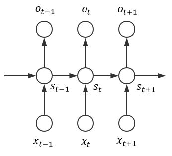</center>.

其中，$x_{t-1},x_t,x_{t+1}、o_{t-1},o_t,o_{t+1}、s_{t-1},s_t,s_{t+1}$可以分别视为第 $t-1,t,t+1$ “时刻”的输入、输出与 State。不难看出对于每一个时刻而言，朴素的 RNN 都可视为一个普通的神经网络：
<center>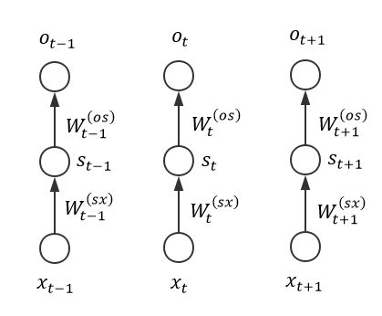</center>.

其中，完全可以视每一个“ $x_i\rightarrow s_i\rightarrow o_i,(i=...,t-1,t,t+1,...)$ ”结构为一个神经网络。再考虑到 **State 的传递**：
<center>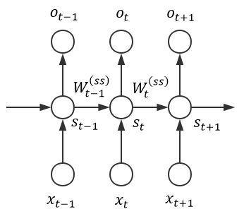</center>.

亦即 $s_t=W_t^{(sx)}x_t+W^{(ss)}_{t-1}s_{t-1} $，那么各个分量的值就很容易求出来了（以t时刻为例）：

$$o_{t} = W_{t}^{\left( \text{os} \right)}s_{t} = W_{i}^{\left( \text{os} \right)}\left( W_{t}^{\left( \text{sx} \right)}x_{t} + W_{t - 1}^{\left( \text{ss} \right)}s_{t - 1} \right)$$

在实际应用中，会视情况决定各个 $W_{i}^{\left( os \right)}、W_{i}^{\left( sx \right)}$ 和$W_{i}^{\left( ss \right)}$ 之间的关系 $（i = 1,...,t,\ldots）$。一种**朴素而自然的方法就是令它们都相等**：
<center>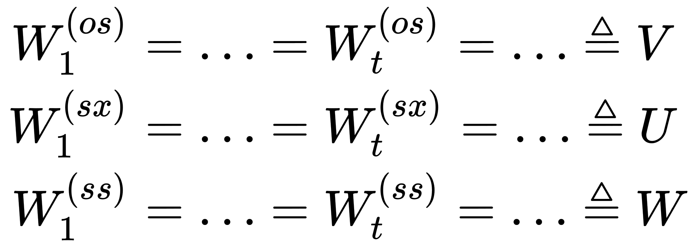</center>.

此时有

$$o_{i} = Vs_{i} = V\left( Ux_{i} + Ws_{i - 1} \right),\ \ i = 1,...,t,\ldots$$

且一般认为

$$s_{0} = \mathbf{0 =}\left( 0,0,\ldots,0 \right)^{T}$$

注意：RNN的传统定义认为上面那些图所示的 State 的传递是由一个“循环”的神经网络“展开”后得到的：
<center></center>.

这样的话各个 $W_{i}^{\left( {os} \right)}、W_{i}^{\left( {sx} \right)}和W_{i}^{\left( ss \right)} $之间天然就应该相等；但个人认为 **State 的通信才是 RNN 最为关键之处**（虽然这个认为也没啥根据就是了……），所以用了种更为一般的叙述形式。虽然传统的定义方式有着诸多好处（比如减少了参数量等），但它毕竟降低了结构的“自由度”

我们知道 NN 中有激活函数和变换函数的概念，将它应用到RNN中是非常自然的（**视 s 为隐藏层、o 为输出层即可**）：

$$s_{t} = \phi_{t}^{\left( {sx} \right)}\left( Ws_{t - 1} + Ux_{t} \right)$$

$$o_{i} = \phi_{i}^{\left( {os} \right)}\left( Vs_{i} \right) = \phi_{i}^{\left( {os} \right)}\left( V\phi_{i}^{\left( {sx} \right)}\left( Ws_{i - 1} + Ux_{i} \right) \right),\ \ i = 1,...,t,\ldots$$

其中，各个 $\phi_{i}^{\left( {os} \right)}、\phi_{i}^{\left( {sx} \right)} $ **每一步通常都会取为相等的函数**：

$$\phi_{1}^{\left( {os} \right)} = \ldots = \phi_{t}^{\left( {os} \right)} = \ldots = f$$

$$\phi_{1}^{\left( {sx} \right)} = \ldots = \phi_{t}^{\left( {sx} \right)} = \ldots = g$$

那么最后就能得到等式：

$$o_{i} = f\left( Vs_{i} \right) = f\left( \text{Vg}\left( Ws_{i - 1} + Ux_{i} \right) \right),\ \ i = 1,...,t,\ldots$$

此即朴素 RNN 的“前向传导算法”。举一个简单的例子：假设现在U,V是单位阵，W是单位阵的两倍，输入序列为：

$$\left( 1,0,0,\ldots,0 \right)^{T} \rightarrow \left( 0,1,0,\ldots,0 \right)^{T} \rightarrow \left( 0,0,1,\ldots,0 \right)^{T} \rightarrow \ldots \rightarrow \left( 0,0,0,\ldots,1 \right)^{T}$$

亦即输入矩阵也是单位阵。为方便讨论，我们不使用激活函数和变换函数，此时易知：
<center>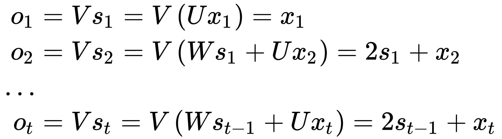</center>.

亦即输出序列为：
<center>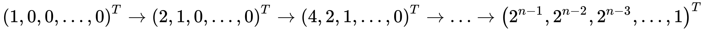</center>.

其中 $n$ 为输入数据的维度

###2、RNN的结构
上一节我们叙述了一种最朴素的 RNN 的结构，这一节我们将会介绍一些 RNN 中经常会用到的、相对而言不太平凡的结构。不过虽然在形式上有所改变，但它们的思想内核都是一致的，相应的“前向传导算法”也都相差不多

首先是输入与输出的对应关系。在上一节中，不难发现我们每接受一个输入、就会产生一个输出（这种结构叫“One to One”）。这其实并不是一个必然的对应关系，最简单的例子就是情感分析：我们只有在接受完某个段落的所有单词后，才会产生一个输出，此时的模型输入与输出的对应关系当如下图所示（这种结构叫“Many to One”）：
<center>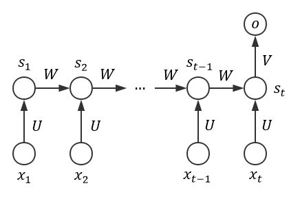</center>.

其中 $x_{1},x_{2},\ldots,x_{t}$ 表示句子中的 $t$ 个词，$o$ 代表最终输出的情感标签。不难得知此时的“前向传导算法”即为（简单起见，暂时不考虑激活函数和变换函数）：
<center>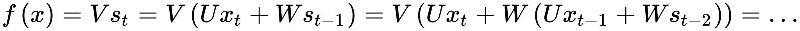</center>.

类似的，我们完全可以根据具体的应用场景提出“One to Many”、“Many to Many”等结构：
<center>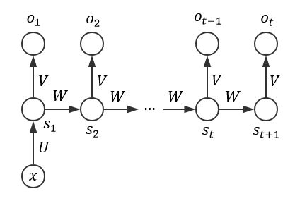</center>.
<center>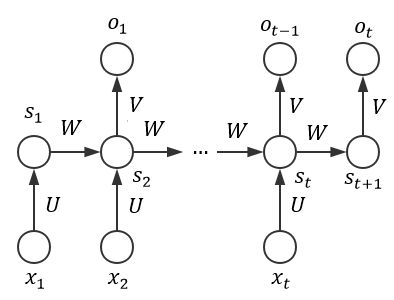</center>.

它们的“前向传导算法”都是类似的，这里就不再赘述,目前为止讨论过的 RNN 的 **State 的传递都是相当朴素的线性传递**，那么是否能改进这种传递方式呢？答案自然是肯定的。接下来我们就介绍一些异于普通线性传递的循环结构，在后文介绍 LSTMs 时则会介绍如何针对传递本身进行改进

**线性传递虽然确实能够利用上“历史信息”，但它却无法利用上“未来的信息”**。以翻译为例，我们常常会需要“联系上下文”来得出某句话的含义，**线性传递允许我们“联系上文”、但“联系下文”却无法做到**。针对这一点，Bidirectional RNN（可译为“双向 RNN”）应运而生：
<center>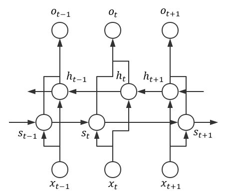</center>.

这种 RNN 的“前向传导算法”会稍微复杂一点，但内核是没有改变的。以 $t$ 时刻为例：
<center>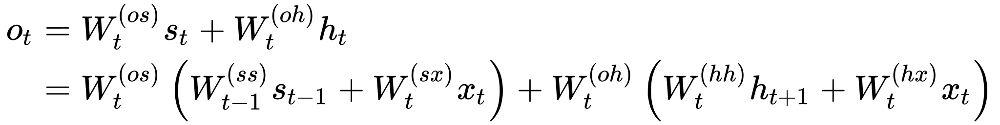</center>.

虽说双向RNN比较好地解决了“过去”与“未来”相结合的问题，但不难看出它和我们说过的所有 RNN 都有一个**共同的“缺点”——看上去太“浅”了（只有一层 State 隐藏层）**。由 NN 和 CNN 的相关讨论可知，更深的网络结构通常能带来更好的性能，那么是否能将 RNN 变得更深呢？答案同样是肯定的。不过实践证明，更深的 RNN 在带来更强的学习能力的同时，往往也需要多得多的训练数据来支撑，在这一点上 RNN 并不能“免俗”

深层 RNN 的提法有许多种，这里仅展示其中比较自然的一个：
<center>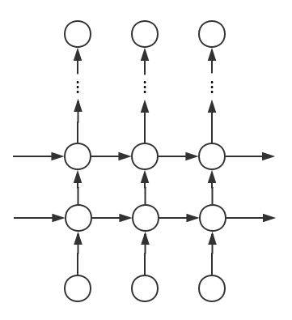</center>.

**注意：双向 RNN 的思想可以自然地移植到该 Deep RNN 上，由此得到的结构即为 Deep Bidirectional RNN（可译为“深层双向 RNN”)**

###3、RNN的训练
至今我们讨论并计算过许多次 RNN 的输出，但还没有提及如何进行 RNN 的训练。事实上与 NN、CNN 类似，RNN 在利用“前向传导算法”计算输出的同时，也是通过反向传播算法来进行训练的。本节将会进行相应的推导，并叙述 RNN 训练中可能会遇到的两个问题——梯度消失和梯度爆炸

与 NN 和 CNN 相比，**RNN 的 BP 算法最大的不同在于 State 之间的通信**。不过这一点反映在数学公式上也只是在应用链式法则时多出一项而已，所以如果能够理解 NN 的 BP 算法的话，推导出 RNN 的 BP 算法并非难事。不过相对而言这部分还是比较繁琐的，所以我打算单独开一个章节来讲，彼时我们会回顾本章所说的“前向传导算法”，然后在说完 BPTT（亦即 RNN 的 BP）后、会给一个朴素的 Numpy 实现，这里就先按下不表

###4、LSTMs
LSTMs 全称是 Long Short Term Memory networks，它是一个相当有趣、强大的 RNN 结构，已被广泛地应用在诸多的实际问题中。虽说 LSTMs 有着不少的变种，不过它们的**核心思想都在于改良 State 的传递过程**，所以本节将只会介绍一种经典有效的 LSTMs 结构并希望能够通过它来将 LSTMs 的内核阐述清楚

目前为止讲过的 RNN 网络的 State 之间的通信都是**朴素的线性传递**，具体而言：
+ State 本身只是个单一的向量

+ State 之间的通信仅仅是通过矩阵进行线性变换

不难看出，如此单薄的结构是无法达到足够的表现能力的。不过由于 RNN 结构的可扩展性很强，所以我们完全可以比较轻易地对它进行各种改良。比如说对于第一条来说，我们完全可以把 **State 看作是一个单元（cell）**，这个单元中可以仅包含单一的向量、也可以包含诸多错综复杂的东西：
<center>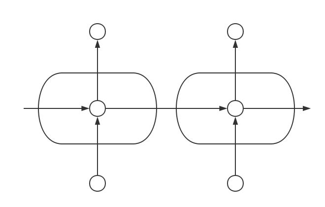</center>.

在把 **State 视为 cell 后**，我们就可以在 **cell** 中任性地设计各种结构以 **改进 State** 了：
<center>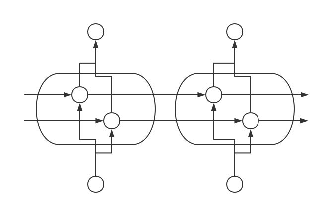</center>.

可以看出，此时我们（通过定制 cell）获得了 **“定制”State 的能力**；而事实上 LSTMs 往简单里说的话，无非就是定制了一种比较厉害的 cell 而已。比如说，一个经典的 LSTMs 的 cell 是长这样的：
<center></center>.

其中，圆圈代表着层结构、小正方形则代表着代数运算，$\phi_{1}、\phi_{2}$ 则分别代表着 $Sigmoid$ 函数和  $Tanh$ 函数。虽说看上去相当的复杂，不过只要一步一步地分析其思想和结果，就会发现理解它其实并不是特别困难

首先可以看到的是，相比起朴素的线性传递，LSTMs 的 **cell 的传递过程要更为复杂**、且**时间通道**也从原来的一条变为了两条。有趣的是，在 LSTMs cell 中位于上方的时间通道（ $h^{\left( {old} \right)} \rightarrow h^{\left( {new} \right)}$ ）里**仅包含了两个代数运算而没有包含任意的层结构，这意味着它信息传递的方式会更为“直接”**。相应的“前向传导算法”是平凡的（其中 $r_{1}、r_{2}$ 留待后文讨论）（注：统一使用“*”表示 element wise 乘法，使用“ $\times$ ”表示矩阵乘法）：
$$h^{\left( {new} \right)} = h^{\left( {old} \right)}*r_1+r_2$$

而位于下方的时间通道（ $s^{\left( {old} \right)} \rightarrow s^{\left( {new} \right)}$ ）则运用了大量的层结构。在 LSTMs 中，我们通常称这些层结构为“门（Gates）”，它拥有着很好的直观（以自然语言处理问题为例）：
+ 我们人类在处理自然语言问题时，通常会“有选择”地“接受”或“遗忘”语句中的信息，传统的 RNN 没有类似的机制，LSTMs 则通过 Gates 来模拟相应的过程

+ 具体而言，我们知道 $Sigmoid$ 函数取值区间为 0 到 1，那么当 $Sigmoid$ 对应的层结构输出 0 时，就对应着“遗忘”这个过程；当输出 1 时，自然就对应着“接受”这个过程。事实上这也是 Sigmoid 层叫“门”的原因——它能决定“放哪些数据进来”和决定“不让哪些数据通过”.

可以看到下方的时间通道中有三个 $Sigmoid$ 门 和一个 $Tanh$ 门 ，它们除了和输入直接相连之外，还连接着由上一个 $cell$ 带来的、下方的时间通道的信息。下面就从左往右地看一下各个 Gate 的表现（**注意：不少人认为只有 Sigmoid 层才叫 Gate，不过笔者认为统一称谓会更方便讨论**）：

+ 最左边的 Sigmoid Gate 通常被称为“遗忘门（**Forget Gate**）”，它对应的“前向传导算法”为：$r_{1} = \phi_{1}\left( W_{1} \times x^{*} \right)$ ，其中我们用 $x^* \triangleq \left[x,s^{(old)}\right]$ 表示将输入样本x和下方时间通道信息 $s^{(old)}$ “联接（Concatenate）”起来。比如，若

<center>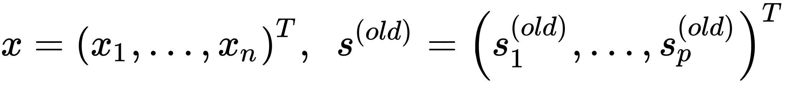</center>.
<center>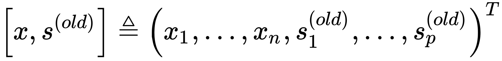</center>.

+ 第二个 Sigmoid Gate 通常被称为“输入门（Input Gate）”，第三个 Tanh Gate 则允许网络结构“驳回”历史信息（因为 Tanh 的函数区间为到[-1,1]）。它们对应的“前向传导算法”为：
<center>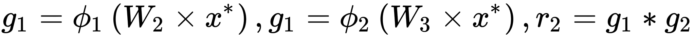</center>.

+ 第四个 Sigmoid Gate 通常被称为“输出门（Output Gate）”，它为输出和传向下一个 cell 的下方通道信息作出了贡献。对应的“前向传导算法”为：$g_3 = \phi_1(W_4\times x^*)$

+ 综上即可算出：$o = s^{(new)} = \phi_2\left(h^{(new)}\right)*g_3$

以上就是该经典 LSTMs 的“前向传导算法”的全部细节，下面说一些注意事项与个人理解：

+ 下方时间通道中，每一个 Gate 都同时连接着输入和历史信息，这意味着**每个 cell 都能有将历史信息进行复杂整合的能力**

+ 每个 Gate 对应的权值矩阵是不同的（ $W_{1}\sim W_{4}$ ），切勿以为它们会“共享权值”,**内部权值不共享**

+ 每个 Gate 的“职能”也是不同的（至少我们期望他们的职能不同），具体而言：
  + 遗忘门控制着时间通道信息的遗忘程度

  + 输入门控制着当前输入和下方通道信息对上方通道信息的影响

  + 输出门控制着当前输入和通道信息对输出和下方通道信息的影响
  **注意：尽管如此，各个 Gate 的职能仍然或多或少地有重叠，所以适当地进行结构的删减在某些场合下是合理的**

+ 上方时间通道信息可视为“历史信息”与“样本信息”的某种组合

+ 每一时刻的输出和相应的下方时间通道信息是一致的

以上我们就大概地过了一遍 RNN 的主要内容，我会在后续章节中说明如何利用 Tensorflow 来实现 LSTMs 的 cell 并做好封装，同时我们会利用这个封装来验证一些直观上的认知

###5、RNN 的“前向传导算法”实现
在说明如何进行训练之前，我们先来回顾一下 RNN 的“前向传导算法。在前面曾经给过一个没有激活函数和变换函数的公式：
<center></center>.

在实现层面来说，这就是一个循环的事儿，所以代码写起来会比较简单：
```python
import numpy as np

class RNN1:
    def __init__(self, u, v, w):
        self._u, self._v, self._w = np.asarray(u), np.asarray(v), np.asarray(w)
        self._states = None

    # 激活函数
    def activate(self, x):
        return x

    # 变换函数
    def transform(self, x):
        return x

    def run(self, x):
        output = []
        x = np.atleast_2d(x)
        # 初始化 States 矩阵为零矩阵
        # 之所以把所有 States 记下来、是因为训练时（BPTT 算法）要用到
        self._states = np.zeros([len(x)+1, self._u.shape[0]])
        for t, xt in enumerate(x):
            # 对着公式敲代码即可 ( σ'ω')σ
            self._states[t] = self.activate(
                self._u.dot(xt) + self._w.dot(self._states[t-1])
            )
            output.append(self.transform(
                self._v.dot(self._states[t]))
            )
        return np.array(output)

```
可以用上一章说过的那个小栗子来测试一下：
+ 假设现在 $U,V$ 是单位阵，$W$ 是单位阵的两倍

+ 假设输入序列为：
$$\left( 1,0,0,\ldots,0 \right)^{T} \rightarrow \left( 0,1,0,\ldots,0 \right)^{T} \rightarrow \left( 0,0,1,\ldots,0 \right)^{T} \rightarrow \ldots \rightarrow \left( 0,0,0,\ldots,1 \right)^{T}$$

对应的测试代码如下：
```python
n_sample = 5
rnn = RNN1(np.eye(n_sample), np.eye(n_sample), np.eye(n_sample) * 2)
print(rnn.run(np.eye(n_sample)))
```
程序输出为:
<center></center>.

这和我们上面推出的理论值是一致的

###6、RNN 的“反向传播算法”
简洁起见，我们采用第一张图所示的那个朴素网络结构：
<center></center>.

然后做出如下符号约定：
+ 取 $\phi$ 作为隐藏层的激活函数

+ 取 $\varphi$ 作为输出层的变换函数

+ 取 $L_{t} = L_{t}\left( o_{t},y_{t} \right)$ 作为模型的损失函数，其中标签 $y_{t}$ 是一个 one-hot 向量；由于 RNN 处理的通常是序列数据、所以在接受完序列中所有样本后再统一计算损失是合理的，此时模型的总损失可以表示为（假设输入序列长度为n）： $L = \sum_{t = 1}^{n}L_{t}$

为了更清晰地表明各个配置，我们可以整理出如下图所示的结构：
<center>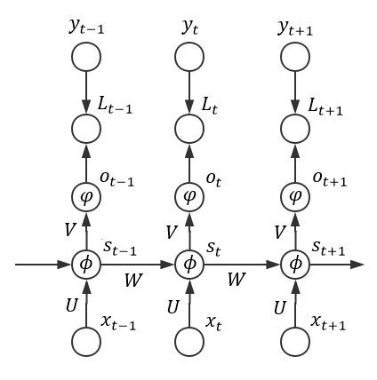</center>.

易知 $o_{t} = \varphi\left( \text{Vs}_{t} \right) = \varphi\left( \text{Vϕ}\left( Ux_{t} + Ws_{t - 1} \right) \right)$ ，其中 $s_{0} = \mathbf{0 =}\left( 0,0,\ldots,0 \right)^{T}$ 。令：
$$o_{t}^{*} = \text{Vs}_{t},\ \ s_{t}^{*} = Ux_{t} + Ws_{t - 1}$$

则有：
$$o_{t} = \varphi\left( o_{t}^{*} \right),\ \ s_{t} = \phi(s_{t}^{*})$$
从而（注：统一使用“*”表示 element wise 乘法，使用“$\times$”表示矩阵乘法）：

$$\frac{\partial L_{t}}{\partial o_{t}^{*}} = \frac{\partial L_{t}}{\partial o_{t}}*\frac{\partial o_{t}}{\partial o_{t}^{*}} = \frac{\partial L_{t}}{\partial o_{t}}*\varphi^{'}\left( o_{t}^{*} \right)$$

$$\frac{\partial L_{t}}{\partial V} = \frac{\partial L_{t}}{\partial Vs_{t}} \times \frac{\partial Vs_{t}}{\partial V} = \left( \frac{\partial L_{t}}{\partial o_{t}}*\varphi^{'}\left( o_{t}^{*} \right) \right) \times s_{t}^{T}$$

可见对矩阵V的分析过程即为**普通的反向传播算法**，相对而言比较平凡。由 $L = \sum_{t = 1}^{n}L_{t}$ 可知，它的总梯度可以表示为：

$$\frac{\partial L}{\partial V} = \sum_{t = 1}^{n}{\left( \frac{\partial L_{t}}{\partial o_{t}}*\varphi^{'}\left( o_{t}^{*} \right) \right) \times s_{t}^{T}}$$

而事实上，RNN 的 BP 算法的主要难点在于它 State 之间的通信，亦即梯度除了按照空间结构传播（$o_{t} \rightarrow s_{t} \rightarrow x_{t}$）以外，还得沿着时间通道传播（$s_{t} \rightarrow s_{t - 1} \rightarrow \ldots \rightarrow s_{1}$），这导致我们比较难将相应 RNN 的 BP 算法写成一个统一的形式（回想之前的“前向传导算法”）。为此，我们可以采用“循环”的方法来计算各个梯度

由于是反向传播算法，所以t应从n开始降序循环至 1，在此期间（若需要初始化、则初始化为 0 向量或 0 矩阵）：

计算时间通道上的“局部梯度” ：
$$\begin{align} \frac{\partial L_{t}}{\partial s_{t}^{*}} &= \frac{\partial s_{t}}{\partial s_{t}^{*}}*\left( \frac{\partial s_{t}^{T}V^{T}}{\partial s_{t}} \times \frac{\partial L_{t}}{\partial Vs_{t}} \right) = \phi'(s_t^*)*\left[V^{T} \times \left( \frac{\partial L_{t}}{\partial o_{t}}*\varphi^{'}\left( o_{t}^{*} \right) \right)\right] \\ \frac{\partial L_{t}}{\partial s_{k - 1}^{*}} &= \frac{\partial s_{k}^{*}}{\partial s_{k - 1}^{*}} \times \frac{\partial L_{t}}{\partial s_{k}^{*}} = \phi^{'}\left( s_{k - 1}^{*} \right) * \left( W^{T} \times \frac{\partial L_{t}}{\partial s_{k}^{*}} \right),\ \ (k = 1,\ldots,t) \end{align}$$
利用时间通道上的“局部梯度”计算U和W的梯度：
$$\begin{align} \frac{\partial L_{t}}{\partial U} &= \sum_{k = 1}^{t}{\frac{\partial L_{t}}{\partial s_{k}^{*}} \times \frac{\partial s_{k}^{*}}{\partial U}} = \sum_{k = 1}^{t}{\frac{\partial L_{t}}{\partial s_{k}^{*}} \times x_{k}^{T}} \\ \frac{\partial L_{t}}{\partial W} &= \sum_{k = 1}^{t}{\frac{\partial L_{t}}{\partial s_{k}^{*}} \times \frac{\partial s_{k}^{*}}{\partial W}} = \sum_{k = 1}^{t}{\frac{\partial L_{t}}{\partial s_{k}^{*}} \times s_{k - 1}^{T}} \end{align}$$
以上即为 RNN 反向传播算法的所有推导，它比 NN 的 BP 算法要繁复不少。事实上，像这种需要把梯度沿时间通道传播的 BP 算法是有一个专门的名词来描述的——Back Propagation Through Time（常简称为 BPTT，可译为“时序反向传播算法”）

不妨举一个具体的栗子来加深理解，假设：
+ 激活函数 $\phi$ 为 Sigmoid 函数

+ 变换函数 $\varphi$为 Softmax 函数

+ 损失函数 $L_{t}$为 Cross Entropy：
$$L_{t}\left( o_{t},y_{t} \right) = -\left[y_{t}\log o_{t}+(1-y_t)\log(1-o_t)\right]$$

由 NN 处的讨论可知这是一个非常经典、有效的配置，其中：

$$\frac{\partial L_{t}}{\partial o_{t}}*\varphi^{'}\left( o_{t}^{*} \right) = o_{t} - y_{t}$$

$$\phi^{'}\left( s_{t}^{*} \right) = \phi\left( s_{t}^{*} \right)*\left( 1 - \phi\left( s_{t}^{*} \right) \right) = s_{t}*(1 - s_{t})$$

从而

$$\frac{\partial L}{\partial V} = \sum_{t = 1}^{n}{\left( o_{t} - y_{t} \right) \times s_{t}^{T}}$$

且t从n开始降序循环至 1 的期间中，各个“局部梯度”为：

$$\begin{align} \frac{\partial L_{t}}{\partial s_{t}^{*}} &= V^{T} \times \left( \frac{\partial L_{t}}{\partial o_{t}}*\varphi^{'}\left( o_{t}^{*} \right) \right) = \left[s_t*(1-s_t)\right]*\left[ V^{T} \times (o_{t} - y_{t})\right] \\ \frac{\partial L_{t}}{\partial s_{k - 1}^{*}} &= W^{T} \times \left( \frac{\partial L_{t}}{\partial s_{k}^{*}}*\phi^{'}\left( s_{k - 1}^{*} \right) \right) = [s_{k - 1}*\left( 1 - s_{k - 1} \right)] * \left(W^{T} \times \frac{\partial L_{t}}{\partial s_{k}^{*}} \right),\ \ (k = 1,\ldots,t) \end{align}$$

由此可算出如下相应梯度：

$$\begin{align} \frac{\partial L_{t}}{\partial U} &= \sum_{k = 1}^{t}{\frac{\partial L_{t}}{\partial s_{k}^{*}} \times x_{k}^{T}} \\ \frac{\partial L_{t}}{\partial W} &= \sum_{k = 1}^{t}{\frac{\partial L_{t}}{\partial s_{k}^{*}} \times s_{k - 1}^{T}} \end{align}$$

可以看到形式相当简洁，所以我们完全可以比较轻易地写出相应实现：
```python
class RNN2(RNN1):
    # 定义 Sigmoid 激活函数
    def activate(self, x):
        return 1 / (1 + np.exp(-x))

    # 定义 Softmax 变换函数
    def transform(self, x):
        safe_exp = np.exp(x - np.max(x))
        return safe_exp / np.sum(safe_exp)

    def bptt(self, x, y):
        x, y, n = np.asarray(x), np.asarray(y), len(y)
        # 获得各个输出，同时计算好各个 State
        o = self.run(x)
        # 照着公式敲即可 ( σ'ω')σ
        dis = o - y
        dv = dis.T.dot(self._states[:-1])
        du = np.zeros_like(self._u)
        dw = np.zeros_like(self._w)
        for t in range(n-1, -1, -1):
            st = self._states[t]
            ds = self._v.T.dot(dis[t]) * st * (1 - st)
            # 这里额外设定了最多往回看 10 步
            for bptt_step in range(t, max(-1, t-10), -1):
                du += np.outer(ds, x[bptt_step])
                dw += np.outer(ds, self._states[bptt_step-1])
                st = self._states[bptt_step-1]
                ds = self._w.T.dot(ds) * st * (1 - st)
        return du, dv, dw

    def loss(self, x, y):
        o = self.run(x)
        return np.sum(
            -y * np.log(np.maximum(o, 1e-12)) -
            (1 - y) * np.log(np.maximum(1 - o, 1e-12))
        )
```
注意我们设定了在每次沿时间通道反向传播时、最多往回看 10 步，这是因为我们实现的这种朴素 RNN 的梯度存在着一些不良性质，我们在下一节中马上就会进行相关的说明

###7、指数级梯度所带来的问题
注意到由于 RNN 需要沿时间通道进行反向传播，其相应的“局部梯度”为：

$$\frac{\partial L_{t}}{\partial s_{k - 1}^{*}} = [s_{k - 1}*\left( 1 - s_{k - 1} \right)] * \left(W^{T} \times \frac{\partial L_{t}}{\partial s_{k}^{*}} \right)$$

注意到式中的每个局部梯度 $\frac{\partial L_{t}}{\partial s_{k}^{*}}$ 都会“携带”一个 $W$ 矩阵和一个 $s_{k}$ 的 $ Sigmoid$ 系激活函数所对应的梯度 $s_{k}*\left( 1 - s_{k} \right)$ ，这意味着局部梯度受 $W$ 和各个激活函数的梯度的影响是指数级的。姑且不考虑 $W$ 而单看激活函数的梯度，回忆我们之前在 NN 处讲过的梯度问题，这里的这种指数级梯度的表现和彼时深层网络梯度的表现是几乎同理的（事实上 RNN 的时间通道长得确实很像一个深层网络）——当输入趋近于两端时，激活函数的梯度会随着传播而迅速弥散，这就是 RNN 中所谓的“梯度消失（The Vanishing Gradient）”问题。是故我们在上一小节实现 RNN 时规定在沿时间通道反向传播时最多只往回看 10 步，这是因为再往下看也没有太大意义了（可以大概地类比于多于 10 层的、以 $Sigmoid$ 系函数作为激活函数的神经网络）（以下纯属开脑洞：这么说的话是不是能在时间通道里面传递残差然后弄一个 Residual RNN 呢……）

这当然是非常令人沮丧的结果，要知道 RNN 的一大好处就在于它能利用上历史的信息，然而梯度消失却告诉我们 RNN 能够利用的历史信息十分有限。所以针对该问题作出优化是非常有必要的，解决方案大体上分两种：

+ 选用更好的激活函数

+ 改进 State 的传递方式

第二点是 LSTMs 等特殊 RNN 的做法，这里就主要说说第一点——如何选用更好的激活函数。由 NN、CNN 处的讨论不难想到，用 ReLU 作为激活函数很有可能是个不错的选择；不过由于梯度是指数级的这一点不会改变，此时我们可能就会面临另一个问题：“梯度爆炸（The Exploding Gradient）”（**注：不是说 Sigmoid 系函数就不会引发梯度爆炸、因为当矩阵W的元素很大时同样会爆炸，只是相对而言更容易引发梯度消失而已**）。不过相比起梯度消失问题来讲，梯度爆炸相对而言要显得更“友好”一些，这是因为：

+ 梯度爆炸一旦发生，是会迅速反映到结果上来的（比如一堆数变成了 NaN）

+ 梯度爆炸可以通过简单的设定阈值来得到改善

而梯度消失相比之下，既难以直接从结果看出、又没有特别平凡的解决方案。现有的较常用的方法为**调整参数的初值、进行适当的正则化、使用 ReLU（需要小心梯度爆炸）等等**。关于为何 LSTMs 能够解决梯度消失，**直观上来说就是上方时间通道是简单的线性组合、从而使得梯度不再是指数级的。**以上就大致地说了说 RNN 的 BPTT 算法，主要要注意的其实就是时间通道上的 BP 算法。如果把时间通道看成一个神经网络的话，运用局部梯度来反向传播其实相当自然
