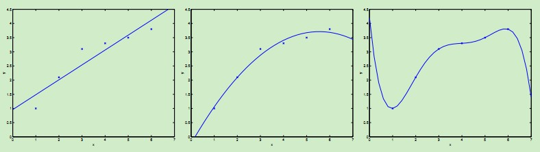
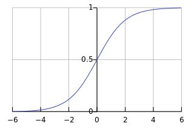

##
常见的回归技术

###1、什么是回归分析
回归分析是研究自变量和因变量之间关系的一种**预测模型技术**。这些技术应用于预测，时间序列模型和找到变量之间关系。例如可以通过回归去研究超速与交通事故发生次数的关系。回归问题的目标是给定 $D$ 维输入变量 $x$，并且每一个输入矢量 $x$ 都有对应的值 $y$，要求对于新来的数据预测它对应的连续的目标值 $t$。我么就可以将拟合的曲线上返回对应的点从而达到预测的目的。
+ 如果要预测的值是**连续的**比如交通事故发生次数，那么就属于**回归**问题；
+ 如果要预测的值是**离散的**即一个个标签，那么就属于**分类**问题。

###2、我们为什么要使用回归分析
这里有一些使用回归分析的好处：
+ 它指示出**自变量与因变量**之间的**显著关系**
+ 它指示出**多个自变量对因变量的影响**
+ 回归分析允许我们**比较不同尺度的变量**，例如：价格改变的影响和宣传活动的次数

这些好处可以帮助市场研究者／数据分析师去除和评价用于建立预测模型里面的变量。
###3、回归有哪些类型
+ 回归分析按照涉及的**自变量的多少**，分为一元回归和多元回归分析

+ 按照因**变量的多少**，可分为简单回归分析和多重回归分析

+ 按照**自变量和因变量之间的关系类型**，可分为线性回归分析和非线性回归分析

+ 如果在回归分析中，只包括一个自变量和一个因变量，且二者的关系可用一条直线近似表示，这种回归分析称为一元线性回归分析

+ 如果回归分析中包括两个或两个以上的自变量，且**自变量之间存在线性相关**，则称为**多重线性回归分析**

###4、线性回归
线性回归模型假设**输入特征和对应的结果**满足**线性关系**。在模型中，**因变量是连续型的，自变量可以使连续型或离散型的，回归线是线性的**。线性回归用最适直线(回归线)去建立因变量 $Y$ 和一个或多个自变量 $X$ 之间的关系。可以用公式来表示:
$$h_\theta(x)=\theta_0+\theta_1x_1$$
其中 $\theta_1$ 表示回归线的斜率，$\theta_0$ 表示截距，简单线性回归与多元线性回归的差别在于：多元线性回归有多个(>1)自变量，而简单线性回归只有一个自变量。多元线性回归可以表示为：
$$h_\theta(x)=\sum_{i=0}^{n}\theta_ix_i=\theta^Tx$$
其中 $x_0=1，n$ 表示特征的个数，最后参数 $\theta$ 和 $x$ 都表示为向量。现在，给定一个训练集，我们应该怎么学习参数 $\theta$，从而达到比较好的拟合效果呢？一个直观的想法是使得预测值 $h(x)$ 尽可能接近 $y$，为了达到这个目的，我们对于每一个参数 $\theta$，定义一个代价函数用来描述  $h(x^{(i)})$ 与对应的 $y^{(i)}$ 的接近程度：
$$J(\theta)=\frac{1}{2}\sum_{i=1}^{m}(h_\theta(x^{(i)})-y^{(i)})^2$$
前面乘上的 $\frac{1}{2}$ 是为了求导的时候，使常数系数消失。于是我们的目标就变为了调整 $\theta$ 使得代价函数 $J(\theta)$ 取得最小值，方法有梯度下降法，最小二乘法等。

####4.1、梯度下降法（GD）
现在我们要调整 $\theta$ 使得 $J(\theta)$ 取得最小值，为了达到这个目的，我们可以对 $\theta$ 取一个随机初始值（随机初始化的目的是使对称失效），然后不断地迭代改变 $\theta$ 的值来使 $J(\theta)$ 减小，直到最终收敛取得一个 $\theta$ 值使得 $J(\theta)$ 最小。梯度下降法就采用这样的思想：对 $\theta$ 设定一个随机初值 $\theta_0$，然后迭代进行以下更新，直到收敛。这里的 $\alpha$ 称为学习率**learning rate(lr)**。

$$\begin{align*}
\theta_{j+1} &=\theta_j-\alpha\frac{\partial J(\theta)}{\partial\theta_j}\\
& =\theta_j-\alpha\frac{\partial \frac{1}{2}\sum_{i=1}^{m}(h_\theta(x^{(i)})-y^{(i)})^2}{\partial\theta_j}\\
& =\theta_j-\alpha\frac{\partial \frac{1}{2}\sum_{i=1}^{m}(\theta^Tx^{(i)}-y^{(i)})^2}{\partial\theta_j}\\
& =\theta_j-\alpha\sum_{i=1}^{m}(\theta^Tx^{(i)}-y^{(i)})\frac{\partial(\theta^Tx^{(i)}-y^{(i)})}{\partial \theta_j}\\
& =\theta_j-\alpha\sum_{i=1}^{m}(\theta^Tx^{(i)}-y^{(i)})\cdot x_j^{(i)}\\
& =\theta_j+\alpha\sum_{i=1}^{m}(y^{(i)}-h_\theta(x^{(i)}))\cdot x_j^{(i)}\\
\end{align*}$$

使用这种方法，由于在每一次迭代都考察训练集的**所有样本 **，而称为**批量梯度下降** batch gradient descent。如果每次不考虑所有样本，每次考虑单个样本来更新参数 $\theta$ 那么就称为随机梯度下降（SGD），比较这两种梯度下降算法，由于batch gradient descent在每一步都考虑全部数据集，因而复杂度比较高，随机梯度下降会比较快地收敛，而且在实际情况中两种梯度下降得到的最优解 $J(\theta)$ 一般会接近真实的最小值。所以对于较大的数据集，一般采用效率较高的随机梯度下降法。
####4.2、最小二乘法（LMS）
梯度下降算法给出了一种计算 $\theta$ 的方法，但是需要迭代的过程，比较费时而且不太直观。下面介绍的最小二乘法是一种直观的直接利用矩阵运算可以得到 $\theta$ 值的算法。但是这个方法需要满足一定的条件，首先 $Ax=b$ 必有最小二乘解，这是定理。其次，当 $A$  **列满秩**的时候，也就是未知数个数等于列的秩，就有唯一的最小二乘。这种情况在低维度下，计算非常快，但是如果在高维度计算就非常复杂了。最后最小二乘法的计算方法如下：
$$\theta=(X^TX)^{-1}X^Ty$$

####4.3、加权线性回归

最左边的图使用线性拟合 $y=\theta_0+\theta_1x$，但是可以看到数据点并不完全在一条直线上，因而拟合的效果并不好。如果我们加入 $x^2$ 项，得到 $y=\theta_0+\theta_1x+\theta_2x^2$，如中间图所示，该二次曲线可以更好的拟合数据点。我们继续加入更高次项，可以得到最右边图所示的拟合曲线，可以完美地拟合数据点，最右边的图中曲线为5阶多项式，可是我们都很清醒地知道这个曲线过于完美了，对于新来的数据可能预测效果并不会那么好。

对于最左边的曲线，我们称之为欠拟合--过小的特征集合使得模型过于简单不能很好地表达数据的结构，最右边的曲线我们称之为过拟合--过大的特征集合使得模型过于复杂。

正如上述例子表明，在学习过程中，**特征的选择**对于最终学习到的模型的性能有很大影响，于是选择用哪个特征，每个特征的重要性如何就产生了加权的线性回归。在传统的线性回归中，优化的误差函数是：
$$min\sum_{i=1}^{m}(y^{(i)}-\theta^Tx^{(i)})^2$$

加权之后的线性回归学习误差函数为：
$$min\sum_{i=1}^{m}w^{(i)}(y^{(i)}-\theta^Tx^{(i)})^2$$
$$w^{(i)}=exp(-\frac{(x^{(i)}-x)^2}{2\tau^2})$$
二者的区别就在于对不同的输入特征赋予了不同的非负值权重，权重越大，对于代价函数的影响越大，其中，$x$ 是要预测的特征，表示离 $x$ 越近的样本权重越大，越远的影响越小。

**线性回归主要特点**
+ 自变量与因变量之间必须要有**线性关系**。

+ **多重共线性、自相关和异方差**对多元线性回归的影响很大。

+ 线性回归**对异常值非常敏感**，其能严重影响回归线，最终影响预测值。

+ 在多元的自变量中，我们可以通过**前进法，后退法和逐步法**去选择最显著的自变量**(逐步回归会讲)**。

###5、逻辑回归(针对分类问题)
下面介绍一下logistic回归，虽然名曰回归，但实际上logistic回归用于**分类问题**。logistic回归实质上还是**线性回归模型**，只是在回归的连续值结果上**加了一层函数映射**，将特征线性求和，然后使用$g(z)$作映射，将连续值映射到离散值0/1上（对于**sigmoid函数**为0/1两类，而对于双曲正弦tanh函数为1/-1两类）。采用假设模型为(**使用sigmoid函数**)：
$$h_\theta(x)=g(\theta^Tx)=\frac{1}{1+e^{-\theta^Tx}}$$
$$sigmoid函数：g(z)=\frac{1}{1+e^{-z}}$$

其中当$z \to +\infty$ 时，$g(z)=1$，当 $z \to -\infty$ 时，$g(z)=0$，通过这个函数的映射，就可以达到分类的目的。对于逻辑回归模型，我们是怎么调节参数的呢？我们可以假设：
$$p(y=1|x;\theta)=h_\theta(x)$$
$$p(y=0|x;\theta)=1-h_\theta(x)$$
在逻辑回归中，是**两分类问题**，所以有：
$$p(y|x;\theta)=(h_\theta(x))^y\cdot(1-h_\theta(x))^{1-y}$$
于是得到似然估计为，要是似然估计概率最大：
$$\begin{align*}
L(\theta) &= p(y|x;\theta)\\
&= \prod_{i=1}^{m}p(y^{(i)}|x^{(i)};\theta)\\
&= \prod_{i=1}^{m}(h_\theta(x^{(i)}))^{y^{(i)}}\cdot(1-h_\theta(x^{(i)}))^{1-{y^{(i)}}}\\
\end{align*}$$
似然估计取对数可以更容易地求解:
$$\ell(\theta)=log L(\theta)=\sum_{i=1}^{m}[y^{(i)}log h(x^{(i)})+(1-y^{(i)})log(1-h(x^{(i)})]$$

接下来是 $\theta$ 的似然估计最大化，可以考虑上述的梯度下降法，于是得到：
$$\theta_{j+1}=\theta_j+\alpha(y^{(i)}-h_\theta(x^{(i)}))\cdot x_j^{(i)}$$

虽然这个更新规则类似于GD得到的公式，但是这两种是不同算法，因为这里的 $h_\theta(x^{(i)})$ 是一个关于 $\theta^Tx^{(i)}$的非线性函数。

**逻辑回归是针对二分类问题，softmax回归可以针对多分类**
逻辑回归是两类回归问题的算法，如果目标结果是多个离散值怎么办？Softmax回归模型就是解决这个问题的，Softmax回归模型是逻辑模型在多分类问题上的推广。在Softmax回归中，类标签 $y$ 可以去 $k$ 个不同的值（$k>2$）。因此对于$y^{(i)}$从属于$\{1,2,3···k\}$，函数形式和逻辑回归非常相似，如果种类数量变成了两类，那么就变成逻辑回归了。

现在，如果有一个k类分类的任务，我们可以选择Softmax回归，也可以选择k个独立的logistic回归分类器，应该如何选择呢？**(种类互斥就选择softmax回归，种类不互斥就选择逻辑回归)**

　　这一选择取决于这k个类别是否互斥，例如，如果有四个类别的电影，分别为：好莱坞电影、港台电影、日韩电影、大陆电影，需要对每一个训练的电影样本打上一个标签，那么此时应选择k = 4的Softmax回归。然而，如果四个电影类别如下：动作、喜剧、爱情、欧美，这些类别并不是互斥的，于是这种情况下使用4个logistic回归分类器比较合理。

**逻辑回归主要特征**
+ 在**分类问题**中使用的非常多。

+ 逻辑回归因其应用**非线性log转换方法**，使得其**不需要自变量与因变量之间有线性关系**。

+ 为防止过拟合和欠拟合，我们应该**确保每个变量是显著的**。应该使用**逐步回归方法**去估计逻辑回归。

+ **逻辑回归需要大样本量**，因为最大似然估计在**低样本量的情况下表现不好**。

+ **要求没有共线性**。

+ 如果因变量是序数型的，则称为序数型逻辑回归。

+ 如果因变量有多个，则称为多项逻辑回归。

###6、多项式回归（不同于多元回归）
如果一个回归，它的**自变量指数超过1**，则称为多项式回归。可以用公式表示：
$$y=a+bx^2+cx$$
在单因子（连续变量）试验中，当回归函数不能用直线来描述时，要考虑用非线性回归函数。 多项式回归属于非线性回归的一种。 这里指单因子多项式回归，即一元多项式回归。

一般非线性回归函数是未知的，或即使已知也未必可以用一个简单的函数变换转化为线性模型。这时，常用的做法是用因子的多项式。 如果从散点图观察到回归函数有一个“弯”，则可考虑用二次多项式；有两个弯则考虑用三次多项式；有三个弯则考虑用四次多项式，等等。

真实的回归函数未必就是某个次数的多项式，但只要拟合得好，用适当的多项式来近似真实的回归函数是可行的。

在这个回归技术中，需要拟合的线不是一条直线，而是一条曲线。多项式回归有个很重要的因素就是指数（degree）。如果我们发现数据的分布大致是一条曲线，那么很可能符合多项式回归，但是我们不知道degree是多少。所以我们只能一个个去试，直到找到最拟合分布的degree。这个过程我们可以交给数据科学软件完成。需要注意的是，如果degree选择过大的话可能会导致函数过于拟合， 意味着对数据或者函数未来的发展很难预测，也许指向不同的方向。

**误差和参数求解同线性回归**
误差使用误差平方和，参数使用梯度下降求解。

**多项式回归主要特点**
+ 很多情况下，我们为了降低误差，经常会抵制不了使用多项式回归的诱惑，但事实是，我们经常会造成过拟合。所以要经常的把数据可视化，观察数据与模型的拟合程度。

+ 特别是要看曲线的结尾部分，看它的形状和趋势是否有意义。高的多项式往往会产生特别古怪的预测值。

###7、逐步回归(需要先使用假设检验)
当我们要处理多个自变量时，我们就需要这个回归方法。在这个方法中选择变量都是通过自动过程实现的，不需要人的干预。

这个工程是通过观察统计值，比如判定系数，$t$值和最小信息准则等去筛选变量。逐步回归变量一般是基于特定的标准加入或移除变量来拟合回归模型。一些常用的逐步回归方法如下：
+ 标准逐步回归做两件事情。只要是需要每一步它都会添加或移除一些变量。

+ 前进法是开始于**最显著的变量**然后在模型中逐渐增加次显著变量。

+ 后退法是开始于所有变量，然后逐渐**移除一些不显著变量**。

+ 这个模型技术的目的是为了用**最少的变量去最大化模型的预测能力**。它也是一种**降维技术**。

###8、岭回归
当碰到数据有**多重共线性**时，我们就会用到岭回归。所谓多重共线性，简单的说就是**自变量之间有高度相关关系**。在多重共线性中，即使是**最小二乘法是无偏的**，它们的方差也会很大。通过在回归中加入一些偏差，岭回归就会**减少标准误差**。如果模型中的特征之间有相互关系，这样会增加模型的复杂程度，并且对整个模型的解释能力并没有提高，这时，我们就要进行特征选择。

岭回归是一种专用于**共线性数据分析的有偏估计回归方法**，实质上是一种**改良的最小二乘估计法**，通过放弃最小二乘法的无偏性，以损失部分信息、**降低精度为代价获得回归系数更为符合实际**、更可靠的回归方法，对病态数据的拟合要强于最小二乘法。

岭回归(Ridge Regression)是在平方误差的基础上增加正则项，是通过岭参数 $\lambda$ 去**解决多重共线性的问题**。看下面的公式：
$$\sum_{i=1}^{n}\left(y_i-\sum_{j=0}^{p}w_jx_{ij}\right)^2+\lambda\sum_{j=0}^{p}w_j^2$$
通过确定 $\lambda$ 的值可以使得在方差和偏差之间达到平衡：随着 $\lambda$ 的增大，模型方差减小而偏差增大。模型总的损失不会变化，方差指的是模型之间的差异，而偏差指的是模型预测值和数据之间的差异。我们需要找到方差和偏差的折中。
对 $w$ 求导，结果为：
$$2X^T(Y-xW)-2\lambda W$$
求最优值时，导数为0，可以求出 $w$ 的值：
$$\hat{w}=(X^TX+\lambda I)^{-1}X^{T}Y$$

**岭回归主要特点是**
+ 岭回归的假设与最小二乘法回归的假设相同除了假设正态性。

+ 它把系数的值收缩了，但是不会为0，主要指正则化。

+ 正则化方法是使用了 $l_2$ 正则。

###9、Lasso回归
和岭回归类似，Lasso(least Absolute Shrinkage and Selection Operator)也是通过惩罚其回归系数的绝对值。看下面的公式：
$$\sum_{i=1}^{n}\left(y_i-\sum_{j=0}^{p}w_jx_{ij}\right)^2+\lambda\sum_{j=0}^{p}|w_j|$$

Lasso回归和岭回归不同的是，Lasso回归在惩罚方程中用的是绝对值，而不是平方。这就使得惩罚后的值可能会变成0。Lasso回归使得一些系数变小，甚至还是一些绝对值较小的系数直接变为0，因此特别适用于**参数数目缩减与参数的选择**，因而用来**估计稀疏参数**的线性模型。

但是Lasso回归有一个很大的问题，导致我们需要把它单独拎出来讲，就是它的**损失函数不是连续可导的**，由于L1范数用的是绝对值之和，导致损失函数有不可导的点。也就是说，我们的最小二乘法，梯度下降法，牛顿法与拟牛顿法对它统统失效了。那我们怎么才能求有这个L1范数的损失函数极小值呢？

通常需要使用两种全新的求极值解法坐标轴下降法（coordinate descent）和最小角回归法（ Least Angle Regression， LARS）

####9.1、坐标下降法
坐标轴下降法和梯度下降法具有同样的思想，都是沿着某个方向不断迭代，但是梯度下降法是沿着当前点的负梯度方向进行参数更新，而坐标轴下降法是沿着坐标轴的方向。下面表示具体的更新过程：
+ 选取初始参数：
$$w^{(0)}=(w_1^{(0)},w_2^{(0)},...,w_n^{(0)})$$
+ 针对当前得到的参数进行迭代，假设已经求出第 $k-1$ 轮的参数，现在由求第 $k$ 轮参数，则：
$$\begin{align*}
w_1^{(k)} &=\mathop{\arg\min}_{w_1}J(w_1,w_2^{(k-1)},...,w_n^{(k-1)})\\
w_2^{(k)} &=\mathop{\arg\min}_{w_2}J(w_1^{(k)},w_2,...,w_n^{(k-1)})\\
w_n^{(k)} &=\mathop{\arg\min}_{w_n}J(w_1^{(k)},w_2^{(k)},...,w_n^{(k)})\\
\end{align*}$$
+ 通过以上步骤可以得到每轮的迭代结果，若 $w^{(k)}$ 相对于 $w^{(k-1)}$ 的变化很小，则停止迭代，否则，重复上面步骤

通过以上迭代过程可以看出，坐标下降的顺序是任意的，可以是从1到n的任意排列。可以在任何地方将单个的坐标替代成坐标块，关键在于一次一个地更新，所有的一起更新有可能会导致不收敛。
- 坐标轴下降法进行参数更新时，**每次总是固定另外n-1个值**，一个一个求，求另外一个的局部最优值，这样也避免了Lasso回归的损失函数不可导的问题。

- 坐标轴下降法每轮迭代都需要O(mn)的计算。（和梯度下降算法相同，n为样本数，m为系数向量的维度）

- 坐标轴下降法在每次迭代中在当前点处沿一个坐标方向进行一维搜索 ，固定其他的坐标方向，找到一个函数的局部极小值。而梯度下降总是沿着梯度的负方向求函数的局部最小值。

- 坐标轴下降优化方法是一种非梯度优化算法。在整个过程中依次循环使用不同的坐标方向进行迭代，一个周期的一维搜索迭代过程相当于一个梯度下降的迭代。

- 梯度下降是利用目标函数的导数来确定搜索方向的，该梯度方向可能不与任何坐标轴平行。而坐标轴下降法法是利用当前坐标方向进行搜索，不需要求目标函数的导数，只按照某一坐标方向进行搜索最小值。

**坐标轴下降法的数学依据为：**
对于一个可微凸函数 $f(w)$ ，其中 $w 为n \times 1$ 的向量，如果对于一个解 $w=(w_1,w_2,...,w_n)$，使得 $f(w)$ 在某个坐标轴上 $w_i(i=1,2,...,n)$ 都能达到最小值，则这个点就是全局最小点。

####9.2、最小角回归法
...比较复杂，没有看明白

**Lasso回归主要特点是**
+ 其假设与最小二乘回归相同除了正态性。

+ 其能把系数收缩到0，使得其能帮助特征选择。

+ 这个正则化方法为 $l_1$ 正则化。

+ 如果一组变量是**高度相关**的，lasso会**选择其中的一个**，然后把其他的都变为0

###10、ElasticNet回归
ElasticNet回归是Lasso回归和岭回归的组合。它会事先训练L1和L2作为惩罚项。当许多变量是相关的时候，Elastic-net是有用的。Lasso一般会随机选择其中一个，而Elastic-net则会选在两个。
$$\hat{\beta}=\mathop{\arg\min}_{\beta}(\|y-X\beta\|^2+\lambda_2\|\beta\|^2+\lambda_1\|\beta\|_1)$$
**ElasticNet回归的主要特征**
+ 在选择变量的数量上没有限制

+ 双重收缩对其有影响

###11、如何去选择回归模型
面对如此多的回归模型，最重要的是根据自变量因变量的类型、数据的维数和其他数据的重要特征去选择最合适的方法。以下是我们选择正确回归模型时要主要考虑的因素：

1.数据探索是建立预测模型不可或缺的部分。它应该是在选择正确模型之前要做的。

2.为了比较不同模型的拟合程度，我们可以分析不同的度量，比如统计显著性参数、R方、调整R方、最小信息标准、BIC和误差准则。另一个是Mallow‘s Cp准则。

3.交叉验证是验证预测模型最好的方法。你把你的数据集分成两组：一组用于训练，一组用于验证。

4.如果你的数据集有许多让你困惑的变量，你就不应该用自动模型选择方法，因为你不想把这些变量放在模型当中。

5.不强大的模型往往容易建立，而强大的模型很难建立。

6.回归**正则方法**在高维度和多重共线性的情况下表现的很好。
