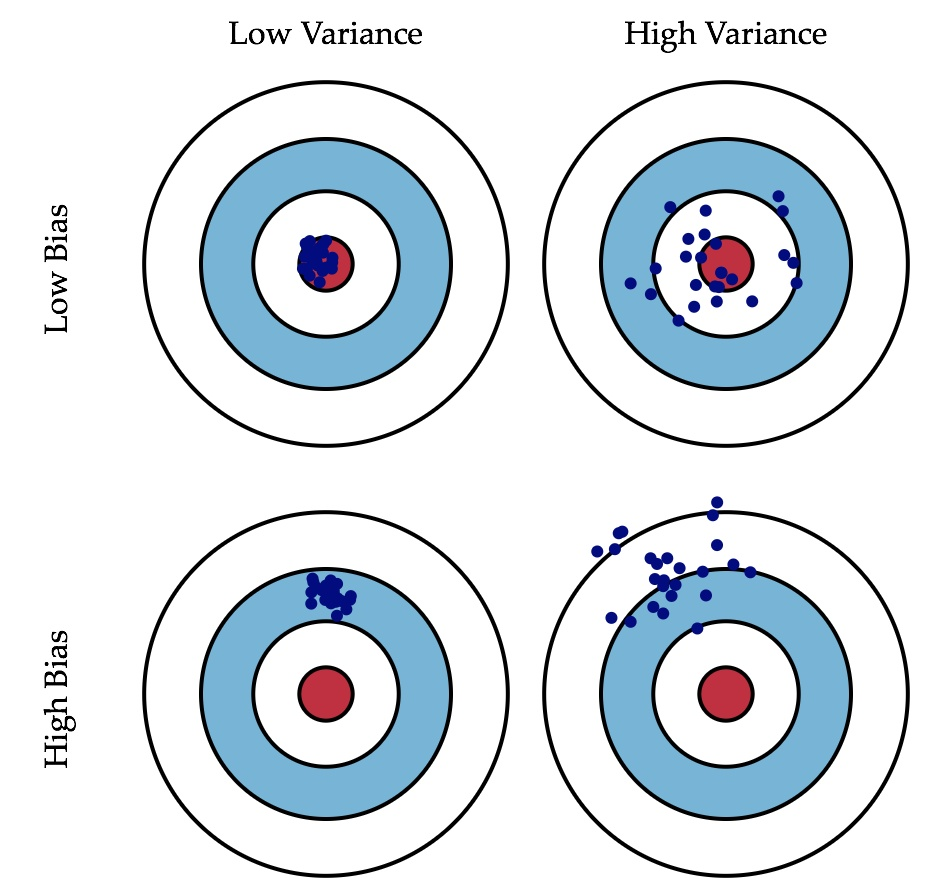

###
常见机器学习面试题

####1、有监督学习和无监督学习的区别
+ 有监督学习：对具有标记的训练样本进行学习，以尽可能对训练样本集外的数据进行分类预测。（LR、SVM、KNN、BP、RF、GBDT、决策树、朴素贝叶斯）
+ 无监督学习：对未标记的样本进行训练学习，比发现这些样本中的结构知识。(KMeans、DL、EM、PCA、GMM)

####2、正则化
正则化是针对过拟合而提出的，以为在求解模型最优的是一般优化最小的经验风险，现在在该经验风险上加入模型复杂度这一项（正则化项是模型参数向量的范数），并使用一个rate比率来权衡模型复杂度与以往经验风险的权重，如果模型复杂度越高，结构化的经验风险会越大，现在的目标就变为了结构经验风险的最优化，可以防止模型训练过度复杂，有效的降低过拟合的风险。奥卡姆剃刀原理，能够很好的解释已知数据并且十分简单才是最好的模型。

####3、过拟合
如果一味的去提高训练数据的预测能力，所选模型的复杂度往往会很高，这种现象称为过拟合。所表现的就是模型训练时候的误差很小，但在测试的时候误差很大。
+ 产生的原因
	- 1、样本数据的问题
		+ 样本数量太少

		+ 抽样方法错误，抽出的样本数据不能有效足够代表业务逻辑或业务场景。比如样本符合正态分布，却按均分分布抽样，或者样本数据不能代表整体数据的分布

		+ 样本里的噪音数据干扰过大
	- 2、模型问题

		+ 模型复杂度高 、参数太多

		+ 决策树模型没有剪枝

		+ 权值学习迭代次数足够多(Overtraining),拟合了训练数据中的噪声和训练样例中没有代表性的特征.
+ 解决方法
	- 1、针对样本数据的问题
		+ 增加样本数量，对样本进行降维，添加验证数据

        + 抽样方法要符合业务场景

        + 清洗噪声数据
	- 2、针对模型问题

		+ 控制模型复杂度，优先选择简单的模型，或者用模型融合技术。

        + 利用先验知识，添加正则项。$L_1$ 正则更加容易产生稀疏解、$L_2$ 正则倾向于让参数 $w$ 趋向于0.

        + 交叉验证

        + 不要过度训练，最优化求解时，收敛之前停止迭代。

        + 决策树模型没有剪枝

        + 权值衰减

		+ dropout技术

####4、泛化能力
泛化能力是指模型对未知数据的预测能力

####5、生成模型和判别模型
+ 1、生成模型:由数据学习联合概率分布 $P(X,Y)$，然后求出条件概率分布 $P(Y|X)$ 作为预测的模型，即生成模型：$P(Y|X)= P(X,Y)/ P(X)$。
	- 常见的生成模型有：朴素贝叶斯、Kmeans、隐马尔科夫模型

	- 生成模型可以还原联合概率分布 $P(X,Y)$，并且有**较快的学习收敛速度，还可以用于隐变量的学习**

+ 2、判别模型：由数据直接学习决策函数 $Y=f(X)$ 或者条件概率分布 $P(Y|X)$ 作为预测的模型，即判别模型。
    - 常见的判别模型有：感知机、KNN、决策树、逻辑回归、最大熵模型、SVM、提升方法、CRF

    - 直接面对预测，往往**准确率较高**，直接对数据在各种程度上的抽象，所以可以简化模型

####6、线性分类器与非线性分类器的区别以及优劣
+ 如果模型是参数的线性函数，并且存在线性分类面，那么就是线性分类器，否则不是。

	+ 常见的线性分类器有：LR，贝叶斯分类，单层感知机、线性回归

	+ 常见的非线性分类器：决策树、RF、GBDT、多层感知机

	+ SVM两种都有(看线性核还是高斯核)

+ 线性分类器速度快、编程方便，但是可能拟合效果不会很好

+ 非线性分类器编程复杂，但是效果拟合能力强

+ 特征比数据量还大时，选择什么样的分类器？
	+ 线性分类器，因为维度高的时候，数据一般在维度空间里面会比较稀疏，很有可能线性可分

+ 对于维度很高的特征，你是选择线性还是非线性分类器？
	+ 理由同上

+ 对于维度极低的特征，你是选择线性还是非线性分类器？
	+ 非线性分类器，因为低维空间可能很多特征都跑到一起了，导致线性不可分

+ 下面是吴恩达的见解：
	+ 1.如果Feature的数量很大，跟样本数量差不多，这时候选用LR或者是Linear Kernel的SVM

	+ 2.如果Feature的数量比较小，样本数量一般，不算大也不算小，选用SVM+Gaussian Kernel

	+ 3.如果Feature的数量比较小，而样本数量很多，需要手工添加一些feature变成第一种情况

####7、ill-condition病态问题
训练完的模型测试样本稍作修改就会得到差别很大的结果，就是病态问题（这简直是不能用啊）

####8、L1和L2正则的区别，如何选择L1和L2正则
他们都是可以防止过拟合，降低模型复杂度。$L_1$ 是在 loss function 后面加上**模型参数**的 1范数（也就是$|w_i|$），$L_2$ 是在 loss function 后面加上模型参数的 2范数（也就是$\sum w_i^2$），注意 $L_2$ 范数的定义是 $\sqrt{\sum w_i^2}$，在正则项上**没有添加根号是为了更加容易优化**。
+ $L_1$ 会产生稀疏的特征

+ $L_2$ 会产生更多地特征但是都会接近于0

+ $L_1$ 会趋向于产生少量的特征，而其他的特征都是0，而 $L_2$ 会选择更多的特征，这些特征都会接近于0。$L_1$ 在特征选择时候非常有用，而 $L_2$ 就只是一种规则化而已。

####9、L0，L1与L2范数详解
监督机器学习问题，就是在规则化参数的同时最小化误差。最小化误差是为了让我们的模型拟合我们的训练数据，而规则化参数是防止我们的模型过分拟合我们的训练数据，也就是能使模型“简单”，使模型稀疏、低秩、平滑等，从而具有更好的泛化能力。

规则化符合奥卡姆剃刀(Occam's razor)原理：在所有可能选择的模型中，我们应该选择能够很好地解释已知数据并且十分简单的模型。从贝叶斯估计的角度来看，规则化项对应于模型的先验概率。民间还有个说法就是，规则化是结构风险最小化策略的实现，是在经验风险上加一个正则化项(regularizer)或惩罚项(penalty term)。

监督学习可以看做最小化下面的目标函数：
$$w^* = arg \min_w \sum_i L(y_i,f(x_i;w))+\lambda \Omega(w)$$
第一项Loss函数，如果是Square loss，那就是最小二乘了；如果是Hinge Loss，那就是著名的SVM了；如果是exp-Loss，那就是牛逼的 Boosting了；如果是log-Loss，那就是Logistic Regression了。不同的loss函数，具有不同的拟合特性。规则化函数 $\Omega(w)$ 也有很多种选择，一般是模型复杂度的单调递增函数，模型越复杂，规则化值就越大。常见的都聚集在：$L_0$ 范数、$L_1$ 范数、$L_2$ 范数等。

+ **$L_0$ 范数**
	- $L_0$ 范数表示参数中非零元素的个数：也就是如果我们使用 $L_0$ 范数，这样选择的模型中参数 $w$ 是稀疏的（大部分元素都是0，只有几个非零参数对应的特征对结果有影响）所以可以用于ML中做**稀疏编码，特征选择**。通过最小化 $L_0$ 范数，来寻找**最少最优的稀疏特征项**。既然 $L_0$ 可以实现稀疏，为什么不用 $L_0$，而要用 $L_1$ 呢？个人理解一是因为 $L_0$ 范数很难优化求解（NP难问题），二是 $L_1$ 范数是 $L_0$ 范数的**最优凸近似**，而且它比 $L_0$ 范数要容易优化求解。

	- 实现参数的稀疏有什么好处吗？
	一是可以简化模型，避免过拟合。因为一个模型中真正重要的参数可能并不多，如果考虑所有的参数起作用，那么可以对训练数据可以预测的很好，但是对测试数据就只能呵呵了。二是可以特征选择，选择参数非零的特征即可，而且使整个模型获得更好的可解释性，只有几个非零参数对结果有影响，更好解释。

+ **$L_1$ 范数-- (Lasso Regression)**
	- $L_1$ 正则化表示各个参数绝对值之和。$L_1$ 正则化之所以可以防止过拟合，是因为 $L_1$ 范数就是各个参数的绝对值相加得到的，参数值大小和模型复杂度是成正比的。因此复杂的模型，其 $L_1$ 范数就大，最终导致损失函数就大，说明这个模型就不够好。$L_1$ 范数的解通常是稀疏性的。

	- 参数值越小代表模型越简单吗？是的。越复杂的模型，越是会尝试对所有的样本进行拟合，甚至包括一些异常样本点，这就容易造成在较小的区间里预测值产生较大的波动，这种较大的波动也反映了在这个区间里的导数很大，**而只有较大的参数值才能产生较大的导数**。因此复杂的模型，其参数值会比较大。

+ **$L_2$ 范数-- (Ridge Regression)**

	- $L_2$ 正则化标识各个参数的平方的和的开方值，也就是欧氏距离，在正则项上没有添加根号是为了更加容易优化。$L_2$ 正则化可以防止过拟合的原因和 $L_1$ 正则化一样，只是形式不太一样。$L_2$ 范数越小，可以使得参数的每个元素都很小，接近于0，但与 $L_1$ 范数不同的是，他不会让参数等于0而是接近于0，有参数平滑的作用。

	- $L_1$ 会趋向于产生少量的特征，而其他的特征都是0，而 $L_2$ 会选择更多的特征，这些特征都会接近于0。Lasso在特征选择时候非常有用，而Ridge就只是一种规则化而已。$L_1$能产生稀疏性，而 $L_2$ 不行。在所有特征中只有**少数特征**起重要作用的情况下，选择Lasso比较合适，因为它能**自动选择特征**。而如果所有特征中，**大部分特征都能起作用**，而且起的作用很平均，那么使用Ridge也许更合适。

	- $L_1$ 正则化的优点是优化后的参数向量往往比较稀疏；$L_2$ 正则化的优点是其正则化项处处可导。

####10、先验概率，后验概率和似然概率
+ 先验——根据若干年的统计（经验）或者气候（常识），某地方下雨的概率；

+ 似然——下雨（果）的时候有乌云（因 or 证据 or 观察的数据）的概率，即已经有了果，对证据发生的可能性描述；

+ 后验——根据天上有乌云（原因或者证据 or 观察数据），下雨（结果）的概率；

+ 后验 ~ 先验*似然 ： 存在下雨的可能（先验），下雨之前会有乌云（似然）~ 通过现在有乌云推断下雨概率（后验）；

####11、L1求解
最小角回归算法：LARS算法，以及坐标轴下降法，思想和梯度下降算法类似。

####12、越小的参数说明模型越简单
过拟合的，拟合会经过曲面的每个点，也就是说在较小的区间里面可能会有较大的曲率，这里的导数就是很大，**线性模型里面的权值就是导数**，所以越小的参数说明模型越简单。

####13、为什么一些机器学习模型需要对数据进行归一化？
归一化化就是要把你需要处理的数据经过处理后（通过某种算法）限制在你需要的一定范围内。
+ 1）归一化后加快了梯度下降求最优解的速度。等高线变得显得圆滑，在梯度下降进行求解时能较快的收敛。如果不做归一化，梯度下降过程容易走之字，很难收敛甚至不能收敛

+ 2）把有量纲表达式变为无量纲表达式, 有可能提高精度。一些分类器需要计算样本之间的距离（如欧氏距离），例如KNN。如果一个特征值域范围非常大，那么距离计算就主要取决于这个特征，从而与实际情况相悖（比如这时实际情况是值域范围小的特征更重要）

+ 3) 逻辑回归等模型先验假设数据服从正态分布。

####14、哪些机器学习算法不需要做归一化处理？
概率模型不需要归一化，因为它们不关心变量的值，而是关心变量的分布和变量之间的条件概率，如决策树、rf。而像adaboost、gbdt、xgboost、svm、lr、KNN、KMeans之类的最优化问题就需要归一化。

####15、特征向量的归一化方法
+ 线性函数转换，表达式如下：$y=(x-min)/(max-min)$

+ 对数函数转换，表达式如下：$y=log (x)$

+ 减去均值，除以方差：$y=(x-means)/variance$

####16、标准化与归一化的区别
简单来说，标准化是依照特征矩阵的**列处理数据**，其通过求z-score的方法，将样本的特征值转换到同一量纲下。归一化是依照特征矩阵的**行处理数据**，其目的在于样本向量在点乘运算或其他核函数计算相似性时，拥有统一的标准，也就是说都转化为**“单位向量”**。规则为 $l_2$ 的归一化公式如下：
$$x'=\frac{x}{\sum_{i=j}^{m}x_i^2}$$

####17、特征向量的缺失值处理
+ 1.缺失值较多.直接将该特征舍弃掉，否则可能反倒会带入较大的noise，对结果造成不良影响。

+ 2.缺失值较少,其余的特征缺失值都在10%以内，我们可以采取很多的方式来处理:
	- 1)把NaN直接作为一个特征，假设用0表示；

	- 2)用均值填充；

	- 3)用随机森林等算法预测填充

####18、随机森林如何处理缺失值
+ 方法一简单粗暴，对于训练集,同一个class下的数据，如果是分类变量缺失，用众数补上，如果是连续型变量缺失，用中位数补。

+ 方法二这个方法计算量大，至于比方法一好坏？不好判断。先用NAN补上缺失值，然后构建森林并计算关系矩阵，再回头看缺失值，如果是分类变量，则用没有缺失的观测实例的关系中的权重进行投票。如果是连续型变量，则用关系矩阵进行加权平均的方法补缺失值。然后迭代4-6次，这个补缺失值的思想和KNN有些类似 $l_2$。

####19、随机森林如何评估特征重要性
衡量变量重要性的方法有两种，Decrease GINI 和 Decrease Accuracy：
+ 1) Decrease GINI： 对于回归问题，直接使用 $\arg \max(Var-VarLeft-VarRight)$ 作为评判标准，即当前节点训练集的方差Var减去左节点的方差VarLeft和右节点的方差VarRight。

+ 2) Decrease Accuracy：对于一棵树 $Tb(x)$，我们用 **OOB样本** 可以得到测试 **误差1**；然后 **随机改变OOB样本的第j列** ：保持其他列不变，对 **第 $j$ 列进行随机的上下置换**，得到 **误差2**。至此，我们可以用 **误差1-误差2** 来刻画变量 $j$ 的重要性。基本思想就是，如果一个变量 $j$ 足够重要，那么改变它会极大的增加测试误差；反之，如果改变它测试误差没有增大，则说明该变量不是那么的重要。

####20、优化Kmeans
使用 kd 树或者优化聚类中心，多次选择聚类中心。将所有的观测实例构建成一颗kd树，之前每个聚类中心都是需要和每个观测点做依次距离计算，现在这些聚类中心根据kd树只需要计算附近的一个局部区域即可

####21、KMeans初始类簇中心点的选取
k-means++算法选择初始seeds的基本思想就是：**初始的聚类中心之间的相互距离要尽可能的远。**
+ 1.从输入的数据点集合中随机选择一个点作为第一个聚类中心

+ 2.对于数据集中的每一个点 $x$，计算它与最近聚类中心(指已选择的聚类中心)的距离 $D(x)$

+ 3.选择一个新的数据点作为新的聚类中心，选择的原则是：$D(x)$ 较大的点，被选取作为聚类中心的概率较大

+ 4.重复2和3直到 $k$ 个聚类中心被选出来

+ 5.利用这 $k$ 个初始的聚类中心来运行标准的 $k-means$ 算法

####22、解释对偶的概念
一个优化问题可以从两个角度进行考察，一个是primal 问题，一个是dual 问题，就是对偶问题，一般情况下对偶问题给出主问题最优值的下界，在强对偶性成立的情况下由对偶问题可以得到主问题的最优下界，**对偶问题是凸优化问题**，可以进行较好的求解，SVM中就是将primal问题转换为dual问题进行求解，从而进一步引入核函数的思想。

####23、如何进行特征选择？
特征选择是一个重要的数据预处理过程，主要有两个原因：一是减少特征数量、降维，使模型泛化能力更强，减少过拟合。二是增强对特征和特征值之间的理解，常见的特征选择方式：
+ 1.去除方差较小的特征

+ 2.正则化。$L_1$ 正则化能够生成稀疏的模型。$L_2$ 正则化的表现更加稳定，由于有用的特征往往对应系数非零。

+ 3.随机森林，对于分类问题，通常采用**基尼不纯度**或者**信息增益**，对于回归问题，通常采用的是方差或者最小二乘拟合。一般不需要feature engineering、调参等繁琐的步骤。它的两个主要问题，1是重要的特征有可能得分很低（关联特征问题），2是这种方法对特征变量类别多的特征越有利（偏向问题）。

+ 4.稳定性选择。是一种基于二次抽样和选择算法相结合较新的方法，选择算法可以是回归、SVM或其他类似的方法。它的主要思想是在不同的数据子集和特征子集上运行特征选择算法，不断的重复，最终汇总特征选择结果，比如可以统计某个特征被认为是重要特征的频率（被选为重要特征的次数除以它所在的子集被测试的次数）。理想情况下，重要特征的得分会接近100%。稍微弱一点的特征得分会是非0的数，而最无用的特征得分将会接近于0。

+ 最小最大缩放：
	- 当使用基于距离的算法时，我们必须尝试将数据缩放，这样较不重要的特征不会因为自身较大的范围而主导目标函数。如KNN。在逻辑回归中，每个特征都被分配了权重或系数(Wi)。如果某个特征有相对来说比较大的范围，而且其在目标函数中无关紧要，那么逻辑回归模型自己就会分配一个非常小的值给它的系数，从而中和该特定特征的影响优势，而基于距离的方法，如KNN，没有这样的内置策略，因此需要缩放。

+ Z-score标准化:
	- 很多的机器学习技巧/模型（例如L1，L2正则项，向量空间模型-Vector Space Model，欧几里得距离测量的KNN、k-均值、SVM、感知器、神经网络、线性判别分析、主成分分析）都基于这样的假设：所有的属性取值都差不多是以0为均值且取值范围相近的，标准化数据帮助我们提高预测模型的精度。

####24、什么是偏差与方差？
+ 偏差：描述的是预测值（估计值）的期望与真实值之间的差距。偏差越大，越偏离真实数据，如下图第二行所示。

+ 方差：描述的是预测值的变化范围，离散程度，也就是离其期望值的距离。方差越大，数据的分布越分散，如下图右列所示。

偏差和方差一般称为bias和variance，一般训练程度越强，偏差越小，方差越大，泛化误差一般在中间有一个最小值，如果偏差较大，方差较小，此时一般称为欠拟合，而偏差较小，方差较大称为过拟合。

####25、解决bias和Variance问题的方法：
交叉验证
High bias解决方案:Boosting、复杂模型（非线性模型、增加神经网络中的层）、更多特征
High Variance解决方案：agging、简化模型、降维

####26、采用 EM 算法求解的模型有哪些，为什么不用牛顿法或梯度下降法？
用EM算法求解的模型一般有GMM或者协同过滤，k-means其实也属于EM。EM算法一定会收敛，但是可能收敛到局部最优。由于求和的项数将随着隐变量的数目指数上升，会给梯度计算带来麻烦。

####27、SVM、LR、决策树的对比？
+ 模型复杂度：SVM支持核函数，可处理线性非线性问题，LR模型简单，训练速度快，适合处理线性问题，决策树容易过拟合，需要进行剪枝

+ 损失函数：SVM hinge loss， LR L2正则化， adaboost 指数损失

+ 数据敏感度：SVM添加容忍度对outlier不敏感，只关心支持向量，且需要先做归一化， LR对远点敏感

+ 数据量：数据量大就用LR，数据量小且特征少就用SVM非线性核

####28、GBDT 和 随机森林的区别？
随机森林采用的是 bagging 的思想，bagging 又称为 bootstrap aggreagation，通过在训练样本集中进行**有放回**的采样得到多个采样集，基于每个采样集训练出一个基学习器，再将基学习器结合。随机森林在对决策树进行bagging的基础上，在决策树的训练过程中引入了随机属性选择。传统决策树在选择划分属性的时候是在当前节点属性集合中选择最优属性，而随机森林则是对结点先随机选择包含 $k$ 个属性的子集，再选择最有属性，$k$ 作为一个参数控制了随机性的引入程度。另外，GBDT训练是基于 Boosting 思想，每一迭代中根据错误更新样本权重，因此是串行生成的序列化方法，而随机森林是 bagging 的思想，因此是并行化方法。

####29、xgboost怎么给特征评分？
在训练的过程中，通过Gini指数选择分离点的特征，一个特征被选中的次数越多，那么该特征评分越高。

####30、什么是OOB？随机森林中OOB是如何计算的，它有什么优缺点？
bagging方法中Bootstrap每次约有 $\frac{1}{3}$ 的样本不会出现在Bootstrap所采集的样本集合中，当然也就没有参加决策树的建立，把这 $\frac{1}{3}$ 的数据称为袋外数据 $oob$，它可以用于取代测试集误差估计方法。袋外数据($oob$)误差的计算方法如下：

对于已经生成的随机森林,用袋外数据测试其性能,假设袋外数据总数为 $O$,用这 $O$ 个袋外数据作为输入,带进之前已经生成的随机森林分类器,分类器会给出 $O$ 个数据相应的分类,因为这 $O$ 条数据的类型是已知的,则用正确的分类与随机森林分类器的结果进行比较,统计随机森林分类器分类错误的数目,设为 $X$,则袋外数据误差大小=$\frac{X}{O}$;这已经经过证明是无偏估计的,所以在随机森林算法中不需要再进行交叉验证或者单独的测试集来获取测试集误差的无偏估计。

####31、解释置信区间
置信区间不能用贝叶斯学派的概率来描述，它属于频率学派的范畴。真值要么在，要么不在。由于在频率学派当中，真值是一个常数，而非随机变量（后者是贝叶斯学派），所以我们不对真值做概率描述。比如，95%置信区间，并不是真值在这个区间内的概率是95%，而应该为100次随机抽样中构造的100个区间如果95次包含了参数真值，那么置信度为95%。

####32、监督学习一般使用两种类型的目标变量：标称型和数值型
标称型：标称型目标变量的结果只在有限目标集中取值，如真与假(标称型目标变量主要用于分类)
数值型：数值型目标变量则可以从无限的数值集合中取值，如0.100，42.001等 (数值型目标变量主要用于回归分析)

####33、为什么说朴素贝叶斯是高偏差低方差？
它简单的假设了各个特征之间是无关的，是一个被严重简化了的模型。所以，对于这样一个简单模型，大部分场合都会bias部分大于variance部分，也就是高偏差，低方差

####34、为什么KNN算法在增大k时，偏差会变大，但RF增大树的数目时偏差却保持不变，GBDT在增大树的数目时偏差却又能变小。
+ 对于KNN算法，k值越大，表示模型的学习能力越弱，因为k越大，它越倾向于从“面”上考虑做出判断，而不是具体地考虑一个样本 近身的情况来做出判断，所以，它的偏差会越来越大。

+ 对于RF，我们实际上是部分实现了多次训练取均值的效果，每次训练得到的树都是一个很强的学习者，每一个的方差都比较大，但综合起来就会比较小。好比一个很强的学习者学习时，刮着西风，它会据此调整自己的瞄准方法，另一个很强的学习者学习时刮着东风，（西风、东风可以理解为不同训练集中的噪声）它也会据此调整自己的瞄准方法，在测试样本时，一个误差向西，一个误差向东，刚好起到互相抵消的作用，所以方差会比较小。但是由于每棵树的偏差都差不多，所以，我们取平均时，偏差不会怎么变化。

+ 为什么说是部分实现了多次训练取均值的效果而不是全部呢？因为我们在训练各棵树时，是通过抽样样本集来实现多次训练的，不同的训练集中不可避免地会有重合的情况，此时，就不能认为是独立的多次训练了，各个训练得到的树之间的方差会产生一定的相关性，训练集中重合的样本越多，则两棵树之间的方差的相关性越强，就越难达成方差互相抵消的效果。

+ 对于GBDT，N棵树之间根本就不是一种多次训练取均值的关系，而是N棵树组成了相关关联，层层递进的超级学习者，可想而知，它的方差一定是比较大的。但由于它的学习能力比较强，所以，它的偏差是很小的，而且树的棵树越多，学习能力就越强，偏差就越小。也就是说，只要学习次数够多，预测的均值会无限接近于目标。简单讲就是GBDT的N棵树实际上是一个有机关联的模型，不能认为是N个模型。

