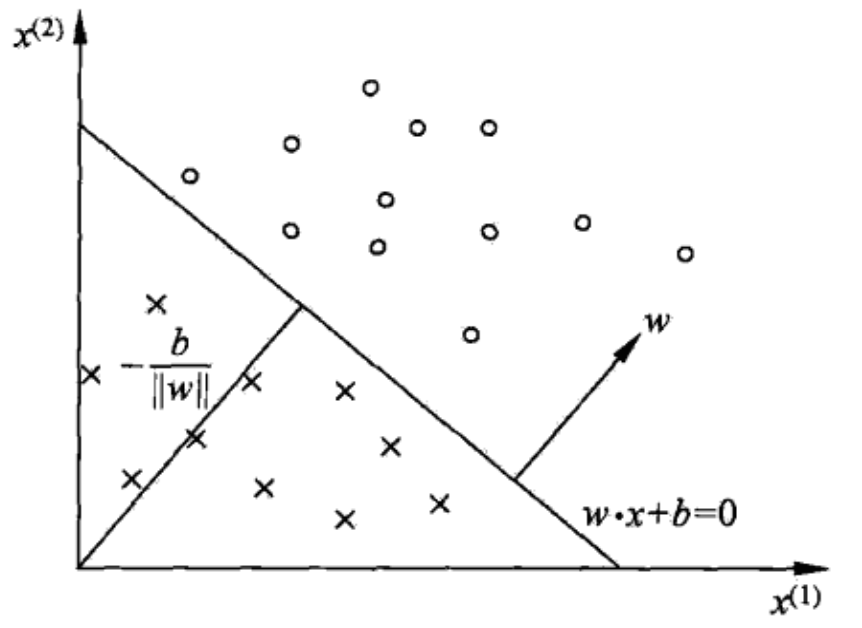

##
感知机

感知机是**二分类**的线性分类模型，其输入是实例的**特征向量**，输出是实例的类别，取+1和-1两个类别。感知机对应于输入空间中，将数据划分为正负两类，形成一个分离超平面，属于**判别模型**，感知机模型的目的是**找到一个超平面**将训练数据完全划分成两个类别。导入基于**误分类**的损失函数，利用**梯度下降法**对损失函数进行极小化。
###1、感知机模型
**感知机定义:**假设输入空间为 $X \subseteq R^n$，输出空间 $Y=\{-1,+1\}$ 。输入空间是样本的特征，输出空间是样本的类别，由输入空间到输出空间定义如下函数：
$$f(x)=sign(w\cdot x +b)$$
这就称为感知机，其中，$w\;和\;b$ 称为感知机的参数，$w \in R^n$ 是权重向量，$b$ 表示偏置向量，$w\cdot x$ 表示内积，sign表示符号函数，定义如下：
$$
sign(x)=\left\{
\begin{align*}
+1 \quad x \geq 0\\
\\
-1 \quad x \lt 0\\
\end{align*}
\right.
$$
感知机是一种**线性分类模型**，属于**判别模型**，感知机模型的假设空间，是定义在特征空间中的线性分类模型，也叫线性分类器。
对感知机的解释，对于几何解释，线性方程：
$$w\cdot x +b =0$$
这个线性方程表示特征空间 $R^n$ 上的一个超平面。其中 $w$ 是超平面的法向量，$b$ 是超平面的截距。这个超平面将特征空间划分为两个部分，分别表示正负类。超平面 $S$ 表示分离平面，如图所示：

.

通过训练数据，学习得到一个模型，对于新的输入实例给出其对应的输出实例。

###2、感知机学习策略
####2.1、数据集的线性可分性
假设数据集是线性可分的：
$$T=\{(x_1,y_1),(x_2,y_2),...,(x_N,y_N)\}$$
其中 $x_i \in R^n$ ，$y_i \in \{+1，-1\}$，如果存在某个超平面，如果存在超平面 $S$
$$w\cdot x+b=0$$
能够将数据集中正负实例完全分开，那么这个数据就是一个线性可分数据集，否则，就是线性不可分数据集。
####2.2、感知机学习策略
假设训练数据集是线性可分的，感知机学习的目标是求一个能够将训练数据正负实例完全分开的超平面。为了找出这样的超平面，确定感知机模型参数 $w,b$，需要确定一个学习策略，定义损失函数并将损失函数极小化。

针对这个问题，损失函数通常会选则误分类点的个数，但是这样的误分类损失函数不是参数 $w,b$ 的连续导数，不容易优化。所以，在这个问题上，将损失函数定义为误分类点到超平面的总距离。输入空间 $R^n$ 中任意一点 $x_0$ 到超平面的距离：
$$点到直线的距离公式：d=\left|\frac{Ax_0+By_0+C}{\sqrt{A^2+B^2}}\right|$$
$$\frac{1}{\|w\|}\left|w\cdot x_0+b\right|$$
其中 $\|w\|$ 表示 $w$ 的 $L_2$ 范数。对于误分类的数据 $(x_i,y_i)$ 来说：
$$y_i(w\cdot x_i +b) \lt 0$$
那么误分类点到超平面的距离为：
$$-\frac{1}{\|w\|}y_i(w\cdot x_i+b)$$
假设误分类点集合为 $M$ 那么，所有的误分类点到超平面的总距离就是：
$$-\frac{1}{\|w\|}\sum_{x_i\in M}y_i(w\cdot x_i+b)$$
对于优化问题，我们可以不考虑 $\frac{1}{\|w\|}$，所以损失函数可以定义为：
$$L(w,b)=-\sum_{x_i\in M}y_i(w\cdot x_i+b)$$
上面这个损失函数就是经验风险函数，显然损失函数是非负的，如果没有误分类点，那么损失为0，误分类点越少，分类点到超平面的距离越小，损失函数就越小。在这个例子中，损失函数 $L(w,b)$ 对 $w,b$，是连续可导的，通过求损失函数极小就可得到模型参数 $w,b$。
###3、感知机学习算法
感知机学习问题转化为求解损失函数的最优化问题，最优化的方法是**随机梯度下降**。
####3.1、感知机学习算法的原始形式
损失函数极小化可以表示为：
$$\min_{w,b}L(w,b)=-\sum_{x_i\in M}y_i(w\cdot x_i+b)$$
感知机学习算法是误分类驱动的，具体采用的是**随机梯度下降**，首先，任意选取一个超平面 $w_0,b_0$，然后再使用梯度下降法不断地极小化目标函数，极小化的过程中不是一次使 $M$ 中所有的误分类点的梯度下降，而是**一次随机选取一个误分类点使其梯度下降**。

假设**误分类点的集合 $M$是固定的**，那么损失函数 $L(w,b)$ 的梯度可以表示为：
$$\nabla_wL(w,b)=-\sum_{x_i \in M}y_ix_i$$
$$\nabla_bL(w,b)=-\sum_{x_i \in M}y_i$$
随机给出一个**误分类点** $(x_i,y_i)$，对 $w,b$ 进行更新有：
$$w \gets w+\eta y_ix_i$$
$$b \gets b+\eta y_i$$
其中，$\eta$ 表示步长，也表示学习率，这样可以通过不断的迭代使得损失函数 $L(w,b)$ 不断减小，直到为0。

**感知机学习算法的原始形式：**
输入：训练数据集 $T$，学习率 $\eta\;(0\lt \eta \leq 1)$
输出：模型参数 $w,b$ ，以及感知机模型 $f(x)=sign(w\cdot x +b)$
+ 选取初值 $w_0,b_0$

+ 在**训练集**中选取数据 $(x_i,y_i)$

+ 如果 $y_i(w\cdot x_i+b) \lt 0$
	- $w \gets w+\eta y_ix_i$
	- $b \gets b+\eta y_i$
+ 重复上面的第2，3步，直到训练集中没有误分类点。

感知机学习算法由于采用不同的初值或选取不同的误分类点，解可以不同。如果数据集是线性可分的那么一定存在一个超平面将数据完全分类正确。

####3.2、算法的收敛性
对于线性可分的数据集，感知机学习算法原始形式收敛，通过有限次的迭代一定可以将一个训练数据集完全正确分类。为了方便描述，我们将偏置 $b$ 并入权重向量 $w$，可以记做 $\hat{w}=(w^T,b)^T$，同样将输入向量加以扩充，加入常数1，得到 $\hat{x}=(x^T,1)^T$，这样就有 $\hat{x}\in R^{n+1}，\;\hat{w}\in R^{n+1}$，显然我们可以得到 $\hat{w}\cdot\hat{x}=w\cdot x +b$

**Novikoff定理(诺维可夫)**
+ 1、存在满足条件 $\|\hat{w}_{opt}\|=1$ 的超平面 $\hat{w}_{opt}\cdot\hat{x}=w_{opt}\cdot x +b_{opt}=0$ 将训练数据集完全正确分开；且存在 $\gamma \gt 0$，对所有的 $i=1,2,...,N$ 满足：
$$y_i(\hat{w}_{opt}\cdot\hat{x})=y_i(w_{opt}\cdot x +b_{opt})\geq \gamma$$

+ 2、令 $R=\max_{1\leq i \leq N}\|\hat{x}_i\|$，根据上面的感知机计算方法，在训练数据集熵的误分类次数 $k$ 满足不等式：
$$k\leq \left(\frac{R}{\gamma}\right)^2$$

**证明**
+ 1、这个问题主要说明了，分离超平面有多个，并且**每一个超平面都可以缩放**，为此我们可以定义一个统一的标准来比较超平面。

  - 由于数据集是线性可分的，所以一定存在一个超平面将数据完全正确分离。

  - 我们假设分离超平面为 $\hat{w}_{opt}\cdot\hat{x}=w_{opt}\cdot x +b_{opt}=0$，对分离平面进行缩放，不改变分离平面的实质。我们可以假设 $\|\hat{w}_{opt}\|=1$，数据被完全正确分离后，我们可以得到
$$y_i(\hat{w}_{opt}\cdot\hat{x})=y_i(w_{opt}\cdot x +b_{opt})\gt 0$$
  - 所以存在一个最小的 $\gamma$ 满足：
$$\gamma=\min_{i}\{y_i(w_{opt}\cdot x +b_{opt})\}$$
  - 最后可以得到：
$$y_i(\hat{w}_{opt}\cdot\hat{x})=y_i(w_{opt}\cdot x +b_{opt})\geq \gamma$$

+ 2、感知机算法从 $\hat{w}_0=0$ 开始，如果实例被误分类，则更新权重。令 $\hat{w}_{k-1}$ 是第 $k$ 个误分类实例之前的扩充权重向量，表示如下：
$$\hat{w}_{k-1}=(w_{k-1}^T,b_{k-1})^T$$
第 $k$ 个误分类的条件为:
$$y_i(\hat{w}_{k-1}\cdot\hat{x})=y_i(w_{k-1}\cdot x +b_{k-1})\leq 0$$
如果 $(x_i,y_i)$ 是被 $\hat{w}_{k-1}=(w_{k-1}^T,b_{k-1})^T$ 误分类的数据，则 $w和b$ 的更新如下：
$$w_k \gets w_{k-1}+\eta y_ix_i$$
$$b_k \gets b_{k-1}+\eta y_i$$
可以统一表示为：
$$\hat{w}_k=\hat{w}_{k-1}+\eta y_i\hat{x}_i$$
下面推导两个不等式：
 - $\hat{w}_k\cdot \hat{w}_{opt} \geq k\eta\gamma$，通过代入得到：
$$\begin{align*}
\hat{w}_k\cdot \hat{w}_{opt} &=(\hat{w}_{k-1}+\eta y_i\hat{x}_i)\cdot \hat{w}_{opt} \\\\
&=\hat{w}_{k-1}\cdot \hat{w}_{opt}+\eta y_i\hat{x}_i\cdot \hat{w}_{opt}\\\\
&\geq \hat{w}_{k-1}\cdot \hat{w}_{opt}+\eta\gamma\\
\end{align*}$$
由此地推不等式可以得到：$\hat{w}_k\cdot \hat{w}_{opt}\geq \hat{w}_{k-1}\cdot \hat{w}_{opt}+\eta\gamma\geq ...\geq k\eta\gamma$

 - $\|\hat{w}_k\|^2 \leq k\eta^2R^2$，由上面推到出的公式可得：
$$\begin{align*}\\
\|\hat{w}_k\|^2 &=\|\hat{w}_{k-1}+\eta y_i\hat{x}_i\|^2\\\\
&=\|\hat{w}_{k-1}\|^2+2\hat{w}_{k-1}\cdot\eta y_i\hat{x}_i+\|\eta y_i\hat{x}_i\|^2\\\\
&=\|\hat{w}_{k-1}\|^2+2\eta  y_i\hat{w}_{k-1}\cdot\hat{x}_i+\eta^2\|\hat{x}_i\|^2\\\\
& \leq \|\hat{w}_{k-1}\|^2+\eta^2\|\hat{x}_i\|^2\\\\
& \leq \|\hat{w}_{k-1}\|^2+\eta^2R^2 \leq ...\\\\
& \leq k\eta^2R^2
\end{align*}$$

 - 结合上面的不等式，我们可以得到
$$k\eta\gamma \leq \hat{w}_k \cdot \hat{w}_{opt}\leq \|\hat{w}_k\|\|\hat{w}_{opt}\|\leq \sqrt{k}\eta R$$
所以可以求得：
$$k\leq \left(\frac{R}{\gamma}\right)^2$$

这个定理说明了，在线性可分数据集中，误分类的次数 $k$ 是有上街的。经过有限次的搜索，一定可以将数据集完全正确分离。，感知机算法存在许多解，这些解的依赖初值的选择，也依赖误分类点的选择顺序。为了得到唯一的超平面，我们需要对分离平面增加约束条件，当训练数据集线性不可分时，感知机算法不收敛，迭代结果会发生震荡。

####3.3、感知机学习算法的对偶形式
对偶形式的基本想法是，将$w 和 b$表示为实例 $x_i$ 和标记 $y_i$ 的**线性组合**形式，公共求解其系数得到 $w 和 b$，我们可以假设初始值 $w_0,b_0$ 均为0，对**误分类点 $(x_i,y_i)$ **通过如下迭代求解：
$$w \gets w+ \eta y_ix_i$$
$$b \gets b + \eta y_i$$
逐步修改 $w,b$，假设对 $(x_i,y_i)$ 修改 $n_i$ 次，则 $w,b$ 关于 $(x_i,y_i)$ 的增量分别是 $n_i\eta y_ix_i$ 和 $n_i \eta y_i$ 我们假设 $\alpha_i=n_i\eta$，从学习过程不难看出，最后学习得到的 $w,b$ 可以分别表示为：
$$w=\sum_{i=1}^{N}\alpha_iy_ix_i$$
$$b =\sum_{i=1}^{N}\alpha_iy_i$$
特别注意，**这里的没一点 $(x_i,y_i)$ 都是误分类点，所以计算之前都要判断是否是误分类点**，当 $\eta=1$ 时，表示对第 $i$ 个实例点由于误分类进行更新的次数，更新次数越多，意味着距离分离超平面越近，也就越难正确分类。

**感知机学习算法的对偶形式**
输入：线性可分数据集 $T$，学习率 $\eta$
输出：$\alpha,b$，感知机模型 $ f(x)=sign\left(\sum_{j=1}^{N}\alpha_j y_j x_j\cdot x +b\right)$，其中 $\alpha=(\alpha_1,\alpha_2,...,\alpha_N)^T$

+ $ \alpha \gets 0\;,\;b \gets 0$

+ 在训练数据集中选取误分类数据 $(x_i,y_i)$

+ 如果 $y_i\left(\sum_{j=1}^{N}\alpha_j y_j x_j\cdot x +b\right)\leq 0$，也就是判断是否误分类了
$$\alpha_i \gets \alpha_i + \eta$$
$$b \gets b +\eta y_i$$
对偶形式中训练实例仅以内积的形式出现，为了方便，可以预先将训练集中的实例内积计算出来，并使用矩阵的形式存储起来，这个矩阵就是所谓的 Gram 矩阵：
$$G=[x_i\cdot x_j]_{N\times N}$$
通过这种方式，迭代速度非常快，可以并行计算，效率高。感知机学习算法的对偶形式是收敛的，存在多个解，和原始形式一样。