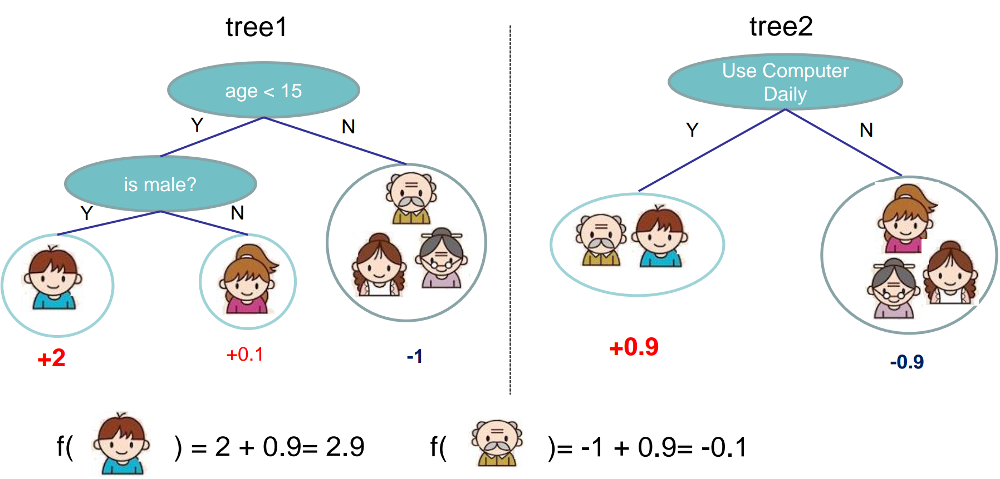
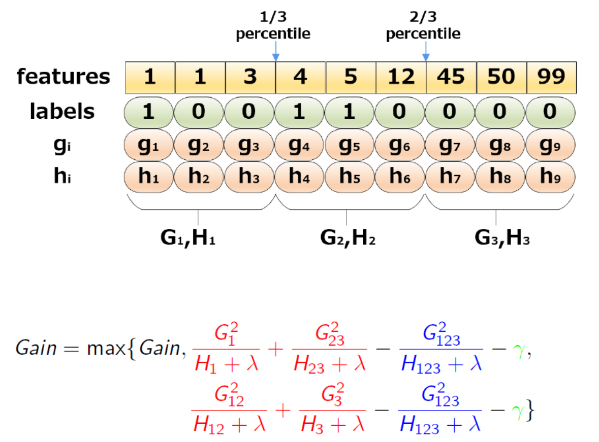
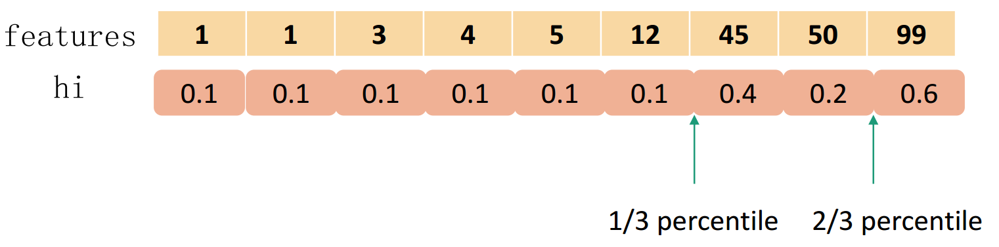
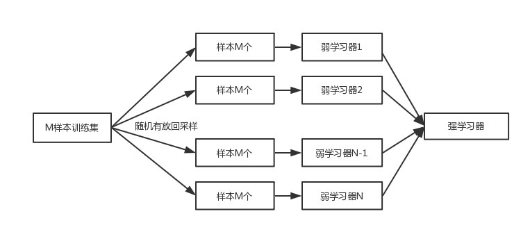

##
提升方法

###1、基本数学知识
####1.1、泰勒公式
+ 定义：泰勒公式是一个用函数在某点的信息描述其**附近**取值的公式。是一种**局部有效性**
+ 基本形式：表示在$x=x_0$处展开
$$f(x)=\sum_{n=0}^\infty \frac{f^{(n)}(x_0)}{n!}(x-x_0)^n$$
  + 一阶泰勒展开：$f(x) \approx f(x_0)+f^{\prime}(x_0)(x-x_0)$
  
  + 二阶泰勒展开：$f(x) \approx f(x_0)+f^{\prime}(x_0)(x-x_0)+\frac{1}{2}f^{\prime\prime}(x_0)(x-x_0)^2$

+ 迭代形式：假设 $x_t=x_{t-1}+\Delta{x}$ ，将 $f(x_t)在x_{t-1}$ 处进行泰勒展开:

$\begin{align*}
f(x_t) &=f(x_{t-1}+\Delta{x})\\
&\approx f(x_{t-1})+f^{\prime}(x_{t-1})\Delta x+\frac{1}{2}f^{\prime\prime}(x_{t-1}){\Delta x}^2
\end{align*}
$

####1.2、梯度下降
在机器学习任务中，通常需要优化最小损失函数$L(\theta)$，其中 $\theta$是要求解的参数模型。梯度下降法通常用来求解**无约束最优化**问题，它是一种迭代方法：选取一个初始值 $\theta_0$ ，不断迭代更新，进行损失函数最小化。
+ 迭代公式：$\theta_t=\theta_{t-1}+\Delta\theta$

+ 将 $L(\theta_t)$ 在 $\theta_{t-1}$ 处进行一阶展开：(**梯度下降采用的是一阶泰勒展开**)

$\begin{align*}
L(\theta_t)&=L(\theta_{t-1}+\Delta\theta)\\
&\approx L(\theta_{t-1})+L^{\prime}(\theta_{t-1})\Delta\theta
\end{align*}$

+ 要使得 $L(\theta_t)\lt L(\theta_{t-1})$，可取：$\Delta\theta=-\alpha L^{\prime}(\theta_{t-1})$ ，那么就有：$\theta_t=\theta_{t-1}-\alpha L^{\prime}(\theta_{t-1})$ ，这里$\alpha$步长，可以通过线性搜索求出一个最优的，但是通常**直接赋一个很小的数**。

####1.3、牛顿法
牛顿法也是用于求解**无约束最优化**常见的方法，特点是**收敛速度快**，也是一种迭代方法，每一步需要求解目标函数的海森矩阵的逆矩阵，计算比较复杂，通常使用拟牛顿法来进行优化。
+ 将 $L(\theta_t)$ 在 $\theta_{t-1}$ 处进行二阶展开：(**梯度下降采用的是二阶泰勒展开**)

$\begin{align*}
L(\theta_t)&=L(\theta_{t-1}+\Delta\theta)\\
&\approx L(\theta_{t-1})+L^{\prime}(\theta_{t-1})\Delta\theta+\frac{1}{2}L^{\prime\prime}(\theta_{t-1})\Delta\theta^2
\end{align*}$

  
  为了简化分析过程，假设参数是标量，只有一维，可以将一阶和二阶导数记为 $g和h$

$L(\theta_t) \approx L(\theta_{t-1})+g\Delta\theta+h\frac{\Delta\theta^2}{2}$

+ 要求 $L(\theta_t)$ 最小，那么，可以将其对$\Delta\theta$ 求偏导，可以得到
$$\frac{\partial(g\Delta\theta+h\frac{\Delta\theta^2}{2})}{\partial\Delta\theta}=0$$
  求得：$\Delta\theta=-\frac{g}{h}$ ，所以 $\theta_t=\theta_{t-1}+\Delta\theta=\theta_{t-1}-\frac{g}{h}$ ，推广到向量形式就可以表示为 $\theta_t=\theta_{t-1}-H^{-1}g$ ，其中 $H$ 表示海森矩阵，需要求矩阵的逆，计算比较复杂，需要使用拟牛顿法进行优化。

###2、提升方法AdaBoost算法
####2.1、提升方法的基本思路
**基本思想**：对于一个复杂的任务，将多个专家的判断综合得出的判断，要比一个专家单独判断的要好。
**强可学习**：一个概念，若果存在一个**多项式**的学习算法能够学习他，并且学习的**正确率比较高**，这就是强可学习。
**弱可学习**：一个概念，若果存在一个**多项式**的学习算法能够学习他，并且学习的**正确率比随机略好**，这就是弱可学习。
在PAC学习的框架下，可以证明强可学习和弱可学习是等价的。对于分类问题，给定一个训练样本，求弱分类器要比求强分类器简单，并且有效。提升方法就是从弱学习方法出发，反复学习，得到一系列弱分类器，然后将这些弱分类器组合，构成一个强分类器。大多数的提升方法都是改变训练数据的**概率分布**，来学习一系列的弱分类器。提升方法的**两个主要问题**：
+ 每一轮如何改变训练数据的权值或概率分布。
+ 如何将弱分类器组合成一个强分类器。

AdaBoost的实现，提高那些被前一轮分类器错误分类样本的权值，降低被正确分类的权值，这样就能够让错误分类的样本，在下一轮中受到更多的关注。针对第二个问题，AdaBoost使用的是加权多数表决的方法，具体的就是将误差率底的弱分类器的权重，降低误差率高弱分类器权重。这样误差率低的分类器的作用就会加大。
####2.2、AdaBoost算法
AdaBoost算法，从训练数据集中学习一系列弱分类器，并将这些弱分类器组成成一个强分类器。
输入：训练数据集$T=\{(x_1,y_1),(x_2,y_2),...,(x_N,y_N)\}，其中x_i \in X \subseteqq R^n ，y_i \in Y=\{-1,+1\}$，弱学习算法
输出：最终分类器$G(x)$
（1）初始化序列数据的权值分布，假设训练数据具有均匀的权值分布，这样就可以学习到 $G_1(x)$
$$D_1=(w_{11},w_{12},...,w_{1N}),\quad w_{1i}=\frac{1}{N},\quad i=1,2,...,N$$
（2）对$m=1,2,...,M$
+ 使用具有权值分布的 $D_m$ 的训练集学习，得到基本分类器 $G_m(x)$，通常是二分类器。
+ 计算 $G_m(x)$ 在训练集上的分类误差率，计算的就是错误加权平均，也可以说是所有误分类样本误差权重相加。
$$e_m=P(G_m(x_i)\neq y_i)=\sum_{i=1}^N w_{mi}I(G_m(x_i)\neq y_i)=\sum_{G_m(x_i) \neq y_i}w_{mi}$$
这里$w_{mi}表示第m轮中第i个实例的权值，\sum_{i=1}^{N}w_{mi}=1$

+ 计算 $G_m(x)$ 的系数，为什么是这个系数，后面有证明，注意这里是**自然对数**，误分类越小，权重越大，这也是弱分类器组合成强分类器的规则。$\alpha_m表示G_m(x)在最终分类器中的重要性。$
$$\alpha_m=\frac{1}{2}log\frac{1-e_m}{e_m}$$

+ 更新训练数据的权值分布

$\begin{align*}
D_{m+1} &=(w_{m+1,1},w_{m+1,2},...,w_{m+1,N})\\\\
w_{m+1,i} &=\frac{w_{mi}}{Z_m}exp(-\alpha_my_iG_m(x_i))\\\\
&=\left\{
\begin{aligned}
\frac{w_{mi}}{Z_m}e^{-\alpha_m}  & & G_m(x_i)=y_i \\
\frac{w_{mi}}{Z_m}e^{\alpha_m}  & & G_m(x_i) \neq y_i \\
\end{aligned}
\right.\\\\
Z_m &=\sum_{i=1}^{N}w_{mi}exp(-\alpha_my_iG_m(x_i))=2\sqrt{e_m(1-e_m)}
\end{align*}$

$Z_m$求的是$m$这一层的误差总和，是一个规范化因子，使得 $D_{m+1}$ 成为一个概率分布。**权重更新是以指数级**更新的，如果 $G_m(x_i)=y_i$ 分类正确，那么$y_iG_m(x_m)=1$ ，这就是说明这个变量的权重会被指数级别降低。如果不相等，那么权重就会被指数级别放大。从上面可以看到误分类样本权重扩大，正确样本权重缩小，两者相比较，误分类样本的权重被放大了
$$e_m^{2\alpha_m}=\frac{1-e_m}{e_m}$$
左边表示放大比例，右边一个表示正确分类比例初除以错误分类比例。不改变所给的训练数据，而不断改变训练数据的权值分布，使得训练数据在基本分类器的学习中起不同的作用，这也是AdaBoost的一个特点。

（3）构建基本分类器的线性组合，得到强分类器，$\alpha_m$ 表示基本分类器的权重，但是他们的**和不为1**，在最终分类器中 $f(x)$ 的**符号决定了样本的分类**，绝对值的大小确定每个样本所属分类的不确定性。
$$f(x)=\sum_{m=1}^{M}\alpha_mG_m(x)$$
$\qquad$最终的分类器为：
$$G(x)=sign(f(x))=sign(\sum_{m=1}^{M}\alpha_mG_m(x))$$

####2.3、AdaBoost的例子
AdaBoost通常使用的是二分类的方法，所以最简单的分类器就是$x\lt v 或x \gt v$ 产生，其阈值$v$使该分类器在训练数据集上**分类误差率最低**，使用AdaBoost学习一个强分类器。

|序号| 1 | 2 | 3 | 4 | 5 | 6 | 7 | 8 | 9 | 10 |
|:-:|:-:|:-:|:-:|:-:|:-:|:-:|:-:|:-:|:-:|:-:|
| x | 0 | 1 | 2 | 3 | 4 | 5 | 6 | 7 | 8 | 9 |
| label | 1 | 1 | 1 | -1 | -1 | -1 | 1 | 1 | 1 | -1 |

初始化数据权值分布
$$D_1=(w_{11},w_{12},...,w_{110})\\w_{1i}=0.1,\quad i=1,2,...,10$$
对$m=1$，
+ 在权值分布为$D_1$的训练数据集上，可选的切分点$v=\{-0.5,0.5,1.5,2.5,...,9.5\}$，计算在每一个切分点下误差率，例如在$v=0.5$的情况下，误差率$e_1=0.1\times 4=0.4$，遍历所有的切分点，选择误差率最小的一个切分点，多个误差率相同的时候，随机选择一个，在这个数据集中目前最佳切分点为$v=2.5$，所以基本分类器为：
$$G_1(x)=\left\{
\begin{aligned}
1 &  & x \lt 2.5 \\
-1 &  & x \gt 2.5\\
\end{aligned}
\right.
$$
+ $G_1(x)$在训练集上的训练误差为$e_1=P(G_1(x_i)\neq y_i)=0.1\times 3=0.3$

+ 计算$G_1(x)$的系数：$\alpha_1=\frac{1}{2}log\frac{1-e_1}{e_1}=0.4236$，同时计算$Z_1=2\sqrt{e_1(1-e_1)}$
+ 更新训练数据的权值分布：**特别注意，这里$y_i$表示label的值**
$$\begin{align*}
D_2&=(w_{21},w_{22},...,w_{210})\\
w_{2i}&=\frac{w_{1i}}{Z_1}exp(-\alpha_1y_iG_1(x_i))\\
f_1(x)&=0.4236G_1(x)
\end{align*}
$$

|序| 1 | 2 | 3 | 4 | 5 | 6 | 7 | 8 | 9 | 10 |
|:-:|:-:|:-:|:-:|:-:|:-:|:-:|:-:|:-:|:-:|:-:|
| x | 0 | 1 | 2 | 3 | 4 | 5 | 6 | 7 | 8 | 9 |
| w |0.07413|0.07413|0.07413|0.07413|0.07413|0.07413|0.16667|0.16667|0.16667|0.07413|
| y | 1 | 1 | 1 | -1 | -1 | -1 | -1 | -1 | -1 | -1 |
| label | 1 | 1 | 1 | -1 | -1 | -1 | 1 | 1 | 1 | -1 |

分类器 $sign(f_1(x))$ 在训练数据集上面还存在3个误分类点。

对$m=2$，
+ 在权值分布为$D_2$的训练数据集上，可选的切分点$v=\{-0.5,0.5,1.5,2.5,...,9.5\}$，计算在每一个切分点下误差率，例如在$v=-0.5$的情况下，误差率$e_2=0.07413\times 3=0.2224$，遍历所有的切分点，选择误差率最小的一个切分点，多个误差率相同的时候，随机选择一个，在这个数据集中目前最佳切分点为$v=8.5$，所以基本分类器为：
$$G_2(x)=\left\{
\begin{aligned}
1 &  & x \lt 8.5 \\
-1 &  & x \gt 8.5\\
\end{aligned}
\right.
$$
+ **这一步存在计算错误，由于没有全部计算，所以姑且是这样表示**
+ $G_2(x)$在训练集上的训练误差为$e_2=P(G_2(x_i)\neq y_i)=0.07413\times 3=0.2143$

+ 计算$G_2(x)$的系数：$\alpha_2=\frac{1}{2}log\frac{1-e_2}{e_2}=0.6496$，同时计算$Z_2=2\sqrt{e_2(1-e_2)}$
+ 更新训练数据的权值分布：
$$\begin{align*}
D_3&=(w_{31},w_{32},...,w_{310})\\
w_{3i}&=\frac{w_{2i}}{Z_2}exp(-\alpha_2y_iG_2(x_i))\\
f_2(x)&=0.4236G_1(x)+0.6496G_2(x)
\end{align*}
$$

|序| 1 | 2 | 3 | 4 | 5 | 6 | 7 | 8 | 9 | 10 |
|:-:|:-:|:-:|:-:|:-:|:-:|:-:|:-:|:-:|:-:|:-:|
| x | 0 | 1 | 2 | 3 | 4 | 5 | 6 | 7 | 8 | 9 |
| w |0.0455|0.0455|0.0455|0.16667|0.16667|0.16667|0.10600|0.10600|0.10600|0.0455|
| y | 1 | 1 | 1 | 1 | 1 | 1 | 1 | 1 | 1 | -1 |
| label | 1 | 1 | 1 | -1 | -1 | -1 | 1 | 1 | 1 | -1 |
分类器 $sign(f_2(x))$ 在训练数据集上面还存在3个误分类点。

对$m=3$，
+ 在权值分布为$D_3$的训练数据集上，可选的切分点$v=\{-0.5,0.5,1.5,2.5,...,9.5\}$，计算在每一个切分点下误差率，例如在$v=-0.5$的情况下，误差率$e_3=0.10600\times 3+0.0455\times 3=0.4545$，遍历所有的切分点，选择误差率最小的一个切分点，多个误差率相同的时候，随机选择一个，在这个数据集中目前最佳切分点为$v=5.5$，所以基本分类器为：
$$G_3(x)=\left\{
\begin{aligned}
-1 &  & x \lt 5.5 \\
1 &  & x \gt 5.5\\
\end{aligned}
\right.
$$
+ $G_3(x)$在训练集上的训练误差为$e_3=P(G_3(x_i)\neq y_i)=0.0455\times 4=0.182$

+ 计算$G_3(x)$的系数：$\alpha_3=\frac{1}{2}log\frac{1-e_3}{e_3}=0.7514$，同时计算$Z_3=2\sqrt{e_3(1-e_3)}$
+ 更新训练数据的权值分布：
$$\begin{align*}
D_4&=(w_{41},w_{42},...,w_{410})\\
w_{4i}&=\frac{w_{3i}}{Z_3}exp(-\alpha_3y_iG_3(x_i))\\
f_3(x)&=0.4236G_1(x)+0.6496G_2(x)+0.7514G_3(x)
\end{align*}
$$

|序| 1 | 2 | 3 | 4 | 5 | 6 | 7 | 8 | 9 | 10 |
|:-:|:-:|:-:|:-:|:-:|:-:|:-:|:-:|:-:|:-:|:-:|
| x | 0 | 1 | 2 | 3 | 4 | 5 | 6 | 7 | 8 | 9 |
| w |0.12500|0.12500|0.12500|0.1020|0.1020|0.1020|0.0650|0.0650|0.0650|0.12500|
| y | 1 | 1 | 1 | -1 | -1 | -1 | 1 | 1 | 1 | -1 |
| label | 1 | 1 | 1 | -1 | -1 | -1 | 1 | 1 | 1 | -1 |
分类器 $sign(f_3(x))$ 在训练数据集上面还存在0个误分类点。所以最终的分类器为
$$G(x)=sign[f_3(x)]=sign[0.4236G_1(x)+0.6496G_2(x)+0.7514G_3(x)]$$

###3、AdaBoost算法的训练误差分析
AdaBoost最基本的思想就是它能在学习的过程中不断的减少训练误差，并且是指数降低的，效果非常客观。
####3.1、一般问题训练误差界
AdaBoost算法最终分类器的训练误差界为，对所有的问题都适应，初始权重为$\frac{1}{N}$
$$\frac{1}{N}\sum_{i=1}^NI(G(x_i)\neq y_i) \leq \frac{1}{N}\sum_iexp(-y_if(x_i))=\prod_m Z_m$$
**证明：**当 $G(x_i)\neq y_i$ 时，有 $I(G(x_i)\neq y_i)=1$，此时 $y_if(x_i) \geq 0$ 所以有$exp(-y_if(x_i)) \geq 1$，所以在第一部分中成立。根据前面推到的公式有：
$$w_{mi}exp(-\alpha_iy_iG_m(x_i))=Z_mw_{m+1,i}$$
推导如下：

$\begin{align*}
\frac{1}{N}\sum_iexp(-y_if(x_i)) &=\frac{1}{N}\sum_iexp(\sum_{m=1}^{M}-\alpha_my_iG_m(x_i))\\
&=\sum_iw_{1i} exp(\sum_{m=1}^{M}-\alpha_my_iG_m(x_i))\\
&=\sum_iw_{1i} \prod_{m=1}^{M} exp(-\alpha_my_iG_m(x_i))\\
&=\sum_iw_{1i}exp(-\alpha_1y_iG_1(x_i)) \prod_{m=2}^{M} exp(-\alpha_my_iG_m(x_i))\\
&=\sum_iZ_1w_{2i} \prod_{m=2}^{M} exp(-\alpha_my_iG_m(x_i))\\
&=\sum_iZ_1Z_2w_{3i} \prod_{m=3}^{M} exp(-\alpha_my_iG_m(x_i))\\
&=\prod_{m=1}^{M}Z_m
\end{align*}$

这个定理说明了，由于$\prod_{m=1}^{M}Z_m$ 是训练误差的上界，可以在每一轮选取适当的 $G_m使得Z_m$最小，从而训练误差下降最快。
####3.2、二分类问题训练误差界
上面公式的推导是针对通用情况，在二分类中，误差上界可以描述为：
$$\prod_{m=1}^{M}Z_m=\prod_{m=1}^{M}[2\sqrt{e_m(1-e_m)}]=\prod_{m=1}^{M}\sqrt{1-4\gamma^2}\leq exp(-2\sum_{m=1}^{M}\gamma_m^2)$$

其中，$\gamma_m=\frac{1}{2}-e_m$，可以看出$Z_m=2\sqrt{e_m(1-e_m)}$，这个非常有用，在计算下一轮权值的时候可以直接用

**证明：**
$$\begin{align*}
Z_m&=\sum_{i=1}^{N}w_{mi}exp(-\alpha_my_iG_m(x_i))\\\\
&=\sum_{G_m(x_i)\neq y_i}w_{mi}e^{\alpha_m}+\sum_{G_m(x_i) = y_i}w_{mi}e^{-\alpha_m}\\\\
&=e_me^{\alpha_m}+(1-e_m)e^{-\alpha_m}\\\\
&=e_me^{\frac{1}{2}log\frac{1-e_m}{e_m}}+(1-e_m)e^{-\frac{1}{2}log\frac{1-e_m}{e_m}}\\\\
&=2\sqrt{e_m(1-e_m)}=\sqrt{1-4\gamma^2}
\end{align*}$$
根据泰勒展开式可以求出$\sqrt{1-4\gamma^2} \leq exp(-2\gamma^2)$

通过上面两小节的计算，可以得到如下推论：如果$\gamma \gt 0$，对所有的$m$有，$\gamma_m \gt \gamma$，若果我们给定一个最小误差，达到这个误差就退出，那么可以将这个误差作为 $\gamma$，那么随着$M$增加一步，那么整体的损失就会成指数下降一步。
$$\frac{1}{N}\sum_{i=1}^{N}I(G(x_i)\neq y_i)\leq exp(-2M\gamma^2)$$

###4、AdaBoost算法的解释
通常人们认为AdaBoost算法是模型为**加法模型**，损失函数是**指数函数**，学习算法是**前向分步算法**时的**二分类**学习方法。
####4.1、前向分步算法
加法模型通常可以表示为：
$$f(x)=\sum_{m=1}^{M}\beta_mb(x;\gamma_m)$$
其中，$b(x;\gamma_m)$ 为基函数，$\gamma_m$ 为基函数的参数，$\beta_m$ 为基函数的系数，可以看出这是一个基本的加法模型。在给定训练数据集和损失函数 $L(y,f(x))$ 的条件下，学习加法模型 $f(x)$ 可以描述为经验风险最小化的问题：
$$\mathop{min}_{\beta_m,\gamma_m}\sum_{i=1}^{N}L(y_i,\sum_{m=1}^{M}\beta_mb(x;\gamma_m))$$
通常的这个问题优化非常复杂。前向分步算法的基本思想就是，因为这个模型是加法模型，所以可以从前向后，每一步学习一个基函数和其系数，逐步逼近优化目标函数，这样就可以简化优化的复杂度，每一步的损失函数为：
$$\mathop{min}_{\beta,\gamma}\sum_{i=1}^{N}L(y_i,b(x_i;\gamma))$$

**前向分步的基本算法流程如下：**
输入：训练数据集 $T=\{(x_1,y_1),(x_2,y_2),...,(x_N,y_N)\}$，损失函数 $L(y,f(x))$，基函数集 $\{b(x;\gamma)\}$
输出：加法模型 $f(x)$
+ 初始化 $f_0(x)=0$
+ 对 $m=1,2,...,M$
  - 极小化损失函数
$$(\beta_m,\gamma_m)=arg \mathop{min}_{\beta,\gamma}\sum_{i=1}^{N}L(y_i,f_{m-1}(x_i)+\beta b(x_i;\gamma))$$
可以求出一个最佳的 $\beta和\gamma$ 来作为当前基函数的系数和参数。

  - 更新加法模型
$$f_m(x)=f_{m-1}(x)+\beta_mb(x;\gamma_m)$$

+ 最后得到总的加法模型
$$f(x)=\sum_{m=1}^{M}\beta_mb(x;\gamma_m)$$

从上面的算法可以看出，前向分步算法将同时求解从$m=1到M$所有参数 $\beta_m,\gamma_m$ 的优化问题分解成了逐步求解各个 $\beta_m,\gamma_m$ 的问题。
####4.2、前向分步算法与AdaBoost
根据前向分步算法可以推导出AdaBoost，通过如下定理可以证明。AdaBoost算法是前向分步加法模型的一个特例，这个模型由基本分类器是加法模型，损失函数是指数损失。

**证明：**AdaBoost最终的分类器就是一个加法模型，符合前向分步算法模型：
$$f(x)=\sum_{m=1}^{M}\alpha_mG_m(x)$$
假设前向分步算法的**损失函数是指数函数**，那么就有：
$$L(y,f(x))=exp(-yf(x))$$
根据前向分步算法的极小化损失函数的规则有：
$$(\alpha_m,G_m(x))=arg \mathop{min}_{\alpha,G}\sum_{i=1}^{N}exp[-y_i(f_{m-1}(x_i)+\alpha G(x_i))]\\(\alpha_m,G_m(x))=arg \mathop{min}_{\alpha,G}\sum_{i=1}^{N}\bar{w}_{mi}exp[-y_i\alpha G(x_i)]$$
其中$\bar{w}_{mi}=exp(-y_if_{m-1}(x))$，可以看出这一项与我们要优化的项无关，所以可以忽略。现在需要证明的是我们使上式达到最小的就是AdaBoost中的基函数和其系数。
+ 首先求解$G_m^*(x)$ ,对于任意的 $\alpha > 0$ ，最优化问题可以转换为：
$$G_m^*(x)=arg \mathop{min}_G\sum_{i=1}^{N}\bar{w}_{mi}I(y_i\neq G(x_i))$$
可以看出，$G_m^*(x)$，就是AdaBoost算法中第$m$轮中要求的基函数，因为这个基函数确保了在这次迭代中使得总体损失最小，符合AdaBoost算法的描述。

+ 求解最佳的 $\alpha_m^*$ 时
$$\begin{align*}\sum_{i=1}^{N}\bar{w}_{mi}exp[-y_i\alpha G(x_i)]&=\sum_{y_i=G_m(x_i)}\bar{w}_{mi}e^{-\alpha}+\sum_{y_i \neq G_m(x_i)}\bar{w}_{mi}e^{\alpha}\\\\
&=\sum_{y_i=G_m(x_i)}\bar{w}_{mi}e^{-\alpha}+\sum_{y_i \neq G_m(x_i)}\bar{w}_{mi}e^{\alpha}+\sum_{y_i \neq G_m(x_i)}\bar{w}_{mi}e^{-\alpha}-\sum_{y_i \neq G_m(x_i)}\bar{w}_{mi}e^{-\alpha}\\\\
&=(e^{\alpha}-e^{-\alpha})\sum_{y_i \neq G_m(x_i)}\bar{w}_{mi}+e^{-\alpha}\sum_{i = 1}^{N}\bar{w}_{mi}\\\\
&=(e^{\alpha}-e^{-\alpha})\sum_{i=1}^{N}\bar{w}_{mi}I(y_i \neq G_i(x))+e^{-\alpha}\sum_{i = 1}^{N}\bar{w}_{mi}\\\\
\end{align*}$$
然后对$\alpha$求导，使其导数为0，可以求出：
$$\alpha_m^*=\frac{1}{2}log\frac{1-e_m}{e_m}$$

###5、提升树基本算法
提升树是以**分类树或者回归树**作为基本分类器的提升方法，提升树通常被认为是统计学习中性能最好的方法之一。
####5.1、提升树模型
提升方法采用的是加法模型和前向分步算法，如果以决策树作为基函数，那么这种提升方法就是一个提升树方法。对于分类问题，决策树是二叉分类树，对于回归问题，决策树是二叉回归树。**决策树桩**表示决策树由一个根节点和两个叶子节点组成，是一种二叉树。提升树模型可以表示为决策树的加法模型：
$$f_M(x)=\sum_{m=1}^{M}T(x;\Theta_m)$$
其中，$T(x;\Theta_m)$ 表示决策树，$\Theta_m$表示为决策树的参数，$M$表示为树的个数
####5.2、提升树算法
提升树算法采用前向分步算法，首先确定初始提升树$f_0(x)=0$，第 $m$ 步的模型是
$$f_m(x)=f_{m-1}(x)+T(x;\Theta_m)$$
通过**经验风险最小化**确定下一颗决策树的参数 $\Theta_m$
$$\hat{\Theta}_m=arg \mathop{min}_{\Theta_m}\sum_{i=1}^{N}L(y_i,f_{m-1}(x_i)+T(x_i;\Theta_m))$$
由于树的线性组合可以很好地拟合训练数据集，即使数据中的输入和输出关系很复杂也可以拟合，所以提升树是一个高功能的学习算法，效果非常好。不同问题的提升树主要的不同在于损失函数的不同，例如回归问题的损失函数是**平方损失**，分类问题的损失函数是**指数损失**，一般决策问题的一般损失函数。由于分类问题的指数损失和AdaBoost非常相似，所以不在描述，这里研究的是**回归问题的平方损失**。

对于回归树，如果将输入空间划分成 $J$ 个不相交的区域 $R_1,R_2,...,R_J$，每个区域上确定输出常量$c_j$，决策树表示为：
$$T(x;\Theta)=\sum_{j=1}^{J}c_jI(x \in R_j)$$
这里的决策树类似与一个分段函数，在不同的取值范围输出不同的值，**这里只描述单层**。$J$ 表示决策树中叶子节点的个数。回归问题可以使用以下的前向分步算法。
$$\begin{align*}
f_0(x)&=0\\
f_m(x)&=f_{m-1}(x)+T(x;\Theta_m)\\
f_M(x)&=\sum_{m=1}^{M}T(x;\Theta_m)
\end{align*}$$
在前向分步算法的第 $m$ 步，给定当前模型 $f_{m-1}(x)$，需要求解:
$$\hat{\Theta}_m=arg \mathop{min}_{\Theta_m}\sum_{i=1}^{N}L(y_i,f_{m-1}(x_i)+T(x_i;\Theta_m))$$
回归提升树，采用的是损失函数是平方误差，所以损失函数为：
$$\begin{align*}L(y,f(x))&=(y-f(x))^2\\
L(y,f_{m-1}(x)+T(x_i;\Theta_m))&=[y-f_{m-1}(x)-T(x_i;\Theta_m)]^2
\end{align*}$$
其中，$r=y-f_{m-1}(x)$，表示当前模型拟合数据的残差，就是有标签的数据与预测的数据之间的差异，对于回归问题的回归树，只需要拟合残差即可。
输入：训练数据集 $T$
输出：提升树 $f_M(x)$
+ 初始化 $f_0(x)=0$

+ 对 $m=1,2,...,M$
 - 计算残差$r_{mi}$，表示现在的数据与上一步预测的数据之间的差异。
 $$r_{mi}=y_i-f_{m-1}(x_i)$$
 - 拟合残差 $r_{mi}$ ，学习一个回归树，得到 $T(x;\Theta_m)$，使用残差作为下一次的训练数据。
 
 - 更新 $f_m(x)=f_{m-1}(x)+T(x;\Theta_m)$
+ 得到回归提升树
$$f_M(x)=\sum_{m=1}^{M}T(x;\Theta_m)$$

####5.3、一个回归提升树的实例
如下数据集，$x$ 的取值范围区间 $[0.5,10.5]$ ，$y$ 的取值范围是 $[5.0,10.0]$，学习一颗回归提升树模型。

|$x_i$|1|2|3|4|5|6|7|8|9|10|
|:---:|:-:|
|$y_i$|5.56|5.70|5.91|6.40|6.80|7.05|8.90|8.70|9.00|9.05|

按照算法可以求出第一个回归树 $f_1(x)$，回归树 $T_1(x)$，需要优化以下问题：
$$\mathop{min}_{s}=[\mathop{min}_{c_1}\sum_{x_i \in R}(y_i-c_1)^2+\mathop{min}_{c2}\sum_{x_i \notin R}(y_i-c_2)^2]$$
求解训练数据的最佳切分点 $s$：
$$R_1=\{x\bracevert x \leq s\},\quad R_2=\{x \bracevert x \gt s\}$$
可以很容易的发现，在 $R_1和R_2$ 内部使得平方误差达到最小值时，可以确定 $c_1和c_2$ 的取值：
$$c_1=\frac{1}{N_1}\sum_{x_i \in R_1}y_i,\quad c_2=\frac{1}{N_2}\sum_{x_i \in R_2}y_i$$
其中 $N_1和N_2$ 分别表示在 $R_1和R_2$中的样本点数。为了求最佳的切分点 $s$，可以考虑如下的切分点，求出是损失函数最小的点：
$$1.5\quad 2.5\quad3.5\quad4.5\quad5.5\quad6.5\quad7.5\quad8.5\quad9.5$$
对于每个切分点，可以求出对应的$R_1,R_2,c_1,c_2$ 以及
$$m(s)=\mathop{min}_{c_1}\sum_{x_i \in R}(y_i-c_1)^2+\mathop{min}_{c2}\sum_{x_i \notin R}(y_i-c_2)^2$$
例如，当 $s=1.5$ 时，$R_1=\{1\}$，$R_2=\{2,3,...,10\}$，$c_1=5.56，c_2=7.50$
$$m(s)=\mathop{min}_{c_1}\sum_{x_i \in R}(y_i-c_1)^2+\mathop{min}_{c2}\sum_{x_i \notin R}(y_i-c_2)^2=0+15.72=15.72$$
使用这种方式求出每一个切分点 $s$ 对应的损失值如下：

|$s$|1.5|2.5|3.5|4.5|5.5|6.5|7.5|8.5|9.5|
|:---:|:-:|
|$m(s)$|15.72|12.07|8.36|5.78|3.91|**1.93**|8.01|11.73|15.74|

从上表可以看出，选择损失值最小的 $s=1.95$，此时对应的 $c_1=6.24，c_2=8.91$，所以此时的回归决策树$T_1(x)$为：
$$T_1(x)=\left\{
\begin{aligned}
6.24 && x \lt 6.5 \\
8.91 && x \geq 6.5 \\
\end{aligned}
\right.\\\\
f_1(x)=T_1(x)
$$
最大的特点是使用训练数据的残差来训练训练下一次，表中$r_{2i}=y_i-f_1(x_i)$，其中 $y_i$ 表示标签数据

|$x_i$|1|2|3|4|5|6|7|8|9|10|
|:---:|:-:|
|$r_{2i}$|-0.68|-0.54|-0.33|-0.16|0.56|0.81|-0.01|-0.21|0.09|0.14|

使用 $f_1(x)$ 来拟合训练数据的平方损失，可以得到：
$$L(y,f_1(x))=\sum_{i=1}^{10}(y_i-f_1(x_i))^2=\sum_{i=1}^{10}r_{2i}^2=1.93$$

第2步求$T_2(x)$，方法与求$T_1(x)$相同，只是现在需要拟合的数据为上一步求出的残差，可以得到：
$$\begin{align*}T_2(x)&=\left\{
\begin{aligned}
-0.52 && x \lt 3.5 \\
0.22 && x \geq 3.5 \\
\end{aligned}
\right.\\\\
f_2(x)=T_1(x)+T_2(x)&=\left\{
\begin{aligned}
5.75 && x \lt 3.5 \\
6.46 && 3.5 \leq x \lt 6.5 \\
9.13 && x \geq 6.5 \\
\end{aligned}
\right.\\
\end{align*}$$
使用 $f_2(x)$ 来拟合训练数据的平方损失，可以得到：
$$L(y,f_2(x))=\sum_{i=1}^{10}(y_i-f_2(x_i))^2=\sum_{i=1}^{10}r_{3i}^2=0.79$$
假设此时已经满足我们需要的条件，所以最后的提升树就是$f_2(x)$，这个算法和决策树算法非常类似。

###6、GBDT和XGBOOST算法
####6.1、GBDT算法
提升树利用**加法模型**和**前向分布算法**实现学习优化过程，当损失函数是平方损失或者指数损失的时候，每一步优化都非常简单，但是对于一般的损失函数而言，往往每一步优化并不那么容易，**针对这个问题**，对一般的损失函数提出了梯度提升算法，**针对一般损失函数提出来的**，这里使用了最速下降法的近似方法，其关键就是计算损失函数，在该点的**负梯度**来作为需要拟合的残差，用这种方法来拟合一颗回归树。**GBDT算法只有回归树，没有分类树**

**基于梯度下降的GBDT算法的主要流程:**
输入：训练数据集 $T$ ，损失函数 $L(y,f(x))$
输出：回归树 $\hat{f}(x)$
+ 初始化：$f_0(x)=0$

+ 对 $m=1,2,...,M$
  - 对 $i=1,2,..,N$ 计算残差近似值，与普通的提升树，**只是改变了一个残差计算方法**
$$r_{mi}=-[\frac{\partial L(y_i,f(x_i))}{\partial f(x_i)}]_{f(x)=f_{m-1}(x)}$$
  - 对 $r_{mi}$ 拟合成一个回归树，得到第 $m$ 棵树的叶节点区域 $R_{mj}$

  - 对 $j=1,2,...,J$，计算每一个区域的输出类别，在每个区域中找一个使损失函数最小的作为输出。计算的时候需要根据具体的损失函数求，如果是平方损失，那么就是使用均值作为输出。不管怎么说，都要是的损失函数值最小。
$$c_{mj}=arg \mathop{min}_{c}\sum_{x_i \in R_{mj}}L(y_i,f_{m-1}(x_i)+c)$$
  - 更新 $f_m(x)=f_{m-1}(x)+\sum_{j=1}^{J}c_{mj}I(x \in R_{mj})$ 
+ 得到回归树
$$\hat{f}(x)=f_M(x)=\sum_{i=1}^{M}\sum_{j=1}^{J}c_{mj}I(x \in R_{mj})$$

从上面可以看出**GBDT**与普通的回归提升树的关键区别在**残差计算**
####6.2、XGBOOST算法
**模型函数形式**，采用以下函数对样本进行预测，也就是最后得到的回归树。
$$\hat{y}_i=\sum_{k=1}^{K}f_k(x_i)$$
这里$f(x)$是CART回归树 $f(x)=w_{q(x)}$，$q(x)$ 表示见样本 $x$ 分到某个叶子节点上，$w$ 表示叶子节点的分数，所以这里 $w_{q(x)}$ 表示回归树对样本的预测值。举个例子，预测一个人是否喜欢玩电脑：

回归树的预测输出是**实数分数**，可以用于回归、分类、排序等任务中。对于回归问题，**可以直接作为目标值**，对于分类问题，需要映射成概率，比如采用逻辑函数。

**目标函数**
$$Obj(\Theta)=L(\Theta)+\Omega(\Theta)$$
其中 $L(\Theta)$ 表示误差函数，可以是平方误差，对数误差等等，用于描述我们的模型有多好，$\Omega(\Theta)$ 表示对模型复杂度的惩罚，是一个正则项，可以是L1也可以是L2正则。

对**正则项**的解释，从贝叶斯的角度来看，正则相当于对**模型参数**引入先验分布，L1正则，模型参数服从拉普拉斯分布对参数加了分布约束，大部分取值为0。L2正则，模型参数服从高斯分布$\theta \sim N(0,\sigma^2)$，对参数加了分布约束，大部分绝对值很小。相比原始的GBDT， XGBoost的目标函数多了正则项，使得学习出来的模型**更加不容易过拟合**。

**有哪些指标可以衡量树的复杂度？**
树的深度，内部节点个数， 叶子节点个数(T)，叶节点分数(w)。

XGBOOST采用的是，叶子节点个数(T)，叶节点分数(w)，所以正则项可以表示为，对叶子节点个数进行惩罚相当于剪枝。
$$\Omega(f)=\gamma T+\frac{1}{2}\lambda\lVert w \rVert^2$$

**回归树的学习策略，使用二阶泰勒展开**
+ 第 $t$ 次迭代后，模型的预测等于前$t-1$次的模型预测加上第$t$棵树的预测：
$$\hat{y}_{i}^{(t)}=\hat{y}_{i}^{(t-1)}+f_t(x_i)$$
+ 此时目标函数可以换成：
$$\begin{align*}
L^t&=\sum_{i=1}^{n}l(y_i,\hat{y}_{i}^{(t-1)}+f_t(x_i))+\Omega(f_t)\\
&=\sum_{i=1}^{n}l(y_i-\hat{y}_{i}^{(t-1)}-f_t(x_i))+\Omega(f_t)\\
&=\sum_{i=1}^{n}[l(y_i,\hat{y}_{i}^{(t-1)})+g_if_t(x_i)+\frac{1}{2}h_if_t^2(x_i)]+\Omega(f_t)\\
\end{align*}$$

+ 把常数项去除后可以得到
$$\begin{align*}
L^t&=\sum_{i=1}^{n}[g_if_t(x_i)+\frac{1}{2}h_if_t^2(x_i)]+\Omega(f_t)\\
\end{align*}$$
+ 把损失函数写成树的形式，将前面定义的公式代入：
$$f(x)=w_{q(x)} \quad \Omega(f)=\gamma T +\frac{1}{2}\lambda\lVert w\rVert^2$$
+ 可以得到如下总的公式：
$$\begin{align*}
L^t&=\sum_{i=1}^{n}[g_if_t(x_i)+\frac{1}{2}h_if_t^2(x_i)]+\Omega(f_t)\\
&=\underbrace{\sum_{i=1}^{n}[g_iw_{q(x_i)}+\frac{1}{2}h_iw_{q(x_i)}^2]}_{对样本的累加}+\gamma T +\underbrace{\frac{1}{2}\lambda\sum_{j=1}^{T}w_j^2}_{对叶节点的累加}\\
\end{align*}$$
+ 定义每个叶节点的样本结合$I_j=\{i|q(x_i)=j\}$

+ 则目标函数可以写成按叶节点累加的形式
$$\begin{align*}
L^t&=\sum_{j=1}^{T}[(\sum_{i \in I_j}g_i)w_j+\frac{1}{2}(\sum_{i \in I_j}h_i +\lambda)w_j^2]+\gamma T\\
&=\sum_{j=1}^{T}[G_jw_j+\frac{1}{2}(H_j +\lambda)w_j^2]+\gamma T
\end{align*}$$

+ 如果确定了树的结构（即q(x)确定），为了使目标函数最小，可以令其导数为0，解得每个叶节点的最优预测分数为：
$$w_j^*=-\frac{G_j}{H_j+\lambda}$$
代入目标函数，得到的最小损失为：
$$L^*=-\frac{1}{2}\sum_{j=1}^{T}\frac{G_j^2}{H_j+\lambda}+\gamma T$$

当回归树的结构确定时，我们前面已经推导出其最优的叶节点分数以及对应的最小损失值，问题是怎么确定树的结构？
- 暴力枚举所有可能的树结构， 选择损失值最小的 - NP难问题
- 贪心法，每次尝试分裂一个叶节点，计算分裂前后的增益，选择增益最大的

**XGBoost的打分函数**
对一个叶子节点进行分裂，分裂前后的增益定义为：
$$Gain=\frac{G^2_L}{H_L+\lambda}+\frac{G^2_R}{H_R+\lambda}-\frac{(G_L+G_R)^2}{H_R+H_L+\lambda}-\gamma$$
Gain的值越大，分裂后 L 减小越多。所以当对一个叶节点分割时，计算所有候选(feature,value)对应的gain，选取gain最大的进行分割，类似于信息增益问题。
+ 暴力枚举：遍历所有特征的所有可能的分割点，计算gain值，选取值最大的

+ 贪心法：对于每个特征，只考察分位点， 减少计算复杂度

实际上XGBoost不是简单地按照样本个数进行分位，而是以二阶导数值作为权重(论文中的Weighted Quantile Sketch)，比如

+ 为什么用 $h_i$ 加权？
把目标函数整理成以下形式，可以看出 $h_i$ 有对loss加权的作用
$$\sum_{i=1}^{n}\frac{1}{2}h_i(f_t(x)-\frac{g_i}{h_i})^2+\Omega(f_t)+constant$$

####6.3、对比分析
相比于**GBDT**算法，**XGBOOST**有上面不同呢？
+ 传统GBDT以CART作为基分类器，xgboost还支持线性分类器，这个时候xgboost相当于带L1和L2正则化项的逻辑斯蒂回归（分类问题）或者线性回归（回归问题）。

+ 传统GBDT在优化时只用到一阶导数信息，xgboost则对代价函数进行了二阶泰勒展开，同时用到了一阶和二阶导数。顺便提一下，xgboost工具支持自定义代价函数，只要函数可一阶和二阶求导。

+ xgboost在代价函数里加入了正则项，用于控制模型的复杂度。正则项里包含了树的叶子节点个数、每个叶子节点上输出的score的L2模的平方和。从Bias-variance tradeoff角度来讲，正则项降低了模型的variance，使学习出来的模型更加简单，防止过拟合，这也是xgboost优于传统GBDT的一个特性。

+ Shrinkage（缩减），相当于学习速率（xgboost中的eta）。xgboost在进行完一次迭代后，会将叶子节点的权重乘上该系数，主要是为了削弱每棵树的影响，让后面有更大的学习空间。实际应用中，一般把eta设置得小一点，然后迭代次数设置得大一点。（补充：传统GBDT的实现也有学习速率）

+ 列抽样（column subsampling）。xgboost借鉴了随机森林的做法，支持列抽样，不仅能降低过拟合，还能减少计算，这也是xgboost异于传统gbdt的一个特性。对缺失值的处理。对于特征的值有缺失的样本，xgboost可以自动学习出它的分裂方向。

+ xgboost工具支持并行。boosting不是一种串行的结构吗?怎么并行的？注意xgboost的并行不是tree粒度的并行，xgboost也是一次迭代完才能进行下一次迭代的（第t次迭代的代价函数里包含了前面t-1次迭代的预测值）。xgboost的并行是在特征粒度上的。我们知道，决策树的学习最耗时的一个步骤就是对特征的值进行排序（因为要确定最佳分割点），xgboost在训练之前，预先对数据进行了排序，然后保存为block结构，后面的迭代中重复地使用这个结构，大大减小计算量。这个block结构也使得并行成为了可能，在进行节点的分裂时，需要计算每个特征的增益，最终选增益最大的那个特征去做分裂，那么各个特征的增益计算就可以开多线程进行。

###7、Bagging和随机森林
在集成学习原理中，集成学习有两个流派，一个是boosting派系，它的特点是各个弱学习器之间有依赖关系。另一种是bagging流派，它的特点是各个弱学习器之间没有依赖关系，可以并行拟合。本小节就对集成学习中Bagging与随机森林算法做一个总结。

随机森林是集成学习中可以和梯度提升树GBDT分庭抗礼的算法，尤其是它可以很方便的并行训练，在如今大数据大样本的的时代很有诱惑力。
####7.1、Bagging算法
如图所示，表示Bagging算法学习流程图：

从上图可以看出，Bagging的弱学习器之间的确没有boosting那样的联系。它的特点在**随机有放回采样**。那么什么是随机采样？

随机采样(bootsrap)就是从我们的训练集里面采集固定个数的样本，但是**每采集一个样本后，都将样本放回**。也就是说，之前采集到的样本在放回后有可能继续被采集到。对于我们的Bagging算法，一般会随机采集和**训练集样本数m一样个数的样本**。这样得到的采样集和训练集样本的个数相同，但是样本内容不同。如果我们对有m个样本训练集做T次的随机采样，则由于随机性，N个采样集各不相同。

注意到这和GBDT的子采样是不同的。GBDT的子采样是无放回采样，而Bagging的子采样是放回采样。对于一个样本，它在某一次含m个样本的训练集的随机采样中，每次被采集到的概率是$\frac{1}{m}$。不被采集到的概率为$1-\frac{1}{m}$。如果$m$次采样都没有被采集中的概率是$(1-\frac{1}{m})^m$。当$m \to \infty$时，$(1-\frac{1}{m})^m \approx 0.368$。也就是说，在bagging的**每轮随机采样**中，训练集中大约有36.8%的数据没有被采样集采集中。

对于这部分大约36.8%的没有被采样到的数据，我们常常称之为袋外数据(Out Of Bag, 简称OOB)。这些数据没有参与训练集模型的拟合，因此**可以用来检测模型的泛化能力**。

+ bagging对于弱学习器没有限制，这和Adaboost一样。但是最常用的一般也是决策树和神经网络。

+ bagging的集合策略也比较简单，对于分类问题，通常使用**简单投票法**，得到最多票数的类别或者类别之一为最终的模型输出。对于回归问题，通常使用**简单平均法**，对N个弱学习器得到的回归结果进行算术平均得到最终的模型输出。

由于Bagging算法每次都进行随机采样来训练模型，因此**泛化能力很强**，对于降低模型的方差很有作用。当然对于训练集的拟合程度就会差一些，也就是模型的偏倚会大一些。

**Bagging算法流程:**
相对于Boosting系列的Adaboost和GBDT，bagging算法要简单的多。主要的算法流程如下：
+ 输入：样本集 $D={(x_1,y_1),(x_2,y_2),...(x_m,y_m)}$，弱学习器算法， 弱分类器迭代次数N。

+ 输出：强分类器 $G(x)$
+ 对于 $n=1,2,3,...,N$
  - 对训练集进行第$n$次随机采样，共采集$m$个样本，得到包含$m$个样本的采样集 $D_n$
  - 用采样集$D_n$训练第$n$个弱学习器 $G_n(x)$
+ 如果是分类算法预测，则N个弱学习器投出最多票数的类别或者类别之一为**最终类别**。如果是回归算法，N个弱学习器得到的回归结果进行算术平均得到的值为最终的模型输出。

**Bagging算法总结**
①  Bagging通过降低基分类器的方差，改善了泛化误差
②  其性能依赖于基分类器的稳定性；如果基分类器不稳定，bagging有助于降低训练数据的随机波动导致的误差；如果稳定，则集成分类器的误差主要由基分类器的偏倚引起
③  由于每个样本被选中的概率相同，因此bagging并不侧重于训练数据集中的任何特定实例

**对比Bagging和Boosting**
①  bagging的训练集是随机的，各训练集是独立的；而boosting训练集的选择不是独立的，每一次选择的训练集都依赖于上一次学习的结果
②  bagging的每个预测函数都没有权重；而boosting根据每一次训练的训练误差得到该次预测函数的权重
③  bagging的各个预测函数可以并行生成；而boosting只能顺序生成。（对于神经网络这样极为耗时的学习方法，bagging可通过并行训练节省大量时间开销）

####7.2、随机森林算法
随机森林(Random Forest,以下简称RF)，它是Bagging算法的进化版，也就是说，它的思想仍然是bagging,但是进行了独有的改进。我们现在就来看看RF算法改进了什么。

首先，**RF使用了CART决策树作为弱学习器**，这让我们想到了梯度提升树GBDT，也是使用**CART树**。第二，在使用决策树的基础上，RF对决策树的建立做了改进，对于普通的决策树，我们会在节点上所有的$n$个样本特征中选择一个最优的特征来做决策树的左右子树划分，但是RF通过随机**选择节点上的一部分样本特征**，这个数字小于$n$，假设为 $n_{sub}$，然后在这些随机选择的 $n_{sub}$个样本特征中，选择一个最优的特征来做决策树的左右子树划分。这样进一步增强了模型的泛化能力。**只选择一部分特征作为分类特征**

如果 $n_{sub}=n$，则此时RF的CART决策树和普通的CART决策树没有区别。 $n_{sub}$越小，则模型越健壮，当然此时对于训练集的拟合程度会变差。也就是说 $n_{sub}$越小，**模型的方差会减小**，但是偏倚会增大。在实际案例中，一般会通过交叉验证调参获取一个合适的 $n_{sub}$的值。

除了上面两点，RF和普通的bagging算法没有什么不同， 下面简单总结下RF的算法。
+ 输入:样本集 $D={(x_1,y_1),(x_2,y_2),...(x_m,y_m)}$，弱学习器算法， 弱分类器迭代次数N。

+ 输出为最终的强分类器 $G(x)$

+ 对于 $n=1,2,3,...,N$
  - 对训练集进行第$n$次随机采样，共采集$m$个样本，得到包含$m$个样本的采样集 $D_n$
  - 用采样集$D_n$训练第$n$个弱学习器 $G_n(x)$，在训练决策树模型的节点的时候， 在节点上所有的样本特征中选择**一部分样本特征**， 在这些随机选择的部分样本特征中**选择一个最优的**特征来做决策树的左右子树划分。

+ 如果是分类算法预测，则N个弱学习器投出最多票数的类别或者类别之一为**最终类别**。如果是回归算法，N个弱学习器得到的回归结果进行算术平均得到的值为最终的模型输出。

**RF的主要优点有：**

　　　　1） 训练可以高度并行化，对于大数据时代的大样本训练速度有优势。个人觉得这是的最主要的优点。

　　　　2） 由于可以随机选择决策树节点划分特征，这样在样本特征维度很高的时候，仍然能高效的训练模型。

　　　　3） 在训练后，可以给出各个特征对于输出的重要性

　　　　4） 由于采用了随机采样，训练出的模型的方差小，泛化能力强。

　　　　5） 相对于Boosting系列的Adaboost和GBDT， RF实现比较简单。

　　　　6） 对部分特征缺失不敏感。

**RF的主要缺点有：**

　　　　1）在某些噪音比较大的样本集上，RF模型容易陷入过拟合。

　　　　2) 取值划分比较多的特征容易对RF的决策产生更大的影响，从而影响拟合的模型的效果。

####7.3、组合策略
#####7.3.1、平均法
Bagging对于回归任务，通常采用的组合方式是平均法，主要包括简单平均和加权平均。
+ 简单平均
$$G(x)=\frac{1}{M}\sum_{i=1}^{M}G_m(x)$$

+ 加权平均
$$G(x)=\sum_{i=1}^{M}w_{i}G_i(x)$$
其中 $w_i$ 是弱分类器 $G_i(x)$ 的权值，通常要求 $ w_i \geq 0，\sum_{i=1}^{M}{w_i}=1$，现实任务中的训练样本通常不充分或者是存在噪声的，这会导致我们学习得到的权值不完全可靠，对与规模较大的集成来说，所需要学习的权值较多，又可能会导致过拟合问题，因此**加权平均法未必一定优于简单平均法**

#####7.3.2、投票法
Bagging对分类任务，常见的组合策略是使用投票法。设学习器 $G_i(x)$ 将从类别标记集合$\{c_1,c_2,...,c_N\}$中预测出一个标记，我们将 $G_i(x)$ 在样本 $x$ 上的预测输出表示为一个$N$维向量$(G^1_i(x);G^2_i(x);...;G^N_i(x))$，其中 $G_{i}^j(x)$ 是 $G_i(x)$ 在类别 $c_j$ 上的输出，其中$n$表示第几个分类器。
+ 绝对多数投票，要求选择的分类，总个数必须大于一半，否则拒绝预测。

+ 相对多数投票，选择获得投票数最多的那个，要是有多个随机选择一个。
+ 加权投票法，计算每个弱分类器的权重，然后计算每个结果的权重，选择权重最高的结果

+ 学习法，当训练数据很多的时候，学习法是一种很好的策略，Stacking 是学习法的典型代表，我们将个体学习器称为初级学习器，用于结合的学习器称为次级学习器或元学习器。 **原理：** 从初始的数据集训练出初级学习器，然后生成一个数据集，即初级学习器的输出来训练次级学习器，初级学习器的输出被当作样例输入的特征 ，初始样本的标记仍当作样本标记 **注意事项：** 次级训练集是利用初级学习器参数的，若直接使用初级学习器的训练集产生次级训练集，会有较高的过拟合风险，因此一般是通过使用交叉验证或留一法的方式用训练初级学习器为使用的样本来参数次级学习器的训练样本。

#####7.3.3、关于Bagging算法的例子
$x表示一维属性，y表示类标号（1或-1）测试条件：当x<=k时，y=？；当x>k时，y=？$，其中$k$为最佳分裂点下表为属性 $x$ 对应的唯一正确的 $y$ 类别，样本数据如下：

|x|0.1|0.2|0.3|0.4|0.5|0.6|0.7|0.8|0.9|1.0|
|:-:|:-:|:-:|:-:|:-:|:-:|:-:|:-:|:-:|:-:|
|y|1|1|1|-1|-1|-1|-1|-1|1|1|

现在进行5轮采样，使用有放回随机采样，结果如下：

第一轮，$k=0.85$ 时，准确率为90%

|x|0.1|0.4|0.5|0.6|0.6|0.7|0.8|0.8|0.9|0.9|
|:-:|:-:|:-:|:-:|:-:|:-:|:-:|:-:|:-:|:-:|
|y|1|-1|-1|-1|-1|-1|-1|-1|1|1|

第二轮，$k=0.85$ 时，准确率为70%

|x|0.1|0.2|0.3|0.4|0.5|0.8|0.9|1.0|1.0|1.0|
|:-:|:-:|:-:|:-:|:-:|:-:|:-:|:-:|:-:|:-:|
|y|1|1|1|-1|-1|-1|1|1|1|1|

第三轮，$k=0.35$ 时，准确率为90%

|x|0.1|0.2|0.3|0.4|0.4|0.5|0.7|0.7|0.8|0.9|
|:-:|:-:|:-:|:-:|:-:|:-:|:-:|:-:|:-:|:-:|
|y|1|1|1|-1|-1|-1|-1|-1|-1|1|

第四轮，$k=0.35$ 时，准确率为80%

|x|0.1|0.1|0.2|0.5|0.6|0.7|0.7|0.8|0.9|0.9|
|:-:|:-:|:-:|:-:|:-:|:-:|:-:|:-:|:-:|:-:|
|y|1|1|1|-1|-1|-1|-1|-1|1|1|

第五轮，$k=0.35$ 时，准确率为70%

|x|0.1|0.1|0.2|0.5|0.6|0.6|0.6|1.0|1.0|1.0|
|:-:|:-:|:-:|:-:|:-:|:-:|:-:|:-:|:-:|:-:|
|y|1|1|1|-1|-1|-1|-1|1|1|1|

每一轮速记抽样后，都生成一个分类器，然后再将五类分类器融合如下：

|轮|k|0.1|0.1|0.2|0.5|0.6|0.6|0.6|1.0|1.0|1.0|
|:-:|:-:|:-:|:-:|:-:|:-:|:-:|:-:|:-:|:-:|:-:|
|1|0.85|1|-1|-1|-1|-1|-1|-1|-1|1|1|
|2|0.85|1|1|1|-1|-1|-1|1|1|1|1|
|3|0.35|1|1|1|-1|-1|-1|-1|-1|-1|1|
|4|0.35|1|1|1|-1|-1|-1|-1|-1|1|1|
|5|0.35|1|1|1|-1|-1|-1|-1|1|1|1|
|和|-|5|4|4|-5|-5|-5|-4|-1|-4|5|
|符号关系|-|1|1|1|-1|-1|-1|-1|-1|-1|1|
|实际类|-|1|1|1|-1|-1|-1|-1|-1|1|1|

对比符号和实际类，我们可以发现：在该例子中，Bagging使得准确率可达90% ，实际效果还不错。