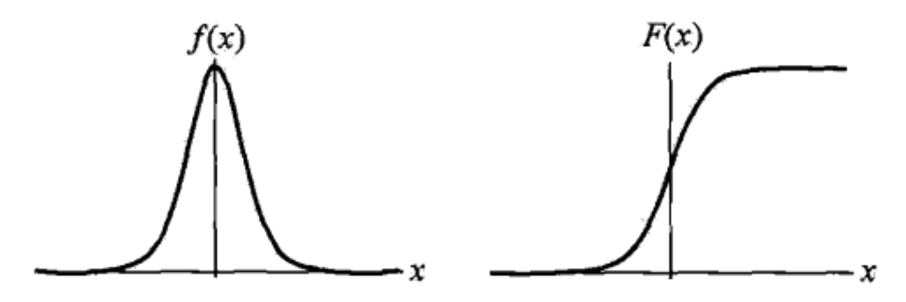
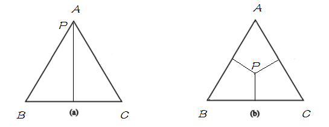
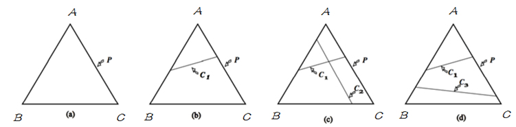

##
逻辑回归和最大熵模型

逻辑回归是统计学习中经典的**分类方法**。最大熵模型是**概率模型**学习的一个准则，将其推广到分类问题上得到**最大熵模型**（针对分类问题的）。逻辑回归和最大熵模型都属于**对数线性模型**。
###1、逻辑回归模型
####1.1、逻辑斯谛分布
**逻辑斯谛分布定义**： 设 $X$ 是连续的随机变量， $X$ 服从逻辑斯谛分布指的是具有如下分布和密度函数：
$$F(x)=P(X\leq x)=\frac{1}{1+e^{-(x-\mu)/\gamma}}$$
$$f(x)=F^{'}(x)=\frac{e^{-(x-\mu)/\gamma}}{\gamma(1+e^{-(x-\mu)/\gamma})^2}$$
其中，$\mu$ 表示位置参数，$\gamma \gt 0$ 为形状参数，如果位置参数为0，形状参数为1，那么逻辑斯谛分布可以化简为：
$$F(x)=P(X\leq x)=\frac{1}{1+e^{-x}}$$
$$f(x)=F^{'}(x)=\frac{e^{-x}}{(1+e^{-x})^2}$$
逻辑斯谛分布函数和密度函数如图，**分布函数属于逻辑斯谛函数**，常用的也是其**分布函数**，其图形是一条 S 形曲线，和sigmoid 函数曲线非常相似。该曲线关于点 $(\mu,\frac{1}{2})$ 中心对称，曲线在**中心点附近增长非常快**，在两端增长非常慢，形状参数 $\gamma$ 越小，曲线在中心点增长越快。

####1.2、二项逻辑回归模型
二项逻辑回归模型是一种分类模型，用于二分类，用条件概率分布 $P(Y|X)$ 表示，随机变量 $X$ 取实数值，随机变量 $Y$ 取0或者1，通过**监督学习**的方法来估计模型的参数。

**逻辑回归模型定义：**二项逻辑回归模型是如下条件概率
$$P(Y=1|x)=\frac{exp(w\cdot x+b)}{1+exp(w\cdot x+b)}$$
$$P(Y=0|x)=\frac{1}{1+exp(w\cdot x+b)}$$
其中 $w,\,b$ 是模型的参数，现在对于给定的输入 $x$ ，按照上面的公式计算概率，哪一类的概率大，就将  $x$ 分到哪一类。

有时为了方便，可以将偏置放到权重向量中去。$w=(w_1,w_2,...,w_n,b)\;,x=(x_1,x_2,...,x_n,1)$ 这样化简为：
$$P(Y=1|x)=\frac{exp(w\cdot x)}{1+exp(w\cdot x)}$$
$$P(Y=0|x)=\frac{1}{1+exp(w\cdot x)}$$

一个事件的几率是指，该事件发生概率与不发生概率的比值，如果一个事件的发生概率为 $p$ 那么这个事件发生的几率为 $\frac{p}{1-p}$ ，该事件的对数几率函数（logit）函数可以表示为：
$$logit(p)=log\frac{p}{1-p}$$
对逻辑斯谛而言，可以表示为：
$$logit(p)=log\frac{p}{1-p}=log\frac{P(Y=1|x)}{P(Y=0|x)}=w\cdot x$$
从上面可以看出，逻辑回归模型中，输出 $Y=1$ 的对数几率是输入 $x$ 的线性函数。**为什么叫逻辑回归呢？**先对输入进行线性变换 $w\cdot x$，其值域为实数域，这一步和回归模型非常相似，也许这就是为什么叫回归模型。通过逻辑回归的定义，直接将线性函数转换为概率。
$$P(Y=1|x)=\frac{exp(w\cdot x)}{1+exp(w\cdot x)}$$

####1.3、模型参数估计
逻辑回归模型进行监督学习时，对于给定的训练数据集，通常使用极大似然估计算法估计模型参数，从而得到我们要求的逻辑回归模型。
$$P(Y=1\;|\;x)=\pi(x),\quad P(Y=0\;|\;x)=1-\pi(x)$$
似然函数可以表示为：
$$\prod_{i=1}^{n}[\pi(x_i)]^{y_i}[1-\pi(x_i)]^{1-y_i}$$
对数似然函数可以表示为：
$$\begin{align*}
L(w)&=\sum_{i=1}^{n}\left[y_ilog\pi(x_i)+(1-y_i)log(1-\pi(x_i))\right]\\
&=\sum_{i=1}^{n}\left[y_ilog\frac{\pi(x_i)}{1-\pi(x_i)}+log(1-\pi(x_i))\right]\\
&=\sum_{i=1}^{n}\left[y_i(w\cdot x_i)-log(1+exp(w\cdot x_i)\right]\\
\end{align*}$$

对 $L(w)$ 求极大值，得到 $w$ 的估计值。这样就可以将问题转换成求极大似然估计的最优化问题了。求最优化问题，通常采用梯度下降或者拟牛顿法。

####1.4、多项逻辑回归
上面介绍的是二分类的逻辑回归，可以用于二分类问题。将其推广到多项逻辑回归模型，就能用于多分类。通常使用的是softmax多分类。假设离散随机变量 $Y$ 的取值集合是 $\{1,2,...,K\}$ 一共有K个类，那么多项逻辑回归就可以表示为：
$$P(Y=k|x)=\frac{exp(w_k\cdot x)}{1+\sum_{k=1}^{K-1}exp(w_k\cdot x)}$$
$$P(Y=K|x)=\frac{1}{1+\sum_{k=1}^{K-1}exp(w_k\cdot x)}$$
二项逻辑回归的参数估计方法也可以推广到多项逻辑回归。

###2、最大熵模型
####2.1、最大熵原理
MaxEnt 是概率模型学习中一个准则，其思想为：在学习概率模型时，所有可能的模型中**熵最大的模型是最好的模型**；若概率模型需要满足一些约束，则最大熵原理就是在满足已知约束的条件集合中选择熵最大模型。最大熵原理指出，**对一个随机事件的概率分布进行预测时，预测应当满足全部已知的约束，而对未知的情况不要做任何主观假设。在这种情况下，概率分布最均匀，预测的风险最小，因此得到的概率分布的熵是最大。**在没有更多的信息情况下，那些不确定的部分都是“等可能”的，最大熵模型就是通过用熵来描述**“等可能”**性。
假设随机变量 $X$ 的概率分布是 $P(X)$ ,则其熵表示为：
$$H(P)=-\sum_{x}p(x)logp(x)$$
熵满足下列不等式：
$$0\leq H(P) \leq log |X|$$
其中，$|X|\;表示\;X\;$的取值个数，如果是**均匀分布**，那么此时熵最大。
**例：**假设随机变量 $X$ 有5个取值 $\{A,B,C,D,E\}$，估计每个取值的概率 $P(A),P(B),P(C),P(D),P(E)$。
**解：**这些概率应该满足如下的约束条件，通过最大熵原理求解：
$$P(A)+P(B)+P(C)+P(D)+P(E)=1$$
如果没有其他的任何信息，我们对每个概率进行估计，我们根据最大熵原理，只能让他们等概率。
$$P(A)=P(B)=P(C)=P(D)=P(E)=\frac{1}{5}$$
等概论表示了对事实的无知，因为没有更多的信息，这种判断是合理的。有时我们可以从先验知识中获取一些对概率值的约束条件。例如：
$$P(A)+P(B)=\frac{3}{10}$$
$$P(A)+P(B)+P(C)+P(D)+P(E)=1$$
满足这个条件的概率分布依然有无穷多个，在缺乏其他信息的条件下，我们根据最大熵原理，可以认为 $A$ 和 $B$ 是等概率的，$C$ ，$D$，$E$ 是等概率的：
$$P(A)=P(B)=\frac{3}{20}$$
$$P(C)=P(D)=P(E)=\frac{7}{30}$$
为了方便起见，我们假设随机变量只有三个取值。如果用欧式空间中的 $simplex$ 来表示随机变量 $X$ 的话，则 $simplex$ 中三个顶点分别代表随机变量 $X$ 的三个取值 $A, B, C$ ， 这里定义 $simplex$  中任意一点 $p$ 到三条边的距离之和（恒等于三角形的高）为 1，点到其所对的边为该取值的概率，比如任给一点 $p$ ，则 $P(A)$ 等于 $p$ 到边 $BC$ 的距离，如果给定如下概率：
$$P(A)=1,P(B)=P(C)=0$$
$$P(A)=P(B)=P(C)=\frac{1}{3}$$
分别用下图表示以上两种情况：

明白了 $simplex$ 的定义之后，将其与概率模型联系起来，在 $simplex$ 中，不加任何约束，整个概率空间的取值可以是 $simplex$ 中的任意一点，只需找到满足最大熵条件的的即可；当引入一个约束条件 $C1$ 后，如下图中 $(b)$,模型被限制在 $C1$ 表示的直线上，则应在满足约束 $C1$ 的条件下来找到熵最大的模型；当继续引入条件 $C2$ 后，如图$(c)$，模型被限制在一点上，即此时有唯一的解；当 $C1$ 与 $C2$ 不一致时，如图$(d)$，此时模型无法满足约束，即无解。在 MaxEnt 模型中，由于约束从训练数据中取得，所以不会出现不一致。即不会出现 $(d)$ 的情况。

####2.2、最大熵模型的定义
**最大熵原理**是统计学习的一般原理，将它应用到**分类**得到**最大熵模型**。假设分类模型是一个条件概率分布 $P(Y|X)$ ，这个模型表示对于给定输入，以条件概率 $P(Y|X)$ 输出 $Y$。给定一个训练数据集：
$$T=\{(x_1,y_1),(x_2,y_2),...,(x_N,y_N)\}$$
学习的目标是用**最大熵原理**选择最好的**分类模型**。首先，模型应该满足约束条件，根据给定的数据集，我们可以得到联合概率分布 $P(X,Y)$ 的**经验分布**和边缘分布 $P(X)$ 的**经验分布**。分别用 $\tilde{P}(X,Y)$ 和 $\tilde{P}(X)$ 表示：
$$\tilde{P}(X=x,Y=y)=\frac{count(X=x,Y=y)}{N}$$
$$\tilde{P}(X=x)=\frac{count(X=x)}{N}$$
其中，$count(X=x,Y=y)$ 表示训练样本中 $(x,y)$ 出现的次数，$N$ 表示样本的容量。

用特征函数 $f(x,y)$ 描述输入 $x$ 和 输出 $y$ 之间满足某种关系。定义为：
$$
f(x,y)=\left\{
\begin{aligned}
1，&\quad x和y满足一定条件 \\
0，&\quad 否则 \\
\end{aligned}
\right.
$$
它是一个二值函数，特征函数可以是任意实值函数，满足条件时，取1，不满足条件时，取0。特征函数 $f(x,y)$ 关于经验分布 $\tilde{P}(X,Y)$ 的期望值，用 $E_{\tilde{P}}(f)$ 表示：
$$E_{\tilde{P}}(f)=\sum_{x,y}\tilde{P}(X,Y)\cdot f(x,y)$$

特征函数 $f(x,y)$ 关于模型 $P(Y|X)$ 和经验分布 $\tilde{P}(X)$ 的期望值，用 $E_{P}(f)$ 表示：
$$P(X,Y)=P(Y|X)\cdot P(X)$$
由于 $P(X)$ 不存在，所以我们这里简单的用 $\tilde{P}(X)$ 替代。
$$E_{P}(f)=\sum_{x,y}\tilde{P}(X)\cdot P(Y|X)\cdot f(x,y)$$

如果模型能够获取训练数据中的信息，也就是要让这**两个概率分布相近，才能更好的表示这个模型**。所以，这里如果他们的期望相等，这样的模型才是好模型，也就是：
$$E_{P}(f)=E_{\tilde{P}}(f)$$
我们认为期望相等是他们的约束条件，假如有 $n$ 个特征函数，那就有 $n$ 个约束条件。

**最大熵模型定义：**
假设满足所有约束条件的模型集合为，使用最大熵原理选择最优模型：
$$C\equiv \{P \in M \;|\;E_{P}(f_i)=E_{\tilde{P}}(f_i),i=1,2,...,n\}$$
定义条件概率 $P(Y|X)$ 上的条件熵为：

$$\begin{align*}
H(Y|X) &=-\sum_{x,y}P(x,y)logP(y|x)\\
&=-\sum_{x,y}\tilde{P}(x)\cdot P(y|x)logP(y|x)\\
\end{align*}
$$
在模型集合 $C$ 中条件熵最大的模型成为最大熵模型。

####2.3、最大熵模型的学习
最大熵模型的**学习过程**就是**求解最大熵模型**的过程。最大熵模型的学习可以形式化为约束最优化问题。对于给定的数据集 $T=\{(x_1,y_1),(x_2,y_2),...,(x_N,y_N)\}$ 以及特征函数 $f_i(x,y)\;i=1,2,...,n$ ，最大熵模型学习等价于约束问题最优化问题：

$$\begin{align*}
\mathop{\max}_{P\in C} \quad  H(Y|X) &=-\sum_{x,y}\tilde{P}(x)\cdot P(y|x)logP(y|x)\\\\
E_{P}(f_i) &=E_{\tilde{P}}(f_i),i=1,2,...,n\\\\
&\sum_{y}P(y|x)=1
\end{align*}
$$

对于约束最优化问题，我们通常将问题等价于求最小值问题：
$$\begin{align*}
\mathop{\min}_{P\in C} \quad  -H(Y|X) &=\sum_{x,y}\tilde{P}(x)\cdot P(y|x)logP(y|x)\\\\
E_{P}(f_i) &=E_{\tilde{P}}(f_i),i=1,2,...,n\\\\
&\sum_{y}P(y|x)=1
\end{align*}
$$
对上述问题求最优化问题，得到的解，就是最大熵模型的解，对于约束问题最优化，我们可以采用拉格朗日对偶优化原则，第一对偶简单，第二很多直接求优化的问题求不出来，但是对偶问题能够求出来。所以这里将最优化原始问题**(有约束)**转换成**无约束最优化的对偶问题**。通过求解对偶问题，来解决最优化问题。

首先引入拉格朗日乘子，$w_0,w_1,...,w_n$，定义拉格朗日函数 $L(P,w)$，由于拉格朗日是一个凸函数，**求参数 $w$ 时，我们要求最大化才能得到模型参数**:
$$\begin{align*}
L(P,w) &\equiv -H(P)+w_0\left(1-\sum_{y}P(y|x)\right)+\sum_{i=1}^{n}w_i\left[E_{P}(f_i) -E_{\tilde{P}}(f_i)\right]\\\\
&=\sum_{x,y}\tilde{P}(x)\cdot P(y|x)logP(y|x)+w_0\left(1-\sum_{y}P(y|x)\right)+\\\\
& \quad \sum_{i=1}^{n}w_i\left[\sum_{x,y}\tilde{P}(x,y)\cdot f_i(x,y)-\sum_{x,y}\tilde{P}(x)\cdot P(y|x)\cdot f_i(x,y) \right]\\\\
\end{align*}
$$

最优化的原始问题为，先求极大化，以参数 $w$ 作为变量，其他的作为常量，求导，导数为0的地方取得最大值：
$$\mathop{\min}_{P\in C} \mathop{\max}_{w}L(P,w)$$

对偶问题为，通过定理可以证明，对偶问题的最优解，就是原问题的最优解，通常将原问题转换成对偶问题，容易求：
$$\mathop{\max}_{w} \mathop{\min}_{P \in C}L(P,w)$$
求解对偶问题，先需要极小化拉格朗日函数 $L(P,w)$ 关于 $P$ 的最小值。极小化之后得到的是关于 $w$ 的函数：
$$\psi(w)=\mathop{\min}_{P \in C}L(P,w)=L(P_w,w)$$
$\psi(w)$称为对偶函数，是一个关于 $w$ 的函数，同时其解记为：
$$P_w=\mathop{\arg \min}_{P \in C}L(P,w)=P_w(y|x)$$
具体求极小值的过程如下，先将拉格朗日函数 $L(P,w)$ 对 $P(y|x)$ 求偏导，这里**不能直接利用 $\sum_{y}P(y|x)=1$**，因为这个条件已经将其统一到拉格朗日内部去了：
$$\begin{align*}
\frac{\partial L(P,w)}{\partial P(y|x)}&=\sum_{x,y}\tilde{P}(x)\cdot (logP(y|x)+1)-\sum_{y}w_0-\sum_{x,y}\tilde{P}(x)\cdot \sum_{i=1}^{n}w_if_i(x,y)\\\\
&=\sum_{x,y}\tilde{P}(x)\left(logP(y|x)+1-w_0-\sum_{i=1}^{n}w_if_i(x,y)\right)
\end{align*}$$
求极值时，导数为0，由于在 $\tilde{P}(x) \gt 0$ 的条件下，我们可以得到：
$$\begin{align*}
log P(y|x)=\sum_{i=1}^{n}w_if_i(x,y)+w_0-1
\end{align*}$$
所以可以得到：
$$\begin{align*}
P(y|x)&=exp\left(\sum_{i=1}^{n}w_if_i(x,y)+w_0-1\right)\\\\
&=\frac{exp\left(\sum_{i=1}^{n}w_if_i(x,y)\right)}{exp(1-w_0)}
\end{align*}$$

根据已知条件 $\sum_{y}P(y|x)=1$ ，所以有：
$$\sum_{y}P(y|x)=\frac{\sum_{y}exp\left(\sum_{i=1}^{n}w_if_i(x,y)\right)}{exp(1-w_0)}=1$$
所以我们可以假设归一化因子 $Z_w(x)$ 为：
$$Z_w(x)=exp(1-w_0)=\sum_{y}exp\left(\sum_{i=1}^{n}w_if_i(x,y)\right)$$

现在求出的**最大熵模型为**，这里只是针对一个 $(x,y)$：
$$P_w(y|x)=\frac{1}{Z_w(x)}exp\left(\sum_{i=1}^{n}w_if_i(x,y)\right)$$
得到最大熵模型之后，我们需要求解对偶问题外部的极大化问题
$$\mathop{max}_w \psi(w)$$
这就是说，可以应用最优化算法求解对偶函数 $\psi(w)$ 极大化，得到 $w^*$，用来表示 $P^* \in C$，这里 $P^*=P_{w^*}=P_{w^*}(y|x)$ 是学习得到的最优模型**（最大熵模型）**，也就是说，最大熵模型的学习归结为**对偶函数 $\psi(w)$ 的极大化，对偶问题的极大化，等价于最大熵模型的极大似然估计。 **

**例子，针对下面问题求最大熵模型学习的最优化问题**
$$\begin{align*}
min \quad -H(P) &=\sum_{i=1}^{5}P(y_i)log P(y_i)\\
s.t. \quad P(y_1)+P(y_2) &=\tilde{P}(y_1)+tilde{P}(y_2)=\frac{3}{10}\\
\sum_{i=1}^{5}P(y_i)&=\sum_{i=1}^{5}\tilde{P}(y_i)=1
\end{align*}$$
引入拉格朗日乘子 $w_0,w_1$，得到拉格朗日函数如下：
$$L(P,w)=\sum_{i=1}^{5}P(y_i)log P(y_i)+w_0\left(\sum_{i=1}^{5}P(y_i)-1\right)+w_1\left(P(y_1)+P(y_2)-\frac{3}{10}\right)$$
通过求解拉格朗日函数的对偶问题得到原问题的最优解：
$$\mathop{\max}_{w} \mathop{\min}_{P \in C}L(P,w)$$
首先求解 $L(P,w)$ 关于 $P$ 的极小化问题。为此，固定 $w_0,w_1$，求偏导数：
$$\begin{align*}
\\
\frac{\partial L(P,w)}{\partial P(y_1)} &=1+log P(y_1)+w_0+w_1\\\\
\frac{\partial L(P,w)}{\partial P(y_2)} &=1+log P(y_2)+w_0+w_1\\\\
\frac{\partial L(P,w)}{\partial P(y_3)} &=1+log P(y_3)+w_0\\\\
\frac{\partial L(P,w)}{\partial P(y_4)} &=1+log P(y_4)+w_0\\\\
\frac{\partial L(P,w)}{\partial P(y_5)} &=1+log P(y_5)+w_0\\
\end{align*}$$

令偏导数为0，可以得到：
$$\begin{align*}
P(y_1)=P(y_2)&=e^{-1-w_0-w_1}\\
P(y_3)=P(y_4)=P(y_5)&=e^{-1-w_0}\\
\end{align*}$$
将结果带入拉格朗日函数得到，得到一个关于 $w$ 的最大熵模型：
$$\mathop{\min}_{P}L(P,w)=-2e^{-1-w_0-w_1}-3e^{-1-w_0}-\frac{3}{10}w_1+w_0$$
对得到的最大熵模型求极大化，也就是分别对 $w_0,w_2$ 求偏导数，可以得到：
$$\begin{align*}
e^{-1-w_0-w_1}=\frac{3}{20}\\
e^{-1-w_0}=\frac{7}{30}\\
\end{align*}$$
最后得到的概率分布为：
$$P(y_1)=P(y_2)=\frac{3}{20}$$
$$P(y_3)=P(y_4)=P(y_5)=\frac{7}{30}$$

####2.4、极大似然估计
对偶函数 $\psi(w)$ 等价于最大熵模型的似然函数，所以可以通过求**最大熵模型的极大似然估计得到对偶函数的极大化**。下面证明**对偶函数 $\psi(w)$ 等价于最大熵模型的似然函数**:

已知训练数据的经验概率分布 $\tilde{P}(X,Y)$，条件概率分布 $P(Y|X)$ 的对数似然函数表示为：
$$L_{\tilde{P}}(P_w)=log \prod_{x,y}P(y|x)^{\tilde{P}(x,y)}=\sum_{x,y}{\tilde{P}(x,y)}log P(y|x)$$
当条件概率分布 $P(y|x)$ 表示最大熵模型时，**这里 $P_w$ 只是为了表示方便，并没有什么关系** ，可以得到：
$$\begin{align*}
\\
L_{\tilde{P}}(P_w)&=\sum_{x,y}{\tilde{P}(x,y)}log P(y|x)\\\\
&=\sum_{x,y}{\tilde{P}(x,y)}\left[log\frac{exp\left(\sum_{i=1}^{n}w_if_i(x,y)\right)}{Z_w(x)}\right]\\\\
&=\sum_{x,y}{\tilde{P}(x,y)}\sum_{i=1}^{n}w_if_i(x,y)-\sum_{x,y}{\tilde{P}(x,y)}log Z_w(x)\\\\
&=\sum_{x,y}{\tilde{P}(x,y)}\sum_{i=1}^{n}w_if_i(x,y)-\sum_{x}{\tilde{P}(x)}log Z_w(x)\\\\
\end{align*}$$

假设通过对拉格朗日函数求关于模型P的最小值，对于的最优值为 $P_w$，带入拉格朗日函数，得到对偶函数，利用$\sum_{y}P_w(y|x)=1$，可以化简得到：
$$\begin{align*}
\psi(w)&=\mathop{\min}_{P\in C}L(P,w)=L(P_w,w)\\
&=\sum_{x,y}\tilde{P}(x)\cdot P_w(y|x)logP_w(y|x)+w_0\left(1-\sum_{y}P_w(y|x)\right)+\\\\
& \quad \sum_{i=1}^{n}w_i\left[\sum_{x,y}\tilde{P}(x,y)\cdot f_i(x,y)-\sum_{x,y}\tilde{P}(x)\cdot P_w(y|x)\cdot f_i(x,y) \right]\\\\
&=\sum_{x,y}\tilde{P}(x)\cdot P_w(y|x)logP_w(y|x)+\sum_{i=1}^{n}w_i\left[\sum_{x,y}\tilde{P}(x,y)\cdot f_i(x,y)-\sum_{x,y}\tilde{P}(x)\cdot P_w(y|x)\cdot f_i(x,y) \right]\\\\
&=\sum_{x,y}\tilde{P}(x)\cdot P_w(y|x)logP_w(y|x)+\left[ \sum_{x,y}\tilde{P}(x,y)\cdot \sum_{i=1}^{n}w_i f_i(x,y)-\sum_{x,y}\tilde{P}(x)\cdot P_w(y|x)\cdot \sum_{i=1}^{n}w_if_i(x,y)\right]\\\\
&=\sum_{x,y}\tilde{P}(x,y)\cdot \sum_{i=1}^{n}w_i f_i(x,y)+\sum_{x,y}\tilde{P}(x)\cdot P_w(y|x)\left(logP_w(y|x)-\sum_{i=1}^{n}w_if_i(x,y)\right)\\\\
&=\sum_{x,y}\tilde{P}(x,y)\cdot \sum_{i=1}^{n}w_i f_i(x,y)-\sum_{x,y}\tilde{P}(x)\cdot P_w(y|x)log Z_w(x) \quad将P_w(y|x)最大熵模型带入\\\\
&=\sum_{x,y}\tilde{P}(x,y)\cdot \sum_{i=1}^{n}w_i f_i(x,y)-\sum_{x}\tilde{P}(x)log Z_w(x) \quad利用\sum_{y}P_w(y|x)=1，求解\\\\
\end{align*}$$
通过对最大熵模型求极大似然估计和对对偶函数求 $\psi(w)$ 求极大值，可以发现，两者函数式相同。所以可以通过求**最大熵模型的极大似然估计得到对偶函数的极大化**。下面证明**对偶函数 $\psi(w)$ 等价于最大熵模型的似然函数**。
这样，最大熵模型的学习问题就转换成具体的求解对数似然函数极大化或者对偶函数极大化的问题。最大熵模型的一般形式为：
$$P_w(y|x)=\frac{1}{Z_w(x)}exp\left(\sum_{i=1}^{n}w_if_i(x,y)\right)$$
归一化因子 $Z_w(x)$ 为：
$$Z_w(x)=exp(1-w_0)=\sum_{y}exp\left(\sum_{i=1}^{n}w_if_i(x,y)\right)$$
最大熵模型与逻辑回归模型有类似的形式，他们都是对数线性模型，模型学习就是在给定的训练数据条件下对摸进行极大似然估计或正则化极大似然估计。
###3、模型学习的优化算法
逻辑回归模型、最大熵模型学习归结为以**似然函数为目标的最优化问题**。通常采用迭代求解，能保证找到最优解，常用的方法有改进的迭代尺度法、梯度下降法、牛顿法或拟牛顿法。**牛顿法或拟牛顿法一般收敛速度更快**，但是工业上使用最多的是**梯度下降法**。已知最大熵模型可以表示为：
$$P_w(y|x)=\frac{1}{Z_w(x)}exp\left(\sum_{i=1}^{n}w_if_i(x,y)\right)$$
归一化因子 $Z_w(x)$ 为：
$$Z_w(x)=\sum_{y}exp\left(\sum_{i=1}^{n}w_if_i(x,y)\right)$$
####3.1、通用迭代尺度法GIS
**算法基本流程**
+ 初始化所有的 $w_i$ 为任意值，一般可以设置为0，即：
$$w_i^{(0)}=0\quad i \in\{1,2,...,n\}$$
其中 $w$ 的上标 $(t)$ 表示第 $t$ 轮迭代，下标 $i$ 表示第 $i$ 个特征，$n$ 是特征总数。

+ 重复下面的权值更新直至收敛：
$$w_i^{(t+1)}=w_i^{(t)}+\frac{1}{C}log\frac{E_{\hat{p}}(f_i)}{E_{p}(f_i)}$$
收敛的判断依据可以是 $w_i$ 前后两次的差足够小。其中 $C$ 一般取所有样本数据中最大的特征数量。

最原始的最大熵模型的训练方法是一种称为通用迭代算法 GIS(generalized iterative scaling) 的迭代算法。GIS 的原理并不复杂，大致可以概括为以下几个步骤：
+ 假定第零次迭代的初始模型为等概率的**均匀分布**。

+ 用第 N 次迭代的模型来估算每种信息特征在训练数据中的分布，如果超过了实际的，就把相应的模型参数变小；否则，将它们变大。

+ 重复步骤 2 直到收敛。

####3.2、改进的迭代尺度法IIS
最大熵模型的对数似然函数可以表示为：
$$L(w)=\sum_{x,y}\tilde{P}(x,y)\sum_{i=1}^{n}w_if_i(x,y)-\sum_{x}\tilde{P}(x)logZ_w(x)$$
目标是通过极大似然估计学习模型参数，求对数似然函数的极大值 $\hat{w}$.
现在有了对数似然方程，接下来只需要求极值可以了，但你会发现，该似然方程相当复杂，对它各个参数直接求偏导时，每个参数 $w_i$ 中还包含另外的 $w$ 参数，这就导致每个参数无法独立的更新，很难求出 $L(w)$ 的极大值。

于是IIS的一个想法是：既然我不知道原始参数如何变化，我就给你一个变化量 $\delta$，对于每个参数 $w_i$ 对应于一个变化量为 $\delta_i$，新的参数向量 $w+\delta$ ，使得模型的对数似然函数值增加。所以，上述式子就可以表示为：
$$L(w+\delta)-L(w)=A(\delta|w)$$
注意 $w$ 是相对固定的，而 $\delta$ 是在变化的，有了这样的等式后，我们无非就开始研究函数  $A(\delta|w)$ 。什么情况下，$L(w)$ 达到极值？首先 $A(\delta|w)$ 的值应该大于0，且为正数情况下，应该令其最大（其实就是求 $A(\delta|w)$ 的极值）。这样 $L(w+\delta)$ 将增大，且增大的步长最大。

所以该问题就变成了研究 $A(\delta|w)$ 的极值了，所以我们把 $A(\delta|w)$ 的表达式写出来。分别代入$w+\delta$ 和 $w$ 得：
$$\begin{align*}\\
L(w+ \delta ) - L(w) &=\sum_{x,y}\tilde P(x,y) log P_{w+\delta}(y|x)-\sum_{x,y}\tilde P(x,y) log P_{w}(y|x)\\
&=\sum_{x,y}\tilde P(x,y)\sum_{i=1}^n\delta_if_i(x,y)- \sum_{x}\tilde{P}(x)log\frac{Z_{w+\delta}(x)}{Z_w(x)}\\
& \ge \sum_{x,y}\tilde P(x,y)\sum_{i=1}^n\delta_if_i(x,y)+1- \sum_{x}\tilde{P}(x)\frac{Z_{w+\delta}(x)}{Z_w(x)}\\
&= \sum_{x,y}\tilde P(x,y)\sum_{i=1}^n\delta_if_i(x,y) +1- \sum_x \tilde  P(x)\sum_y P_w(y|x)exp(\sum_{i=1}^n\delta_if_i(x,y))
\end{align*}$$
其中利用了不等式 $-log\alpha \ge 1-\alpha$

为什么是不等式，因为原式无法对它进一步求导分析，**所以需要近似的下界**，来缓解这种尴尬的情况。但当我们得到 $A(\delta|w)$ 时，对它继续求导试试，你会发现同样的问题，参数 $\delta_i$ 关联了其他参数 $\delta$，依然无法独立，所以咱们得想办法进一步降低下界，呵呵，书中引进了计数函数 $f^\#(x,y) = \sum_{i=1}^n f_i (x,y)$，再利用Jensen不等式完美的解决了这个问题。于是，经过层层推导，下界再一次被刷新！即为：
$$B(\delta | w) = \sum_{x,y}\tilde P(x,y)\sum_{i=1}^n\delta_if_i(x,y) +1
- \sum_x \tilde P(x)\sum_y P_w(y|x)\sum_{i=1}^n (\frac{f_i(x,y)}{f^{\#}(x,y)})exp(\delta_if^{\#}(x,y))$$

你会发现一个神奇的现象，原本在exp中的所有参数累加，在最新的下界中消失不见了，没错，这就是神奇的jessen不等式功效，然后你再对 $B(\delta|w)$ 求偏导试试，呵呵，所以的参数能够独立计算了，于是我们得到一个迭代更新公式：
$$L(w+\delta)-L(w)\ge B(\delta|w)$$
$$\sum_{x,y}\tilde P(x)P_w(y|x)f_i(x,y)exp(\delta_i,f^{\#}(x,y)) = E_{\tilde p}(f)$$
简单的方程，给出初始值，不断迭代就完事了。最终每个 $\delta$ 将收敛于某个稳定的值。而此时的 $L(w)$ 将走到极大值。

于是，依次对 $\delta_i$ 求解方程，可以得到 $\delta$

**改进的迭代尺度算法IIS：**
输入：特征函数$f_1,f_2,...,f_n$；经验分布 $\tilde P(X,Y)$，最大熵模型 $P_w(y|x)$
输出：最优参数值 $w_i^{*}$；最优模型 $P_{w^*}$
+ 对所有 $i \in \{1,2,...,n\}$，取初值 $w_i=0$

+ 对每个 $i \in \{1,2,...,n\}$:

   - 令 $\delta_i$ 是方程的解
$$\sum_{x,y}\tilde P(x)P_w(y|x)f_i(x,y)exp(\delta_i,f^{\#}(x,y)) = E_{\tilde p}(f)$$
其中，$f^{\#}(x,y)=\sum_{i=1}^{n}f_i(x,y)$

   - 更新 $w_i$ 值： $w_i \to w_i+\delta_i$

+ 若果不是所有的 $w_i$ 都收敛，重复上一步

这个算法的关键一步是，求解方程中的 $\delta_i$，如果 $f^{\#}(x,y)$ 是常数，也就是说IIS要求**每个训练数据的特征数量相同** ，即对任何 $x,y$，都有 $f^{\#}(x,y)=M$，例如一共有10个特征，对于每个样本，要求他们只包含其中的3个特征，那么 $\delta_i$ 就可以显示的表示成，这一部分和GIS一样：
$$\delta_i=\frac{1}{M}log \frac{E_\tilde P(f_i)}{E_P(f_i)}$$
如果 $f^{\#}(x,y)$ 不是常数，**那么必须通过数值计算求 $\delta_i$**。简单有效的方法是牛顿法，用 $g(\delta_i)=0$ 表示要求解的方程，牛顿法通过迭代的方式求的 $\delta_i^*$ ，使得  $g(\delta_i^*)=0$ ，迭代公式为：
$$\delta_i^{(k+1)}=\delta_i^{(k)}-\frac{g(\delta_i^{(k)})}{g^{'}(\delta_i^{(k)})}$$
只要选取适当的初始值 $\delta_i^{(0)}$ ，由于方程有单根，因此牛顿法一定会收敛，并且收敛速度比较快。
####3.3、拟牛顿法
最大熵模型学习还可以使用牛顿法或者拟牛顿法，对于最大熵模型有：
$$P_w(y|x)=\frac{exp\left[\sum_{i=1}^{n}w_if_i(x,y)\right]}{\sum_yexp\left[\sum_{i=1}^{n}w_if_i(x,y)\right]}$$
建立目标函数：
$$\begin{align*}
\mathop{\min}_{w\in R^*} - \psi(w) &=\sum_{x}\tilde{P}(x)logZ_w(x)-\sum_{x,y}\tilde{P}(x,y)\sum_{i=1}^{n}w_if_i(x,y)\\
&=\sum_{x}\tilde{P}(x)log \sum_y exp\left(\sum_{i=1}^{n}w_if_i(x,y)\right)-\sum_{x,y}\tilde{P}(x,y)\sum_{i=1}^{n}w_if_i(x,y)\\
\end{align*}$$
梯度：
$$g(w)=\left(\frac{\partial f(w)}{\partial w_1},\frac{\partial f(w)}{\partial w_2},...,\frac{\partial f(w)}{\partial w_n}\right)^T$$
其中:
$$\frac{\partial f(w)}{\partial w_i}=\sum_{x,y}\tilde P(x) P_w(y|x)f_i(x,y)-E_{\tilde P}(f_i)$$
具体的可以使用 **BFGS**算法进行求解
