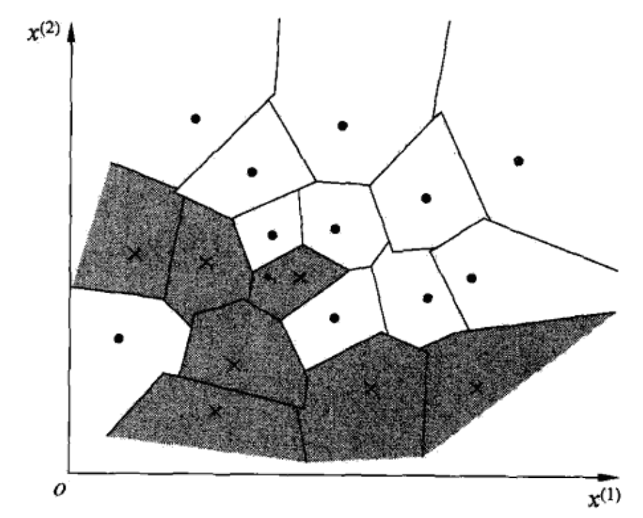
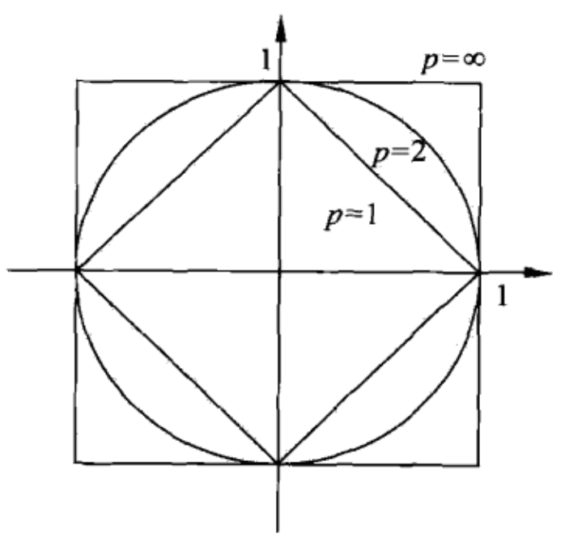
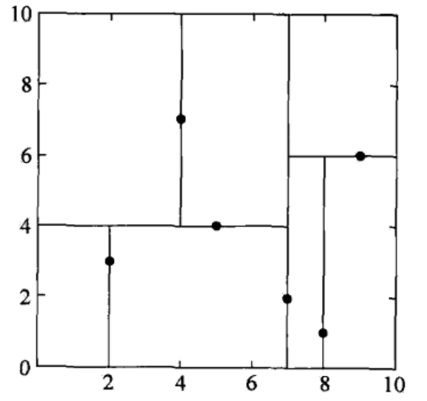
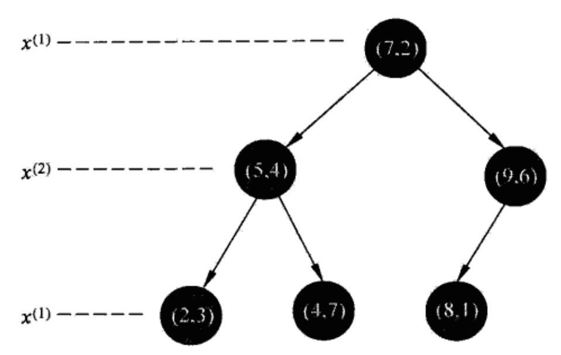
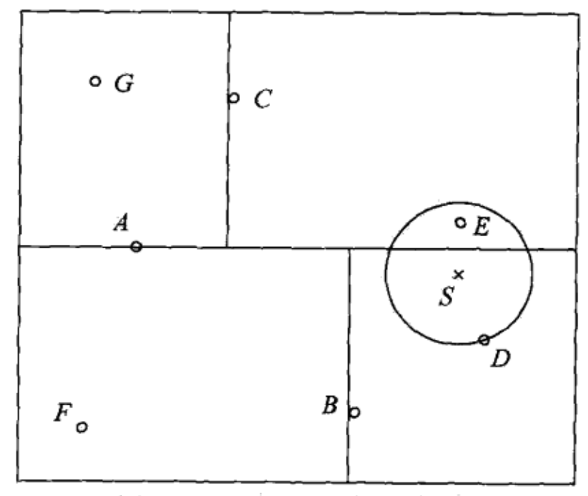

##
$k$ 近邻法

$k$ 近邻法是一种基本的**分类与回归**方法，这里我们只讨论分类问题，$k$ 近邻输入为实例的特征向量，对应于特征空间的点，输出为实例的类别，可以取多类。$k$ 近邻法假设给定一个训练数据集，其中的类别已定，分类时，对新的实例，根据其 $k$ 个近邻的训练实例的类别，通过多数表决的方式，来确定这个新实例的类别。$k$ 近邻不具备显示的学习过程，$k$ 近邻法实际上利用**训练数据集对输入特征空间进行划分**。$k$ 近邻法的三要素为：**$k$ 值的选择，距离度量，分类决策规则**
###1、$k$ 近邻算法
$k$ 近邻算法简单，直观：给定一个训练数据集，对新的输入实例，在训练数据集中**找到与该实例最邻近的 $k$ 个实例，这 $k$ 个实例的多数属于某个类**，就把该输入实例分为这个类，**可用于多分类问题**。

**$k$ 近邻算法**

输入：训练数据集 $T$，输出类别 $y_i\in\{c_1,c_2,...,c_K\}$

输出：实例 $x$ 所属的类别 $y$

+ 根据给定的距离度量，在训练数据集 $T$ 中找出与 $x$ 最近邻的 $k$ 个点，涵盖这 $k$ 个点的 $x$ 的邻域记作 $N_k(x)$

+ 在 $N_k(x)$ 中根据分类决策规则（如多数表决）决定 $x$ 的类别 $y$

$k$ 近邻算法的特殊情况是 $k=1$ 的情形，叫做最近邻算法。对于最近邻算法，对新实例，选择一个与实例最近的已知实例的类别作为其类别，可以看出 $k$ 近邻没有显示的学习过程。

###2、$k$ 近邻模型
$k$ 近邻法使用的模型实际上对应于特征空间的划分，模型由由三个基本要素组成：**距离度量，$k$ 值选择，分类决策规则**
####2.1、模型
特征空间中，对每个训练实例点 $x_i$，距离该点比其他点更近的所有点组成一个区域，叫做单元**(cell)**，每个训练实例有一个所属单元，所有实例组成对一个特征空间的划分，这就是一个二维的特征划分的例子，如果所示：

.

####2.2、距离度量
特征空间中两个**实例点的距离**，是两个实例相似程度的反应，在 $k$ 近邻模型中，特征空间一般是 $n$ 维实数向量空间 $R^n$，所以使用的距离通常是**欧式距离**，但也可以是其他的一般距离公式**曼哈顿距离**。

设特征空间 $\mathcal{X}$ 是 $n$ 维实数向量空间 $R^n$，$x_i,x_j \in \mathcal{X}$，其中 $x_i=(x_i^1,x_i^2,...,x_i^n)^T$，那么 $x_i,x_j$ 的 $L_p$ 距离公式为：
$$L_p(x_i,x_j)=\left(\sum_{l=1}^{n}\left|x_i^l-x_j^l\right|^p\right)^\frac{1}{p}$$

这里 $p \geq 1$ ，当 $p=2$ 时，称为欧式距离，即：
$$L_2(x_i,x_j)=\left(\sum_{l=1}^{n}\left|x_i^l-x_j^l\right|^2\right)^\frac{1}{2}$$

当 $p=1$ 时，称为曼哈顿距离，即：
$$L_1(x_i,x_j)=\sum_{l=1}^{n}\left|x_i^l-x_j^l\right|$$

当 $p=\infty$ 时，表示选择每个特征距离最大值作为他们之间的距离，即：
$$L_\infty(x_i,x_j)=\max_{l}\left|x_i^l-x_j^l\right|$$

如下图，给出二维空间中 $p$ 取不同值时，与原点的 $L_p$ 距离为1 的点的图形

.

由于距离度量的不同，确定的最近邻也可能不同，所以选择合适的距离度量非常重要。

**例如**：已知二维空间的3个点 $x_1=(1,1)^T，x_2=(5,1)^T，x_3=(4,4)^T$，求在 $p$ 取不同值时，$L_p$ 距离下 $x_1$ 的最近邻。

$$L_1(x_1,x_2)=4\quad L_2(x_1,x_2)=4\quad L_3(x_1,x_2)=4\quad L_4(x_1,x_2)=4$$
$$L_1(x_1,x_3)=6\quad L_2(x_1,x_3)=4.24\quad L_3(x_1,x_3)=3.78\quad L_4(x_1,x_3)=3.57$$

从上面计算可以看出，$p=1 或者 2$ 时，$x_2$是$x_1$ 的最近邻，$p \geq 3$ 时，$x_3 是 x_1$ 的最近邻。

####2.3、$k$ 值的选择
$k$ 值的选择，会对 $k$ 近邻算法产生重要的影响。如果选择较小的 $k$，那么只会选择与之接近的实例，这样计算出来的误差会减小，但是这样就导致**估计误差增加**，预测的结果对近邻的结果非常敏感，如果近邻的数据存在噪声，那么就会导致预测出错。**$k$ 值的减小，意味着模型变得复杂，容易发生过拟合**。

如果选择较大的 $k$ 值，就相当与选择一个较大的邻域进行预测，这样会导致**估计误差变小，但是近似误差增大**。与实例不相似的点也会起决策作用，使预测发生错误。**$k$ 值的增大，意味着模型变得简单**。

在应用中，通常选择一个较小的 $k$ 值，然后使用交叉验证的方法来选取最优的 $k$ 值。

####2.4、分类决策规则
$k$ 近邻法中的分类决策规则往往是多数表决，有输入实例的 $k$ 个近邻的训练实例中的，多数类别决定输入实例的类。

多数表决规则有如下解释，如果分类损失函数为0-1损失，分类函数为：
$$f:R^n \to \{c_1,c_2,...,c_K\}$$
那么误分类的概率是:
$$P(Y \neq f(X))=1-P(Y = f(X))$$
给定的实例 $x \in \mathcal{X}$，其最近邻的 $k$ 个训练实例点构成集合 $N_{k}(x)$，假设这个邻域最后输出的类别是 $c_j$ 那么，误分类的概率为：
$$\frac{1}{k}\sum_{x_i\in N_{k}(x)}I(y_i \ne c_j)=1-\frac{1}{k}\sum_{x_i\in N_{k}(x)}I(y_i = c_j)$$
要是误分类概率最小，也就是经验风险最小，就要使 $\sum_{x_i\in N_{k}(x)}I(y_i = c_j)$ 最大，所以多数表决规则等价于经验风险最小化，**没有加入正则化系数**。

###3、$k$ 近邻法的实现：$kd$ 树
实现 $k$ 近邻算法时，主要考虑的问题包括对训练数据进行快速 $k$ 近邻搜索，这在大量数据时，非常重要。 $k$ 近邻算法的**最简单实现方法是线性扫描**。这是需要计算输入实例与每一个训练实例之间的距离，当数据量非常大的时候，非常费时。使用 $kd$ 树是一个非常好的选择。**$kd$ 树是存储 $k$ 维空间数据的树结构，与$k$ 近邻的值物理含义不同**。
####3.1、构造 $kd$ 树
$kd$ 树是一种对** $k$ 维空间**中的实例点进行存储，以便于对其进行**快速检索的树形数据结构**。$kd$ 树是一种二叉树，表示对 $k$ 维空间的一个划分。

构造 $kd$ 树相当于不断地用**垂直坐标轴**的超平面将 $k$ 维空间切分，构成一系列的超矩形区域。通常，依次选择坐标轴对空间切分，选择训练实例点坐标轴上的**中位数为切分点**，这样能够保证平衡。水平和垂直交替进行。通常第一刀为**垂直**。注意平衡的 $kd$ 搜索树**效率未必是最优的**。

**构造平衡 $kd$ 树：**
输入：$k$ 维空间数据集 $T=\{x_1,x_2,...,x_N\}$
输出：$kd$ 树
+ 开始：构造根节点，让根节点对应于 $k$ 维空间的超矩形区域。
  - 任意选择一个特征维度，将所有数据按照这个维度分成左右两部分，以他们的**中位数**作为切分点，**注意这里的中位数一定是包含一个点的位置，不是加权平均**，建立一个超平面**垂直于该维度坐标轴**。
  
  - **将落在切分平面上的点作为根节点。**

+ 重复：将上面切分好的两个区域，任意选择另外的一个维度作为切分维度，计算该坐标下的中位数位置，然后用一个超平面切分。两个子区域都使用这个方法。

+ 直到两个子区域没有实例点的时候停止。

**例子：**给定一个二维空间的数据集如下，请构造一颗平衡 $kd$ 树：
$$T=\{(2,3)^T,(5,4)^T,(9,6)^T,(4,7)^T,(8,1)^T,(7,2)^T\}$$
根节点对应于包含数据集 $T$ 的矩形，选择第一维作为切分坐标，计算中位数，可以发现这时的中位数为5和7的平均数，**但是这里必须是一个存在的数据**，所以我们选择其中一个，就选择7。接着使用另外一个维度来切分数据，计算方法还是一样的，可以发现对应的中位数为4和6，继续切分，**直到子区域没有实例为止**。

.

####3.2、搜索 $kd$ 树
根据上面构造的 $kd$ 对任意的输入实例找出其 $k$ 近邻。从图中可以看出，搜索时，可以省去大部分数据的搜索。现在假设需要搜索最近邻，对于 $k$ 近邻也是类似的。

.

**用 $kd$ 树的最近邻搜索算法**
输入：已构造的 $kd$ 树，目标点 $x$
输出：$x$ 的最近邻
+ 在 $kd$ 树中找出包含目标点 $x$ 的叶节点。具体做法是，从根节点出发，递归向下访问 $kd$ 树，如果目标点 $x$ 的当前维度的坐标小于切分点的坐标，则移动到左边，否则移动到右边，直到子节点为叶节点为止。

+ 以此叶节点作为 “当前最近点”

+ 递归向上回退，在每个节点进行以下操作：
 - 如果该节点保存的实例点比当前最近距离目标点更近，**需要临时计算**，那么就替换。
 
 - 检查**当前最近节点的父节点**的另外一个子区域，搜索是否有更近的节点，具体的做法是，以目标节点为圆心，与最近点的距离作为半径，判断这个子区域是否存在一点在超球体内部。如果没有，继续回退。
 - 当回退到根节点时，搜索结束，当前的“最近点”就是我们要求的点。

下面通过一个实例来计算最近邻。如图根节点是A,其子节点是B，C等。现在输入目标实例 S，求其最近邻。

首先在 $kd$ 树中找到包含 S 的叶节点 D，这里还有一条线没有画。以叶节点D作为最近邻。返回到D的父节点B，在B的另一个子区域F中搜索最近邻，发现与超球体不想交，不存在。继续回退，回退到B的父节点A，在A的一个子区域C，这个区域与超球体相交。检测C发现，距离太大，然后探索其子区域E和G，发现G与超球体不想交。探索E，发现E比D更近，所以最后选择的是E。

.

