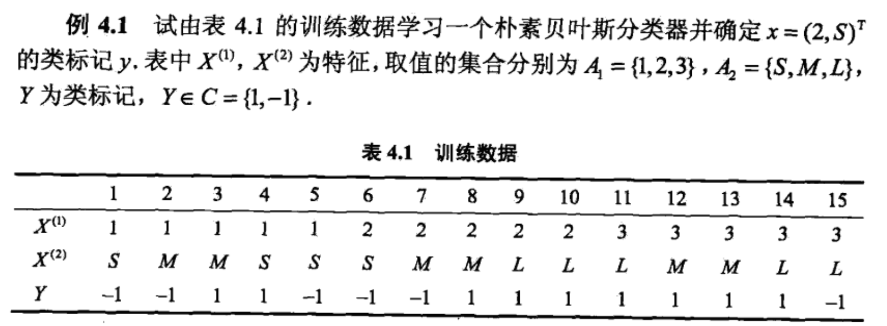

##
朴素贝叶斯分类

朴素贝叶斯法**（音译过来的）**是基于**贝叶斯定理**与**特征条件独立假设**的分类方法。对于给定的训练数据集，首先基于特征独立假设，学习输入与输出的联合概率分布的**经验分布**。然后基于此模型，给定的输入 $x$ ，利用贝叶斯定理求出后验概率最大的输出 $y$，朴素贝叶斯算法实现简单，学习与预测的效率都很高，是一种常用的方法。
###1、朴素贝叶斯法的学习与分类
####1.1、基本方法
输入空间 $\mathcal{X} \subseteq R^n$ 为 $n$ 维向量的集合，输出空间为类标记集合 $\mathcal{Y} = \{c_1,c_2,...,c_K\}$，我们定义输入特征向量为 $x \in R^n$ ，表示的是含有 $n$ 维的特征样本。输出 $y \in \mathcal{Y}$ 是一个值，表示预测的类别。$P(X,Y)$ 表示联合概率分布。
$$T=\{(x_1,y_1),(x_2,y_3),...,(x_N,y_N)\}$$
训练数据集 $T$ 是由 $P(X,Y)$ 独立同分布产生的。

朴素贝叶斯法，通过训练数据集，学习联合概率分布 $P(X,Y)$ ，得到的是经验分布，具体的学习以下先验概率分布和条件概率分布。先验概率分布：
$$P(Y=c_k),\quad k=1,2,...,K$$
条件概率分布，求出每种 $x$ 在每种 $y$ 下的条件概率分布：
$$P(X=x\,|\,Y=c_k)=P(x^1,x^2,...,x^n\,|\,Y=c_k)\quad k=1,2,...,K \quad i=1,2,...,N$$
通过这种从数据集中直接计算得到的，我们可以联合概率分布 $P(X,Y)$，但是条件概率分布 $P(X=x\,|\,Y=c_k)$ 有指数集数量的参数，估计实际是不可能的。每个样本有 $n$ 维特征，假设 $x^j$ 这个特征有 $S_j$ 的取值可能，$Y$ 可能的取值为 $K$ 个，那么参数为 $K\prod_{j=1}^{n}S_j$

根据朴素贝叶斯法的**特征独立假设**，我们可以得到特征概率相乘：
$$P(X=x\,|\,Y=c_k)=P(x^1,x^2,...,x^n\,|\,Y=c_k)=\prod_{j=1}^{n}P(x^j\,|\,Y=c_k)$$
朴素贝叶斯法实际上学习到生成数据的机制，所以属于**生成模型**。特征条件独立假设等价于用于分类的特征在给定类别后都满足条件独立假设，使得贝叶斯法变的简单，但有时会牺牲一定的精度。

使用**朴素贝叶斯分类**，给定的输入 $x$，通过学习得到的联合概率分布，我们可以求出后验概率分布 $P(Y=c_k | X=x)$ ，将后验概率最大值作为 $x$ 类输出。后验概率计算就是根据贝叶斯定理来求的：
$$ \begin{align*}\\
P(Y=c_k | X=x) &=\frac{P(X=x|Y=c_k)\cdot P(Y=c_k)}{P(X=x)}\\\\
 &=\frac{P(X=x|Y=c_k)\cdot P(Y=c_k)}{\sum_k P(X=x,Y=c_k)}\\\\
&=\frac{P(X=x|Y=c_k)\cdot P(Y=c_k)}{\sum_k P(X=x|Y=c_k)\cdot P(Y=c_k)}
\end{align*}$$
根据条件独立假设部分代入得到：
$$ \begin{align*}\\
P(Y=c_k | X=x)&=\frac{P(X=x|Y=c_k)\cdot P(Y=c_k)}{\sum_k P(X=x|Y=c_k)\cdot P(Y=c_k)}\\\\
&=\frac{P(Y=c_k)\cdot \prod_{j=1}^{n}P(x^j\,|\,Y=c_k)}{\sum_k  P(Y=c_k) \cdot \prod_{j=1}^{n}P(x^j\,|\,Y=c_k)}\\\\
\end{align*}$$
这就是朴素贝叶斯分类器的基本公式，于是，朴素贝叶斯分类器可以表示为：
$$y=f(x)=\arg \max_{c_k}\frac{P(Y=c_k)\cdot \prod_{j=1}^{n}P(x^j\,|\,Y=c_k)}{\sum_k  P(Y=c_k) \cdot \prod_{j=1}^{n}P(x^j\,|\,Y=c_k)} $$
由于上面公式中，分母都是相同的，所以：
$$y=f(x)=\arg \max_{c_k} P(Y=c_k)\cdot \prod_{j=1}^{n}P(x^j\,|\,Y=c_k)$$

####1.2、后验概率最大化的含义
朴素贝叶斯法将实例分到后验概率最大的类中，这等价于期望风险最小化，假设选择0-1损失函数：
$$L(Y,f(X))=\left\{
\begin{align*}
1,& \quad Y\neq f(X)\\\\
0,& \quad Y = f(X)
\end{align*}
\right.$$
式中 $f(X)$ 是分类决策函数。这是，期望风险函数为：
$$R_{exp}(f)=E[L(Y,f(X))]$$
期望风险是针对联合概率分布 $P(X,Y)$ 取的，由此取条件期望：
$$\begin{align*}
R_{exp}(f)&=\sum_{X,Y}P(X,Y)[L(Y,f(X))]\\
&=\sum_{X,Y}P(Y|X)P(X)[L(Y,f(X))]\\
&=\sum_{X}P(X)\sum_{k=1}^{K}P(Y=c_k|X)[L(Y=c_k,f(X))]\\
&=E_X\sum_{k=1}^{K}P(Y=c_k|X)[L(Y=c_k,f(X))]\\
\end{align*}$$
由于先验分布 $P(X)$ 已经固定，所以，为了使期望风险最小化，只需要对 $X=x$ 逐个极小化，由此得到：
$$\begin{align*}
f(x)&=\arg \min_{y\in \mathcal{Y}} \sum_{k=1}^{K}L(c_k,y)P(c_k|X=x)\\
&=\arg \min_{y\in \mathcal{Y}} \sum_{k=1}^{K}P(c_k \neq y\;|X=x)\\
&=\arg \min_{y\in \mathcal{Y}} \sum_{k=1}^{K}1-P(c_k = y\;|X=x)\\
&=\arg \max_{y\in \mathcal{Y}} \sum_{k=1}^{K}P(c_k = y\;|X=x)\\
\end{align*}$$
这样以来，根据期望风险最小化原则，就得到了后验概率最大化原则，在贝叶斯分类中，我们利用的就是**后验概率最大化准则**，也满足**期望风险最小化原则**。

###2、朴素贝叶斯法的参数估计
####2.1、极大似然估计
在朴素贝叶斯法中，学习意味着估计 $P(Y=c_k)$ 和 $P(x^j|Y=c_k)$，可以应用到极大似然估计法估计相应的概率。先验概率 $P(Y=c_k)$ 的极大似然估计为：
$$P(Y=c_k)=\frac{\sum_{i=1}^{N}I(y_i=c_k)}{N} \quad k=1,2,...,K$$
条件概率的似然估计为，样本第 $j$ 个特征的取值范围为 $\{a_{j1},a_{j2},...,a_{js}\}$：
$$\begin{align*}\\
P(x^j=a_{jl}\;|\;Y=c_k)=\frac{\sum_{i=1}^{N}I(x^j=a_{jl},y_i=c_k)}{\sum_{i=1}^{N}I(y_i=c_k)}
\end{align*}$$
####2.2、学习与分类算法
**朴素贝叶斯算法描述**
+ 计算先验概率和条件概率(针对所有的训练实例)
$$P(Y=c_k)=\frac{\sum_{i=1}^{N}I(y_i=c_k)}{N} \quad k=1,2,...,K$$

$$\begin{align*}\\
P(x^j=a_{jl}\;|\;Y=c_k)=\frac{\sum_{i=1}^{N}I(x^j=a_{jl},y_i=c_k)}{\sum_{i=1}^{N}I(y_i=c_k)}
\end{align*}$$
+ 对于给定的实例 $x=(x^1,x^2,...,x^n)^T$，计算：
$$P(X=x\,|\,Y=c_k)=P(x^1,x^2,...,x^n\,|\,Y=c_k)=\prod_{j=1}^{n}P(x^j\,|\,Y=c_k)$$
+ 确定实例的分类：
$$y=f(x)=\arg \max_{c_k} P(Y=c_k)\cdot \prod_{j=1}^{n}P(x^j\,|\,Y=c_k)$$

下面举个例子：

解：先求先验概率分布 $P(y=c_k)$，可以得到：
$$P(Y=-1)=\frac{6}{15} \quad P(Y=1)=\frac{9}{15}$$
第二步，求在每个 $Y$ 取不同值的情况下，每个样本 $X$ 不同属性的取值概率得到：
$$P(x^1=1|Y=1)=\frac{2}{9} \quad P(x^1=2|Y=1)=\frac{3}{9}\quad P(x^1=3|Y=1)=\frac{4}{9}$$
$$P(x^2=S|Y=1)=\frac{1}{9} \quad P(x^2=M|Y=1)=\frac{4}{9}\quad P(x^2=L|Y=1)=\frac{4}{9}$$
$$P(x^1=1|Y=-1)=\frac{3}{6} \quad P(x^1=2|Y=-1)=\frac{2}{6}\quad P(x^1=3|Y=-1)=\frac{1}{6}$$
$$P(x^2=S|Y=-1)=\frac{3}{6} \quad P(x^2=M|Y=-1)=\frac{2}{6}\quad P(x^2=L|Y=-1)=\frac{1}{6}$$
因此对于给定的 $(2,S)^T$ 计算：
$$P(Y=1)P(x^1=2|Y=1)P(x^2=S|Y=1)=\frac{9}{15}\cdot\frac{3}{9}\cdot\frac{1}{9}=\frac{1}{45}$$
$$P(Y=-1)P(x^1=2|Y=-1)P(x^2=S|Y=-1)=\frac{6}{15}\cdot\frac{2}{6}\cdot\frac{3}{6}=\frac{1}{15}$$
通过计算可以发现，我们应该选择 $-1$ 作为他的分类。
####2.3、贝叶斯估计
用极大似然估计可能会出现所要估计的概率值为０的情况，这是会影响到后验概率的结果的计算，解决这个问题的方法是使用**贝叶斯估计**，条件概率的贝叶斯估计如下：
$$P_\lambda(Y=c_k)=\frac{\sum_{i=1}^{N}I(y_i=c_k)+\lambda}{N＋\lambda K} \quad k=1,2,...,K$$

$$\begin{align*}\\
P_\lambda(x^j=a_{jl}\;|\;Y=c_k)=\frac{\sum_{i=1}^{N}I(x^j=a_{jl},y_i=c_k)+\lambda}{\sum_{i=1}^{N}I(y_i=c_k)+S_j\lambda}
\end{align*}$$
通过这种方式就可以避免出现概率为０的情况，通常取　$\lambda=１$ ，这是就是拉普拉斯平滑。

