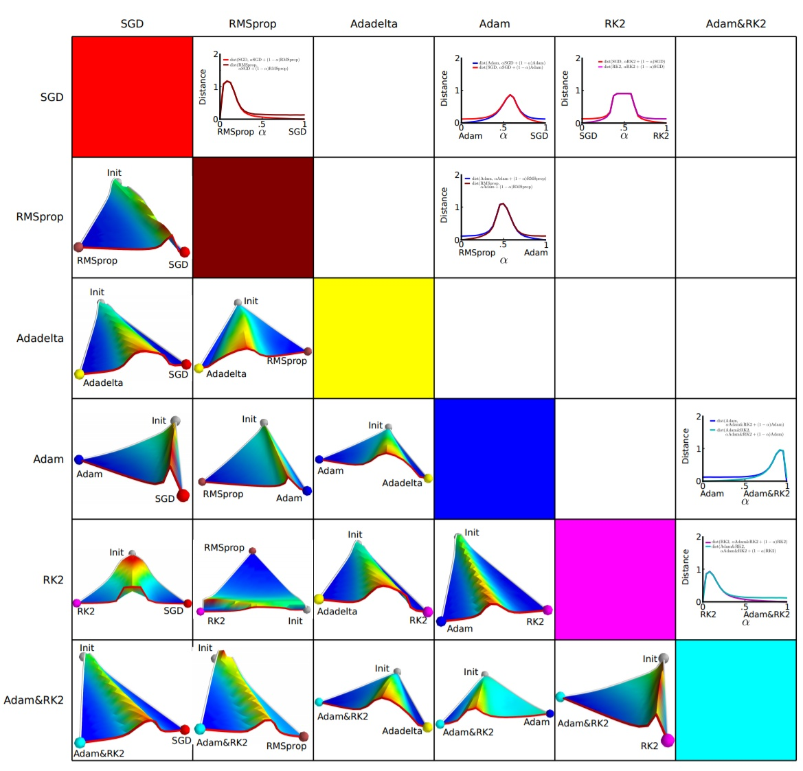
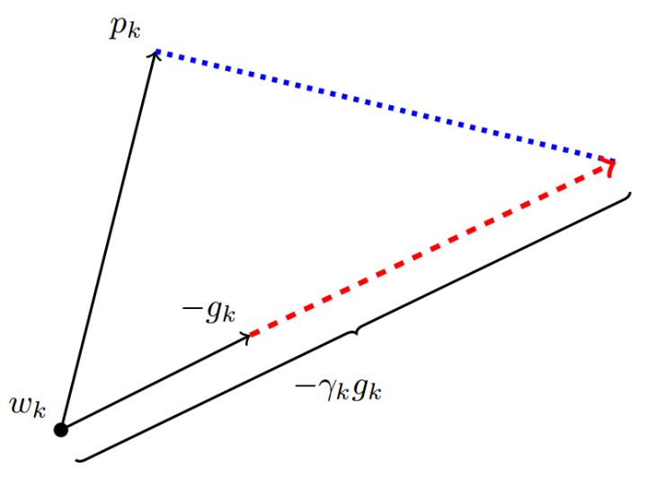

###
一阶优化原理

####1、一个框架回顾优化算法
首先我们来回顾一下各类优化算法。

深度学习优化算法经历了 $SGD \to SGDM \to NAG \to AdaGrad \to AdaDelta \to Adam \to Nadam$ 这样的发展历程。Google一下就可以看到很多的教程文章，详细告诉你这些算法是如何一步一步演变而来的。在这里，我们换一个思路，用一个框架来梳理所有的优化算法，做一个更加高屋建瓴的对比。

首先定义：待优化参数： $w$ ，目标函数： $f(w)$ ，初始学习率 $\alpha$。而后，开始进行迭代优化。在每个epoch $t$：

+ 计算目标函数关于当前参数的梯度： $g_t=\nabla f(w_t)$
 
+ 根据历史梯度计算一阶动量和二阶动量：$m_t = \phi(g_1, g_2, \cdots, g_t); V_t = \psi(g_1, g_2, \cdots, g_t)$

+ 计算当前时刻的下降梯度： $\eta_t = \alpha \cdot \frac{m_t}{\sqrt{V_t}}$
 
+ 根据下降梯度进行更新： $w_{t+1} = w_t - \eta_t$

掌握了这个框架，你可以轻轻松松设计自己的优化算法。我们拿着这个框架，来照一照各种玄乎其玄的优化算法的真身。步骤3、4对于各个算法都是一致的，主要的差别就体现在1和2上。

####2、SGD
先来看SGD。SGD没有动量的概念，也就是说：

$$m_t = g_t; V_t = I^2$$

代入步骤3，可以看到下降梯度就是最简单的

$$\eta_t = \alpha \cdot g_t$$

SGD最大的缺点是下降速度慢，而且可能会在沟壑的两边持续震荡，停留在一个局部最优点。

####3、SGD with Momentum
为了抑制SGD的震荡，SGDM认为梯度下降过程可以加入惯性。下坡的时候，如果发现是陡坡，那就利用惯性跑的快一些。SGDM全称是SGD with momentum，在SGD基础上引入了一阶动量：

$$m_t = \beta_1 \cdot m_{t-1} + (1-\beta_1)\cdot g_t $$

一阶动量是各个时刻梯度方向的指数移动平均值，约等于最近 $1/(1-\beta_1)$ 个时刻的梯度向量和的平均值。

也就是说，$t$ 时刻的下降方向，不仅由当前点的梯度方向决定，而且由此前累积的下降方向决定。 $\beta_1$ 的经验值为0.9，这就意味着下降方向主要是此前累积的下降方向，并略微偏向当前时刻的下降方向。想象高速公路上汽车转弯，在高速向前的同时略微偏向，急转弯可是要出事的。

####4、SGD with Nesterov  Acceleration 

SGD 还有一个问题是困在局部最优的沟壑里面震荡。想象一下你走到一个盆地，四周都是略高的小山，你觉得没有下坡的方向，那就只能待在这里了。可是如果你爬上高地，就会发现外面的世界还很广阔。因此，我们不能停留在当前位置去观察未来的方向，而要向前一步、多看一步、看远一些。

NAG全称Nesterov  Accelerated Gradient，是在SGD、SGD-M的基础上的进一步改进，改进点在于步骤1。我们知道在时刻 $t$ 的主要下降方向是由累积动量决定的，自己的梯度方向说了也不算，那与其看当前梯度方向，不如先看看如果跟着累积动量走了一步，那个时候再怎么走。因此，NAG在步骤1，不计算当前位置的梯度方向，而是计算如果按照累积动量走了一步，那个时候的下降方向：
$$g_t=\nabla f(w_t-\alpha \cdot m_{t-1} / \sqrt{V_{t-1}})$$

然后用下一个点的梯度方向，与历史累积动量相结合，计算步骤2中当前时刻的累积动量。

####5、AdaGrad
此前我们都没有用到二阶动量。二阶动量的出现，才意味着“自适应学习率”优化算法时代的到来。SGD及其变种以同样的学习率更新每个参数，但深度神经网络往往包含大量的参数，这些参数并不是总会用得到（想想大规模的embedding）。对于经常更新的参数，我们已经积累了大量关于它的知识，不希望被单个样本影响太大，希望学习速率慢一些；对于偶尔更新的参数，我们了解的信息太少，希望能从每个偶然出现的样本身上多学一些，即学习速率大一些。

**怎么样去度量历史更新频率呢？那就是二阶动量——该维度上，迄今为止所有梯度值的平方和：**

$$V_t = \sum_{\tau=1}^{t} g_\tau^2$$

我们再回顾一下步骤3中的下降梯度：

$$\eta_t = \alpha \cdot m_t / \sqrt{V_t}$$

可以看出，此时实质上的学习率由  $\alpha$ 变成了  $\alpha / \sqrt{V_t}$ 。 一般为了避免分母为0，会在分母上加一个小的平滑项。因此 $\sqrt{V_t}$ 是恒大于0的，而且参数更新越频繁，二阶动量越大，学习率就越小。

**这一方法在稀疏数据场景下表现非常好**。但也存在一些问题：因为 $\sqrt{V_t}$ 是单调递增的，会使得学习率单调递减至0，可能会使得训练过程提前结束，即便后续还有数据也无法学到必要的知识。

####6、AdaDelta / RMSProp
由于AdaGrad单调递减的学习率变化过于激进，我们考虑一个改变二阶动量计算方法的策略：不累积全部历史梯度，而只关注过去一段时间窗口的下降梯度。这也就是AdaDelta名称中Delta的来历。修改的思路很简单。前面我们讲到，指数移动平均值大约就是过去一段时间的平均值，因此我们用这一方法来计算二阶累积动量：

$$V_t = \beta_2 * V_{t-1} + (1-\beta_2) g_t^2$$

这就避免了二阶动量持续累积、导致训练过程提前结束的问题了。

####7、Adam
谈到这里，Adam和Nadam的出现就很自然而然了——它们是前述方法的集大成者。我们看到，SGD-M在SGD基础上增加了一阶动量，AdaGrad和AdaDelta在SGD基础上增加了二阶动量。把一阶动量和二阶动量都用起来，就是Adam了——Adaptive + Momentum。

SGD的一阶动量：

$$m_t = \beta_1 \cdot m_{t-1} + (1-\beta_1)\cdot g_t$$

加上AdaDelta的二阶动量：

$$V_t = \beta_2 * V_{t-1} + (1-\beta_2) g_t^2$$

优化算法里最常见的两个超参数 $ \beta_1, \beta_2$ 就都在这里了，前者控制一阶动量，后者控制二阶动量。

####8、Nadam
最后是Nadam。我们说Adam是集大成者，但它居然遗漏了Nesterov，这还能忍？必须给它加上，按照NAG的步骤1：

$$g_t=\nabla f(w_t-\alpha \cdot m_{t-1} / \sqrt{V_t}) $$

这就是Nesterov + Adam = Nadam了。

说到这里，大概可以理解为什么j经常有人说 Adam / Nadam 目前最主流、最好用的优化算法了。新手上路，先拿来一试，收敛速度嗖嗖滴，效果也是杠杠滴。

####9、补充
前面我们讲到，一阶动量和二阶动量都是按照指数移动平均值进行计算的：

$$m_t = \beta_1 \cdot m_{t-1} + (1-\beta_1)\cdot g_t $$

$$V_t = \beta_2 \cdot V_{t-1} + (1-\beta_2) \cdot g_t^2 $$ 

实际使用过程中，参数的经验值是

$$\beta_1=0.9, \beta_2=0.999 $$

初始化：

$m_0=0, V_0=0$ 

这个时候我们看到，在初期， m_t, V_t 都会接近于0，这个估计是有问题的。因此我们常常根据下式进行误差修正：

$$\tilde{m}_t = m_t / (1-\beta_1^t) $$

$$\tilde{V}_t = V_t / (1-\beta_2^t) $$

####10、关于Adam的讨论
**Adam罪状一：可能不收敛**
回忆一下上文提到的各大优化算法的学习率：

$\eta_t = \alpha / \sqrt{V_t} $

其中，SGD没有用到二阶动量，因此学习率是恒定的（实际使用过程中会采用学习率衰减策略，因此学习率递减）。AdaGrad的二阶动量不断累积，单调递增，因此学习率是单调递减的。因此，这两类算法会使得学习率不断递减，最终收敛到0，模型也得以收敛。

但AdaDelta和Adam则不然。二阶动量是固定时间窗口内的累积，随着时间窗口的变化，遇到的数据可能发生巨变，使得 $V_t$ 可能会时大时小，不是单调变化。这就可能在训练后期引起学习率的震荡，导致模型无法收敛。

这篇文章也给出了一个修正的方法。由于Adam中的学习率主要是由二阶动量控制的，为了保证算法的收敛，可以对二阶动量的变化进行控制，避免上下波动。

$V_t = max(\beta_2 * V_{t-1} + (1-\beta_2) g_t^2, V_{t-1})$

通过这样修改，就保证了 $||V_t|| \geq ||V_{t-1}||$ ，从而使得学习率单调递减。

**Adam罪状二：可能错过全局最优解**
深度神经网络往往包含大量的参数，在这样一个维度极高的空间内，非凸的目标函数往往起起伏伏，拥有无数个高地和洼地。有的是高峰，通过引入动量可能很容易越过；但有些是高原，可能探索很多次都出不来，于是停止了训练。

第一篇就是前文提到的吐槽Adam最狠的 The Marginal Value of Adaptive Gradient Methods in Machine Learning 。文中说到，同样的一个优化问题，不同的优化算法可能会找到不同的答案，但自适应学习率的算法往往找到非常差的答案。他们通过一个特定的数据例子说明，自适应学习率算法可能会对前期出现的特征过拟合，后期才出现的特征很难纠正前期的拟合效果。

另外一篇是 Improving Generalization Performance by Switching from Adam to SGD，进行了实验验证。他们CIFAR-10数据集上进行测试，Adam的收敛速度比SGD要快，但最终收敛的结果并没有SGD好。他们进一步实验发现，主要是后期Adam的学习率太低，影响了有效的收敛。他们试着对Adam的学习率的下界进行控制，发现效果好了很多。

于是他们提出了一个用来改进Adam的方法：**前期用Adam，享受Adam快速收敛的优势；后期切换到SGD，慢慢寻找最优解**。这一方法以前也被研究者们用到，不过主要是根据经验来选择切换的时机和切换后的学习率。这篇文章把这一切换过程傻瓜化，给出了切换SGD的时机选择方法，以及学习率的计算方法，效果看起来也不错。

####11、不同优化算法的核心差异：下降方向

从第一篇的框架中我们看到，不同优化算法最核心的区别，就是第三步所执行的下降方向：

$$\eta_t = (\alpha/ \sqrt{V_t} ) \cdot m_t$$

这个式子中，前半部分是实际的学习率（也即下降步长），后半部分是实际的下降方向。SGD算法的下降方向就是该位置的梯度方向的反方向，带一阶动量的SGD的下降方向则是该位置的一阶动量方向。自适应学习率类优化算法为每个参数设定了不同的学习率，在不同维度上设定不同步长，因此其下降方向是缩放过（scaled）的一阶动量方向。

**由于下降方向的不同，可能导致不同算法到达完全不同的局部最优点。**An empirical analysis of the optimization of deep network loss surfaces 这篇论文中做了一个有趣的实验，他们把目标函数值和相应的参数形成的超平面映射到一个三维空间，这样我们可以直观地看到各个算法是如何寻找超平面上的最低点的。

上图是论文的实验结果，横纵坐标表示降维后的特征空间，区域颜色则表示目标函数值的变化，红色是高原，蓝色是洼地。他们做的是配对儿实验，让两个算法从同一个初始化位置开始出发，然后对比优化的结果。可以看到，**几乎任何两个算法都走到了不同的洼地，他们中间往往隔了一个很高的高原。这就说明，不同算法在高原的时候，选择了不同的下降方向。**

####12、Adam+SGD 组合策略
不同优化算法的优劣依然是未有定论的争议话题。据我在paper和各类社区看到的反馈，主流的观点认为：**Adam等自适应学习率算法对于稀疏数据具有优势，且收敛速度很快；但精调参数的SGD（+Momentum）往往能够取得更好的最终结果。**

那么我们就会想到，可不可以把这两者结合起来，先用Adam快速下降，再用SGD调优，一举两得？思路简单，但里面有两个技术问题：
+ **什么时候切换优化算法？**——如果切换太晚，Adam可能已经跑到自己的盆地里去了，SGD再怎么好也跑不出来了。

+ **切换算法以后用什么样的学习率？**——Adam用的是自适应学习率，依赖的是二阶动量的累积，SGD接着训练的话，用什么样的学习率？

**首先来看第二个问题，切换之后用什么样的学习率。**Adam的下降方向是

$$\eta_t^{Adam} = (\alpha/ \sqrt{V_t} ) \cdot m_t $$

而SGD的下降方向是

$$\eta_t^{SGD} = \alpha^{SGD}\cdot g_t$$

$\eta_t^{SGD}$ 必定可以分解为 $\eta_t^{Adam}$ 所在方向及其正交方向上的两个方向之和，那么其在 $\eta_t^{Adam}$ 方向上的投影就意味着SGD在Adam算法决定的下降方向上前进的距离，而在 $\eta_t^{Adam}$ 的正交方向上的投影是 SGD 在自己选择的修正方向上前进的距离。

这里 $p_k$ 为Adam下降方向，$g$ 为梯度方向，$\gamma_k$ 为SGD的学习率。如果SGD要走完Adam未走完的路，那就首先要接过Adam的大旗——沿着 $\eta_t^{Adam}$ 方向走一步，而后在沿着其正交方向走相应的一步。

这样我们就知道该如何确定SGD的步长（学习率）了——**SGD在Adam下降方向上的正交投影，应该正好等于Adam的下降方向（含步长）。**也即：
$$proj_{\eta_t^{SGD}} =\eta_t^{Adam}$$

解这个方程，我们就可以得到接续进行SGD的学习率：

$$\alpha_t^{SGD}=( (\eta_t^{Adam})^T \eta_t^{Adam})/( (\eta_t^{Adam})^Tg_t)$$

为了减少噪声影响，作者使用移动平均值来修正对学习率的估计：

$$\lambda_t^{SGD}=\beta_2\cdot\lambda_{t-1}^{SGD} + (1-\beta_2) \cdot\alpha_t^{SGD} $$

$$\tilde{\lambda}_t^{SGD}=\lambda_t^{SGD}/(1-\beta_2^t) $$

这里直接复用了Adam的  $\beta_2$ 参数。

**然后来看第一个问题，何时进行算法的切换。**

作者的回答也很简单，那就是当 SGD的相应学习率的移动平均值基本不变的时候，即：

$|\tilde{\lambda}_t^{SGD} - \alpha_t^{SGD}|<\epsilon$ . 每次迭代玩都计算一下SGD接班人的相应学习率，如果发现基本稳定了，那就SGD以 $\tilde{\lambda}_t^{SGD}$ 为学习率接班前进。

**优化算法的常用tricks**

最后，分享一些在优化算法的选择和使用方面的一些tricks。
+ **首先，各大算法孰优孰劣并无定论。**如果是刚入门，优先考虑 SGD+Nesterov Momentum或者Adam.

+ **选择你熟悉的算法**——这样你可以更加熟练地利用你的经验进行调参。

+ **充分了解你的数据**——如果模型是非常稀疏的，那么优先考虑自适应学习率的算法。

+ **根据你的需求来选择**——在模型设计实验过程中，要快速验证新模型的效果，可以先用Adam进行快速实验优化；在模型上线或者结果发布前，可以用精调的SGD进行模型的极致优化。

+ **先用小数据集进行实验。**有论文研究指出，随机梯度下降算法的收敛速度和数据集的大小的关系不大。因此可以先用一个具有代表性的小数据集进行实验，测试一下最好的优化算法，并通过参数搜索来寻找最优的训练参数。

+ **考虑不同算法的组合。**先用Adam进行快速下降，而后再换到SGD进行充分的调优。切换策略可以参考本文介绍的方法。

+ **数据集一定要充分的打散（shuffle）。**这样在使用自适应学习率算法的时候，可以避免某些特征集中出现，而导致的有时学习过度、有时学习不足，使得下降方向出现偏差的问题。

+ 训练过程中**持续监控训练数据和验证数据**上的目标函数值以及精度或者AUC等指标的变化情况。对训练数据的监控是要保证模型进行了充分的训练——下降方向正确，且学习率足够高；对验证数据的监控是为了避免出现过拟合。

+ **制定一个合适的学习率衰减策略。**可以使用定期衰减策略，比如每过多少个epoch就衰减一次；或者利用精度或者AUC等性能指标来监控，当测试集上的指标不变或者下跌时，就降低学习率。