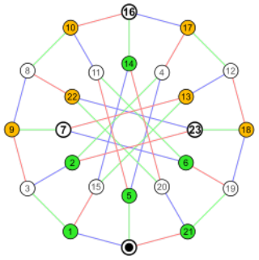
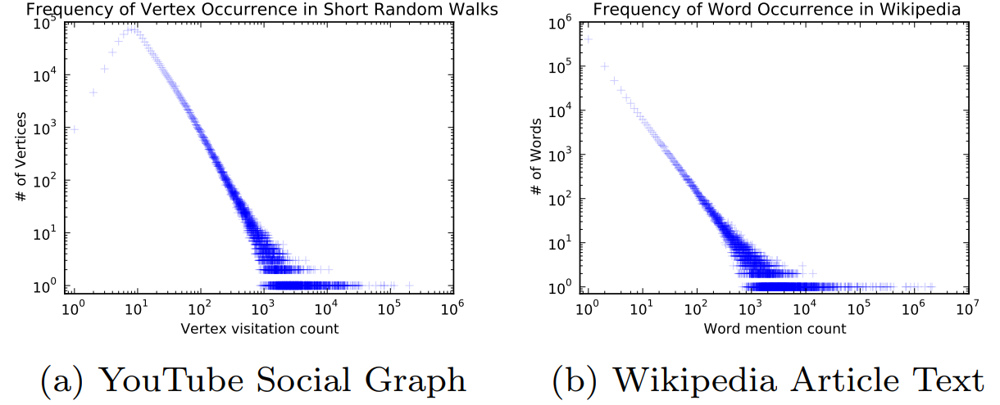
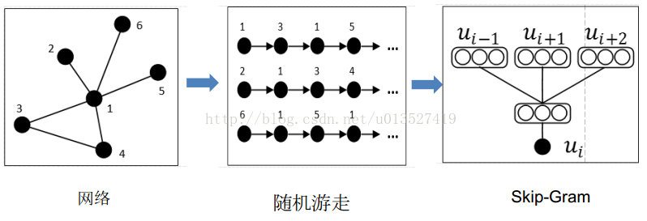
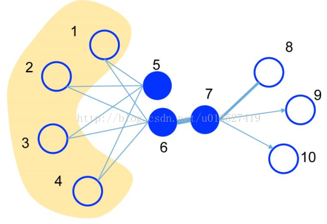
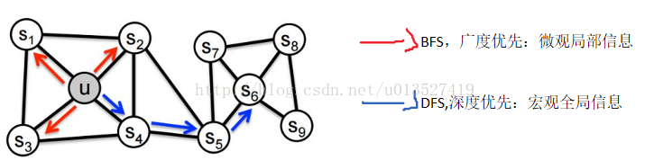
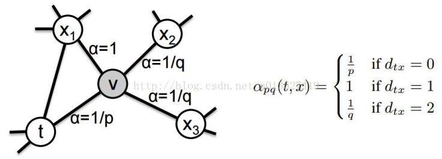

###
网络表示学习

####1、传统的方法：基于图的表示（又称为基于符号的表示）
如下图 $G=(V,E)$，用不同的符号命名不同的节点，用二维数组（邻接矩阵）的存储结构表示两节点间是否存在连边，存在为1，否则为0。**缺点**:长尾分布下大部分节点间没有关系，所有邻接矩阵非常稀疏，不利于存储计算。

.

####2、网络表示学习（NRL），称为图嵌入法（GEM）
这种方法使用低维、稠密、实值的向量表示网络中的节点，含有语义关系，利于计算存储，不需要再手动提特征（自动适应），且可以将不同的信息投影到同一个低维空间中方便进行下游计算。
#####2.1、Word2Vec

#####2.2、DeepWalk
具体实现参考 [deepwalk](https://github.com/phanein/deepwalk)，这种方法是利用 $SkipGram$ 模型进行网络节点的表示学习。那么，根据 $SkipGram$ 的思路，最重要的就是定义 $Context$，也就是 $Neighborhood$ 。在 $NLP$ 中，$Neighborhood$ 是当前 $Word$ 周围的字，本文就是利用随机游走得到 $Graph$ 或者 $Network$ 中节点的 $Neighborhood$。具体方法如下：
+ (1) 随机游走随机均匀地选取网络节点，并生成**固定长度**的随机游走序列，将此序列类比为自然语言中的句子（节点序列=句子，序列中的节点=句子中的单词），应用 $SkipGram$ 模型学习简单的分布式表示。

+ (2) **前提：**如果一个网络的节点服从幂律分布，那么节点在随机游走序列中的出现次数也服从幂律分布，并且在实际中发现 $NLP$ 中单词的出现频率也服从幂律分布。（幂律分布，就是马太效应，二八原则，少部分的人，占据大多数的财富）

.

+ (3)大体步骤：$Network\,/\,graph \to random\;walk \to 得到节点序列（representation\;mapping）\to 放到\;SkipGram\;模型中$$（中间节点预测上下文节点）\to \;output:\;representation$

.

#####2.３、LINE
**一阶相似度：**直接相连的节点，例如下面的节点6和7。定义节点 $v_i$ 和 $v_j$ 之间的联合概率为：
$$p_1(v_i,v_j)=\frac{1}{1+exp(-\textbf{u}^T_i \cdot \textbf{u}_j)}$$ 
  其中，$v$ 代表节点，$u$ 代表这个节点的 $embedding$。上面公式的意思是两个节点越相似，内积越大，$sigmoid$ 映射后的值越大，也就是两个点相连的权重越大，也就是两个节点间出现的概率越大。

**二阶相似度**：通过其他中间节点相连的节点例如5和6，用一个条件概率，来表示两个节点的相似度：
$$p_2(v_j\,|\,v_i)=\frac{exp(\textbf{u}^T_j \cdot \textbf{u}_i)}{\sum_{k=1}^{|V|}exp(\textbf{u}^T_k \cdot \textbf{u}_i)}$$

.

网络表示学习的目标是让 $NRL$ 前后节点间相似度不变，也就是节点表示学习前如果两个节点比较相似，那么 $embedding$ 后这两个节点的向量也要很相似，本文中使用 $KL$ 散度来度量两个概率分布之间的距离。关于 $KL$ 散度的相关知识详见 [KL散度](http://blog.csdn.net/u013527419/article/details/51776786) ，下面举一个保证其一阶相似度的例子：

embedding 前：节点 $v_i$ 和 节点 $v_j$ 之间的经验联合概率为：
$$\hat{p}_1(i,j)=\frac{w_{ij}}{W}$$
所以需要最小化下面的目标函数：
$$O_1=-\sum_{(i,j)\in E} w_{ij} log p_1(v_i,v_j)$$

#####2.4、Node2Vec
具体参考 [论文和实现](http://snap.stanford.edu/node2vec/) 类似于 $deepwalk$，主要的创新点在于改进了随机游走的策略，定义了两个参数 $p$ 和 $q$ ，在 $BFS$ 和 $DFS$ 中达到一个平衡，同时考虑到局部和宏观信息，并且具有很高的适应性。下图给出一个参考示例：

.

这种方法，通过参数来控制跳转概率的随机游走，之前完全随机时，$p=q=1$，两个参数的含义如下：
+ 返回概率参数 $p$，对应 $BFS$，$p$ 控制回到原来节点的概率，如图中从 $t$ 跳到 $v$ 以后，有 $\frac{1}{p}$ 的概率在节点 $v$ 处再跳会到 $t$。
+ 离开概率参数 $q$，对应 $DFS$ ，$q$ 控制跳到其他节点的概率。

.

上图中，刚从 $edge(t,v)$ 过来，现在在节点 $v$ 上，要决定下一步 $(v,x)$ 怎么走，其中 $d_{tx}$ 表示节点 $t$ 到节点 $x$ 之间的最短路径，$d_{tx}=0$ 表示会回到节点 $t$ 本身，$d_{tx}=1$ 表示节点 $t$ 和节点 $x$ 直接相连，但是在上一步却选择了节点 $v$，$d_{tx}=2$ 表示节点 $t$ 不与节点 $x$ 直接相连，但是节点 $v$ 与节点 $x$ 直接相连。这种方法可以在广告、推荐领域得到大力的应用。

#####2.5、SDNE
本文的一大贡献在于提出一种新的半监督学习模型，结合一阶估计和二阶估计的有点，用于表示网络的全局结构属性和局部结构属性，基本结构如下图所示：

.

对节点的描述特征向量（比如点的邻接向量）使用autoencoder编码，取autoencoder中间层作为向量表示，以此来获得相似邻居节点相似度较高，因为两个节点的邻接向量相似，说明他们共享了很对邻居，最后映射成的向量 $y$ 也会更接近。

