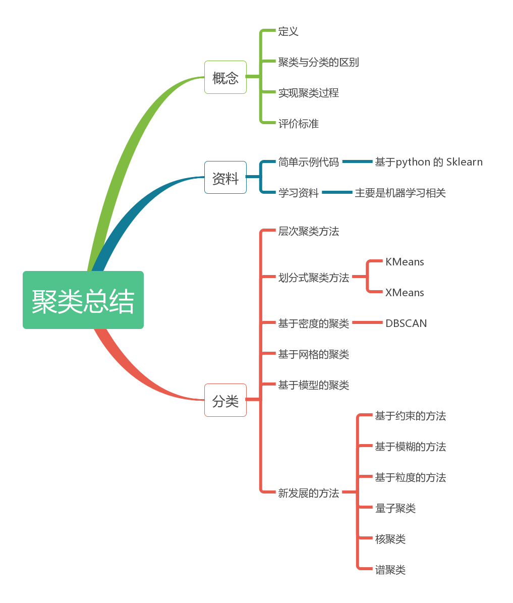
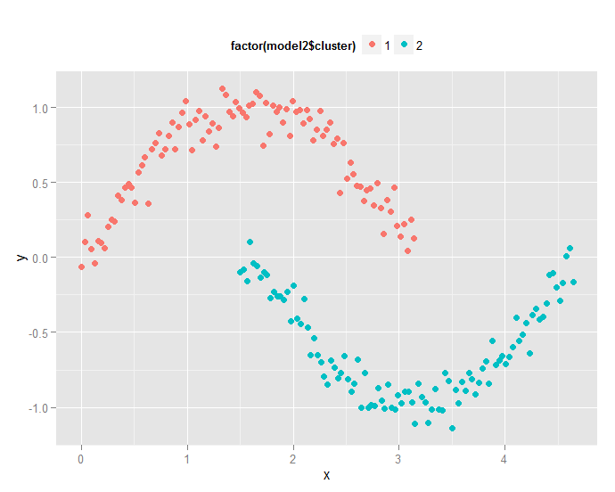

###<center>聚类算法总结</center>
可以总结如下图所示，从概念，资料，分类等三个方面来讨论：
<center></center>.

###1、聚类的基本概念
####1.1、定义
聚类是数据挖掘中的概念，就是按照某个特定标准(如距离)把一个数据集分割成不同的类或簇，使得同一个簇内的数据对象的相似性尽可能大，同时不在同一个簇中的数据对象的差异性也尽可能地大。也即聚类后同一类的数据尽可能聚集到一起，不同类数据尽量分离。

####1.2、聚类与分类的区别
Clustering (聚类)，简单地说就是把相似的东西分到一组，聚类的时候，我们并不关心某一类是什么，我们需要实现的目标只是把相似的东西聚到一起。因此，一个聚类算法通常只需要知道如何计算相似度就可以开始工作了，因此 clustering 通常并不需要使用训练数据进行学习，这在Machine Learning中被称作unsupervised learning (无监督学习)。

Classification (分类)，对于一个classifier，通常需要你告诉它“这个东西被分为某某类”这样一些例子，理想情况下，一个 classifier 会从它得到的训练集中进行“学习”，从而具备对未知数据进行分类的能力，这种提供训练数据的过程通常叫做supervised learning (监督学习)。

####1.3、实现聚类的过程
1. 数据准备：包括特征标准化和降维；

2. 特征选择：从最初的特征中选择最有效的特征,并将其存储于向量中;

3. 特征提取：通过对所选择的特征进行转换形成新的突出特征;

4. 聚类(或分组)：首先选择合适特征类型的某种距离函数(或构造新的距离函数)进行接近程度的度量，而后执行聚类或分组;

5. 聚类结果评估：是指对聚类结果进行评估，评估主要有3种：外部有效性评估、内部有效性评估和相关性测试评估。

####1.4、评价指标
1. 处理大的数据集的能力;

2. 处理任意形状，包括有间隙的嵌套的数据的能力;

3. 算法处理的结果与数据输入的顺序是否相关，也就是说算法是否独立于数据输入顺序;

4. 处理数据噪声的能力;

5. 是否需要预先知道聚类个数，是否需要用户给出领域知识;

6. 算法处理有很多属性数据的能力，也就是对数据维数是否敏感。


###2、聚类方法的分类
主要分为层次化聚类算法，划分式聚类算法，基于密度的聚类算法，基于网格的聚类算法，基于模型的聚类算法等。
####2.1、层次聚类算法
又称树聚类算法，透过一种层次架构方式，反复将数据进行分裂或聚合。典型的有BIRCH算法，CURE算法，CHAMELEON算法，Sequence data rough clustering算法，Between groups average算法，Furthest neighbor算法，Neares neighbor算法等。

**典型凝聚型层次聚类：**
先将每个对象作为一个簇，然后合并这些原子簇为越来越大的簇，直到所有对象都在一个簇中，或者某个终结条件被满足。

**算法流程：**
1. 将每个对象看作一类，计算两两之间的最小距离;

2. 将距离最小的两个类合并成一个新类;

3. 重新计算新类与所有类之间的距离;

4. 重复1、2，直到所有类最后合并成一类。


####2.2、划分式聚类方法
预先指定聚类数目或聚类中心，反复迭代逐步降低目标函数误差值直至收敛，得到最终结果。K-means，K-modes-Huang，K-means-CP，MDS_CLUSTER，Feature weighted fuzzy clustering，CLARANS等，还有一个最优特色的就是X-means。

**经典K-means算法流程：**

1. 随机地选择k个对象，每个对象初始地代表了一个簇的中心;

2. 对剩余的每个对象，根据其与各簇中心的距离，将它赋给最近的簇;

3. 重新计算每个簇的平均值，更新为新的簇中心;

4. 不断重复2、3，直到准则函数收敛。

#####2.2.1、Xmeans算法
**贝叶斯信息准则 BIC：**
BIC 是 Pelleg 和Moore在2000年提出来的，现在来解释一下这个准则。下面对符号进行说明，$i,j,...$ 表示分布的点，$m,n,...$ 表示不同的聚类，$D$ 表示每个聚类区域，BIC 假设这些点每个聚类之间服从<font color="red">**高斯分布**</font>，给定这个模型，数据点 $i$ 标记为 $x_i$ 的概率分布如下：

$$P(x_i)=\sum_{n=1}^{K}\underbrace{P(x_i\in D_n)}_{x_i属于D_n区域的概率}\cdot \underbrace{P(x_i|x_i \in D_n)}_{标记x_i在当前区域的所占份额}$$

为了计算最大似然，对于第一项，$P(x_i\in D_n)$ 可以表示为：
$$P(x_i \in D_n)=\frac{R_n}{R}$$
其中，$R_n$ 表示第 $n$ 聚类中的元素个数。

对于第二项，每个聚类由一个高斯分布组成，假设每个聚类中心为 $\mu_n$ ，对应的方差为 $\sigma^2$，所以第二项可以表示为：
$$P(x_i|x_i\in D_n)=\frac{1}{(2\pi \sigma^2)^{M/2}}exp\left(-\frac{1}{2\sigma^2}\|x_i-\mu_n\|^2\right)$$
合并上面的公式可以得到：
$$P(x_i)=\frac{R_n}{R}\frac{1}{(2\pi \sigma^2)^{M/2}}exp\left(-\frac{1}{2\sigma^2}\|x_i-\mu_n\|^2\right)$$
转换成对数似然为：
$$\begin{align*}
l(D)&=log\prod_{i}P(x_i)\\\\
&=\sum_ilogP(x_i)\\\\
&=\sum_i\left(log\frac{R_n}{R}+log\left(\frac{1}{(2\pi \sigma^2)}\right)-\frac{1}{2\sigma^2}\|x_i-\mu_n\|^2\right)\\\\
&=\sum_{n=1}^{K}\sum_{x_i\in D_n}\left(log\frac{R_n}{R}+log\left(\frac{1}{(2\pi \sigma^2)}\right)-\frac{1}{2\sigma^2}\|x_i-\mu_n\|^2\right)\\\\
&=\sum_{n=1}^{K}\left[R_n\left(log \frac{R_n}{R}-\frac{M}{2}log\left(2\pi \sigma^2\right)\right)-\frac{1}{2\sigma^2}\sum_{x_i\in D_n}\|x_i-\mu_{(i)}\|^2\right]
\end{align*}$$
通过最大似然估计，作者得到了模型的方差估计，这个方差只是作者为了简化计算得到的：
$$\hat{\sigma}^2=\frac{1}{R-K}\sum_i\|x_i-\mu_{(i)}\|^2$$
通过对似然函数求导，然后让其值为0可以得到：
$$\begin{align*}
\frac{\partial l(D)}{\partial \sigma}&=\sum_{n=1}^{K}\left[-\frac{MR_n}{\sigma}+\frac{1}{\sigma^3}\sum_{x_i\in D_n}\|x_i-\mu_{(i)}\|^2\right]\\\\
&=\sigma^{-3}\sum_{n=1}^{K}\left[-MR_n\sigma^2+\sum_{x_i\in D_n}\|x_i-\mu_{(i)}\|^2\right]\\\\
&=\sigma^{-3}\left[-MR_n\sigma^2+\sum_{i}\|x_i-\mu_{(i)}\|^2\right]\\\\
\end{align*}$$
令导数为0，可以得到：
$$\hat{\sigma}^2=\frac{1}{RM}\sum_i\|x_i-\mu_{(i)}\|^2$$
上面两种衡量方差的方式，都是计算每个点到聚类中心的距离求和，距离求和可以分解表示为如下方式：
$$\sum_i\|x_i-\mu_{(i)}\|^2=\sum_n\sum_{i\in D_n}\|x_i-\mu_{(i)}\|^2$$
每个聚类都是一个高斯分布，意味着求出来的方差都是无偏估计，可以表示为：
$$\hat{\sigma}^2_n=\frac{1}{M(R_n-1)}\sum_{i\in D_n}\|x_i-\mu_{(i)}\|^2$$
结合上面两个公式可以得到：
$$\sum_i\|x_i-\mu_{(i)}\|^2=M\sum_n(R_n-1)\;\hat{\sigma}^2_j$$
作者假设每个聚类都服从高斯分布，所以可以得到:
$$\hat{\sigma}^2_j=\hat{\sigma}^2$$
然后就可以得到：
$$\begin{align*}
\sum_i\|x_i-\mu_{(i)}\|^2&=M\left(\sum_n(R_n)-\sum_n(1)\right)\;\hat{\sigma}^2\\\\
&=M(R-K)\;\sigma^2
\end{align*}$$
或者可以表示为：
$$\hat{\sigma}^2=\frac{1}{M(R-K)}\sum_i\|x_i-\mu_{(i)}\|^2$$
这个表示和作者提出来的很相似，只是多了一个M，表示一个影响因子。作者使用无偏估计的方法，使用最大似然估计的方法，可以得到：
$$\begin{align*}
\hat{l}(D)&=\sum_{n=1}^{K}\left[R_n\left(log\frac{R_n}{R}-\frac{M}{2}log(2\pi \hat\sigma^2)\right)-\frac{1}{2\hat\sigma^2}M(R_n-1)\hat\sigma^2\right]\\\\
&=\sum_{n=1}^{K}\left[R_nlog R_n - R_nlogR-\frac{R_nM}{2}log(2\pi\hat\sigma^2)-\frac{1}{2}M(R_n-1)\right]
\end{align*}$$
直接利用 $\sum_{n=1}^{K}R_n=R$，可以得到：
$$\hat{l}(D)=\sum_{n=1}^{K}R_nlogR_n-RlogR-\frac{RM}{2}log(2\pi\hat\sigma^2)-\frac{M}{2}(R-K)$$
现在考虑两个假设，$\phi_1 和\phi_2$，文章中使用 $M_j$ 表示，为了让大家明白与M的维度无关，所以作者又设置了几个变量。$\phi_1$ 表示使用固定聚类数，最小化聚类得到的聚类结果。$\phi_2$ 表示将上面的聚类结果切分成两个子聚类，使用kmeans的聚类方法。如果切分之后，聚类的总方差更小，那么就将其切分。针对这个问题，作者提出了BIC，可以表示如下：
$$BIC(\phi)=\hat{l}_{\phi}(D)-\frac{p_{\phi}}{2}\cdot log R$$
其中 $\phi$ 表示模型，$\hat{l}_\phi(D)$ 表示似然函数，$p_\phi$ 表示模型的复杂度（自由参数的个数）

**X-means 的假设：**相同球形假设
数据由X个高斯函数残生，每个高斯函数有一样的方差 $\sigma$ 、不同的$μ_i$，每个维度上的变量不相关，协方差矩阵为$diag(\sigma)$；
数据生成时，根据概率 $p_i$ 选择一个高斯函数 $g_i$，然后生成一个点，所以似然函数为：
$$l_{\phi}(D) = \sum_{i=1}^R [log\ p(g_{(i)})+log\ p(x_i)]$$
其中 $p(g(i))$ 为生成点 $x_i$ 的高斯函数被选到的概率。

**计算BIC，需要计算最大化的$\hat{l}_\phi(D)$,所以需要对参数进行估计:**
$$p(g_k)=\frac{R_k}{R}$$
$$\sigma^2=\frac{1}{MR}\sum_{k=1}^{K}\sum_{x_i\in D_k}{\left\|x_i-\mu_k\right\|}^2$$
文中使用无偏估计，可以得到：
$$\sigma^2=\frac{1}{M(R-K)}\sum_{k=1}^{K}\sum_{x_i\in D_k}{\left\|x_i-\mu_k\right\|}^2$$

**$p_{\phi}$ 自由参数的个数：**
$K-1$个高斯函数选择到的概率，$MK$ 个每个高斯函数每个维度上的mean，1个方差，所以$p_\phi=(M+1)K$

**更简单的表示：**
$$BIC=kln(n)-2ln(L)$$
其中，k表示模型的自由参数个数，n表示样本数量，L表示似然对数，kln(n)惩罚项在维数过大且训练样本数据相对较少的情况下，可以有效避免出现维度灾难现象。


####2.3、基于密度的聚类
**主要思想：**
只要邻近区域的密度(对象或数据点的数目)超过某个阈值，就继续聚类，擅于解决不规则形状的聚类问题，广泛应用于空间信息处理,SGC,GCHL，DBSCAN算法、OPTICS算法、DENCLUE算法。

基于密度的聚类的算法是数据挖掘技术中被广泛应用的一类方法，其核心思想是用一个点的 $\epsilon$ 邻域内的邻居点数量来衡量该点所在的空间密度。它可以找出形状不规则的聚类，并且聚类时不需要事先知道聚类数。DBSCAN（Density-Based Spatial Clustering of Application with Noise）是一种典型的基于密度的聚类的方法。这一小节主要对其进行详细的介绍。

#####2.3.1、基本概念
DBSCAN算法中有两个重要参数：$\textbf{Eps}$ 和 $\textbf{MinPts}$，这是一些参考文献和工具包中常用的名字，前者为定义密度时的邻域半径，后者为定义核心点时的阈值，判断一个点是否是核心点的，就看它周边的点的个数。为了方便起见，以下将$\textbf{Eps}$ 和 $\textbf{MinPts}$ 分别记为 $\epsilon$ 和 $\mathcal{M}$，考虑数据集合，$X=\{\textbf{x}^{(1)},\textbf{x}^{(2)},\textbf{x}^{(3)},...,\textbf{x}^{(N)}\}$，首先引入以下概念和记号。

**1.$\epsilon$ 邻域**
设 $\textbf{x}\in X$，称
$$\begin{equation}
N_\epsilon(\textbf{x})=\{\textbf{y}\in X:d\,(\textbf{y,x})\leq \epsilon\} \tag{2.3.1.1}
\end{equation}$$
为 $\textbf{x}$ 的 $\epsilon$ 邻域。显然，$\textbf{X} \in N_\epsilon (\textbf{x})$，有时为了简单起见，也将节点 $\textbf{x}^{(i)}$ 与其指标 $i$ 视为等同，并引入记号：
$$\begin{equation}
N_\epsilon(i)=\{j:d\,(\textbf{y}^{(j)},\textbf{x}^{(i)})\leq \epsilon ,\;\textbf{y}^{(j)},\textbf{x}^{(i)} \in X\} \tag{2.3.1.2}
\end{equation}$$
**2.密度**
设 $\textbf{x}\in X$，称
$$\begin{equation}
\rho(\textbf{x}) = \left|\;N_\epsilon(\textbf{x})\;\right| \tag{2.3.1.3}
\end{equation}$$
为 $\textbf{x}$ 的密度。注意，这里的密度是一个整数值，且依赖于半径 $\epsilon$

**3.核心点**
设 $\textbf{x}\in X$，如果$\rho(\textbf{x}) \geq \mathcal{M}$，则称 $\textbf{x}$ 为 $X$ 的核心点，由 $X$ 中所有核心点构成的集合为 $X_c$ ，并记 $X_{nc} = X \backslash X_{c}$ 表示由 $X$ 中的所有为核心点构成的集合。

**4.边界点**
如果 $\textbf{x} \in X_{nc}$ ，并且 $\exists\;\textbf{y}\in X$ ,满足：
$$\textbf{y}\in N_{\epsilon}(\textbf{x}) \cap X_c$$
则 $\textbf{x}$ 的 $\epsilon$ 邻域中存在的核心点，则称 $\textbf{x}$ 为 $X$ 的边界点。记由 $X$ 中所有边界点构成的集合为 $X_{bd}$ 。此外，边界点也可以这样定义，如果 $\textbf{x} \in X_{nc}$ ,并且 $\textbf{x}$ 落在某个核心点的 $\epsilon$ 邻域内，那么这样的点就是边界点。一个边界点可能同时落入一个或者多个核心点的 $\epsilon$ 邻域。

**5.噪音点**
现在定义噪音点，$X_{noi} = X \backslash(X_c\cup X_{bd})$ ,如果 $\textbf{x} \in X_{noi}$ ,则称 $\textbf{x}$ 为噪音点。到这里我们已经严格的给出了核心点，边界点和噪音点的数学定义，且满足 $X=X_c \cup X_{bd} \cup X_{noi}$ 。为了直观的理解，我们给定如下图示：
<center></center>.

通俗地讲，核心点对应稠密区域内部的点，边界点对应稠密区域边缘的点，而噪音点对应与系数区域中的点，如下图所示：在下图中，大点表示核心点，小点与核心点相同颜色表示边界点，黑色的小点表示噪音点。需要注意的是，核心点位于族的内部，它确定无误地属于某个特定的族，噪音点是数据集中的干扰数据，它不属于任何一个族，而边界点是一类特殊的点，它位于一个或几个族的边缘地带，可能属于一个族，也可能属于另一个族，其族归属并不明确。
<center></center>.

**6.直接密度可达**
设 $\textbf{x},\textbf{y} \in X$，若满足 $\textbf{x} \in X_c，\textbf{y} \in N_\epsilon(\textbf{x})$，则称 $\textbf{y}$ 是从 $\textbf{x}$ 直接密度可达的

**7.密度可达**
设 $\textbf{p}^{(1)},\textbf{p}^{(2)},...,\textbf{p}^{(m)} \in X$，其中 $m \geq 2$，若他们满足：$\textbf{p}^{(i+1)}$ 是从 $\textbf{p}^{(i)}$ 直接密度可达的，$i=1,2,...,m-1$，则称 $\textbf{p}^{(m)}$ 是从 $\textbf{p}^{(1)}$ 密度可达的。也就是说可以借助别人来实现密度可达。

**注**，当 $m=2$ 时，密度可达就是直接密度可达，由此可知，密度可达是直接密度可达的一种推广，事实上，密度可达是直接密度可达的 **传递闭包**

**注**，密度可达关系 **不具备对称性**，即，若 $\textbf{p}^{(m)}$ 是从 $\textbf{p}^{(1)}$ 密度可达的，则 $\textbf{p}^{(1)}$ 不一定是从 $\textbf{p}^{(m)}$ 密度可达的，因此从上述定义可知，$\textbf{p}^{(1)},\textbf{p}^{(2)},...,\textbf{p}^{(m-1)}$ 必须是核心点，而 $\textbf{p}^{(m)}$ 可以是核心点也可以是边界点。当 $\textbf{p}^{(m)}$ 为边界点时，$\textbf{p}^{(1)}$ 不可能是从 $\textbf{p}^{(m)}$ 密度可达的。**这说明，这种图是有方向的**。

**8.密度相连**
设 $\textbf{x,y,z} \in X$，若 $\textbf{y}$ 和 $\textbf{z}$ 均是从 $\textbf{x}$ 密度可达的，则称 $\textbf{y}$ 和 $\textbf{z}$ 是密度相连的。显然密度相连 **具有对称性**

**9.类**
称非空结合 $C \subset X$ 是 $X$ 的一个类，如果满足：对 $\textbf{x,y} \in X$
+ $(Maximality)$ 若 $\textbf{x} \in C$，且 $\textbf{y}$ 是从 $\textbf{x}$ 密度可达的，则 $\textbf{y} \in C$

+ $(Connectivity)$ 若 $\textbf{x} \in C$ , $\textbf{y} \in C$ ,则称$\textbf{x，y}$ 是密度相连的。

#####2.3.2、算法描述
这一部分主要介绍DBSCAN算法，其核心思想可描述如下：**从某个选定的核心点出发，不断向密度可达的区域扩张，从而得到一个包含核心点和边界点的最大化区域，区域中任意两点密度相连**

考虑数据集合 $X=\{\textbf{x}^{(1)},\textbf{x}^{(2)},...,\textbf{x}^{(N)}\}$，DBSCAN算法的目标是将数据集合 $X$ 分成 $K$ 个 $cluster$ **(注意 $K$ 也是由算法得到，无需事先指定)**以及噪音点集合，引入 $cluster$ 标记数组：
$$\begin{equation}
m_i=\left\{
   \begin{aligned}
   j\quad(j\gt 0) \quad,若 \textbf{x}^{(i)} 属于第\;j\;个\;cluster\\
   -1 \qquad\qquad ,若 \textbf{x}^{(i)} 为噪音点\qquad\quad\;\;\\
   \end{aligned}
   \right.
\end{equation}$$
由此，DBSCAN算法的目标就是生成标记数组，$m_i,i=1,2,...,N$，而 $K$ 即为 $\{m_i\}^N_{i=1}$ 中互异的非负的个数，下面就给出了DBSCAN算法的描述

**算法：DBSCAN**
+ **Step 1** 初始化

  1. 给定参数 $\epsilon$ 和 $\mathcal{M}$

  2. 生成 $N_\epsilon(i)，i=1,2,...,N$，生成所有数据的邻域点

  3. 令 $k=1;m_i=0,i=1,2,...,N$，首先见所有数据的标签设置为0

  4. 令 $I=\{1,2,...,N\}$
+ **Step 2** 生成 $cluster$ 标记数组

  1. 如果，$I$ 不为空，从 $I$ 中任取一个元素 $i$，并令 $I=I\backslash\{i\}$
  
  2. 如果 $m_i=0$，也就是节点 $i$ 还没有被处理过，则进行下面3-5步，否则重复1
  
  3. 初始化 $T=N_\epsilon(i)$
  
  4. 若 $|T| \lt \mathcal{M}$，则令 $m_i=-1$，（暂时将 $i$ 号节点标记为 **噪音点**）
  
  5. 若 $|T| \ge \mathcal{M}$，则 $i$ 为核心点，则进行以下三个步骤：
  
    a. 令 $m_i = k$，将 $i$ 号节点归属于第 $k$ 个聚类
    
    b. 如果 $T \neq \emptyset$，则进行以下三个步骤
    
      （1）从 $T$ 中任取元素 $j$，并令 $T=T\backslash \{j\}$
      
      （2）若 $m_j=0$ 或 -1，则令 $m_j=k$
      
      （3）若 $|N_\epsilon(j)|\geq \mathcal{M}$，也就是 $j$ 为核心点，则令 $T=T\cup N_\epsilon(j)$
      
    c. 令 $k=k+1$，表示第 $k$ 个聚类以及完成，开始下一个聚类。

**注** **瓶颈问题**
上面算法的瓶颈在于 $N_\epsilon(i),\;i=1,2,...,N$ 的计算，一种做法是引入一个（对称的）距离矩阵，用来存储 $X$ 中，任意两个节点之间的距离，但这种方法的时间复杂度为 $O(N^2)$，并且需要 $O(\frac{1}{2}N^2)$ 的存储开销，对大规模数据集是不可行的。

为了提升效率，可以建立指标索引，如 $R-tree$ 或 $k-d tree$ 。此外，也可以基于网格来做，该方法用网格划分的方法和数据分箱技术减少判定密度可达对象时的搜索范围。

注意，算法描述中为方便起见，将 $N_\epsilon(i)$ 的计算放在初始步，这意味着实现开设足够的空间存放他们，然而随着 $\epsilon$ 的增大，这种存储开销趋于 $O(N^2)$，因此，在实际变成中，$N_\epsilon(i)$ 的查询嵌套在step 2中，从而节省存储空间。

**注** **噪音点的确定**
在 step 2 中，将满足 $|T|\lt \mathcal{M}$ 的节点 $\textbf{x}^{(i)}$ 的标记属性赋值为 $-1$ ，事实上这里面处理真正的噪音点，还可能包括一些边界点，但是在上面算法中的 $5-b-(2)$ 中，又将这些边界点归到相应的 $cluster$ 中。

**注** **由一个核心点确定一个 $cluster$ **
在 step 2 中，对应的是由一个核心点（也成为“种子点”）确定一个 $cluster$ 的过程，注意 $T$ 是用来存放待加入 $\textbf{x}^{(i)}$ 所在 $cluster$ 的候选集合的容器，在循环中，它是动态变化的，因此可以通过栈结构来实现。此外，采用递归的方法也是可行的。

**注** **边界点的归属问题**
前面我们提到，边界点是一类特殊的点，它位于一个或几个 $cluster$ 的边缘地带，因此其 $cluster$ 归属并不明确，但在算法中，我们可以看到，所有边界点都唯一地归属到了一个 $cluster$，显然，这完全取决于节点遍历的顺序。

当边界点的归属很重要时，我们可以在 step 2 中，先将边界点标记出来（不划分任何 cluster），然后增加 step 3 来单独处理他们，如何处理呢？这里提供一个策略：（1）计算各 $cluster$ 的中心点 $\textbf{y}^{(j)}$; (2)按照公式 $m_i = arg\; min \;d(\textbf{x}^{(i)},\textbf{y}^{(j)})$ 对边界点 $\textbf{x}^{(i)}$ 进行归来，事实上，这里用的是 $K-means$ 算法的思想。

接下来，我们进一步讨论DBSCAN算法的几个重要问题：

1. **参数 $\epsilon$ 选择**
DBSCAN算法中使用了统一的 $\epsilon$ 值，因此数据空间中国你所有节点的领域大小是一致的，当数据密度和 $cluster$ 间距离分布不均匀时，若选取较小的 $\epsilon$ 值，则较稀疏 $cluster$ 中的节点的密度会小于 $\mathcal{M}$ ，从而被认为是边界点而不被用于所在类的进一步扩展，随之而来的结果是，较稀的 $cluster$ 可能被划分成多个性质相似的 $cluster$ ，与此相反，若选取较大的 $\epsilon$ 值，则离得比较近而密度比较大的那些 $cluster$ 将很可能被合并为同一个 $cluster$ ，他们之间的差异将被忽略，显然，在这种情况下，要选取一个合适的 $\epsilon$ 值比较困难，对于高维数据，由于“维数灾难”，$\epsilon$ 的合理选择变得更加困难。

2. **参数 $\mathcal{M}$ 选择**
$\mathcal{M}$ 的选择有一个指导性的原则，也就是 $\mathcal{M} \geq dim +1$，这里 $dim$ 表示聚类数据空间的维度（也就是 $X$ 中元素的长度）

3. **复杂度问题**
DBSCAN算法需要访问 $X$ 中所有节点（有些节点，如边界节点，可能还需访问多次），因此事件复杂度主要取决于 **区块查询** （获取某个节点的 $\epsilon$ 邻域）的次数，DBSCAN算法的事件复杂度为 $O(N^2)$，如果使用 $k-d$ 树等索引结果，复杂度可将为 $O(Nlog N)$，注意，在复杂度为 $O(N^2)$ 的算法中，为了避免重复计算距离，通常事先生成一个 $N$ 阶的对称距离矩阵，这样存储该矩阵也需要 $O(N^2)$ 的空间开销。


#####2.3.3、优缺点
+ **优点**
  1. 不需要事先指定cluster的数量

  2. 可以发现任何形状的cluster，聚类效果如图：
<center></center>.

  3. 能找出数据中的噪音，且对噪音不敏感

  4. 算法中只需要确定两个参数

  5. 聚类结果几乎不依赖于节点的遍历顺序

+ **缺点**

  1. DBSCAN 算法的聚类质量（或效果）依赖于距离公式的选取，实际应用中，最常见的距离公式是欧几里得距离，然而，对于高纬度数据，由于“维度灾难” 的影响，距离的度量标准变得不再重要。

  2. DBSCAN算法不适合与数据集密度差异很大的情况，在这种情况下，参数 $\epsilon$ 和 $\mathcal{M}$ 的选取是很困难的。


####2.4、基于网格的聚类
基于网格的方法把对象空间量化为有限数目的单元，形成一个网格结构。所有的聚类操作都在这个网格结构(即量化空间)上进行。这种方法的主要优点是它的处理 速度很快，其处理速度独立于数据对象的数目，只与量化空间中每一维的单元数目有关。但这种算法效率的提高是以聚类结果的精确性为代价的。经常与基于密度的算法结合使用。代表算法有STING算法、CLIQUE算法、WAVE-CLUSTER算法等。

####2.5、基于模型的聚类
为每簇假定了一个模型，寻找数据对给定模型的最佳拟合，同一”类“的数据属于同一种概率分布，即假设数据是根据潜在的概率分布生成的。主要有基于统计学模型的方法和基于神经网络模型的方法，尤其以基于概率模型的方法居多。一个基于模型的算法可能通过构建反应数据点空间分布的密度函数来定位聚类。基于模型的聚类试图优化给定的数据和某些数据模型之间的适应性。

**SOM神经网络算法：**

该算法假设在输入对象中存在一些拓扑结构或顺序，可以实现从输入空间(n维)到输出平面(2维)的降维映射，其映射具有拓扑特征保持性质,与实际的大脑处理有很强的理论联系。

SOM网络包含输入层和输出层。输入层对应一个高维的输入向量，输出层由一系列组织在2维网格上的有序节点构成，输入节点与输出节点通过权重向量连接。学习过程中，找到与之距离最短的输出层单元，即获胜单元，对其更新。同时，将邻近区域的权值更新，使输出节点保持输入向量的拓扑特征。

**算法流程：**

1. 网络初始化，对输出层每个节点权重赋初值;

2. 将输入样本中随机选取输入向量，找到与输入向量距离最小的权重向量;

3. 定义获胜单元，在获胜单元的邻近区域调整权重使其向输入向量靠拢;

4. 提供新样本、进行训练;

5. 收缩邻域半径、减小学习率、重复，直到小于允许值，输出聚类结果。

####2.6、新发展的方法
#####2.6.1、基于约束的方法
真实世界中的聚类问题往往是具备多种约束条件的 , 然而由于在处理过程中不能准确表达相应的约束条件、不能很好地利用约束知识进行推理以及不能有效利用动态的约束条件 , 使得这一方法无法得到广泛的推广和应用。这里的约束可以是对个体对象的约束 , 也可以是对聚类参数的约束 , 它们均来自相关领域的经验知识。该方法的一个重要应用在于对存在障碍数据的二维空间数据进行聚类。 COD (Clustering with Ob2structed Distance) 就是处理这类问题的典型算法 , 其主要思想是用两点之间的障碍距离取代了一般的欧氏距离来计算其间的最小距离。

#####2.6.2、基于模糊的方法
基于模糊集理论的聚类方法，样本以一定的概率属于某个类。比较典型的有基于目标函数的模糊聚类方法、基于相似性关系和模糊关系的方法、基于模糊等价关系的传递闭包方法、基于模 糊图论的最小支撑树方法，以及基于数据集的凸分解、动态规划和难以辨别关系等方法。

**FCM模糊聚类算法流程：**

1. 标准化数据矩阵;

2. 建立模糊相似矩阵，初始化隶属矩阵;

3. 算法开始迭代，直到目标函数收敛到极小值;

4. 根据迭代结果，由最后的隶属矩阵确定数据所属的类，显示最后的聚类结果。

5. 基于粒度的聚类方法：

6. 基于粒度原理，研究还不完善。

#####2.6.3、量子聚类
受物理学中量子机理和特性启发，可以用量子理论解决聚类记过依赖于初值和需要指定类别数的问题。一个很好的例子就是基于相关点的 Pott 自旋和统计机理提出的量子聚类模型。它把聚类问题看做一个物理系统。并且许多算例表明，对于传统聚类算法无能为力的几种聚类问题，该算法都得到了比较满意的结果。

#####2.6.4、核聚类
核聚类方法增加了对样本特征的优化过程，利用 Mercer 核 把输入空间的样本映射到高维特征空间，并在特征空间中进行聚类。核聚类方法是普适的，并在性能上优于经典的聚类算法，它通过非线性映射能够较好地分辨、提 取并放大有用的特征，从而实现更为准确的聚类;同时，算法的收敛速度也较快。在经典聚类算法失效的情况下，核聚类算法仍能够得到正确的聚类。代表算法有SVDD算法，SVC算法。

#####2.6.5、谱聚类
首先根据给定的样本数据集定义一个描述成对数据点相似度的亲合矩阵,并计算矩阵的特征值和特征向量,然后选择合适的特征向量聚类不同的数据点。谱聚类算法最初用于计算机视觉、VLSI设计等领域,最近才开始用于机器学习中,并迅速成为国际上机器学习领域的研究热点。

谱聚类算法建立在图论中的谱图理论基础上,其本质是将聚类问题转化为图的最优划分问题,是一种点对聚类算法。

###3、资料
####3.1、简单的代码示例
聚类算法，一般可以直接使用sklearn包，直接调用各种聚类算法。
```python
>>> from sklearn.cluster import KMeans
>>> import numpy as np
>>> X = np.array([[1, 2], [1, 4], [1, 0],
...               [4, 2], [4, 4], [4, 0]])
>>> kmeans = KMeans(n_clusters=2, random_state=0).fit(X)
>>> kmeans.labels_
array([0, 0, 0, 1, 1, 1], dtype=int32)
>>> kmeans.predict([[0, 0], [4, 4]])
array([0, 1], dtype=int32)
>>> kmeans.cluster_centers_
array([[ 1.,  2.],
       [ 4.,  2.]])
```

####3.2、学习资料
聚类算法属于机器学习或数据挖掘领域内，范畴比较小，一般都算作机器学习的一部分或数据挖掘领域中的一类算法，可结合机器学习进行学习。

Scikit Learn:Python的基于NumPy和SciPy的机器学习库。(http://scikit-learn.org/)

Stanford Machine Learning:斯坦福的机器学习课程，在Coursera上观看，这门课是由 Andrew Ng讲解的，讲解非常好。(https://www.coursera.org/course/ml)

A List of Data Science and Machine Learning Resources:高手整理的学习资源列表。(http://conductrics.com/data-science-resources/)