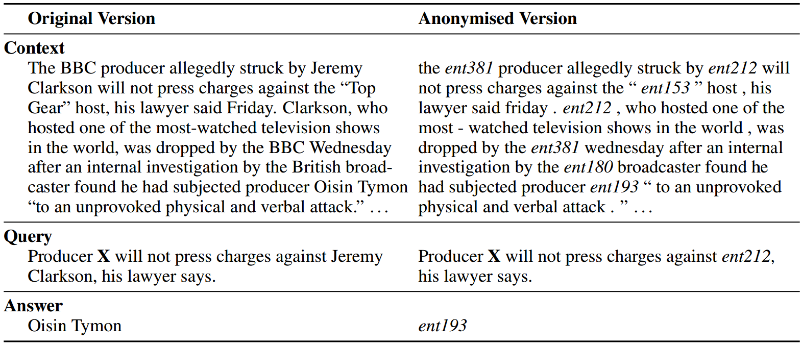
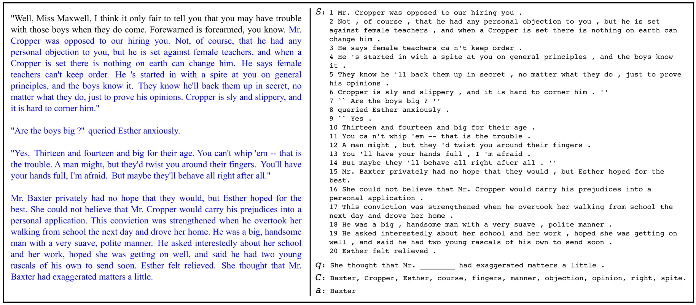
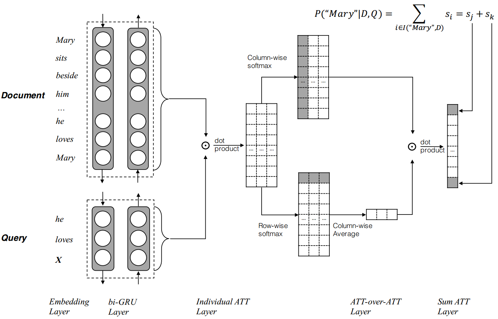
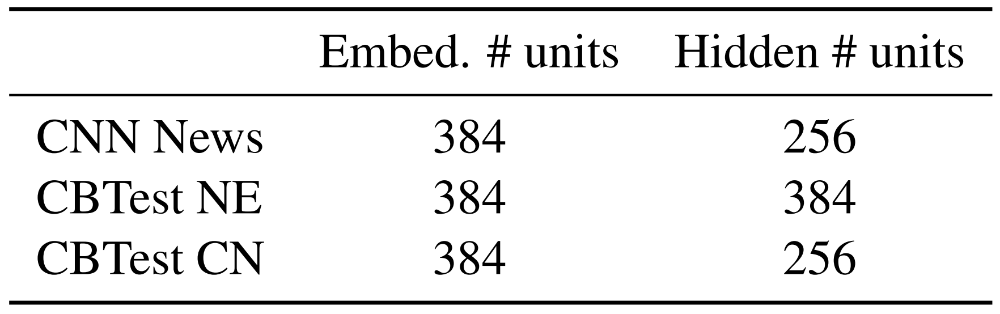
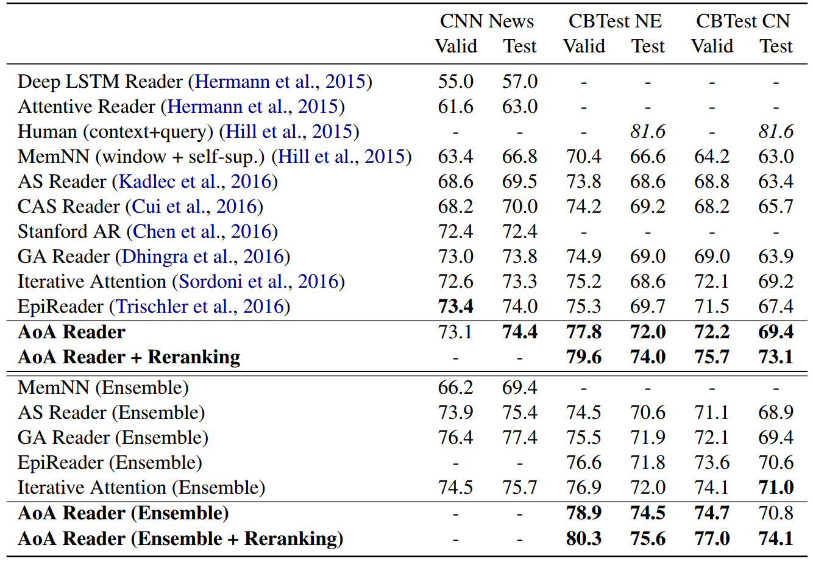
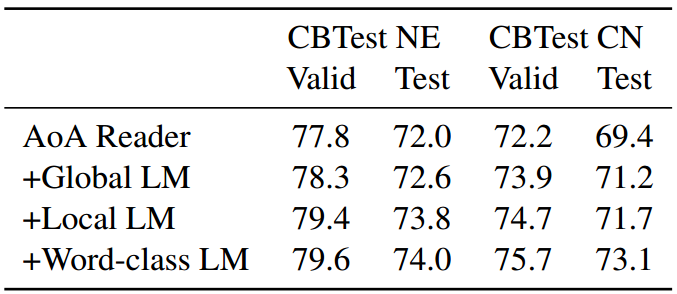
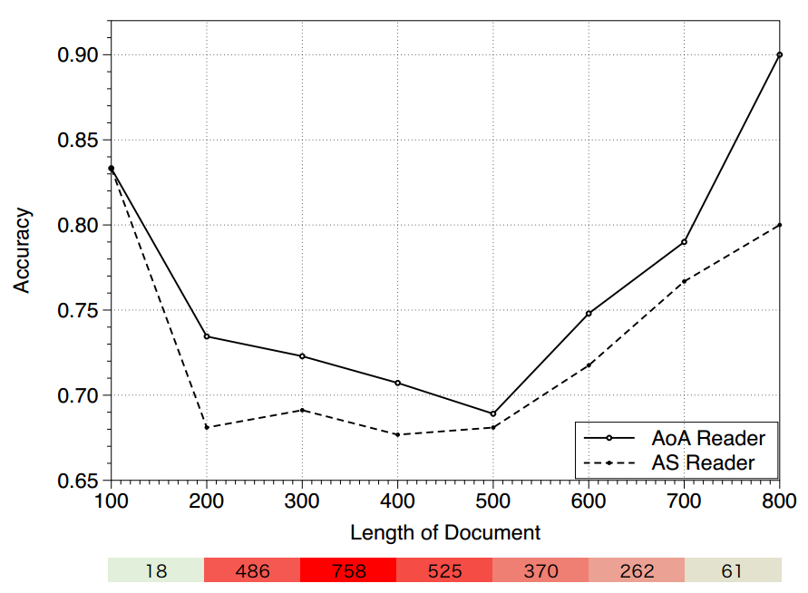
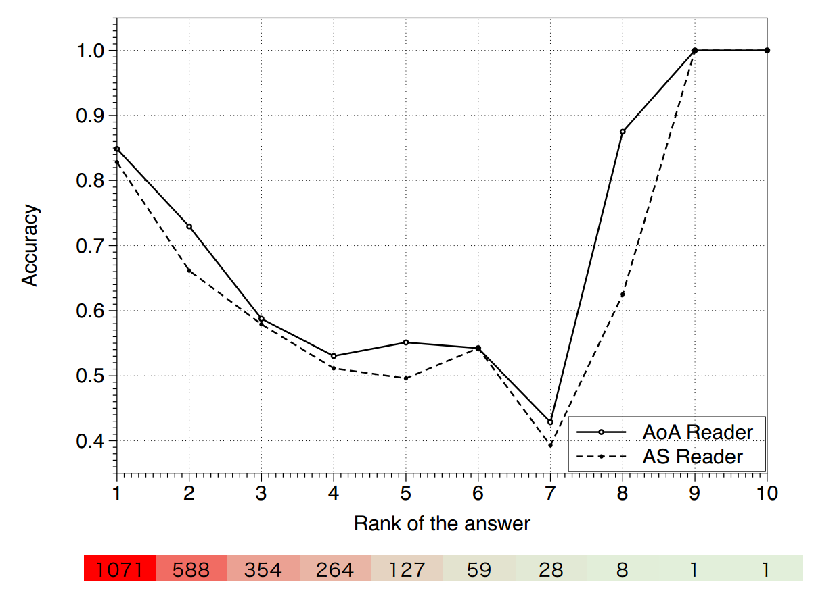

##
Attention-over-Attention Neural Networks for Reading Comprehension 

####
Yiming Cui, Zhipeng Chen, Si Wei, Shijin Wang, Ting Liu

### 1、摘要
完型填空式的阅读理解是用于挖掘document和query之间的关系，这篇文章中，作者提出了一个**全新的、简单的、有效的attention-over-attention **阅读理解模型，这个模型相比于其他 **attention** 模型，增加了一个 **attention** 层。模型的优点是简单，性能好。提出了一种 **N-best re-ranking** 策略用于二次验证候选集，提升了AoA模型的性能。实验结果表面，在CNN和CBT数据集上达到了最高的性能。
### 2、介绍
机器要阅读和理解人类语言非常困难，因为需要理解自然语言并且要分析其中的原因。阅读理解是一个非常常见的问题，通常是给定一个文本或者文章，以及相应的问题，需要机器正确的回答这个问题。最近，完型填空式的阅读理解问题变成一个非常流行的问题。

为了能够让机器更好的阅读理解，需要大量的有监督的训练数据集，Hermann et al. (2015)给出了CNN/Daily Mail数据集，不久之后这个作者又给出了CBT数据集，在这两个数据集下有很多人做过实验，他们大多数是建立的基于**attention**的神经网络，考虑document中的每个词对query的重要性。

作者这个模型在document层上面再加了一个 **attention**，前人的工作只是 query-to-document 方向的 attention，作者在此基础上增加了一个 document-to-query 方向的 attention，作者认为主要的创新点在于：
+ 在这个任务上第一次使用 attention-over-attention。

+ 模型思想简单便于理解，性能更好。

+ 提出了N-best re-ranking 策略对候选集重新打分，这个策略提升了整个模型的性能

### 3、完型填空式阅读理解
####3.1、任务描述
完型填空任务可以描述为一个三元组
$$\langle D,Q,A \rangle$$
这个任务中，答案通常是文档中的**一个单词**，例如命名实体Obama，普通名词sunny，动词，介词。
####3.2、存在的公开数据集
+ CNN/Daily Mail 数据集的介绍
&ensp;&ensp;&ensp;&ensp;这个数据集构建基本的思路是受启发于自动文摘任务，从两个大型的新闻网站CNN和Daily Mail中获取数据源，用abstractive的方法生成每篇新闻的summary，用新闻原文作为document，将summary中去掉一个entity作为query，被去掉的entity作为answer，从而得到阅读理解的数据三元组(document,query,answer)。
&ensp;&ensp;&ensp;&ensp;这里存在一个问题，就是有的query并不需要联系到document，通过query中的上下文就可以predict出answer是什么，也就失去了阅读理解的意义，**举个例子，蓝天白__**。因此，论文中提出了用一些标识替换entity和重新排列的方法将数据打乱，防止上面现象的出现。处理之后的效果见下图：

+ CBT 数据集介绍
&ensp;&ensp;&ensp;&ensp;CBT的数据均来自Project Gutenberg，使用了其中的与孩子们相关的故事，这是为了保证故事叙述结构的清晰，从而使得上下文的作用更加突出。每篇文章只选用21句话，前20句作为document，将第21句中去掉一个词之后作为query，被去掉的词作为answer，并且给定10个候选答案，每个候选答案是从原文中随机选取的，并且这10个答案的词性是相同的，要是名词都是名词，要是命名实体都是实体，要是动词都是动词。作者通过实验发现，动词和介词与上下文关联不大，可以使用常识来进行判断，所以大部分的研究重点在于命名实体和普通名词。例子看下图：

+ 两个数据集的统计信息

### 4、Attention-over-Attention Reader 模型

####4.1、Contextual Embedding
首先将document和query中的每个词提取出来，通过查询训练好的word embedding 得到每个词的特征表示。使用双向GRU模型来获取每个部分的语义表示。作者这里对每个单词的编码是384维，GRU输出层为256维。所以单个GRU的输入就是384维，输出为256维。双层GRU拼接之后的输出就是512维。
$$e(x)=W_e\cdot x，x表示单词用one-hot表示\\
\overrightarrow{h_s(x)}=\overrightarrow{GRU}(e(x))\\
\overleftarrow{h_s(x)}=\overleftarrow{GRU}(e(x))\\
h_s(x)=[\overrightarrow{h_s(x)};\overleftarrow{h_s(x)}]
$$
这里假设 $h_{doc} \in R^{|D|\times 2d}$ 表示document部分输出的隐含状态矩阵。$h_{query} \in R^{|Q|\times 2d}$ 表示query部分输出的隐含状态矩阵。
####4.2、Pair-wise Matching Score
计算 $h_{doc}$ 中每个单词与 $h_{query}$ 单词的匹配分数，得到分数矩阵。
$$M(i,j)=h_{doc}(i)\cdot h_{query}(j)^T$$
最后得到的分数矩阵 $M \in R^{|D|\times|Q|}$，上面的例子中document的维度是$7\times 512$，query的维度是$3\times 512$，进行点乘之后变成了 $7\times 3$，列表示document中的单词，行表示query中的单词，AS Reader模型中，将query部分编码成 $1 \times 512$，最后得到的也是 $7 \times 1$ 的矩阵。
####4.3、Individual Attentions
计算query中每个词在document中注意力分布，使用softmax进行归一化，直观的解释就是**document中每个词在query中的重要性**，得到的矩阵的形状没有改变，只是数值进行了归一化。计算方法为：
$$\alpha(t)=softmax(M(1,t),...,M(|D|,t))\\
\alpha=[\alpha(1),\alpha(2),...,\alpha(|Q|)]$$
####4.4、Attention-over-Attention
计算document中每个单词在query中注意力的权值分布，使用softmax归一化，直观的解释就是**query中每个词在document中的重要性**，然后在对每一列求平均，获取query中每个词在document中的权重，**最直观的印象就是每个词在query中的权重**。然后计算两个方向 attention 的点积，得到document中每个词在query中的重要性。
####4.5、Final Predictions
通过上一步计算的每个词在query中的权重，让后将相同的词的概率相加，得到最终的概率，选择概率最大的值作为预测输出单词。整个模型的目标函数就是：
$$L=max\sum_ilog(p(x))$$
### 5、N-best Re-ranking Strategy
从人的角度出发，我们做完型填空的时候，通常是先选择一个词，填入这个问句的空白出，然后再次验证这句话是否存在语法问题，是否流畅，是否是最合适的。如果存在问题，我们会尝试下一个选项。为了达到二次验证的目的，作者提出了N-best Re-ranking策略，来提升模型的性能。
+ N-best Decoding
相比于前面的选择一个概率最大的作为最后的答案，这里选择概率最大的N个单词作为候选词。

+ Refill Candidate into Query
把每个候选词填入Query中，检测他在里面的语义，形成N个句子。

+ Feature Scoring
对上面的N个句子进行评分，作者主要选择了三个评分特征。
  - Global N-gram LM:计算候选句子的流畅性。
例如需要计算“我爱吃饭”和“我爱吃水”的流畅性，通过训练所以所有的文本可以得到已知“我爱吃”后面出现每个词的概率，这个概率就表示其流畅度。

  - Local N-gram LM:还是计算候选句子的流畅性，但是这次求概率时，不是计算所有的训练文本，而是从每个query对应的document来计算。这部分科可能会导致训练误差增加，但是可以提高泛化能，因为我们只需要从对应的原文中找，这在测试的时候是有利的，尤其是一些没有统计到的词。

  - Word-class LM:这个方法先将文档中所有单词，通过聚类的方法分为1000类，然后将候选句子中按照类别来计算流畅度，计算方法和Global N-gram LM相同。

+ Weight Tuning
通过训练数据不断的调整这三个特征的权重，使得目标损失最小。

+ Re-scoring and Re-ranking
计算每个句子在这三个特征下的加权评分，最后再次通过softmax选择概率最大的。

### 6、实验
####6.1、实验设置
+ Embedding层：embedding权重随机初始化
+ 隐含层使用GRU随机初始化，主要参数设置如下图。
+ 优化器使用ADAM，初始化的学习率为0.001，提取裁剪取值为5。
+ N-best作者设置的N是5，选择5个作为候选集合。
+ N-gram模型中，N设置为8。
+ 集成模型使用的是4个最好的模型，使用不同的随机初始化种子得到的。

####6.2、全部实验结果

从实验结果可以发现，AoA模型在这两个数据集上面已经达到最佳的效果。上面一部分是单模型，下面一个是集成模型。
####6.3、Effectiveness of Re-ranking Strategy
从上面的实验结果可以看出，Re-ranking对整个模型的效果有很多贡献。具体的贡献量如下：

+ AoA Reader表示不使用Re-ranking策略的效果，每一行表示增加一个特征，并且累加以前的特征。
+ 在CBT NE测试集上Global LM增加了0.6，Local LM增加了0.12，Word-class LM增加了0.2。
+ 在CBT CN测试集上Global LM增加了1.8，Local LM增加了0.5，Word-class LM增加了1.4。
+ 在NE这个数据集上，Local LM这个特征最为重要，回答问题的命名实体通常在对应的文章上。
+ 在CN这个数据集上，Global LM和Word-class LM特征最为重要。

### 7、定量分析
+ 在CBTNE上进行定量分析。下图是文档的长度和相应的精度的关系：

最下面的横条表示每个区间的文档的数量，可以看出文档单词个数在400-500之间，整个模型的效果最差。这个效果和AS Reader模型类似，当单词个数超过700时，AoA模型精度提升非常大，可以看出AoA模型比AS模型更适合阅读长文本。

+ 下图表示测试精度与答案词频之间的关系：

最下面的横条表示有多少个问句选择了答案所在的词频。例如有1071个句子的答案选择了词频最高的作为答案，测试的准确率为0.85左右。

