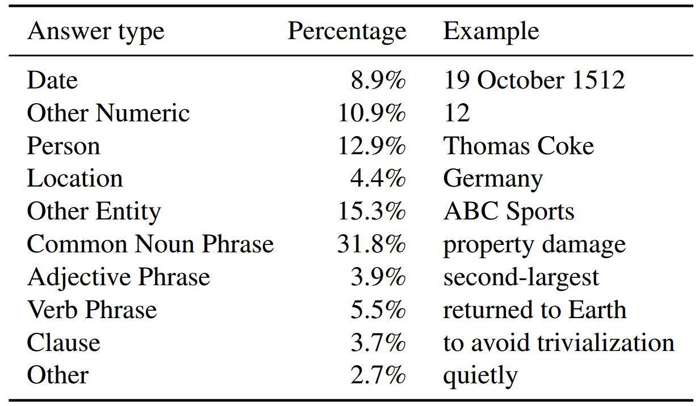
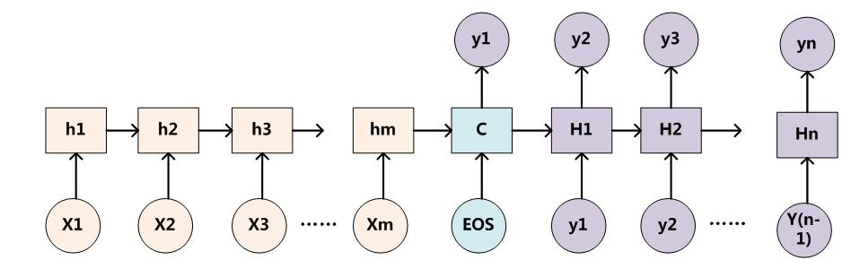
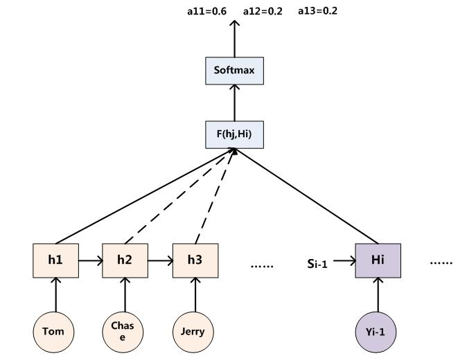
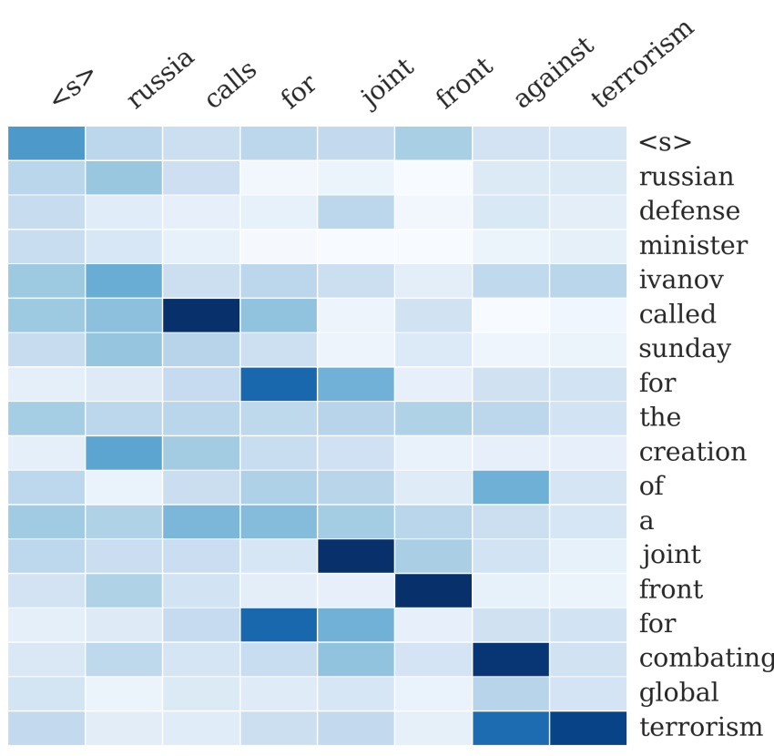
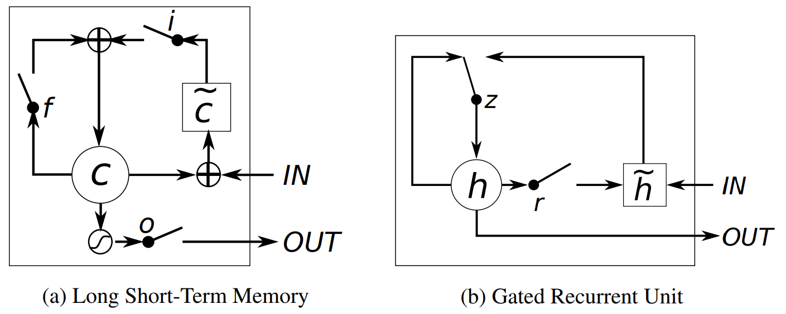
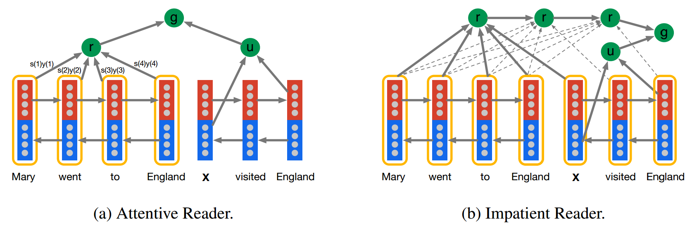
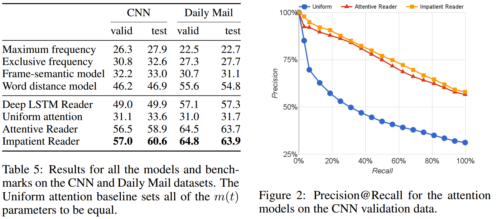
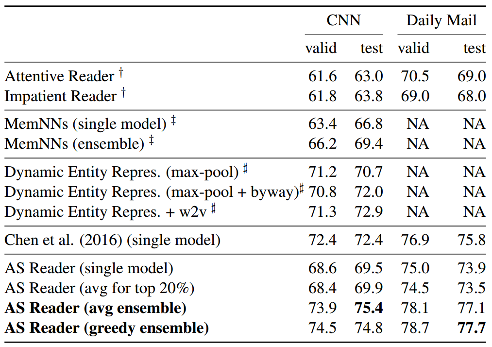

##
阅读理解报告

###1、任务说明
&ensp;&ensp;&ensp;&ensp;阅读理解问题可以表述为一个三元组(d,q,a)，这里d是指原文document，q是指问题query，a是answer，即问题的答案。这个答案是来自一个固定大小的词汇表A中的一个词或者一个短语。我们要解决的问题就变成了：给定一个document-query对(d,q)，从A中找到最合适的答案a。
&ensp;&ensp;&ensp;&ensp;经常听到这么一句话，没有分类解决不了的问题。虽然有一点夸张，但这个问题是一个典型的多分类问题，预测候选列表中每个word或者entity的条件概率，最大的那个就是正确答案。其实很多问题也都是这样，尤其是在生成问题上，给定context，来predict每一个word的概率。
&ensp;&ensp;&ensp;&ensp;不同的论文在词汇表A中有些不同，有的论文将A定义为document和query中的所有词，而有的将A定义为所有的entity，还有的将会附带一个包括正确答案在内的10个候选答案，并且每个答案的词性都一致。
###2、常用数据集
####2.1、CNN/Daily Mail
&ensp;&ensp;&ensp;&ensp;这个数据集构建基本的思路是受启发于自动文摘任务，从两个大型的新闻网站CNN和Daily Mail中获取数据源，用abstractive的方法生成每篇新闻的summary，用新闻原文作为document，将summary中去掉一个entity作为query，被去掉的entity作为answer，从而得到阅读理解的数据三元组(document,query,answer)。
&ensp;&ensp;&ensp;&ensp;这里存在一个问题，就是有的query并不需要联系到document，通过query中的上下文就可以predict出answer是什么，也就失去了阅读理解的意义，**举个例子，蓝天白__**。因此，论文中提出了用一些标识替换entity和重新排列的方法将数据打乱，防止上面现象的出现。处理之后的效果见下图：

####2.2、Children’s Book Test(CBT)
&ensp;&ensp;&ensp;&ensp;CBT的数据均来自Project Gutenberg，使用了其中的与孩子们相关的故事，这是为了保证故事叙述结构的清晰，从而使得上下文的作用更加突出。每篇文章只选用21句话，前20句作为document，将第21句中去掉一个词之后作为query，被去掉的词作为answer，并且给定10个候选答案，每个候选答案是从原文中随机选取的，并且这10个答案的词性是相同的，要是名词都是名词，要是命名实体都是实体，要是动词都是动词。作者通过实验发现，动词和介词与上下文关联不大，可以使用常识来进行判断，所以大部分的研究重点在于命名实体和普通名词。例子看下图：

####2.3、Stanford Question Answering Dataset(SQuAD)
该数据集的构建分为三个步骤：
+ 在Wikipedia中选取质量排名在10000以内的article，（这里用了 Project Nayuki’s Wikipedia’s internal PageRanks来做rank），从每篇文章中提取出paragraph，经过一系列处理之后得到了23215个paragraph，涉及了很宽泛的话题。

+ 然后雇佣了crowdworkers给每个paragraph提问和回答，而且鼓励workers用自己的话来提问。（这一点和CNN中用abstractive的思路很像，只不过是用了人工来做。）

+ 第三步是让crowdworkers来用原文中的text（word或者是span）来回答这个问题，如果无法用原文回答的话，直接提交问题。

###3、通用的Attention机制
&ensp;&ensp;&ensp;&ensp;在特定的时刻T，你的意识和注意力的焦点是集中在画面中的某一个部分上，其它部分虽然还在你的眼中，但是你分配给它们的注意力资源是很少的。比如你过马路，其实你的注意力会被更多地分配给红绿灯和来往的车辆上，虽然此时你看到了整个世界，但是对其它部分视而不见。
&ensp;&ensp;&ensp;&ensp;因为目前绝大多数文献中出现的AM模型是附着在Encoder-Decoder框架下的，当然，其实AM模型可以看作一种通用的思想，本身并不依赖于Encoder-Decoder模型，这点需要注意。

**抽象的Encoder-Decoder框架**

&ensp;&ensp;&ensp;&ensp;Encoder-Decoder框架可以这么直观地去理解：可以把它看作适合处理由一个句子（或篇章）生成另外一个句子（或篇章）的通用处理模型。对于句子对<X,Y>，我们的目标是给定输入句子X，期待通过Encoder-Decoder框架来生成目标句子Y。在阅读理解中，**X和Y分别表示文档和问题**。而X和Y分别由各自的单词序列构成：
$$X=(x_1,x_2,...,x_n)\\
Y=(y_1,y_2,...,y_m)
$$

Encoder顾名思义就是对输入句子X进行编码，将输入句子通过非线性变换转化为中间语义表示C
$$C=F(x_1,x_2,...,x_m)$$

对于解码器Decoder来说，其任务是根据句子X的中间语义表示C和之前已经生成的历史信息$y_1,y_2,...,y_{i-1}$来生成i时刻要生成的单词$y_i$
$$y_i=G(C,y_1,y_2,...,y_{i-1})$$

每个$y_i$都依次这么产生，那么看起来就是整个系统根据输入句子X生成了目标句子Y。它的应用场景多得不得了，比如对于机器翻译来说，(X,Y)就是对应不同语言的句子，比如X是英语句子，Y是对应的中文句子翻译。再比如对于文本摘要来说，X就是一篇文章，Y就是对应的摘要；再比如对于对话机器人来说，X就是某人的一句话，Y就是对话机器人的应答；

Encoder-Decoder是个非常通用的计算框架，至于Encoder和Decoder具体使用什么模型都是由实际任务定的，常见的比如$CNN/RNN/BiRNN/GRU/LSTM/Deep LSTM$等

上图中展示的Encoder-Decoder模型是没有体现出“注意力模型”的，可以把它看作是注意力不集中的分心模型。为什么说它注意力不集中呢？请观察下目标句子Y中每个单词的生成过程如下：
$$\begin{align*}y_1&=f(C)\\y_2&=f(C,y_1)\\y_3&=f(C,y_1,y_2)\end{align*}$$

其中 $f$ 是decoder的非线性变换函数。从这里可以看出，在生成目标句子的单词时，不论生成哪个单词，是$y_1,y_2$也好，还是$y_3$也好，他们使用的句子X的语义编码C都是一样的，没有任何区别。

而语义编码C是由句子X的每个单词经过Encoder 编码产生的，这意味着不论是生成哪个单词，$y_1,y_2还是y_3$，其实句子X中任意单词对生成某个目标单词 $y_i$ 来说影响力都是相同的，没有任何区别。

如果拿机器翻译来解释这个分心模型的Encoder-Decoder框架更好理解，比如输入的是英文句子：Tom chase Jerry，Encoder-Decoder框架逐步生成中文单词：“汤姆”，“追逐”，“杰瑞”。在翻译“杰瑞”这个中文单词的时候，分心模型里面的每个英文单词对于翻译目标单词“杰瑞”贡献是相同的，很明显这里不太合理，显然“Jerry”对于翻译成“杰瑞”更重要，但是分心模型是无法体现这一点的，这就是为何说它没有引入注意力的原因。

没有引入注意力的模型在输入句子比较短的时候估计问题不大，但是如果输入句子比较长，此时所有语义完全通过一个中间语义向量来表示，单词自身的信息已经消失，可想而知会丢失很多细节信息，这也是为何要引入注意力模型的重要原因。

简单的说，这种模型在产生输出的时候，还会产生一个“注意力范围”表示接下来输出的时候要重点关注输入序列中的哪些部分，然后根据关注的区域来产生下一个输出，如此往复。

上面的例子中，如果引入AM模型的话，应该在翻译“杰瑞”的时候，体现出英文单词对于翻译当前中文单词不同的影响程度，比如给出类似下面一个概率分布值：
$$(Tom,0.3)\quad(chase,0.2)\quad(Jerry,0.5)$$

每个英文单词的概率代表了翻译当前单词“杰瑞”时，注意力分配模型分配给不同英文单词的注意力大小。这对于正确翻译目标语单词肯定是有帮助的，因为引入了新的信息。同理，目标句子中的每个单词都应该学会其对应的源语句子中单词的注意力分配概率信息。这意味着在生成每个单词 $Y_i$ 的时候，原先都是相同的中间语义表示C会替换成根据当前生成单词而不断变化的 $C_i$。理解AM模型的关键就是这里，即由固定的中间语义表示C换成了根据当前输出单词来调整成加入注意力模型的变化的 $C_i$。增加了AM模型的Encoder-Decoder框架理解起来如图所示:

生成目标句子单词的过程成了下面的形式:
$$\begin{align*}y_1&=f_1(C_1)\\y_2&=f_1(C_2,y_1)\\y_3&=f_1(C_3,y_1,y_2)\end{align*}$$
而每个 $C_i$ 可能对应着不同的源语句子单词的注意力分配概率分布，比如对于上面的英汉翻译来说，其对应的信息可能如下：
$$C_{汤姆}=g( 0.6*f_2("Tom"),0.2*f_2("chase"),0.2*f_2("Jerry"))\\\\
C_{追逐}=g( 0.2*f_2("Tom"),0.7*f_2("chase"),0.1*f_2("Jerry"))\\\\
C_{杰瑞}=g( 0.3*f_2("Tom"),0.2*f_2("chase"),0.5*f_2("Jerry"))$$

其中，$f_2$函数代表Encoder对输入英文单词的某种变换函数，比如如果Encoder是用的RNN模型的话，这个$f_2$函数的结果往往是某个时刻输入$x_i$后隐层节点的状态值；$g$代表Encoder根据单词的中间表示合成整个句子中间语义表示的变换函数，一般的做法中，$g$函数就是对构成元素加权求和，也就是常常在论文里看到的下列公式：
$$C_i=\sum_{j=1}^{T_x}\alpha_{ij}h_j$$
假设$C_i$中那个 $i$ 就是上面的“汤姆”，那么 $T_x$ 就是3，代表输入句子的长度，$h_1=f("Tom")，h_2=f("Chase"),h_3=f("Jerry")$，对应的注意力模型权值分别是 $0.6,0.2,0.2$，所以 $g$ 函数就是个加权求和函数。如果形象表示的话，翻译中文单词“汤姆”的时候，数学公式对应的中间语义表示  $C_i$ 的形成过程类似下图：

这里还有一个问题：生成目标句子某个单词，比如“汤姆”的时候，你怎么知道AM模型所需要的输入句子单词注意力分配概率分布值呢？就是说“汤姆”对应的概率分布，是如何得到的呢？

为了便于说明，我们假设对非AM模型的Encoder-Decoder框架进行细化，Encoder采用RNN模型，Decoder也采用RNN模型，这是比较常见的一种模型配置，则转换为下图：

那么用下图可以较为便捷地说明注意力分配概率分布值的通用计算过程：

对于采用RNN的Decoder来说，如果要生成 $y_i$ 单词，在时刻 $i$，我们是可以知道在生成 $y_i$ 之前的隐层节点 $i$ 时刻的输出值 $H_i$ 的，而我们的目的是要计算生成 $y_i$ 时的输入句子单词“Tom”、“Chase”、“Jerry”对 $y_i$ 来说的注意力分配概率分布，那么可以用 $i$ 时刻的隐层节点状态 $H_i$ 去一一和输入句子中每个单词对应的RNN隐层节点状态 $h_j$ 进行对比，即通过函数 $F(h_j,H_i)$ 来获得目标单词 $y_i$ 和每个输入单词对应的对齐可能性，这个 $F$ 函数在不同论文里可能会采取不同的方法，**通常使用前馈神经网络去学习**，然后函数F的输出经过Softmax进行归一化就得到了符合概率分布取值区间的注意力分配概率分布数值。

上图显示的是当输出单词为“汤姆”时刻对应的输入句子单词的对齐概率。绝大多数AM模型都是采取上述的计算框架来计算注意力分配概率分布信息，区别只是在 $F$ 的定义上可能有所不同。

上述内容就是论文里面常常提到的Soft Attention Model的基本思想，你能在文献里面看到的大多数AM模型基本就是这个模型，区别很可能只是把这个模型用来解决不同的应用问题。那么怎么理解AM模型的物理含义呢？

一般文献里会把AM模型看作是**单词对齐模型**，这是非常有道理的。目标句子生成的每个单词对应输入句子单词的概率分布可以理解为输入句子单词和这个目标生成单词的对齐概率，这在机器翻译语境下是非常直观的：传统的统计机器翻译一般在做的过程中会专门有一个短语对齐的步骤，而注意力模型其实起的是相同的作用。在其他应用里面把AM模型理解成输入句子和目标句子单词之间的对齐概率也是很顺畅的想法。

当然，我觉得从概念上理解的话，把AM模型理解成影响力模型也是合理的，就是说生成目标单词的时候，输入句子每个单词对于生成这个单词有多大的影响程度。这种想法也是比较好理解AM模型物理意义的一种思维方式。

Rush用AM模型来做生成式摘要给出的一个AM的一个非常直观的例子。

这个例子中，Encoder-Decoder框架的输入句子是：“russian defense minister ivanov called sunday for the creation of a joint front for combating global terrorism”。对应图中**纵坐标**的句子。系统生成的摘要句子是：“russia calls for joint front against terrorism”，对应图中**横坐标**的句子。可以看出模型已经把句子主体部分正确地抽出来了。矩阵中**每一列**代表生成的目标单词对应输入句子每个单词的AM分配概率，颜色越深代表分配到的概率越大。这个例子对于直观理解AM是很有帮助作用的。

###4、GRU网络
通过大量的实验(Chung et al.,2014)发现，GRU网络精度和LSTM差不多，但是结构非常简单，概括的来说，LSTM和GRU都能通过各种Gate将重要特征保留，保证其在long-term 传播的时候也不会被丢失；在收敛时间和需要的epoch上，GRU应该要更胜一筹。

###5、模型与实验结果
**Teaching Machines to Read and Comprehend**
本文关键作用，使用新方法，自动生成大量的数据，提供大量的监督阅读数据，这篇文章在2015年提出了CNN/Daily Mail数据集。作者在当年提出了以下两个模型对数据测试，这个模型比较简单，基本是这个**数据集** 的baseline (Hermann et al.,2015NIPS)

**Attentive Reader**:
基本的实现过程是，左边表示对document的双向LSTM编码，右边表示对query的双向LSTM编码，对于document这一部分，每个单词的两次编码直接拼接，得到隐含状态 $y_i$，再乘以各自的权重，这里的权重是通过神经网络学习得到的，再相加得到 $r$，对于query这一部分，只将正向的LSTM层的最后编码和反向的LSTM的最后一层编码拼接，得到隐含状态 $u$。通过神经网络的训练，计算document中每一个**attention词**与query的关联度，这篇文章中作者将query的特征 $u$ 与每一个带**attention词**向量相加，最后根据 $tanh$ 计算概率值。

**Impatient Reader**:
这一模型和 attentive reader 类似，但是每读入一个 query token 就迭代计算一次 document 的权重分布。

最终的结果，在 CNN 语料中，第三种模型 Impatient Reader 最优，Attentive Reader 效果和 Impatient Reader 差不太多。

**Text Understanding with the Attention Sum Reader Network**
这个模型是针对Attentive Reader的改进，主要的创新点(Kadlec et al.,2016ACL)：
+ 首先使用双向GRU对Document和Question的每个单词编码。
+ Question编码后，与每一个Document单词编码之后进行点积，这与上一篇中对所以单词加权求和不同。
+ 使用Softmax对每个单词求概率。
+ 首次针对这个任务使用模型集成的方法来提升模型的效果。

从上图看，基本的流程和attentive reader相同，首先将Document和Question编码，再使用一个双向的GRU将输出的隐含层拼接。Document每一个单词的双向GRU拼接作为一个输出，Question部分将正、反向GRU最后一个拼接，得到Question部分的一个编码。然后Question部分的编码与每一个Document单词编码求点积。最后使用softmax求每个单词的概率，这个概率就表示每个单词与Question的语义相似性，选择概率最大的一个作为正确答案。效果怎么样呢？后面有结果。

由于初始化的参数不同，会导致模型预测结果不同，作者通过多次初始化权重，来训练不同的模型。single model表示在所有训练的模型中，选择预测效果最好的一个模型，avg for top 20% 表示求预测效果好的前20%模型的平均值，只是针对单个模型。avg ensemble文中表示对前70%的模型进行集成，使用加权平均的方式来预测最后的结果，greedy ensemble表示在每一步集成的过程中，对预测记过进行测试，如果性能提升，就把这个模型加入进去。

**Attention-over-Attention Neural Networks for Reading Comprehension**

(Cui et al.,2017)

