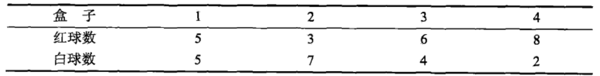
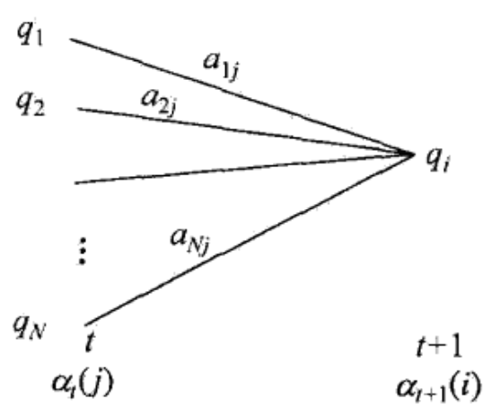
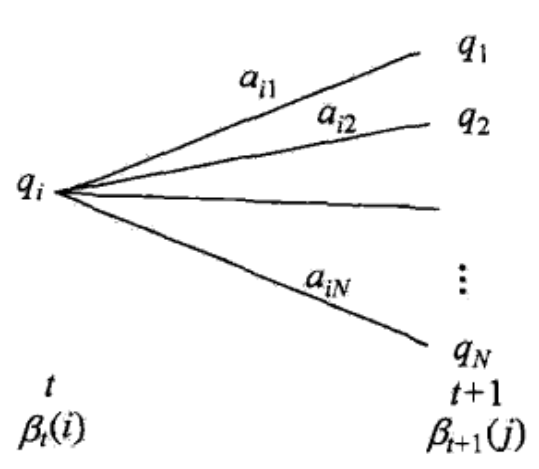
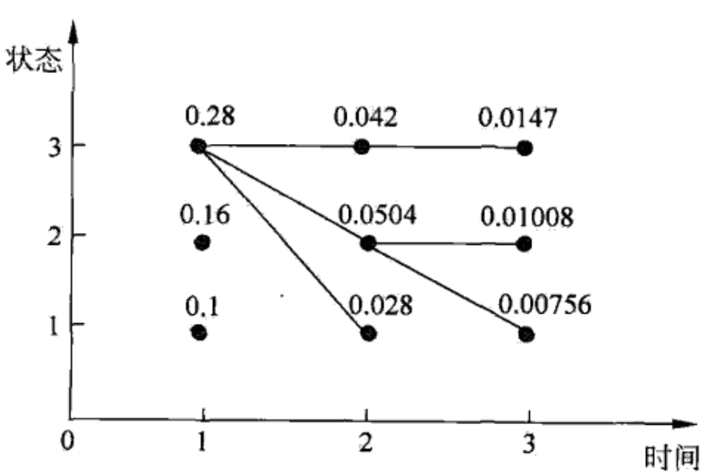

##
隐马尔科夫模型

###1、隐马尔科夫模型的基本概念
####1.1、隐马尔科夫模型的基本概念
隐马尔科夫模型(HMM)，描述由隐藏的马尔科夫链**观测序列的过程**，属于**生成模型**。HMM是一个关于时序的概率模型，按照概率生成观测序列和状态序列，先生成**随机不可观测的状态序列，再由这些状态序列，对应生成一个随机的观测序列，终极目的，生成观测序列**。这里包含了双重随机，第一个是状态随机，第二个是观测随机。HMM由初始概率分布，状态转移概率分布以及观测概率分布确定。

假设 $Q$ 是所有可能的状态集合，$V$ 是所有可能的观测的集合：
$$Q=\{q_1,q_2,...,q_N\}\quad V=\{v_1,v_2,...,v_M\}$$
其中，$N$ 表示所有的状态数，是固定的，$M$ 表示所有的观测值数目。

$I$ 是长度为 $T$ 的状态序列，$O$ 是对应的观测序列，**每个状态和观测有多种取值**，状态序列和对应的观测序列长度相等:
$$I=(i_1,i_2,...,i_T)\quad O=(o_1,o_2,...,o_T)$$

$A$ 表示状态转移概率矩阵：
$$A=\left[a_{ij}\right]_{N\times N}$$
其中，$a_{ij}$ 表示在 $t$ 时刻处于状态 $q_i$ 的条件下，在 $t+1$ 时刻处于 $q_j$ 的概率。
$$a_{ij}=P(i_{t+1}=q_j\,|\,i_t=q_i)$$

$B$ 表示观测概率矩阵：
$$B=\left[b_j(k)\right]_{N\times M}$$
其中，$b_j(k)$ 表示在时刻 $t$ 下，处于状态 $q_j$ 的条件下，生成观测值 $v_k$ 的概率。
$$b_j(k)=P(o_t=v_k\,|\,i_t=q_j)$$

$\pi$ 表示初始概率向量：
$$\pi=(\pi_i)$$
$\pi$ 表示 $t=1$ 时刻 $q_i$ 的概率分布，第一步的概率分布。
$$\pi_i=P(i_1=q_i)$$

隐马尔科夫模型，$\pi\,和\,A$ 决定状态序列，$B$ 决定观测序列，马尔科夫模型 $\lambda$ ，三个参数称为三要素：
$$\lambda=(A,B,\pi)$$

状态转移概率矩阵 $A$ 与初始概率分布 $\pi$ **确定了隐藏的马尔科夫链**，**生成不可观测的状态序列**。观测概率矩阵 $B$ 确定了如何从状态生成观测，与状态序列综合**确定了如何产生观测序列**。

马尔科夫的两个基本假设，这两个假设非常重要：
+ **齐次马尔科夫假设**，假设隐藏的马尔科夫链在任意时刻 $t$ 的状态，**只依赖与前一时刻的状态**，与**上一个状态的观测**无关，至于状态转移概率有关，也与时刻 $t$ 无关。
$$P(i_t\,|\,i_{t-1},o_{t-1},...,i_1,o_1)=P(i_t\,|\,i_{t-1})$$

+ **观测独立性假设**，任意时刻的观测只依赖与该时刻对应的状态，与其他观测和状态无关。
$$P(o_t\,|\,i_t,o_{t-1},...,i_1,o_1)=P(o_t\,|\,i_t)$$

**例子**，假设有4个盒子，每个盒子里面都装有红白两种颜色的求，盒子里面的球如下表：

.

按照下面的方法抽球，产生一个球的颜色的观测序列：开始，从4个盒子里面**等概率**随机抽取1个盒子，然后在这个盒子里面随机抽取1个求，记录颜色后放回。然后从当前的盒子随机转移到下一个盒子，转移规则如下：如果当前的盒子是1，那么下一个盒子一定是2，如果当前的盒子是2或3，那么分别以0.4和0.6的概率转移到左边或者右边的盒子，如果是盒子4，那么分别以0.5个概率停留在盒子4或者转移到盒子3。如此下去，重复5次，得到一个求得颜色的观测序列。
$$O=\{红，红，白，白，红\}$$
在这个过程中，观测这只能观测到球的颜色，观测不到从哪个盒子取出来的，也就是观测不到状态序列。在这个过程中，有两个随机序列，一个是盒子的序列**(状态序列)**，一个是球的颜色的观测序列**(观测序列)**，前者是隐藏的，后者是可观测的。**状态序列是隐藏的，观测序列是可观测的，这就是一个典型的HMM模型**。

盒子对应于状态，状态的集合是：
$$Q=\{盒子1，盒子2，盒子3，盒子4\}\quad N=4$$
球的颜色对应观测，观测集合为：
$$V=\{红，白\}\quad M=2$$
状态序列和观测序列的长度为 $T=5$
初始概率分布为**(机器学习中很多变量默认是使用列向量表示)**：
$$\pi=(0.25,0.25,0.25,0.25)^T$$
状态转移概率分布为：
$$\begin{align*}
A=\begin{bmatrix}
0 & 1 & 0 & 0\\
0.4 & 0 & 0.6 & 0\\
0 & 0.4 & 0 & 0.6\\
0 & 0 & 0.5 & 0.5\\
\end{bmatrix}
\end{align*}$$
观测概率分布为：
$$\begin{align*}
B=\begin{bmatrix}
0.5 & 0.5\\
0.3 & 0.7\\
0.6 & 0.4\\
0.8 & 0.2\\
\end{bmatrix}
\end{align*}$$

####1.2、观测序列的生成过程
根据HMM的定义，可将一个长度为 $T$ 的观测序列 $O=(o_1,o_2,...,o_T)$ 的生成过程描述如下：

**观测序列的生成**
输入：隐马尔科夫模型 $\lambda=(A,B,\pi)$ **模型已知**，观测序列的长度 $T$ 。
输出：观测序列 $O=(o_1,o_2,...,o_T)$
+ 按照初始状态分布 $\pi$ 产生状态 $i_1$，**按照概率分布生成**。

+ 令 $t=1$

+ 按照状态 $i_t$ 的 **观测概率分布 $b_{i_t}(k)$** 生成观测 $o_t$

+ 按照状态 $i_t$ 的状态转移概率分布 $\{a_{i_ti_{t+1}}\}$ 产生状态 $i_{t+1}$，一共有 $N$ 种可能。

+ 迭代，直到达到指定的长度。

####1.3、隐马尔科夫模型的3个基本问题
+ 概率计算问题。**使用前向后向算法**，给定模型 $\lambda=(A,B,\pi)$ 和观测序列 $O=(o_1,o_2,...,o_T)$，计算在模型 $\lambda$ 下观测序列 $O$ 的概率 $P(O\,|\,\lambda)$，这一步是 **学习算法中的一个必备步骤，用于EM算法的 E 步**

+ 学习问题。已知观测序列 $O=(o_1,o_2,...,o_T)$ ，估计模型 $\lambda=(A,B,\pi)$ 的参数。使得在该模型下，观测序列概率 $P(O\,|\,\lambda)$ 最大。通常使用极大似然估计的方法来估计参数。**由于含有隐变量，是无标签数据，所以需要使用 EM 算法**。

+ 预测问题，也叫解码问题，已知模型 $\lambda=(A,B,\pi)$ 和观测序列 $O=(o_1,o_2,...,o_T)$，求给定观测条件序列条件下，概率 $P(I|O)$ 最大的状态序列 $I=(i_1,i_2,...,i_T)$。也就是给定观测序列，求最可能的状态序列。**通常用于序列标注问题，重点是求状态序列。**

总结起来，这三个问题就是**求观测序列的概率，估计模型参数，求状态序列**。

###2、概率计算方法
####2.1、直接计算法
给定模型 $\lambda=(A,B,\pi)$ 和观测序列 $O=(o_1,o_2,...,o_T)$，计算在模型 $\lambda$ 下观测序列 $O$ 的概率 $P(O\,|\,\lambda)$，最直接的方法是，按概率公式直接计算。通过列举所有长度为 $T$ 的状态序列 $I=(i_1,i_2,...,i_T)$ ，求各个状态序列 $I$ 与观测序列 $O=(o_1,o_2,...,o_T)$ 的联合概率 $P(O,I\,|\,\lambda)$，然后对所有的状态序列求和，得到 $P(O\,|\,\lambda)$。先求联合概率，再对每个状态求和。

指定状态序列 $I=(i_1,i_2,...,i_T)$ 出现的概率：
$$P(I\,|\,\lambda)=\pi_{i_1}a_{i_1i_2}a_{i_2i_3}...a_{i_{T-1}i_T}$$

在指定状态序列 $I=(i_1,i_2,...,i_T)$ 下，观测序列 $O=(o_1,o_2,...,o_T)$ 出现的概率：
$$P(O\,|\,I,\lambda)=b_{i_1}(o_1)b_{i_2}(o_2)...b_{i_T}(o_T)$$

$O\,和\,I$ 同时出现的联合概率为：
$$\begin{align*}
P(O\,|\,\lambda)&=P(O\,|\,I,\lambda)P(I\,|\,\lambda)\\\\
&=[\pi_{i_1}b_{i_1}(o_1)][a_{i_1i_2}b_{i_2}(o_2)]...[a_{i_{T-1}i_T}b_{i_T}(o_T)]
\end{align*}$$

然后，对所有可能的状态序列 $I$ 求和，得到观测序列 $O$ 的概率 $P(O\,|\,\lambda)$，具体求解方式如下：
$$\begin{align*}
P(O\,|\,\lambda)&=\sum_{I}P(O\,|\,I,\lambda)P(I\,|\,\lambda)\\\\
&=\sum_{i_1,i_2,...,i_T}[\pi_{i_1}b_{i_1}(o_1)][a_{i_1i_2}b_{i_2}(o_2)]...[a_{i_{T-1}i_T}b_{i_T}(o_T)]
\end{align*}$$

从上面的公式可以看到，一共要进行 $T$ 次求和，由于每一步，需要对所有的状态都求指定观测 $o_i$ 的概率，所以需要 $N$ 次计算，那么求完一整个观测序列，时间复杂度为 $O(TN^T)$，这种复杂度在非常大，计算几乎不可能。

####2.2、前向算法
**前向概率**，给定隐马尔科夫模型 $\lambda$ ，定义到时刻 $t$ 部分观测序列为 $o_1,o_2,...,o_t$，且在 $t$ 时刻状态为 $q_i$ 的概率，**求在特定时刻 $t$，满足特定的观测序列，并且在该时刻，状态为 $q_i$ 的概率**：
$$\alpha_t(i)=P(o_1,o_2,...,o_t,i_t=q_i\,|\,\lambda)$$
可以递归地求出前向概率 $\alpha_t(i)$，以及观测序列概率 $P(O\,|\,\lambda)$。

**最终目的，求观测序列的前向概率**
输入：隐马尔科夫模型 $\lambda$，观测序列 $O$
输出：观测序列概率 $P(O\,|\,\lambda)$
+ 初值 $t=1$：
$$\alpha_1(i)=P(o_1,i_1=q_i\,|\,\lambda)=\pi_ib_i(o_1)\quad i=1,2,...,N\;(状态数量)$$

+ 递推，对 $t=1,2,...,T-1$，只能递推到 $T-1$ 步，具体的形式如图：
$$\alpha_{t+1}(i)=\left[\sum_{j=1}^{N}\alpha_t(j)\cdot a_{ji}\right]b_i(o_{t+1})$$
左边中括号部分表示，按照指定的观测序列 $o_1,o_2,...,o_{t}$，走下来，在 $t+1$ 时刻的出现状态 $q_i$ 的概率，右边部分表示在 $q_i$ 状态出现指定观测的概率。

.

+ 终止，需要对最后所有的出现指定观测的概率进行累加。
$$P(O\,|\,\lambda)=\sum_{i=1}^{N}\alpha_T(i)$$

前向算法实际是基于**状态序列的路径结构**递推的计算 $P(O\,|\,\lambda)$ 的算法，前向算法高效的关键是**局部计算**前向概率，避免了很多重复计算，通过递推的方法，推广到全局。由于计算时，只要用到上一步的结果，所以只要计算两层，时间复杂度为 $O(N^2T)$

**例子：**已知上面的盒子和球模型为 $\lambda=(A,B,\pi)$，状态集合 $Q=\{1,2,3\}$，观测集合为 $V=\{红，白\}$，参数如下：
$$\begin{align*}\\
A=\begin{bmatrix}
0.5 & 0.2 & 0.3\\
0.3 & 0.5 & 0.2\\
0.2 & 0.3 & 0.5
\end{bmatrix}\quad
B=\begin{bmatrix}
0.5 & 0.5\\
0.4 & 0.6\\
0.7 & 0.3
\end{bmatrix}\quad
\pi=(0.2,0.4,0.4)^T
\end{align*}$$
设 $T=3\;,\;O=(红，白，红)$，使用前向算法计算观测概率值 $P(O\,|\,\lambda)$
+ 计算初值：
$$\alpha_1(q_i=1)=\pi_1\cdot b_1(红)=0.2\times 0.5=0.10$$
$$\alpha_1(q_i=2)=\pi_2\cdot b_2(红)=0.4\times 0.4=0.16$$
$$\alpha_1(q_i=3)=\pi_3\cdot b_3(红)=0.7\times 0.4=0.28$$

+ 递推计算：
$$\alpha_2(q_i=1)=\left[\sum_{j=1}^{3}\alpha_1(j)\cdot a_{j1}\right]b_1(白)=(0.10\times 0.5+0.16\times0.3+0.28\times 0.2)\times 0.5=0.077$$
$$\alpha_2(q_i=2)=\left[\sum_{j=1}^{3}\alpha_1(j)\cdot a_{j2}\right]b_2(白)=(0.10\times 0.2+0.16\times0.5+0.28\times 0.3)\times 0.6=0.1104$$
$$\alpha_2(q_i=3)=\left[\sum_{j=1}^{3}\alpha_1(j)\cdot a_{j3}\right]b_3(白)=(0.10\times 0.3+0.16\times0.2+0.28\times 0.5)\times 0.3=0.0606$$
$$\alpha_3(q_i=1)=\left[\sum_{j=1}^{3}\alpha_2(j)\cdot a_{j1}\right]b_1(红)=(0.077\times 0.5+0.1104\times0.3+0.0606\times 0.2)\times 0.5=0.04187$$
$$\alpha_3(q_i=2)=\left[\sum_{j=1}^{3}\alpha_2(j)\cdot a_{j2}\right]b_2(红)=(0.077\times 0.2+0.1104\times0.5+0.0606\times 0.3)\times 0.4=0.03551$$
$$\alpha_3(q_i=3)=\left[\sum_{j=1}^{3}\alpha_2(j)\cdot a_{j3}\right]b_3(红)=(0.077\times 0.3+0.1104\times0.2+0.0606\times 0.5)\times 0.7=0.05284$$

+ 终止，将所有可能出现指定状态的概率累加
$$P(O\,|\,\lambda)=\sum_{i=1}^{3}\alpha_3(i)=0.13022$$

####2.3、后向算法
**后向概率**，给定马尔科夫模型 $\lambda$，已知 $t$ 时刻的状态 $q_i$，求从 $t+1$ 到 $T$ 的出现指定观测序列 $o_{t+1},o_{t+2},...,o_T$ 的概率。
$$\beta_t(i)=P(o_{t+1},o_{t+2},...,o_T\,|\,i_t=q_i,\lambda)$$
可以只用递推的方法求得后向概率 $\beta_t(i)$，以及观测序列概率 $P(O\,|\,\lambda)$

**最终目的，求观测序列的后向概率**
输入：隐马尔科夫模型 $\lambda$，观测序列 $O$
输出：观测序列概率 $P(O\,|\,\lambda)$
+ 初始化，由于在 $T$ 时刻，后面的观测序列都不存在，所以规定其值为1
$$\beta_T(i)=1\quad i=1,2,...,N$$

+ 递推，对 $t=T-1,T-2,...,1$
$$\beta_t(i)=\sum_{j=1}^{N}a_{ij}b_j(o_{t+1})\beta_{t+1}(j)$$
现在，我们假设在 $t$ 时刻，向后迭代一步，也就是下一步必须出现 $o_{t+1}$，由于从 $t$ 到 $t+1$ 时刻有N种可能出现指定的观测 $o_{t+1}$ ，所以需要将他们累加。

.

+ 终止
$$P(O\,|\,\lambda)=\sum_{i=1}^{N}\pi_ib_i(o_1)\beta_1(i)$$

利用前向概率和后向概率的定义可以将观测序列概率 $P(O\,|\,\lambda)$ 统一写成：
$$P(O\,|\,\lambda)=\sum_{i=1}^{N}\sum_{j=1}^{N}\alpha_t(i)a_{ij}b_j(o_{t+1})\beta_{t+1}(j)$$

####2.4、一些有用的概率与期望值的计算(都是在给定模型 $\lambda$ 和观测序列 $O$ 的前提下)
+ 给定模型 $\lambda$ 和观测 $O$，在时刻 $t$ 处于状态 $q_i$ 的概率，**也就是观测序列经过指定的状态序列的概率**
$$\gamma_t(i)=P(i_t=q_i\,|\,O,\lambda)=\frac{P(i_t=q_i,O\,|\,\lambda)}{P(O\,|\,\lambda)}=\frac{\alpha_t(i)\beta_t(i)}{\sum_{j=1}^{N}\alpha_t(j)\beta_t(j)}$$

+ 给定模型 $\lambda$ 和观测 $O$，在时刻 $t$ 处于状态$q_i$，且在时刻 $t+1$ 处于状态 $q_j$ 的概率可以表示为：
$$\xi_t(i,j)=P(i_t=q_i,i_{t+1}=q_j\,|\,O,\lambda)$$
可以通过前向和后向算法计算概率，得到：
$$\xi_t(i,j)=\frac{P(i_t=q_i,i_{t+1}=q_j,O\,|\,\lambda)}{P(O\,|\,\lambda)}=\frac{P(i_t=q_i,i_{t+1}=q_j,O\,|\,\lambda)}{\sum_{i=1}^{N}\sum_{j=1}^{N}P(i_t=q_i,i_{t+1}=q_j,O\,|\,\lambda)}$$
从前向后向计算概率可以得到
$$P(i_t=q_i,i_{t+1}=q_j,O\,|\,\lambda)=\alpha_t(i)a_{ij}b_j(o_{t+1})\beta_{t+1}(j)$$

+ 将 $\gamma_t(i)$ 和 $\xi_t(i,j)$ 对各个时刻 $t$ 求和，可以得到以下期望值：
  - 在观测 $O$ 下状态 $i$ 出现的概率值，在所有步长中出现的概率之和：
$$\sum_{t=1}^{T}\gamma_t(i)$$
  - 在观测 $O$ 下状态 $i$ 转移的期望值
$$\sum_{t=1}^{T－１}\gamma_t(i)$$
  - 在观测 $O$ 下状态 $i$ 转移到状态 $j$ 的期望值
$$\sum_{t=1}^{T－１}\xi_t(i,j)$$

###3、学习算法
马尔科夫模型的学习，已知观测序列，根据对应的训练集数据**是否含有状态序列**，可分为监督学习和非监督学习，非监督学习方法-Baum-Welch算法**（也就是EM算法）**
####3.1、监督学习方法
假设已经给定的训练数据集，包含** $S$ 个观测序列和对应的状态序列** $\{(O_1,I_1),(O_2,I_2),...,(O_S,I_S)\}$，有了这些数据，就可以直接使用**极大似然估计**来估计隐马尔科夫模型的参数，**全部可以通过统计计算得到**。
+ **转移概率 $a_{ij}$ 的估计**
设样本中时刻 $t$ 处于状态 $i$，时刻 $t+1$ 转移到状态 $j$ 的频数为 $A_{ij}$，那么状态转移概率 $a_{ij}$ 的估计为：
$$\hat{a}_{ij}=\frac{A_{ij}}{\sum_{j=1}^{N}A_{ij}}\quad i=1,2,...,N\quad j=1,2,...,N$$

+ **观测概率 $b_j(k)$ 的估计**
设样本中状态为 $j$，并且观测为 $k$ 的频数为 $B_{jk}$，那么观测概率 $b_j(k)$ 可以表示为：
$$\hat{b}_j(k)=\frac{B_{jk}}{\sum_{k=1}^{M}B_{jk}}\quad j=1,2,...,N\quad k=1,2,...,M$$

+ **初始状态概率 $\pi_i$ 的估计**，$\hat{\pi}_i$ 为 $S$ 个样本中初始状态为 $q_i$ 的频率。

可以看出，使用监督学习，需要使用大量的人工标注训练数据，代价往往比较高，所以可以通过非监督学习的方法来实现。

####3.2、Baum-Welch 算法
假设给定的训练数据只包含 $S$ 个 **长度为 $T$** 的观测序列，$\{O_1,O_2,...,O_S\}$，没有给出相应的状态序列，目标是学习隐马尔科夫模型 $\lambda=(A,B,\pi)$ 的参数，这个问题可以将不可观测的状态序列 $I$ 看做隐变量，也就是一个**包含隐变量的概率模型**：
$$P(O\,|\,\lambda)=\sum_{I}P(O\,|\,I,\lambda)P(I\,|\,\lambda)$$
这个模型的参数学习可以由 $EM$ 算法来实现。
+ **确定完全数据的对数似然函数**
所有的观测数据可以表示为 $O=(o_1,o_2,...,o_T)$ ，所有的隐状态可以表示为 $I=(i_1,i_2,...,i_T)$，完全数据是 $(O,I)=(o_1,o_2,...,o_T,(i_1,i_2,...,i_T)$，完全数据的似然函数是：
$$log P(O,I\,|\,\lambda)$$
+ **EM算法的E步：求Q函数 $Q(\lambda,\bar{\lambda})$**，**完全数据的似然函数与隐数据的概率分布**的期望
$$\begin{align*}\\
Q(\lambda,\bar{\lambda})=E_I\left[log P(O,I\,|\,\lambda)\,|\,O,\bar{\lambda}\right]&=\sum_{I}P(I\,|\,O,\bar\lambda)log P(O,I\,|\,\lambda)\\\\
&=\sum_{I}\frac{P(I,O\,|\,\bar{\lambda})}{P(O\,|\,\bar{\lambda})}log P(O,I\,|\,\lambda)
\end{align*}$$
由于 $P(O\,|\,\bar{\lambda})$ 是已知的一个常数，所以我们可以省去，得到的 $Q$ 函数如下,**形成了一个类似与熵的模型**：
$$Q(\lambda,\bar{\lambda})=\sum_{I}P(I,O\,|\,\bar{\lambda})log P(O,I\,|\,\lambda)$$
其中 $\bar\lambda$ 是隐马尔科夫模型参数的当前估计值，**已知的**，$\lambda$ 是需要极大化的隐马尔科夫模型参数。
$$P(O,I\,|\,\lambda)=\pi_{i_1}b_{i_1}(o_1)a_{i_1i_2}b_{i_2}(o_2)...a_{i_{T-1}}b_{i_T}(o_T)$$
于是 $Q(\lambda,\bar{\lambda})$ 函数可以表示为：
$$\begin{align*}\\
Q(\lambda,\bar{\lambda})&=\sum_{I}P(I,O\,|\,\bar{\lambda})log\pi_{i_1}\\
&+\sum_{I}P(I,O\,|\,\bar{\lambda})\sum_{t=1}^{T-1}log a_{i_t i_{t+1}}+\sum_{I}P(I,O\,|\,\bar{\lambda})\sum_{t=1}^{T}log b_{i_t}(o_t)
\end{align*}$$

+ **EM算法的M步：极大化函数 $Q(\lambda,\bar{\lambda})$ 求参数模型**
根据上面的表达式，需要极大化 $Q$ 函数，就需要分别对这三个部分进行极大化。
  - 第一项极大化：
$$\sum_{I}P(I,O\,|\,\bar{\lambda})log\pi_{i_1}=\sum_{i=1}^{N}P(i_1=i,O\,|\,\bar{\lambda})log \pi_i$$
注意到 $\pi_i$ 满足约束条件 $\sum_{i=1}^{N}\pi_i=1$，利用拉格朗日乘子法，可以得到拉格朗日函数：
$$\sum_{i=1}^{N}P(i_1=i,O\,|\,\bar{\lambda})log\pi_i+\gamma\left(\sum_{i=1}^{N}\pi_i-1\right)$$
要估计参数 $\pi_i$，需要对参数求偏导数并令结果为0，可得：
$$\frac{\partial}{\partial \pi_i}\left[\sum_{i=1}^{N}P(i_1=i,O\,|\,\bar{\lambda})log \pi_i+\gamma\left(\sum_{i=1}^{N}\pi_i-1\right)\right]=0$$
求导之后可以得到：
$$\frac{P(i_1=i,O\,|\,\bar{\lambda})}{\pi_i}+\gamma=0$$
也就是可以得到：
$$P(i_1=i,O\,|\,\bar{\lambda})+\gamma\pi_i=0$$
两边同时对 $i$ 求和，得到 $\gamma$
$$\gamma=-P(O\,|\,\bar\lambda)$$
于是得到：
$$\pi_i=\frac{P(i_1=i,O\,|\,\bar{\lambda})}{P(O\,|\,\bar\lambda)}$$
  - 第二项极大化：
$$\sum_{I}P(I,O\,|\,\bar{\lambda})\sum_{t=1}^{T-1}log a_{i_t i_{t+1}}=\sum_{i=1}^{N}\sum_{j=1}^{N}\sum_{t=1}^{T-1}[log a_{ij}]P(i_t=i,i_{t+1}=j,O\,|\,\bar{\lambda})$$
类似与第一项，应用约束条件 $\sum_{j=1}^{N}a_{ij}=1$ 的拉个朗日乘子，可以求出
$$a_{ij}=\frac{\sum_{t=1}^{T-1}P(i_t=i,i_{t+1}=j,O\,|\,\bar{\lambda})}{\sum_{t=1}^{T-1}P(i_t=i,O\,|\,\bar{\lambda})}$$
  - 第三项极大化：
$$b_j(k)=\frac{\sum_{t=1}^{T}P(O,i_t=j\,|\,\bar{\lambda})I(o_t=v_k)}{\sum_{t=1}^{T}P(O,i_t=j\,|\,\bar{\lambda})}$$

####3.3、Baum-Welch 模型参数估计公式（需要对所有的长度求和）
将上面的各个概率分别用 $\gamma_t(i)，\xi_t(i,j)$ 表示，则可将相应的公式写成：
$$\\a_{ij}=\frac{\sum_{t=1}^{T-1}\xi_t(i,j)}{\sum_{t=1}^{T-1}\gamma_t(i)}\\$$
$$b_j(k)=\frac{\sum_{t=1,o_t=v_k}^{T}\gamma_t(i)}{\sum_{t=1}^{T}\gamma_t(i)}\\$$
$$\pi_i=\gamma_1(i)$$
从这里也可以看出，使用EM算法学习模型参数时，**需要利用到前向后向算法的计算结果**。

**Baum-Welch算法：**
输入：观测数据 $O=(o_1,o_2,...,o_T)$
输出：隐马尔科夫模型参数
+ 初始化：
对 $n=0$，选取 $a_{ij}^{(0)},b_j(k)^{(0)},\pi_i^{(0)}，得到模型\; \lambda^{(0)}=(A^{(0)},B^{(0)},\pi^{(0)})$

+ 递推，对 $n=1,2,...$
$$a_{ij}^{(n+1)}=\frac{\sum_{t=1}^{T-1}\xi_t(i,j)}{\sum_{t=1}^{T-1}\gamma_t(i)}\\$$
$$b_j(k)^{(n+1)}=\frac{\sum_{t=1,o_t=v_k}^{T}\gamma_t(i)}{\sum_{t=1}^{T}\gamma_t(i)}\\$$
$$\pi_i^{(n+1)}=\gamma_1(i)$$
更具给定的模型参数，我们可以计算当前的 $\gamma_t(i)，\xi_t(i,j)$ ，通过这个公式得到下一个模型的参数，通过这种方式来不断迭代，当每个值的变化都很小的时候，终止迭代。
+ 终止：得到模型参数 $\lambda^{(n+1)}=(A^{(n+1)},B^{(n+1)},\pi^{(n+1)})$

###4、预测算法
####4.1、近似算法（贪心算法）
近似算法的思想是，在每个时刻 $t$ ，选择在该时刻最有可能出现的状态 $i_t^*$，从而得到一个状态序列 $I^*=(i_1^*,i_2^*,...,i_T^*)$ 将它作为预测的结果。

给定隐马尔科夫模型 $\lambda$ 和 观测序列 $O$，在时刻 $t$ 处于状态 $q_i$ 的概率 $\gamma_t(i)$可以表示为：
$$\gamma_t(i)=\frac{\alpha_t(i)\beta_t(i)}{\sum_{j=1}^{N}\alpha_t(i)\beta_t(i)}$$
在每一时刻 $t$ 选取最有可能的状态 $i_t^*$:
$$i_t^*=arg \max_{1\le i \le N}\left[\gamma_t(i)\right]\quad t=1,2,..,T$$
从而得到状态序列 $I^*=(i_1^*,i_2^*,...,i_T^*)$，近似算法的优点是计算简单，其缺点是不能保证预测的转台序列的整体最优。可能出现有的转移概率为0的情况。

####4.2、维特比算法（动态规划算法）
维特比算法是一种使用动态规划方法求解隐马尔科夫模型的算法，求概率最大路径，也就是最优路径，这条路径对应这一个状态序列。

**从前往后计算概率最大，从后往前计算最优节点**。首先定义两个变量 $\delta\;和\;\psi$，定义在时刻 $t$ 状态为 $i$ ，并且观测值为 $o_t$， 的所有单个路径 $(i_1,i_2,...,i_t)$ 中概率最大值**（只是该状态下，并且出现指定观测的概率，所以是二者相乘）**：
$$\delta_t(i)=\max_{i_1,i_2,...,i_{t-1}}P(i_t=i,i_{t-1},...,i_1,o_t,...,o_1\,|\,\lambda)\quad i=1,2,...,N$$
那么变量 $\delta$ 的递推公式为：
$$\begin{align*}
\delta_{t+1}(i)&=\max_{i_1,i_2,...,i_{t+1}}P(i_{t+1}=i,i_{t},...,i_1,o_{t+1},...,o_1\,|\,\lambda)\\\\
&=\max_{1 \le j \le N}\left[\delta_t(j)a_{ji}\right]b_i(o_{t+1})\quad 状态与观测值概率的乘积
\end{align*}$$
定义在时刻 $t$ ，状态为 $i$ 的所有所有可能路径中，概率最大的一个状态，**没有乘以当前状态的观测值，但是返回的是上一个使其状态概率最大的点，返回的是 j 这个点**：
$$\psi_t(i)=arg \max_{1\le j \le N}\left[\delta_{t-1}(j)a_{ji}\right]$$

**维特比算法：**
输入：隐马尔科夫模型 $\lambda=(A,B,\pi)$ 和观测 $O=(o_1,o_2,...,o_T)$
输出：最优路径 $I^*=(i_1^*,i_2^*,...,i_T^*)$
+ 初始化
$$\delta_1(i)=\pi_ib_i(o_1)\\\psi_1(i)=0$$
+ 递推，对 $t=2,3,...,T$
$$\delta_{t}(i)=\max_{1 \le j \le N}\left[\delta_{t-1}(j)a_{ji}\right]b_i(o_{t})$$
$$\psi_t(i)=arg \max_{1\le j \le N}\left[\delta_{t-1}(j)a_{ji}\right]$$

+ 终止，先找到求的概率值最大的点
$$P^*=\max_{1 \le i \le N} \delta_T(i)$$
$$i_T^*=arg \max_{1 \le i \le N}\left[\delta_T(i)\right]$$

+ 最优路径回溯，对 $t=T-1,T-2,...,1$
$$i_t^*=\psi_{t+1}(i_{t+1}^*)$$
从后向前找，就能找到最优路径 $I^*=(i_1^*,i_2^*,...,i_T^*)$

**例子**，已知模型 $\lambda=(A,B,\pi)$
$$\begin{align*}\\
A=\begin{bmatrix}
0.5 & 0.2 & 0.3\\
0.3 & 0.5 & 0.2\\
0.2 & 0.3 & 0.5
\end{bmatrix}\quad
B=\begin{bmatrix}
0.5 & 0.5\\
0.4 & 0.6\\
0.7 & 0.3
\end{bmatrix}\quad
\pi=(0.2,0.4,0.4)^T
\end{align*}$$

设 $T=3\;,\;O=(红，白，白)$，试求最优状态序列，也就是最优路径 $I^*=(i_1^*,i_2^*,i_3^*)$

.

+ 初始化，在 $t=1$ 时，对每个状态 $i=1,2,3$，求状态为 $i$ 观测 $o_1$ 为红的概率，则有
$$\delta_1(i)=\pi_ib_i(o_1)=\pi_ib_i(红)$$
代入数据得到：
$$\delta_1(1)=0.2\times0.5=0.1\quad\delta_1(2)=0.4\times0.4=0.16\quad\delta_1(3)=0.4\times0.7=0.28$$
$$\psi_1(i)=0\quad i=1,2,3$$

+ 在$t=2$ 时，对每个状态 $i=1,2,3$，求在 $t=1$ 时刻状态 $j$ 观测为红，并且在 $t=2$ 时状态为 $i$ 观测 $o_2$ 为白的路径的最大概率，记最大概率为 $\delta_2(t)$ ，则：
$$\delta_2(i)=\max_{1\le j \le 3}\left[\delta_1(j)a_{ji}\right]b_i(o_2)$$
所以有：
$$\delta_2(1)=max\{0.1\times0.5,0.16\times0.3,0.28\times0.2\}\times0.5=0.0280$$
$$\delta_2(2)=max\{0.1\times0.2,0.16\times0.5,0.28\times0.3\}\times0.6=0.0504$$
$$\delta_2(3)=max\{0.1\times0.3,0.16\times0.2,0.28\times0.5\}\times0.3=0.0420$$
$$\psi_2(i)=arg \max_{1\le j \le 3}\left[\delta_{1}(j)a_{1i}\right]$$
$$\psi_2(1)=3 \quad \psi_2(2)=3 \quad \psi_2(3)=3$$

+ 在$t=3$ 时，对每个状态 $i=1,2,3$，求在 $t=2$ 时刻状态 $j$ 观测为白，并且在 $t=3$ 时状态为 $i$ 观测 $o_3$ 为白的路径的最大概率，记最大概率为 $\delta_3(t)$ ，则：
$$\delta_3(1)=0.00756$$
$$\delta_3(2)=0.01008$$
$$\delta_3(3)=0.0147$$
$$\psi_3(1)=2 \quad \psi_3(2)=2 \quad \psi_3(3)=3$$

+ 以 $P^*$ 表示最优路径的概率，则
$$P^*=\max_{1\le i \le 3}\delta_3(i)=0.0147$$
最优路径的终点 $i_3^*$
$$i_3^*=arg \max_{i} \delta_3(i)=3$$

+ 由最优路径的终点  $i_3^*$，逆向找到 $i_2^*,i_1^*$:
$$在 t=2 时，i_2^*=\psi_3(i_3^*)=\psi_3(3)=3$$
$$在 t=1 时，i_1^*=\psi_2(i_2^*)=\psi_2(3)=3$$
于是求得最优路径，最优状态序列 $I^*=(i_1^*,i_2^*,i_3^*)=(3,3,3)$

